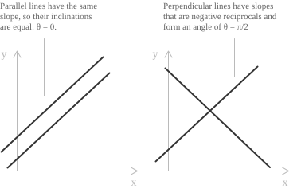
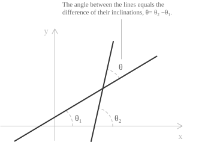
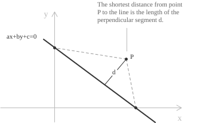
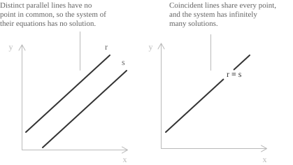

## Lines in the coordinate plane

A line is a set of points extending without end in two opposite directions, with no thickness and no endpoints. Two distinct points determine a unique line. In the Cartesian plane, a line is the [solution set](../equations/) of a [first-degree equation](../linear-equations/) in the variables $x$ and $y$. Its implicit form is:

$$ax + by + c = 0$$

The coefficients $a$, $b$, $c$ are [real numbers](../real-numbers/), with at least one of $a$ and $b$ different from zero. The form is called implicit because it is not solved for either variable. When the line is not parallel to the $y$-axis, its equation can be solved for $y$ and written in explicit form:

$$y = mx + q$$

The number $m$ is the slope, which measures the rate of change of $y$ with respect to $x$, and $q$ is the $y$-intercept, the ordinate of the point where the line meets the $y$-axis. This explicit form is a linear equation in two variables. The $x$-intercept is the value of $x$ for which $y = 0,$ the [root](../roots-of-a-polynomial/) of the line's equation.

A point lies on a line exactly when its coordinates satisfy the equation, so substituting them leaves both sides equal. The point $(2, 5)$ lies on the line $y = 2x + 1$ because $2(2) + 1 = 5,$ and the equation holds.

The coefficients of the implicit form are not unique. Multiplying $ax + by + c = 0$ by a nonzero constant $\lambda$ gives $\lambda ax + \lambda by + \lambda c = 0,$ an equation with the same solutions. Thus, only the ratios of $a$, $b$, $c$ are determined by the line, not their separate values. The implicit form is also called the general form of the line. The origin belongs to the line exactly when $c = 0,$ since substituting $(0, 0)$ into the equation leaves only the constant term. The explicit equation of a line through the origin is $y = mx$.

## Intercept form

A line that meets both axes away from the origin has an equation in terms of its intercepts. Let it cross the $x$-axis at $(p, 0)$ and the $y$-axis at $(0, q)$, with $p \ne 0$ and $q \ne 0$. Its equation is:

$$\frac{x}{p} + \frac{y}{q} = 1$$

The number $p$ is the $x$-intercept and $q$ is the $y$-intercept. Substituting $(p, 0)$ gives $\frac{p}{p} + \frac{0}{q} = 1,$ and substituting $(0, q)$ gives $\frac{0}{p} + \frac{q}{q} = 1,$ so both points satisfy the equation. This form is not defined for lines through the origin, where $p$ and $q$ would both be zero and the denominators would vanish, or for lines parallel to an axis, which meet only one of the two axes.

As an example, take the line crossing the $x$-axis at $(3, 0)$ and the $y$-axis at $(0, 5)$. With $p = 3$ and $q = 5$ the intercept form is:

$$\frac{x}{3} + \frac{y}{5} = 1$$

Multiplying both sides by $15$ clears the denominators and gives the implicit form $5x + 3y - 15 = 0$.

## Slope and inclination

A line parallel to the $y$-axis is vertical, and all of its points have the same abscissa. Its equation is:

$$x = k$$

A line parallel to the $x$-axis is horizontal, and all of its points have the same ordinate. Its equation is:

$$y = k$$

A horizontal line has slope $0$. A vertical line has no slope, since it cannot be written in the form $y = mx + q$.

Every nonhorizontal line meets the $x$-axis at a point. The inclination of the line is the [angle](../angles-and-angular-measure/) $\theta$ measured counterclockwise from the positive direction of the $x$-axis to the line, with $0 \le \theta < \pi$. A horizontal line has inclination $0$. The inclination and the slope of a nonvertical line are related by:

$$m = \tan\theta$$

For $\theta = \pi/2$ the [tangent](../tangent-and-cotangent/) is undefined, which matches the fact that a vertical line has no slope. An acute inclination gives a positive slope, and an obtuse inclination gives a negative slope.

The bisectors of the quadrants are the two lines through the origin with inclination $\pi/4$ and $3\pi/4$. The first has slope $1$ and equation $y = x,$ the locus of the points with equal coordinates, which lie in the first and third quadrants. The second has slope $-1$ and equation $y = -x,$ whose points have opposite coordinates and lie in the second and fourth.

As an example, find the inclination of the line:

$$5x + 2y = 10$$

Solving for $y$ gives:

$$y = -\frac{5}{2}x + 5$$

Thus, the slope is:

$$m = -\frac{5}{2}$$

The slope is negative, so the inclination is obtuse, and from $\tan\theta = -\frac{5}{2}$ we add $\pi$ to the principal value of the [arctangent](../arctangent-and-arccotangent/):

$$\theta = \pi + \arctan\left(-\frac{5}{2}\right) \approx \pi - 1.190 \approx 1.951$$

The inclination is about $1.951$ radians, or about $111.8°$.

## Parallel and perpendicular lines

Two lines $r$ and $s$ with slopes $m_r$ and $m_s$ are parallel when their slopes are equal:

$$m_r = m_s$$

They are perpendicular when their slopes are negative reciprocals of each other:

$$m_r = -\frac{1}{m_s}$$

The second condition is equivalent to $m_r m_s = -1,$ and it applies only when neither line is vertical or horizontal.

> A line parallel to the $y$-axis has no slope, while a line parallel to the $x$-axis has slope $0$. These two lines are perpendicular to each other, a case the slope conditions above leave out.

The corresponding conditions in implicit form are valid for vertical lines as well. Take $r$ with equation $ax + by + c = 0$ and $s$ with equation $a'x + b'y + c' = 0$. When $b$ and $b'$ are nonzero, the slopes are $m_r = -a/b$ and $m_s = -a'/b',$ and clearing the denominators in $m_r = m_s$ gives:

$$ab' - a'b = 0$$

This condition is also valid when $b$ or $b'$ vanishes, and it holds exactly when the two lines have the same direction, coincident lines included. The same substitution gives:

$$aa' + bb' = 0$$

The left-hand side is the [dot product](../vectors/) of the normal vectors $(a,b)$ and $(a',b')$. The vertical and horizontal pair of the previous note satisfies this second condition, since $x = k$ has $a = 1$ and $b = 0,$ while $y = k$ has $a' = 0$ and $b' = 1$.

Each condition determines a line once a point is fixed. The line through $P(x_P, y_P)$ parallel to $r: y = m_r x + q_r$ has slope $m_r,$ so its equation is $y = m_r x + q$ with $q$ still unknown. Requiring that $P$ satisfy it gives $y_P = m_r x_P + q,$ hence:

$$q = y_P - m_r x_P$$

When $m_r \ne 0,$ the perpendicular through $P$ has slope $-1/m_r$. If $m_r = 0,$ the perpendicular is the vertical line $x = x_P$.

As an example, take the line $r$ of equation $2x + 3y - 6 = 0$ and the point $P(4, -1)$. Solving for $y$ gives $y = -\frac{2}{3}x + 2,$ so $m_r = -\frac{2}{3}$. The parallel through $P$ has the same slope, and its intercept is $q = -1 + \frac{2}{3}(4) = \frac{5}{3}$. Its equation is:

$$y = -\frac{2}{3}x + \frac{5}{3}$$

Clearing the denominators gives the implicit form $2x + 3y - 5 = 0$. The perpendicular through $P$ has slope $\frac{3}{2}$ and intercept $q = -1 - \frac{3}{2}(4) = -7,$ so its equation is:

$$y = \frac{3}{2}x - 7$$

which becomes $3x - 2y - 14 = 0$ once the denominators are cleared. Its coefficients satisfy $aa' + bb' = 2(3) + 3(-2) = 0,$ as the condition requires.

## Angle between two lines

Two distinct lines in the plane are either parallel or intersecting. Parallel lines have angle $0$. Intersecting lines form two pairs of opposite angles, and the angle between the lines is the smaller one. Thus, the angle lies between $0$ and $\pi/2$.

If two nonvertical lines have inclinations $\theta_1$ and $\theta_2$ with $\theta_1 \le \theta_2,$ set $\varphi = \theta_2 - \theta_1$. The tangent of a [difference of angles](../trigonometric-identities/) is:

$$\tan\varphi = \tan(\theta_2 - \theta_1) = \frac{\tan\theta_2 - \tan\theta_1}{1 + \tan\theta_1\tan\theta_2}$$

When $\varphi \ne \pi/2,$ the smaller angle $\theta$ has $|\tan\varphi|$ as its tangent. Replacing the other tangents by the corresponding slopes gives:

$$\tan\theta = \left|\frac{m_2 - m_1}{1 + m_1 m_2}\right|$$

The [absolute value](../absolute-value/) makes the right-hand side nonnegative, as required for the smaller angle. When $m_1 = m_2$ the numerator vanishes and $\theta = 0,$ so the lines are parallel. When $1 + m_1 m_2 = 0$ the expression is undefined and $\theta = \pi/2,$ so the lines are perpendicular and $m_1 m_2 = -1$.

As an example, find the angle between the lines $2x - y - 4 = 0$ and $3x + 4y - 12 = 0$. Their slopes are $m_1 = 2$ and $m_2 = -3/4,$ so the tangent of the angle between them is:

$$\tan\theta = \left|\frac{-\frac{3}{4} - 2}{1 + 2\left(-\frac{3}{4}\right)}\right| = \left|\frac{-\frac{11}{4}}{-\frac{1}{2}}\right| = \frac{11}{2}$$

The angle is $\theta = \arctan\frac{11}{2} \approx 1.391$ radians, or about $79.70°$.

## Line through two points

Consider the line through two points $P(x_P, y_P)$ and $Q(x_Q, y_Q)$. When $x_P = x_Q,$ the two points have the same abscissa, the line is parallel to the $y$-axis, and its equation is:

$$x = x_P$$

When $x_P \ne x_Q$ the line has slope:

$$m = \frac{y_Q - y_P}{x_Q - x_P}$$

Using this slope and the point $P$, the equation in point-slope form is:

$$y - y_P = m(x - x_P)$$

If $m$ is a free parameter, the point-slope form $y - y_P = m(x - x_P)$ describes the pencil of lines through $P$, the family of all lines through that point. Each value of $m$ gives one nonvertical member, and the vertical line $x = x_P$ completes the family. If $m$ is the slope determined above, the corresponding member also passes through $Q$. This pencil is called proper, and $P$ is its center.

Holding the slope fixed instead of the point gives a second family. If $q$ is a free parameter and $m$ is constant, the equation $y = mx + q$ describes all the lines of slope $m,$ which are parallel to one another. This family is the improper pencil of direction $m$. Exactly one of its members passes through each point of the plane, just as a proper pencil has exactly one member with any assigned slope.

Eliminating $m$ between the slope formula and the point-slope form gives the symmetric form:

$$\frac{y - y_P}{y_Q - y_P} = \frac{x - x_P}{x_Q - x_P}$$

One of the two denominators vanishes in the degenerate cases, the left one when the two points have the same ordinate and the right one when they have the same abscissa. Cross-multiplication gives an equation without denominators:

$$(y - y_P)(x_Q - x_P) = (y_Q - y_P)(x - x_P)$$

This equation holds for every pair of distinct points. When $x_P = x_Q,$ its left side vanishes identically, and $y_Q \ne y_P,$ so the equation reduces to $x = x_P,$ the vertical line found at the start of the section. When $y_P = y_Q,$ the same argument on the right side gives $y = y_P$.

As an example, find the equation of the line through $P(1, 2)$ and $Q(3, 6)$. The slope is the ratio of the difference of the ordinates to the difference of the abscissas:

$$m = \frac{y_Q - y_P}{x_Q - x_P} = \frac{6 - 2}{3 - 1} = \frac{4}{2} = 2$$

With slope $2$ and the point $P(1, 2)$, the point-slope form gives:

$$y - 2 = 2(x - 1)$$

Expanding and simplifying gives the explicit form:

$$y = 2x - 2 + 2 = 2x$$

The line through $P(1, 2)$ and $Q(3, 6)$ has equation $y = 2x$.

The same line has a [vector and parametric description](../vector-and-parametric-equations-of-a-line/) based on a point and a direction vector rather than a slope. For this line the direction vector is $Q - P = (2, 4)$, parallel to the line.

Three points are collinear when a single line contains all of them. Two of them already determine a line, so the test is whether the third satisfies its equation. Take $A(-2, -3)$, $B(1, 3)$, and $C(3, 7)$. The line through $A$ and $B$ has slope:

$$m = \frac{3 - (-3)}{1 - (-2)} = \frac{6}{3} = 2$$

The point-slope form gives $y + 3 = 2(x + 2),$ that is $y = 2x + 1$. Substituting the abscissa of $C$ gives $2(3) + 1 = 7,$ the ordinate of $C,$ so the three points are collinear. The slopes give the same test, since $m_{AB} = m_{AC}$ holds exactly when the three points lie on one line, provided no two of them have the same abscissa.

Evaluating the cross-multiplied equation of the line through $A$ and $B$ at the third point gives $(y_C - y_A)(x_B - x_A) = (y_B - y_A)(x_C - x_A)$. This equality is equivalent to the vanishing of a [determinant](../determinant/):

$$
\det\begin{pmatrix}
x_A & y_A & 1 \\[6pt]
x_B & y_B & 1 \\[6pt]
x_C & y_C & 1
\end{pmatrix} = 0
$$

Each row contains the coordinates of one point followed by $1,$ so the criterion does not depend on the order in which the points are listed and includes the vertical case. Expanding along the first row for $A(-2, -3)$, $B(1, 3)$, $C(3, 7)$ gives $-2(3 - 7) + 3(1 - 3) + (7 - 9) = 8 - 6 - 2 = 0$.

## Distance from a point to a line

The distance from a point $P(x_P, y_P)$ to a line $r$ with equation $ax + by + c = 0$ is the length of the segment from $P$ to the foot of the perpendicular on the line. This distance is given by:

$$d = \frac{\left|ax_P + by_P + c\right|}{\sqrt{a^2 + b^2}}$$

The coefficients $a$, $b$, $c$ are those of the implicit form $ax + by + c = 0,$ so the line must be written in this form before the coordinates of $P$ are substituted.

The denominator $\sqrt{a^2+b^2}$ is the length of the normal vector $\mathbf{n}=(a,b)$ to the line, given by the [Pythagorean theorem](../pythagorean-theorem/). Dividing by this quantity normalizes the expression, so the distance does not depend on the coefficients used to write the equation of the line.

Dividing the implicit equation itself by $\pm\sqrt{a^2+b^2}$, with the sign chosen to make the constant term nonpositive, rewrites the line in normal form:

$$x\cos\alpha + y\sin\alpha = p$$

The coefficients of $x$ and $y$ are the [cosine and sine](../sine-and-cosine/) of $\alpha,$ so they are the components of the unit normal vector $(\cos\alpha,\sin\alpha)$. The angle $\alpha$ is measured from the positive direction of the $x$-axis to this normal. The constant $p\ge0$ is the distance from the origin to the line. At $P=(0,0),$ the distance formula gives $d=|c|/\sqrt{a^2+b^2}$.

When $p>0,$ the nonpositive constant term fixes the sign of the divisor. The unit normal is then unique, and $\alpha$ is determined modulo $2\pi,$ so the pair $(\alpha, p)$ identifies the line. A line through the origin has $p=0,$ so either of the two opposite unit normals is admissible and $\alpha$ is determined only modulo $\pi$.

As an example, find the distance from the point $(4, 1)$ to the line $y = x - 1$. Writing the line in implicit form gives $x - y - 1 = 0,$ so $a = 1,$ $b = -1,$ $c = -1$. Substituting the coordinates of the point gives:

$$d = \frac{\left|1(4) - 1 - 1\right|}{\sqrt{1^2 + (-1)^2}} = \frac{2}{\sqrt{2}} = \sqrt{2} \approx 1.41$$

The point lies about $1.41$ units from the line.

## Intersection of two lines

The common points of two lines are the solutions of the [system in two variables](../systems-of-linear-equations-in-two-variables/) formed by their equations. The system can have one, zero, or infinitely many solutions. Two lines with different slopes meet at a single point, and the system has one solution. Two lines with equal slopes have no point in common when their intercepts differ, and the system has no solution. When the intercepts agree as well, the two equations describe the same line, every one of its points solves the system, and the lines are coincident.

The implicit form gives the same classification without excluding vertical lines. For $r: ax + by + c = 0$ and $s: a'x + b'y + c' = 0$, the system has exactly one solution when $ab' - a'b \ne 0$. When this quantity vanishes, the two lines have the same direction, and the constant terms distinguish the remaining cases. If the triples $(a, b, c)$ and $(a', b', c')$ are not proportional, the lines are parallel and distinct. If they are proportional, the two equations differ by a nonzero factor and describe one line. With all the coefficients different from zero, the three cases are:

$$\frac{a}{a'} \ne \frac{b}{b'} \qquad \frac{a}{a'} = \frac{b}{b'} \ne \frac{c}{c'} \qquad \frac{a}{a'} = \frac{b}{b'} = \frac{c}{c'}$$

The lines $x - 2y + 3 = 0$ and $x - 2y - 1 = 0$ fall in the second case, since only their constant terms differ. Multiplying the first by $-2$ gives $-2x + 4y - 6 = 0,$ a third equation whose coefficients are proportional to those of the first, so it falls in the third case and describes the same line.

As an example, consider the lines $y = x + 2$ and $y = -2x + 8$. Their slopes differ, so they intersect at one point, found by solving the system:

$$
\begin{cases}
y = x + 2 \\[6pt]
y = -2x + 8
\end{cases}
$$

Equating the right-hand sides removes $y$ and leaves an equation in $x$:

$$
\begin{align}
x + 2 &= -2x + 8 \\[6pt]
3x &= 6 \\[6pt]
x &= 2
\end{align}
$$

Substituting $x = 2$ into the first equation gives $y = 2 + 2 = 4$. The two lines meet at the point $(2, 4)$.
