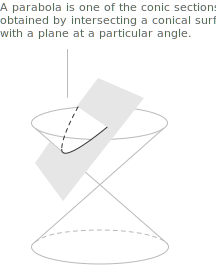
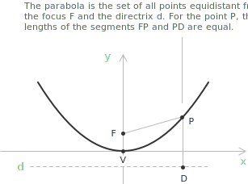
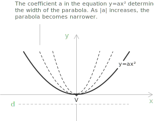
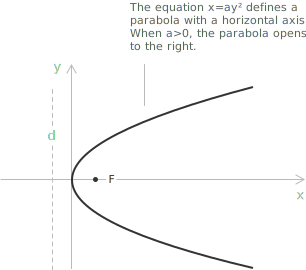
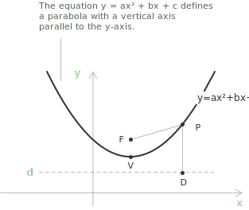
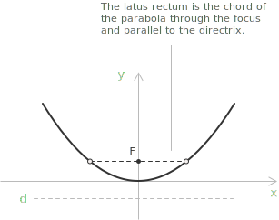
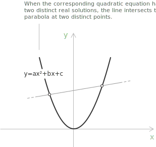
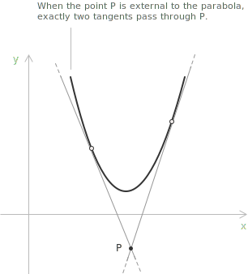

## Conic sections

When a plane cuts a cone, the intersection projected onto the plane is a [circumference](../circumference/), a parabola, an [ellipse](../ellipse/), or a [hyperbola](../hyperbola/). These curves are the conic sections, or conics. A conic is a second-degree plane algebraic curve, the set of points $(x, y) \in \mathbb{R}^2$ that satisfy a quadratic equation in $x$ and $y$:

$$f(x, y) = a_{11}x^2 + 2a_{12}xy + a_{22}y^2 + 2a_{13}x + 2a_{23}y + a_{33} = 0$$

The coefficients $a_{ij}$ are [real numbers](../real-numbers/), with $a_{11},$ $a_{12},$ $a_{22}$ not all zero so that at least one second-degree term is present. Each coefficient has a geometric meaning.

+ The terms $a_{11}$ and $a_{22}$ set the curvature along the $x$- and $y$-directions and, together with $a_{12},$ fix the type of conic and its orientation. 
+ The coefficient $a_{12}$ governs the rotation of the curve relative to the coordinate axes, and the conic is aligned with the axes exactly when $a_{12} = 0.$ 
+ The linear coefficients $a_{13}$ and $a_{23}$ are the translation terms along the $x$- and $y$-axes, while the constant $a_{33}$ shifts the curve relative to the origin.

When the polynomial $f(x, y)$ factors as a product of two linear polynomials:

$$f(x, y) = (ax + by + c)(a'x + b'y + c') = 0$$

with [complex coefficients](../complex-numbers/) $a, b, c, a', b', c' \in \mathbb{C},$ the conic is degenerate.

> A degenerate conic is not a proper curved figure such as a parabola, ellipse, or hyperbola. It reduces to a simpler object: a pair of lines, a single line, or in some cases the empty set.

## The parabola

The parabola is the conic section obtained when the cutting plane is parallel to a generatrix of the cone, so the intersection is a single unbounded curve.

A parabola is the set of all points in the plane equidistant from a fixed point $F,$ the focus, and a fixed line $d,$ the directrix. For any point $P$ on the curve, the distance from $P$ to the focus equals the distance from $P$ to the directrix. 

The line through the focus perpendicular to the directrix is the axis of the parabola. The point $V$ where the parabola meets its axis is the vertex. A parabola with vertex at the origin and axis along the $y$-axis has equation:

$$y = ax^2, \quad a \neq 0$$

Such a parabola is symmetric with respect to the $y$-axis. When $a = 0$ the equation reduces to $y = 0,$ the $x$-axis, and the parabola is degenerate. Its focus and directrix are:

$$F = \left(0, \frac{1}{4a}\right)$$

$$y = -\frac{1}{4a}$$

When $a > 0$ the parabola opens upward, so $y \geq 0$ for every $x$ and the focus lies on the positive half of the $y$-axis. When $a < 0$ it opens downward. The [magnitude](../absolute-value/) of $a$ fixes the width of the curve: as $|a|$ increases the opening narrows, and as $|a|$ decreases it widens.

## Parabola with a horizontal axis

Interchanging the roles of $x$ and $y$ makes the axis of the parabola horizontal. A parabola with vertex at the origin and axis along the $x$-axis has equation:

$$x = ay^2, \quad a \neq 0$$

Such a parabola is symmetric with respect to the $x$-axis. Its focus and directrix are:

$$F = \left(\frac{1}{4a}, 0\right)$$

$$x = -\frac{1}{4a}$$

When $a > 0$ the parabola opens to the right, so $x \geq 0$ for every $y,$ and when $a < 0$ it opens to the left. As before, the opening narrows as $|a|$ increases. The general equation with axis parallel to the $x$-axis is $x = ay^2 + by + c$ with $a \neq 0.$ Its axis of symmetry is the horizontal line:

$$y = -\frac{b}{2a}$$ 
Its vertex, focus, and directrix follow from the vertical case by exchanging the two coordinates.

## The parabola in standard quadratic form

A parabola with axis parallel to the $y$-axis has the general equation:

$$y = ax^2 + bx + c, \quad a \neq 0$$

This is a [second-degree equation](../quadratic-equations/) in $x.$ Its axis of symmetry is the vertical line:

$$x = -\frac{b}{2a}$$

The vertex is:

$$V\left(-\frac{b}{2a}, -\frac{\Delta}{4a}\right)$$

where $\Delta = b^2 - 4ac$ is the [discriminant](../quadratic-formula/) of the quadratic. The focus and the directrix are:

$$F\left(-\frac{b}{2a}, \frac{1 - \Delta}{4a}\right)$$

$$y = -\frac{1 + \Delta}{4a}$$

Two special cases follow from the general equation. When $b = 0$ and $c \neq 0$ the equation becomes $y = ax^2 + c,$ with vertex $V(0, c)$ and axis of symmetry the $y$-axis. When $c = 0$ and $b \neq 0$ the equation becomes $y = ax^2 + bx,$ with vertex:

$$V\left(-\frac{b}{2a}, -\frac{b^2}{4a}\right)$$

and the curve passes through the origin $O(0, 0).$

## Parabola with vertex not at the origin

A parabola whose vertex is not at the origin is a translation of one of the origin forms. Moving the vertex of $y = ax^2$ to a point $(h, k)$ replaces $x$ with $x - h$ and $y$ with $y - k,$ which gives the vertex form:

$$y - k = a(x - h)^2$$

The axis of symmetry is the vertical line $x = h,$ the vertex is $(h, k),$ and the focus and directrix move with the vertex:

$$F = \left(h, k + \frac{1}{4a}\right)$$

$$y = k - \frac{1}{4a}$$

The same translation applied to $x = ay^2$ gives the parabola with horizontal axis and vertex $(h, k)$:

$$x - h = a(y - k)^2$$

with axis of symmetry $y = k,$ focus $\left(h + \frac{1}{4a}, k\right),$ and directrix $x = h - \frac{1}{4a}.$

Expanding $y = a(x - h)^2 + k$ returns the standard quadratic form $y = ax^2 + bx + c,$ so the vertex form and the general form describe the same curve. To read the vertex from the general form, [complete the square](../completing-the-square/).

As an example, write $y = 2x^2 - 12x + 13$ in vertex form. Since the leading coefficient multiplies only the terms in $x,$ factor it out of those terms:

$$y = 2(x^2 - 6x) + 13$$

The term that turns $x^2 - 6x$ into a perfect square is $\left(\frac{6}{2}\right)^2 = 9,$ so adding and subtracting it inside the parentheses leaves the expression unchanged:

$$
\begin{align}
y &= 2(x^2 - 6x + 9 - 9) + 13 \\[6pt]
  &= 2(x - 3)^2 - 18 + 13 \\[6pt]
  &= 2(x - 3)^2 - 5
\end{align}
$$

The vertex is $(3, -5)$ and the axis of symmetry is $x = 3.$ With $a = 2$ the focus is $\left(3, -5 + \frac{1}{8}\right) = \left(3, -\frac{39}{8}\right)$ and the directrix is $y = -5 - \frac{1}{8} = -\frac{41}{8}.$

## The latus rectum

The chord of the parabola through the focus and parallel to the directrix is the latus rectum. Its endpoints lie on the curve, and its length measures the opening of the parabola at the focus.

For the parabola $y = ax^2$ the focus has ordinate $1/4a,$ so the endpoints of the latus rectum are the points of the curve with this ordinate. Setting $ax^2 = 1/4a$ gives:

$$x = \pm\frac{1}{2|a|}$$

The endpoints are:

$$\left(-\frac{1}{2|a|}, \frac{1}{4a}\right) \quad \text{and} \quad \left(\frac{1}{2|a|}, \frac{1}{4a}\right)$$

The latus rectum has length: 
$$\frac{1}{|a|}$$

A larger $|a|$ gives a shorter latus rectum and a narrower parabola, which matches the effect of $a$ on the width.

## Eccentricity and the polar equation

The parabola has a description common to all the conics. Fix a focus $F$ and a directrix $d,$ and for a point $P$ let $r$ be its distance to the focus and $\delta$ its distance to the directrix. The eccentricity is the constant ratio:

$$e = \frac{r}{\delta}$$

The value of $e$ selects the conic: $e < 1$ gives an ellipse, $e = 1$ gives a parabola, and $e > 1$ gives a hyperbola. The defining equidistance of the parabola, $r = \delta,$ is the case $e = 1.$

This description also gives the equation of the parabola in [polar coordinates](../polar-coordinates/). Place the focus at the pole and take the directrix as the vertical line $x = -h,$ with $h > 0$ the distance from the focus to the directrix. A point $P$ with polar coordinates $(r, \theta)$ has abscissa $x = r\cos\theta,$ so its distance to the directrix is $r\cos\theta + h.$ The condition $r = r\cos\theta + h$ gives:

$$
\begin{align}
&r - r\cos\theta = h \\[6pt]
&r = \frac{h}{1 - \cos\theta}
\end{align}
$$

The trigonometric function and the sign depend on the placement of the directrix. A directrix $x = h$ gives:
$$r = \frac{h}{1 + \cos\theta}$$
A horizontal directrix $y = \mp h$ gives: 

$$r = \frac{h}{1 \pm \sin\theta}$$

The same construction for a general conic yields:

$$r = \frac{eh}{1 - e\cos\theta}$$

which reduces to the parabola when $e = 1.$

At $\theta = \pi/2$ the radius equals $h,$ the distance from the focus to the directrix, which is the semi-latus rectum. The full latus rectum has length $2h,$ in agreement with the value $1/\lvert a\rvert$ found for $y = ax^2,$ where $h=1/2\lvert a\rvert.$

## Intersection with a line

The intersection points of the parabola $y = ax^2 + bx + c$ with a [line](../lines/) $y = mx + q$ are the solutions of the system formed by the two equations:

$$
\begin{cases}
y = ax^2 + bx + c \\[6pt]
y = mx + q
\end{cases}
$$

Equating the right-hand sides and collecting terms gives a single quadratic in $x$:

$$
\begin{align}
&ax^2 + bx + c = mx + q \\[6pt]
&ax^2 + (b - m)x + (c - q) = 0
\end{align}
$$

Its solutions are the $x$-coordinates of the intersection points. Being a quadratic, it has at most two distinct [roots](../roots-of-a-polynomial/), and the discriminant $\Delta$ determines how the line meets the parabola:

+ When $\Delta > 0$ the roots are real and distinct, and the line meets the parabola at two points. The line is a secant.
+ When $\Delta = 0$ the roots are real and coincident, and the line is tangent to the parabola at a single point.
+ When $\Delta < 0$ there are no real roots, and the line does not meet the parabola. The line is external.

> Taking the line to be the $x$-axis, $y = 0,$ recovers the [intersections of the parabola with the $x$-axis](../geometrical-meaning-quadratic-equations/), fixed by the sign of $b^2 - 4ac.$

## Tangent lines through a point

Given a point $P$ in the plane, the number of tangents to the parabola through $P$ depends on the position of $P$:

+ Two tangents pass through $P$ when $P$ is external to the parabola.
+ One tangent passes through $P$ when $P$ lies on the parabola.
+ No tangent passes through $P$ when $P$ is internal to the parabola.

To find the tangents from $P(x_0, y_0)$ to the parabola $y = ax^2 + bx + c,$ solve the system of the parabola and the pencil of lines through $P$:

$$
\begin{cases}
y - y_0 = m(x - x_0) \\[6pt]
y = ax^2 + bx + c
\end{cases}
$$

Eliminating $y$ produces a quadratic in $x$ whose coefficients depend on $m.$ The tangency condition sets its discriminant equal to zero, which gives an equation in $m.$ Solving for $m$ and substituting the values into the pencil yields the tangent lines.

## Example

Find the equations of the lines through $P(3, -6)$ tangent to the parabola $y = x^2 - 4.$ The pencil of lines through $P$ is:

$$y - y_0 = m(x - x_0)$$

Substituting $x_0 = 3$ and $y_0 = -6$ gives:

$$y + 6 = m(x - 3)$$

The system of the pencil and the parabola is:

$$
\begin{cases}
y = x^2 - 4 \\[6pt]
y + 6 = m(x - 3)
\end{cases}
$$

Substituting the first equation into the second and collecting terms produces a quadratic in $x$:

$$
\begin{align}
&x^2 - 4 = m(x - 3) - 6 \\[6pt]
&x^2 - mx + 3m + 2 = 0
\end{align}
$$

With $a = 1,$ $b = -m,$ and $c = 3m + 2,$ the discriminant is:

$$\Delta = m^2 - 12m - 8$$

Imposing the tangency condition $\Delta = 0$ and solving the quadratic in $m$:

$$
\begin{align}
&m^2 - 12m - 8 = 0 \\[6pt]
&m = \frac{12 \pm \sqrt{144 + 32}}{2} = \frac{12 \pm 4\sqrt{11}}{2} = 6 \pm 2\sqrt{11}
\end{align}
$$

The two slopes are $m_1 = 6 - 2\sqrt{11}$ and $m_2 = 6 + 2\sqrt{11}.$ Substituting each into $y + 6 = m(x - 3)$ gives the two tangent lines:

$$
\begin{align}
y &= \left(6 - 2\sqrt{11}\right)x + 6\sqrt{11} - 24 \\[6pt]
y &= \left(6 + 2\sqrt{11}\right)x - 6\sqrt{11} - 24
\end{align}
$$
