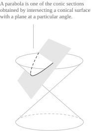
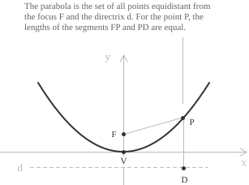
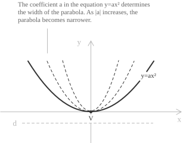
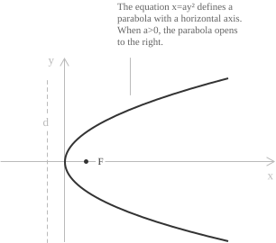
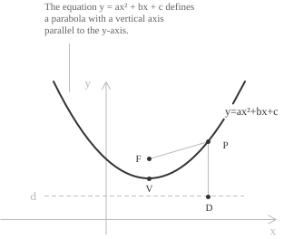
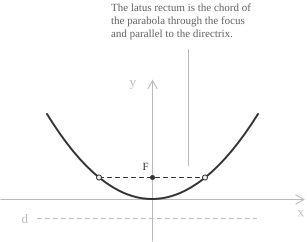
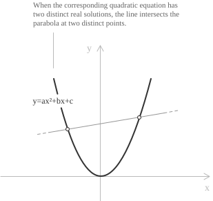
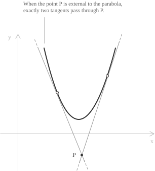

## Conic sections

When a [plane](../planes/) cuts a right circular double cone without passing through its vertex, the intersection is a [circle](../circumference/), a parabola, an [ellipse](../ellipse/), or a [hyperbola](../hyperbola/). These curves are the conic sections, or conics. Algebraically, a conic is the set of points $(x, y) \in \mathbb{R}^2$ that satisfy a quadratic equation in $x$ and $y:$

$$f(x, y) = a_{11}x^2 + 2a_{12}xy + a_{22}y^2 + 2a_{13}x + 2a_{23}y + a_{33} = 0$$

The coefficients $a_{ij}$ are [real numbers](../real-numbers/), and at least one of $a_{11},$ $a_{12},$ and $a_{22}$ is nonzero, so the equation has a nonzero quadratic part.

+ The quadratic type is elliptic when $a_{11}a_{22}-a_{12}^2>0,$ parabolic when $a_{11}a_{22}-a_{12}^2=0,$ and hyperbolic when $a_{11}a_{22}-a_{12}^2<0.$
+ The quadratic part is diagonal in the chosen coordinates exactly when $a_{12}=0.$
+ The coefficients determine where the conic lies, its size or aperture, whether it is degenerate, and whether it has real points. A translation changes the linear and constant coefficients while leaving the quadratic coefficients unchanged.

In the [matrix classification of conics](../introduction-to-conics/), the full coefficient matrix $A$ and its leading quadratic block $A_0$ are:

$$
A = \begin{pmatrix}
a_{11} & a_{12} & a_{13} \\[6pt]
a_{12} & a_{22} & a_{23} \\[6pt]
a_{13} & a_{23} & a_{33}
\end{pmatrix}
\qquad
A_0 = \begin{pmatrix}
a_{11} & a_{12} \\[6pt]
a_{12} & a_{22}
\end{pmatrix}
$$

The equation defines a non-degenerate parabola exactly when $\det A\neq0$ and $\det A_0=0.$ Since $A_0$ is nonzero, it has rank $1$ and one zero eigenvalue. An eigenvector for this eigenvalue is parallel to the axis of the parabola.

When $\det A=0,$ the conic is degenerate. Over the [complex numbers](../complex-numbers/), its equation factors as a product of two linear polynomials:

$$(ax + by + c)(a'x + b'y + c') = 0$$

> The real locus of a degenerate conic may be a pair of lines, one double line, one point, or the empty set.

## The parabola

A non-degenerate parabola is the conic section obtained when the cutting plane is parallel to a generatrix of the cone and does not pass through the vertex of the cone. The intersection is a single unbounded curve.

A parabola is the set of all points in the plane equidistant from a fixed point $F,$ the focus, and a fixed line $d,$ the directrix, where $F\notin d.$

The line through the focus perpendicular to the directrix is the axis of the parabola. The point $V$ where the parabola meets its axis is the vertex. A parabola with vertex at the origin and axis along the $y$-axis has equation:

$$y = ax^2, \quad a \neq 0$$

This equation follows from the focus-directrix definition. Write $p=\frac{1}{4a}.$ The distances from a point $P(x, y)$ to $F=(0, p)$ and to the line $y=-p$ are equal exactly when:

$$\sqrt{x^2 + (y - p)^2} = |y + p|$$

Squaring and simplifying gives $x^2=4py,$ which is equivalent to $y=ax^2.$ The parabola is symmetric with respect to the $y$-axis. Its focus and directrix are:

$$F = \left(0, \frac{1}{4a}\right)$$

$$y = -\frac{1}{4a}$$

When $a > 0,$ the parabola opens upward, so $y \geq 0$ for every $x,$ and the focus lies on the positive half of the $y$-axis. When $a < 0,$ it opens downward. The [absolute value](../absolute-value/) $|a|$ determines the width of the curve. As $|a|$ increases, the opening narrows; as $|a|$ decreases, it widens.

## Parabola with a horizontal axis

Interchanging the roles of $x$ and $y$ makes the axis of the parabola horizontal. A parabola with vertex at the origin and axis along the $x$-axis has equation:

$$x = ay^2, \quad a \neq 0$$

The parabola is symmetric with respect to the $x$-axis. Its focus and directrix are:

$$F = \left(\frac{1}{4a}, 0\right)$$

$$x = -\frac{1}{4a}$$

When $a > 0,$ the parabola opens to the right, so $x \geq 0$ for every $y,$ and when $a < 0,$ it opens to the left. As before, the opening narrows as $|a|$ increases. The general equation with axis parallel to the $x$-axis is $x = ay^2 + by + c,$ with $a \neq 0.$ Its axis of symmetry is the horizontal line:

$$y = -\frac{b}{2a}$$

The corresponding formulas for the vertex, focus, and directrix are obtained by exchanging $x$ and $y$ in the vertical formulas derived in the next section.

## The parabola in standard quadratic form

A parabola with axis parallel to the $y$-axis has the general equation:

$$y = ax^2 + bx + c, \quad a \neq 0$$

This is a [second-degree equation](../quadratic-equations/) in $x.$ With the [discriminant](../quadratic-formula/) $\Delta=b^2-4ac,$ completing the square gives:

$$y = a\left(x + \frac{b}{2a}\right)^2 - \frac{\Delta}{4a}$$

This expression has the form $y=a(x-h)^2+k,$ with $h=-\frac{b}{2a}$ and $k=-\frac{\Delta}{4a}.$ Its axis of symmetry is the vertical line:

$$x = -\frac{b}{2a}$$

The vertex is:

$$V\left(-\frac{b}{2a}, -\frac{\Delta}{4a}\right)$$

The focus and directrix have signed vertical offsets $\frac{1}{4a}$ and $-\frac{1}{4a}$ from the vertex, respectively:

$$F\left(-\frac{b}{2a}, \frac{1 - \Delta}{4a}\right)$$

$$y = -\frac{1 + \Delta}{4a}$$

Two special cases follow from the general equation. When $b = 0$ and $c \neq 0,$ the equation becomes $y = ax^2 + c,$ with vertex $V(0, c)$ and axis of symmetry the $y$-axis. When $c = 0$ and $b \neq 0,$ the equation becomes $y = ax^2 + bx,$ with vertex:

$$V\left(-\frac{b}{2a}, -\frac{b^2}{4a}\right)$$

The curve also passes through the origin $O(0, 0).$

## Parabola with vertex not at the origin

A parabola whose vertex is not at the origin is a translation of one of the origin forms. Moving the vertex of $y = ax^2$ to a point $(h, k)$ replaces $x$ with $x - h$ and $y$ with $y - k,$ which gives the vertex form:

$$y - k = a(x - h)^2$$

The axis of symmetry is the vertical line $x = h,$ the vertex is $(h, k),$ and the focus and directrix move with the vertex:

$$F = \left(h, k + \frac{1}{4a}\right)$$

$$y = k - \frac{1}{4a}$$

The same translation applied to $x = ay^2$ gives the parabola with horizontal axis and vertex $(h, k):$

$$x - h = a(y - k)^2$$

Its axis of symmetry is $y = k.$ Its focus is $\left(h + \frac{1}{4a}, k\right),$ and its directrix is $x = h - \frac{1}{4a}.$

Expanding $y = a(x - h)^2 + k$ gives the standard quadratic form $y = ax^2 + bx + c,$ so the vertex form and the general form describe the same curve. To read the vertex from the general form, [complete the square](../completing-the-square/).

To write $y = 2x^2 - 12x + 13$ in vertex form, we complete the square. The first two terms have a common factor of $2,$ so we factor it out:

$$y = 2(x^2 - 6x) + 13$$

The term that turns $x^2 - 6x$ into a perfect square is $\left(\frac{6}{2}\right)^2 = 9,$ so adding and subtracting it inside the parentheses leaves the expression unchanged:

$$
\begin{align}
y &= 2(x^2 - 6x + 9 - 9) + 13 \\[6pt]
  &= 2(x - 3)^2 - 18 + 13 \\[6pt]
  &= 2(x - 3)^2 - 5
\end{align}
$$

The vertex is $(3, -5)$ and the axis of symmetry is $x = 3.$ With $a = 2,$ the focus is $\left(3, -5 + \frac{1}{8}\right) = \left(3, -\frac{39}{8}\right).$ The directrix is $y = -5 - \frac{1}{8} = -\frac{41}{8}.$

## The latus rectum

The chord of the parabola through the focus and parallel to the directrix is the latus rectum. Its endpoints lie on the curve, and its length measures the opening of the parabola at the focus.

For the parabola $y = ax^2,$ the focus has ordinate $\frac{1}{4a},$ so the endpoints of the latus rectum are the points of the curve with this ordinate. Setting $ax^2 = \frac{1}{4a}$ and solving for $x$ gives:

$$x = \pm\frac{1}{2|a|}$$

The endpoints are:

$$\left(-\frac{1}{2|a|}, \frac{1}{4a}\right) \quad \text{and} \quad \left(\frac{1}{2|a|}, \frac{1}{4a}\right)$$

The latus rectum has length:

$$\frac{1}{|a|}$$

A larger $|a|$ gives a shorter latus rectum and a narrower parabola.

## Eccentricity and the polar equation

Non-degenerate conics with positive eccentricity have a common focus-directrix description. Fix a focus $F$ and a directrix $d,$ with $F\notin d.$ For a point $P,$ let $r$ be its distance to the focus and $\delta$ its distance to the directrix. A conic is the locus on which the ratio of these distances has a fixed positive value $e:$

$$e = \frac{r}{\delta}$$

The conic is an ellipse when $0 < e < 1,$ a parabola when $e = 1,$ and a hyperbola when $e > 1.$ The defining equidistance of the parabola, $r = \delta,$ is the case $e = 1.$

This description also gives the equation of the parabola in [polar coordinates](../polar-coordinates/). Place the focus at the pole and take the directrix as the vertical line $x = -h,$ where $h > 0$ is the distance from the focus to the directrix. A point $P$ with polar coordinates $(r, \theta)$ has abscissa $x = r\cos\theta,$ so its distance to the directrix is $|r\cos\theta + h|.$ The parabola lies on the side of the directrix containing the focus, where this distance is $r\cos\theta + h.$ The condition $r = r\cos\theta + h$ gives:

$$
\begin{align}
&r - r\cos\theta = h \\[6pt]
&r = \frac{h}{1 - \cos\theta}
\end{align}
$$

The trigonometric function and the sign depend on the placement of the directrix. A directrix $x = h$ gives:

$$r = \frac{h}{1 + \cos\theta}$$

A horizontal directrix $y = \pm h$ gives:

$$r = \frac{h}{1 \pm \sin\theta}$$

On the side of the directrix containing the focus, a conic with eccentricity $e$ satisfies $r=e(r\cos\theta+h).$ Hence:

$$r = \frac{eh}{1 - e\cos\theta}$$

For $e = 1,$ this is the polar equation of the parabola. For $e > 1,$ the solutions with $r\geq0$ form one branch of the hyperbola; the complete locus satisfies $r=e|r\cos\theta+h|.$

For the parabola, at $\theta = \pm\pi/2,$ the radius equals $h,$ the distance from the focus to the directrix, which is the semi-latus rectum. The full latus rectum has length $2h.$ For $y = ax^2,$ we have $h=\frac{1}{2|a|},$ so $2h=\frac{1}{|a|},$ as obtained above.

## Intersection with a line

The intersection points of the parabola $y = ax^2 + bx + c$ with a nonvertical [line](../lines/) $y = mx + q$ are the solutions of the system:

$$
\begin{cases}
y = ax^2 + bx + c \\[6pt]
y = mx + q
\end{cases}
$$

Equating the right-hand sides and collecting terms gives a single quadratic in $x:$

$$
\begin{align}
&ax^2 + bx + c = mx + q \\[6pt]
&ax^2 + (b - m)x + (c - q) = 0
\end{align}
$$

Its solutions are the $x$-coordinates of the intersection points. This quadratic has at most two distinct [roots](../roots-of-a-polynomial/). Its discriminant is:

$$\Delta_{\ell} = (b - m)^2 - 4a(c - q)$$

The sign of $\Delta_{\ell}$ determines how the line meets the parabola:

+ When $\Delta_{\ell} > 0,$ the roots are real and distinct, and the line meets the parabola at two points. The line is a secant.
+ When $\Delta_{\ell} = 0,$ the quadratic has one repeated real root, and the line is tangent to the parabola at a single point.
+ When $\Delta_{\ell} < 0,$ the quadratic has no real roots, and the line does not meet the parabola. The line is external.

> Taking the line to be the $x$-axis, $y = 0,$ recovers the [intersections of the parabola with the $x$-axis](../geometrical-meaning-quadratic-equations/), whose number is determined by the sign of $b^2 - 4ac.$

## Tangent lines through a point

The parabola divides the plane into two regions. The internal region is the side containing the focus, and the external region is the opposite side. Given a point $P$ in the plane, the number of tangents to the parabola through $P$ depends on the position of $P:$

+ Two tangents pass through $P$ when $P$ is external to the parabola.
+ One tangent passes through $P$ when $P$ lies on the parabola.
+ No tangent passes through $P$ when $P$ is internal to the parabola.

Every tangent to the parabola $y = ax^2 + bx + c$ is nonvertical, so a candidate through $P(x_0, y_0)$ has a finite slope $m.$ Its intersections with the parabola are the solutions of the system:

$$
\begin{cases}
y - y_0 = m(x - x_0) \\[6pt]
y = ax^2 + bx + c
\end{cases}
$$

Eliminating $y$ gives a quadratic in $x$ whose coefficients depend on $m.$ Tangency requires its discriminant to be zero. Solving the resulting equation for $m$ and substituting each solution into $y-y_0=m(x-x_0)$ gives the tangent lines.

## Example

Find the equations of the lines through $P(3, -6)$ tangent to the parabola $y = x^2 - 4.$ A nonvertical line through $P$ has equation:

$$y - y_0 = m(x - x_0)$$

Substituting $x_0 = 3$ and $y_0 = -6$ gives:

$$y + 6 = m(x - 3)$$

Combining this line with the parabola gives the system:

$$
\begin{cases}
y = x^2 - 4 \\[6pt]
y + 6 = m(x - 3)
\end{cases}
$$

Substituting the first equation into the second and collecting terms gives a quadratic in $x:$

$$
\begin{align}
&x^2 - 4 = m(x - 3) - 6 \\[6pt]
&x^2 - mx + 3m + 2 = 0
\end{align}
$$

The discriminant of this quadratic in $x$ is:

$$D(m) = (-m)^2 - 4(1)(3m + 2) = m^2 - 12m - 8$$

The tangency condition is $D(m)=0,$ so $m$ satisfies:

$$
\begin{align}
&m^2 - 12m - 8 = 0 \\[6pt]
&m = \frac{12 \pm \sqrt{144 + 32}}{2} = \frac{12 \pm 4\sqrt{11}}{2} = 6 \pm 2\sqrt{11}
\end{align}
$$

The two slopes are $m_1 = 6 - 2\sqrt{11}$ and $m_2 = 6 + 2\sqrt{11}.$ Substituting each into $y + 6 = m(x - 3)$ gives the two tangent lines:

$$
\begin{align}
y &= \left(6 - 2\sqrt{11}\right)x + 6\sqrt{11} - 24 \\[6pt]
y &= \left(6 + 2\sqrt{11}\right)x - 6\sqrt{11} - 24
\end{align}
$$

These are the two tangent lines through $P(3, -6).$
