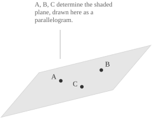
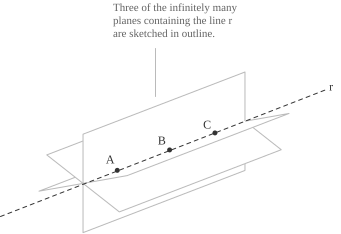
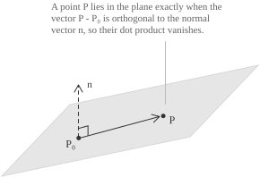
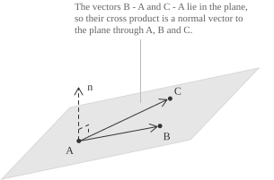
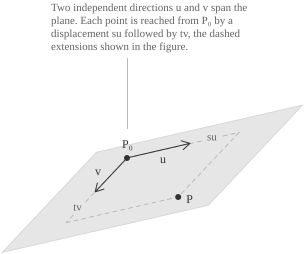
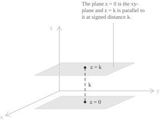
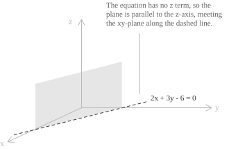
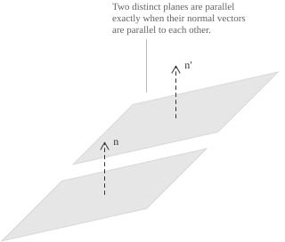
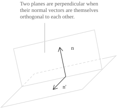
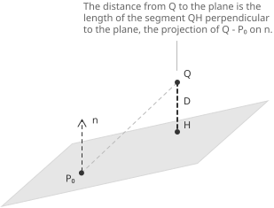

## What determines a plane

A plane is a flat unbounded surface with no thickness. Like the point and the [line](../lines/), it is a primitive notion of Euclidean geometry, not defined through simpler objects, and its behaviour is fixed by the axioms relating it to points and lines. A plane is two-dimensional, since two [independent directions](../vector-spaces/) inside it are enough to reach any of its points from any other, and no third independent direction is available.

Three points $A,$ $B,$ and $C$ that do not lie on a common line determine one plane and only one.

Three collinear points do not, because every plane containing their common line contains all three, and infinitely many planes contain a given line.

The other ways of determining a plane reduce to this one, since each of the following configurations contains three non-collinear points:

+ a line and a point outside it
+ two distinct lines meeting at a point
+ two distinct parallel lines

Take the first configuration. Two distinct points of the line together with the external point are non-collinear, so they determine a plane, and that plane contains the whole line. The argument for the other two configurations is the same, with the three points chosen one from one line and two from the other.

A plane has two incidence properties. A line with two distinct points in a plane lies entirely in that plane, so a plane contains every line joining two of its points. Two distinct planes are either disjoint, and are then parallel, or meet along a line, and they cannot have exactly one point in common.

## A point and a normal direction

Infinitely many planes pass through a given point, so a point alone does not determine a plane. Prescribing a direction perpendicular to the plane removes the remaining freedom. This condition gives the equation of a plane.

A [vector](../vectors/) $\mathbf{n}$ is a normal vector to a plane $\pi$ when it is orthogonal to every vector joining two points of $\pi.$ A plane has infinitely many normal vectors, since $\lambda\mathbf{n}$ is orthogonal to the same directions for every $\lambda \neq 0,$ and these are all of them, because the directions orthogonal to a plane form a line.

Fix a point $P_0$ of $\pi$ and a normal vector $\mathbf{n} \neq \mathbf{0}.$ A point $P$ of space belongs to $\pi$ exactly when the vector $P-P_0$ is orthogonal to $\mathbf{n}.$ Two vectors are orthogonal when their [dot product](../vectors/) vanishes. Thus the vector equation of the plane is:

$$\mathbf{n}\cdot(P-P_0) = 0$$

The base point satisfies the equation, since $P-P_0=\mathbf{0}$ there and the dot product with the zero vector is zero. Conversely, a point $P$ satisfying the equation has $P-P_0$ orthogonal to $\mathbf{n},$ hence lying in $\pi,$ so $P$ belongs to $\pi.$ The solution set is the plane $\pi.$

> In the [Cartesian plane](../lines/) the equation $ax+by+c=0$ describes a line, and $(a,b)$ is a normal vector to it. This is the same construction one dimension higher, with a normal vector of three components. A single [linear equation](../linear-equations/) removes one degree of freedom from the ambient space, which leaves a line in $\mathbb{R}^2$ and a plane in $\mathbb{R}^3.$

## The scalar equation

To turn the vector equation into a relation among coordinates, we introduce a Cartesian system in space, with origin $O$ and three mutually perpendicular axes $x,$ $y,$ $z.$ Write the two points and the normal vector in coordinates as $P_0=(x_0,y_0,z_0),$ $P=(x,y,z)$ and $\mathbf{n}=(a,b,c).$ The vector joining the two points has components:

$$P-P_0 = (x-x_0, y-y_0, z-z_0)$$

The dot product is the sum of the products of corresponding components, so the vector equation becomes:

$$a(x-x_0) + b(y-y_0) + c(z-z_0) = 0$$

This is the point-normal form, in which the base point and the normal vector remain separate. Expanding the products and collecting the constants gives the general form of the equation of a plane:

$$ax + by + cz + d = 0 \quad \text{with}\ d = -(ax_0+by_0+cz_0)$$

The coefficients of the three variables are the components of a normal vector, so they determine the normal direction. The constant term determines the position of the plane along that direction.

Conversely, take any first-degree equation $ax+by+cz+d=0$ with $(a,b,c) \neq (0,0,0),$ and suppose $a \neq 0,$ the remaining cases being symmetric. The point $P_0=(-d/a, 0, 0)$ satisfies the equation, so $d=-(ax_0+by_0+cz_0)$ for this choice of $P_0.$ Substituting this value of $d$ gives the point-normal form of the plane through $P_0$ with normal vector $(a,b,c).$ Every first-degree equation in three variables whose coefficients are not all zero is therefore the equation of a plane.

Multiplying an equation by a nonzero constant leaves its solutions unchanged, so the coefficients of a plane are determined up to a common nonzero factor. The equations $2x-y+z-3=0$ and $-4x+2y-2z+6=0$ describe the same plane.

Set $f(x,y,z)=ax+by+cz+d.$ The plane is the set where $f$ vanishes, and the regions where $f>0$ and where $f<0$ are the two open half-spaces it bounds. Two points lie on the same side exactly when $f$ has the [same sign](../sign-function/) at both points.

- - -

Consider the plane through $P_0=(1,-2,4)$ with normal vector $\mathbf{n}=(3,1,-2).$ Substituting the coordinates and the components into the point-normal form gives:

$$3(x-1) + 1(y+2) - 2(z-4) = 0$$

Expanding the products gives $3x-3+y+2-2z+8=0,$ and collecting the constants yields the general form:

$$3x + y - 2z + 7 = 0$$

Substituting the coordinates of $P_0$ gives $3-2-8+7=0,$ so the base point lies on the plane. At the origin the left-hand side has the value $7,$ while at $(0,0,10)$ it has the value $-13,$ so these two points lie on opposite sides of the plane.

## The plane through three points

Three non-collinear points $A,$ $B,$ $C$ determine a plane. The vectors $B-A$ and $C-A$ join points of the plane, so both lie in it, and non-collinearity makes them nonzero and non-parallel. Their [cross product](../vectors/) is a normal vector because it is orthogonal to both:

$$\mathbf{n} = (B-A)\times(C-A)$$

Every vector lying in the plane is a [linear combination](../linear-combinations/) of $B-A$ and $C-A,$ and a vector orthogonal to two vectors is orthogonal to all their combinations, so $\mathbf{n}$ is a normal vector to the plane. Its norm equals the area of the parallelogram spanned by the two vectors, which is nonzero exactly when they are non-parallel. Thus the cross product vanishes only when the three points are collinear.

- - -

Consider the plane through $A=(1,0,2),$ $B=(3,1,2)$ and $C=(0,2,-1).$ The two vectors issuing from $A$ are:

$$B-A = (2,1,0) \qquad C-A = (-1,2,-3)$$

Their cross product is computed as a [determinant](../determinant/) and expanded along the first row:

$$
\begin{align}
\mathbf{n} &=
\begin{vmatrix}
\mathbf{i} & \mathbf{j} & \mathbf{k} \\[6pt]
2 & 1 & 0 \\[6pt]
-1 & 2 & -3
\end{vmatrix} \\[6pt]
&= \big(1(-3)-0(2)\big)\mathbf{i} - \big(2(-3)-0(-1)\big)\mathbf{j} + \big(2(2)-1(-1)\big)\mathbf{k} \\[6pt]
&= -3\mathbf{i} + 6\mathbf{j} + 5\mathbf{k}
\end{align}
$$

Using $A$ as the base point, the point-normal form of the plane is:

$$-3(x-1) + 6(y-0) + 5(z-2) = 0$$

Expanding and collecting the constants gives $-3x+6y+5z-7=0,$ and changing the sign of every coefficient gives the same plane written with a positive leading coefficient:

$$3x - 6y - 5z + 7 = 0$$

Substituting $B$ gives $9-6-10+7=0,$ and substituting $C$ gives $0-12+5+7=0,$ so both points satisfy the equation. Choosing $B$ or $C$ as the base point changes the intermediate expressions and leaves the plane unchanged.

## Vector and parametric equations

A line is fixed by a point and one direction, and a plane is fixed by a point and two independent directions. Let $P_0$ be a point of $\pi$ and let $\mathbf{u},$ $\mathbf{v}$ be nonzero non-parallel vectors lying in $\pi.$ Every point $P$ of the plane has the form:

$$P = P_0 + s\mathbf{u} + t\mathbf{v} \quad \text{with}\ s, t \in \mathbb{R}$$

The two parameters are [real numbers](../real-numbers/) and correspond to the two dimensions of the plane, while the [equations of a line](../vector-and-parametric-equations-of-a-line/) use a single parameter. Reading the equality componentwise, with $\mathbf{u}=(u_1,u_2,u_3)$ and $\mathbf{v}=(v_1,v_2,v_3),$ gives the parametric equations of the plane:

$$
\begin{cases}
x = x_0 + su_1 + tv_1 \\[6pt]
y = y_0 + su_2 + tv_2 \\[6pt]
z = z_0 + su_3 + tv_3
\end{cases}
$$

Passing from this description to the scalar equation requires a normal vector. The cross product $\mathbf{u}\times\mathbf{v}$ is such a vector. In the opposite direction, two direction vectors come from two nonzero and non-parallel solutions of the homogeneous equation $ax+by+cz=0,$ whose solution set is the [subspace](../subspaces/) of vectors orthogonal to $\mathbf{n}.$

The scalar triple product eliminates the parameters. A point $P$ lies in the plane exactly when $P-P_0,$ $\mathbf{u}$ and $\mathbf{v}$ are coplanar, and three vectors are coplanar exactly when their [scalar triple product](../vectors/) vanishes:

$$
\begin{vmatrix}
x-x_0 & y-y_0 & z-z_0 \\[6pt]
u_1 & u_2 & u_3 \\[6pt]
v_1 & v_2 & v_3
\end{vmatrix} = 0
$$

Expanding the determinant along the first row gives the scalar equation, and the three cofactors are the components of $\mathbf{u}\times\mathbf{v}.$

- - -

The plane of the previous example passes through $A=(1,0,2)$ and contains the directions $\mathbf{u}=(2,1,0)$ and $\mathbf{v}=(-1,2,-3),$ so its parametric equations are:

$$
\begin{cases}
x = 1 + 2s - t \\[6pt]
y = s + 2t \\[6pt]
z = 2 - 3t
\end{cases}
$$

The pair $s=1,$ $t=0$ gives the point $B=(3,1,2),$ and the pair $s=0,$ $t=1$ gives $C=(0,2,-1).$ Each pair $(s,t)$ determines one point of the plane, and each point of the plane comes from exactly one pair, since $\mathbf{u}$ and $\mathbf{v}$ are independent.

## Coordinate planes and planes parallel to an axis

The three coordinate planes have equations obtained by setting one coordinate equal to zero. The $xy$-plane consists of the points with $z=0,$ and its normal vector is $\mathbf{k}=(0,0,1).$ In the same way $y=0$ is the $xz$-plane with normal vector $\mathbf{j},$ and $x=0$ is the $yz$-plane with normal vector $\mathbf{i}.$ An equation $z=k$ describes the plane parallel to the $xy$-plane at signed distance $k$ from it, and the same holds for $x=k$ and $y=k.$

If a variable is missing from the equation, its coefficient is zero and the plane is parallel to the corresponding axis. When $c=0,$ the normal vector $(a,b,0)$ is orthogonal to $\mathbf{k},$ so the direction of the $z$-axis lies in the plane and the plane is parallel to that axis, containing it when $d=0$ as well. In space, the equation $2x+3y-6=0$ describes the plane parallel to the $z$-axis that cuts the $xy$-plane along the line with the same equation.

One equation describes a line in the plane and a plane in space, and only the ambient space distinguishes the two readings.

> Each missing variable gives a coordinate-axis direction parallel to the plane. One missing variable gives a plane parallel to one axis, and two missing variables give an equation such as $z=k,$ a plane parallel to two axes and perpendicular to the third.

- - -

When a plane meets all three axes at points other than the origin, its equation has the intercept form. Under this condition the four coefficients are nonzero, and dividing $ax+by+cz+d=0$ by $-d$ gives:

$$\frac{x}{p} + \frac{y}{q} + \frac{z}{r} = 1$$

with $p=-d/a,$ $q=-d/b$ and $r=-d/c.$ Setting $y=z=0$ gives $x=p,$ so $p$ is the abscissa of the intersection with the $x$-axis, and $q,$ $r$ are the corresponding intercepts on the other two axes. The plane $2x+3y+6z-12=0$ becomes:

$$\frac{x}{6} + \frac{y}{4} + \frac{z}{2} = 1$$

so it meets the axes at $(6,0,0),$ $(0,4,0)$ and $(0,0,2).$

## Parallel and perpendicular planes

Two planes are parallel when they have no point in common or coincide, and this happens exactly when their normal vectors are parallel. For the two planes $\pi: ax+by+cz+d=0$ and $\sigma: a'x+b'y+c'z+d'=0,$ the condition is:

$$(a',b',c') = \lambda(a,b,c) \quad \text{with}\ \lambda \neq 0$$

The constant terms determine whether the two planes coincide or are distinct. If the quadruple $(a',b',c',d')$ is proportional to $(a,b,c,d),$ the two equations differ by a nonzero factor and describe one plane. If the proportionality holds for the first three coefficients and fails for the fourth, the planes are parallel and distinct.

Two planes are perpendicular exactly when the dot product of their coefficient triples vanishes:

$$aa' + bb' + cc' = 0$$

The equality $\mathbf{n}\cdot\mathbf{n}'=0$ means that $\mathbf{n}$ is parallel to the plane $\sigma.$ Thus a plane is perpendicular to $\pi$ exactly when it is parallel to the normal direction of $\pi.$ The possible normal directions orthogonal to $\mathbf{n}$ form a plane, so infinitely many planes through a given point are perpendicular to a given plane.

For parallel planes, the normal vector is fixed up to a nonzero factor. Hence exactly one plane through a given point is parallel to $\pi.$

- - -

The planes $2x-3y+z-4=0$ and $-4x+6y-2z-1=0$ have normal vectors $(2,-3,1)$ and $(-4,6,-2)=-2(2,-3,1),$ so they are parallel. Multiplying the first equation by $-2$ gives $-4x+6y-2z+8=0,$ whose constant term differs from $-1,$ so the two planes are distinct.

The plane $x+y+z=0$ has normal vector $(1,1,1),$ and the dot product $(2,-3,1)\cdot(1,1,1)=2-3+1$ vanishes, so this plane is perpendicular to $2x-3y+z-4=0.$

To find the plane through $Q=(0,1,2)$ parallel to $2x-3y+z-4=0,$ we keep the normal vector and write the equation as $2x-3y+z+d'=0$ with $d'$ unknown. Requiring that $Q$ satisfy it gives $0-3+2+d'=0,$ hence $d'=1$ and the plane is $2x-3y+z+1=0.$

## The angle between two planes

Two distinct planes that are not parallel meet along a line. Cutting the configuration with a plane perpendicular to that line produces two lines, one from each plane, and the [angle](../angles-and-angular-measure/) they form is the angle between the two planes. The four angles around the common line come in two pairs of equal ones, and an angle of one pair is supplementary to an angle of the other, so we take the non-obtuse value, which lies between $0$ and $\pi/2.$

The angle is determined by the normal vectors. In the cutting plane, $\mathbf{n}$ and $\mathbf{n}'$ are perpendicular to the lines obtained from their respective planes. Two lines and their perpendiculars form equal or supplementary angles, so the angle between the normal vectors is the angle between the planes or its supplement, depending on which of the two opposite normals is chosen for each plane. Taking the [absolute value](../absolute-value/) of the dot product gives the non-obtuse angle:

$$\cos\theta = \frac{|\mathbf{n}\cdot\mathbf{n}'|}{\|\mathbf{n}\|\|\mathbf{n}'\|}$$

The right-hand side is the absolute value of the [cosine similarity](../cosine-similarity/) of the two normal vectors.

For parallel normal vectors, $\cos\theta=1$ and $\theta=0,$ so the planes are parallel. For orthogonal normal vectors, $\cos\theta=0$ and $\theta=\pi/2,$ so the planes are perpendicular.

- - -

Consider the planes $2x-y+2z-5=0$ and $x+2y-2z-1=0.$ Their normal vectors are $\mathbf{n}=(2,-1,2)$ and $\mathbf{n}'=(1,2,-2),$ with dot product:

$$\mathbf{n}\cdot\mathbf{n}' = 2(1) + (-1)(2) + 2(-2) = -4$$

Both vectors have norm $3,$ since $4+1+4=9$ and $1+4+4=9,$ so the [cosine](../sine-and-cosine/) of the angle is:

$$\cos\theta = \frac{|-4|}{3 \cdot 3} = \frac{4}{9}$$

The [arccosine](../arcsine-and-arccosine/) gives the angle $\theta=\arccos\frac{4}{9} \approx 1.11$ radians, or $63.61°.$

## Distance from a point to a plane

The distance from a point $Q$ to a plane $\pi$ is the length of the segment joining $Q$ to the foot of the perpendicular dropped from $Q$ onto $\pi,$ and it is the smallest of the distances from $Q$ to the points of the plane. Take any point $P_0$ of $\pi$ and split $Q-P_0$ into a component parallel to $\mathbf{n}$ and a component orthogonal to it. The orthogonal component lies in the plane and contributes nothing to the distance, so the distance is the norm of the [projection](../inner-product-spaces/) of $Q-P_0$ onto $\mathbf{n}:$

$$D = \frac{|\mathbf{n}\cdot(Q-P_0)|}{\|\mathbf{n}\|}$$

In coordinates, with $Q=(x_Q,y_Q,z_Q),$ the numerator expands to:

$$\mathbf{n}\cdot(Q-P_0) = ax_Q + by_Q + cz_Q - (ax_0+by_0+cz_0)$$

The point $P_0$ lies on the plane, so $-(ax_0+by_0+cz_0)=d.$ The denominator is the norm of $(a,b,c),$ which gives the distance in terms of the coefficients alone:

$$D = \frac{|ax_Q + by_Q + cz_Q + d|}{\sqrt{a^2+b^2+c^2}}$$

The numerator is the left-hand side of the equation evaluated at $Q,$ and it vanishes exactly when $Q$ lies on the plane. Multiplying the equation by a nonzero factor scales numerator and denominator by the same amount, so $D$ depends on the plane and not on the equation chosen to write it. The formula is also independent of the base point $P_0.$

Setting $Q=O$ gives the distance from the origin to the plane:

$$D = \frac{|d|}{\sqrt{a^2+b^2+c^2}}$$

Two distinct parallel planes can be written with the same normal vector, as $ax+by+cz+d=0$ and $ax+by+cz+d'=0.$ Substituting a point of the second into the formula for the first gives the distance between them, since $ax_Q+by_Q+cz_Q=-d'$ there:

$$D = \frac{|d-d'|}{\sqrt{a^2+b^2+c^2}}$$

- - -

Consider the point $Q=(4,1,-3)$ and the plane $3x-6y-5z+7=0$ obtained earlier. Substituting the coordinates of $Q$ in the numerator gives:

$$|3(4) - 6(1) - 5(-3) + 7| = |12-6+15+7| = 28$$

The norm of the normal vector $(3,-6,-5)$ is $\sqrt{9+36+25}=\sqrt{70},$ so the distance is:

$$D = \frac{28}{\sqrt{70}} = \frac{2\sqrt{70}}{5} \approx 3.35$$

## The line where two planes meet

Two planes $\pi$ and $\sigma$ whose normal vectors are not parallel intersect along a line $r.$ The cross product $\mathbf{n}\times\mathbf{n}'$ is orthogonal to both normal vectors, so it is parallel to both planes and to their common line. Hence a direction vector of $r$ is:

$$\mathbf{v} = \mathbf{n}\times\mathbf{n}'$$

The direction alone does not locate the line, and a point of $r$ is any common solution of the two equations. The two equations involve three unknowns, so one coordinate can be assigned a convenient value, which leaves a [system of two equations in two unknowns](../systems-of-linear-equations-in-two-variables/). The choice has to be compatible with the line, since setting $z=0$ fails when $r$ is parallel to the $xy$-plane without lying in it, and another coordinate is fixed instead.

- - -

Consider the planes $x+y+z-1=0$ and $2x-y+3z-4=0.$ The normal vectors $\mathbf{n}=(1,1,1)$ and $\mathbf{n}'=(2,-1,3)$ are not proportional, so the two planes meet along a line whose direction is:

$$
\begin{align}
\mathbf{v} &=
\begin{vmatrix}
\mathbf{i} & \mathbf{j} & \mathbf{k} \\[6pt]
1 & 1 & 1 \\[6pt]
2 & -1 & 3
\end{vmatrix} \\[6pt]
&= \big(1(3)-1(-1)\big)\mathbf{i} - \big(1(3)-1(2)\big)\mathbf{j} + \big(1(-1)-1(2)\big)\mathbf{k} \\[6pt]
&= 4\mathbf{i} - \mathbf{j} - 3\mathbf{k}
\end{align}
$$

Setting $y=0$ in the two equations leaves a system in $x$ and $z:$

$$
\begin{cases}
x + z = 1 \\[6pt]
2x + 3z = 4
\end{cases}
$$

The first equation gives $x=1-z,$ and substituting into the second gives $2-2z+3z=4,$ hence $z=2$ and $x=-1.$ The point $P_0=(-1,0,2)$ lies on both planes, and the line of intersection has parametric equations:

$$
\begin{cases}
x = -1 + 4t \\[6pt]
y = -t \\[6pt]
z = 2 - 3t
\end{cases}
$$

The [system formed by the equations of two planes](../systems-of-linear-equations-in-three-variables/) determines their mutual position. The [Rouché-Capelli theorem](../rouche-capelli-theorem/) distinguishes the three cases. Non-proportional coefficient triples give a [coefficient matrix](../matrices/) of [rank](../rank-of-a-matrix/) $2,$ so the solutions depend on one parameter and are the points of a line. Proportional triples with non-proportional constant terms give an inconsistent system and two distinct parallel planes. Proportional quadruples give two equations that differ by a factor, hence a single plane.
