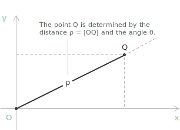
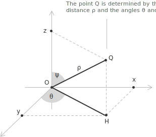

## Radial and angular description of a point

The Cartesian coordinate system describes a point in the plane by projecting it onto two perpendicular axes, which privileges horizontal and vertical directions. In many problems the distance from a fixed point and the direction relative to a fixed ray are more natural descriptors, and this leads to the polar coordinate system. Fix in the plane:

+ a point $O$, called the pole
+ a reference half-line from $O$, called the polar axis
+ a counterclockwise orientation

Every point $Q\neq O$ determines a distance from the pole $\rho=|OQ|$ and an oriented [angle](../angles-and-angular-measure/) $\theta$ between the polar axis and the ray $OQ$. The ordered pair $(\rho,\theta)$ is a system of polar coordinates for $Q$. The first component $\rho$ is the radius [vector](../vectors/), and the second component $\theta$ is the anomaly.

Let $(x,y)$ be the Cartesian coordinates of $Q$ and $(\rho,\theta)$ its polar coordinates. Consider the [right triangle](../right-triangle-trigonometry/) formed by the origin $O$, the point $Q$, and its projection onto the $x$-axis. The hypotenuse is the segment $OQ$ of length $\rho$, and the angle at the origin is $\theta$. Resolving this segment into its horizontal and vertical components through the [sine and cosine](../sine-and-cosine/) of $\theta$ gives:

$$
\begin{align}
x &= \rho\cos\theta \\[6pt]
y &= \rho\sin\theta
\end{align}
$$

The point is reconstructed by projecting the segment of length $\rho$, inclined at angle $\theta$ to the polar axis, onto each coordinate axis. Starting instead from the Cartesian description of $Q$, the radial coordinate follows from the [Pythagorean theorem](../pythagorean-theorem/) applied to the same right triangle:

$$\rho=\sqrt{x^2+y^2}$$

The quantity $\rho$ is the Euclidean distance of the point from the origin, independent of the direction from which it is approached.

> Identifying the plane with the complex plane, the pair $(\rho,\theta)$ gives the [trigonometric form](../complex-numbers-trigonometric-form/) $z=\rho(\cos\theta+i\sin\theta)$ and the [exponential form](../complex-numbers-exponential-form/) $z=\rho e^{i\theta}$ of the number $z=x+iy$, with $\rho$ the modulus and $\theta$ the argument.

## Determining the angle $\theta$

Given the Cartesian coordinates of a point, recovering $\rho$ is immediate, while recovering $\theta$ requires more care, because the trigonometric functions involved are not injective on the full circle and the naive approach through the tangent leaves an ambiguity that must be resolved geometrically. If $x\neq 0$, we divide the second transformation formula by the first:

$$\frac{y}{x}=\frac{\rho\sin\theta}{\rho\cos\theta}$$

Since $\rho>0$, the factor $\rho$ cancels:

$$\frac{y}{x}=\frac{\sin\theta}{\cos\theta}$$

By definition of the [tangent function](../tangent-function/), we obtain:

$$\tan\theta=\frac{y}{x}$$

This equation alone does not determine $\theta$ uniquely, since:

$$\tan\theta=\tan(\theta+\pi)$$

The correct angle is chosen according to the [quadrant](../unit-circle/) in which the point lies. The value of $\theta$ is the angle satisfying:

$$\cos\theta=\frac{x}{\rho}\qquad\sin\theta=\frac{y}{\rho}$$

These two conditions pin down $\theta$ unambiguously, since the signs of $\cos\theta$ and $\sin\theta$ identify the quadrant and resolve the ambiguity left by the tangent alone.

If $Q=O$, then $\rho=0$. The angular coordinate is then irrelevant, because every ray from the pole passes through the origin and the angle carries no geometric meaning. The origin is written as:

$$O=(0,\theta)\quad\forall\ \theta$$

Angular information collapses when the radial distance vanishes.

## Non-uniqueness of polar representation

Polar coordinates are not unique. For every integer $k$ we have:

$$(\rho,\theta)=(\rho,\theta+2\pi k)$$

The same geometric point is also represented by changing the sign of the radial coordinate while adding $\pi$ to the angular coordinate. Reversing the direction of the radial segment and rotating it by half a turn leaves the endpoint unchanged, so:

$$(\rho,\theta)=(-\rho,\theta+\pi)$$

Infinitely many pairs therefore represent the same point. A canonical representation is obtained by imposing:

$$\rho\ge 0,\qquad\theta\in[0,2\pi)$$

This non-uniqueness follows from the rotational symmetry of the plane, since angles are periodic and directions can be traversed in opposite orientations.

## Example 1

We work through a complete conversion from Cartesian to polar coordinates. The chosen point lies in the second quadrant, where the ambiguity of the tangent becomes relevant and must be resolved explicitly. Consider the point:

$$(x,y)=(-3,\ \sqrt{3})$$

We first compute the radial coordinate. Applying the Pythagorean relation:

$$\rho=\sqrt{(-3)^2+(\sqrt{3})^2}=\sqrt{9+3}=2\sqrt{3}$$

We then compute the angular coordinate. The tangent of $\theta$ is:

$$\tan\theta=\frac{\sqrt{3}}{-3}=-\frac{\sqrt{3}}{3}$$

This [equation](../equations/) admits two solutions in $[0,2\pi)$, differing by $\pi$. To select the correct one, we observe that the point has $x<0$ and $y>0$, placing it in the second quadrant. The angle consistent with this quadrant is:

$$\theta=\frac{5\pi}{6}$$

We verify this directly:

$$\cos\frac{5\pi}{6}=-\frac{\sqrt{3}}{2}<0$$

$$\sin\frac{5\pi}{6}=\frac{1}{2}>0$$

These signs match those of $x$ and $y$ respectively. One polar representation of the point is:

$$\left(2\sqrt{3},\ \frac{5\pi}{6}\right)$$

## Example 2

The conversion from polar to Cartesian coordinates is more direct, since it requires no quadrant analysis. We choose a point whose polar form is clean but whose Cartesian form is not obvious, so the calculation is worth carrying out in full. Consider the point given in polar coordinates by:

$$\left(\sqrt{6},\ \frac{7\pi}{4}\right)$$

The angle $\frac{7\pi}{4}$ lies in the fourth quadrant, just short of a full rotation. We apply the transformation formulas directly:

$$x=\rho\cos\theta=\sqrt{6}\cos\frac{7\pi}{4}$$

Recalling that $\cos\frac{7\pi}{4}=\frac{\sqrt{2}}{2}$, we obtain:

$$x=\sqrt{6}\cdot\frac{\sqrt{2}}{2}=\frac{\sqrt{12}}{2}=\frac{2\sqrt{3}}{2}=\sqrt{3}$$

For the vertical component:

$$y=\rho\sin\theta=\sqrt{6}\sin\frac{7\pi}{4}$$

Since $\sin\frac{7\pi}{4}=-\frac{\sqrt{2}}{2}$, the same calculation gives:

$$y=\sqrt{6}\cdot\left(-\frac{\sqrt{2}}{2}\right)=-\sqrt{3}$$

> The angle $\frac{7\pi}{4}$ lies in the fourth quadrant and can be written as $2\pi-\frac{\pi}{4}$. The sine is negative in the fourth quadrant and has the same absolute value as the [reference angle](../reduction-formulas-and-reference-angles/) $\frac{\pi}{4}$, so $\sin\frac{7\pi}{4}=-\frac{\sqrt{2}}{2}$

The Cartesian representation of the point is:

$$(x,y)=\left(\sqrt{3},\ -\sqrt{3}\right)$$

## Canonical representation and bijectivity

The non-uniqueness of polar coordinates raises a natural question. Although many pairs $(\rho,\theta)$ represent the same point, can we choose a single preferred representative? This is possible once we restrict the range of the coordinates suitably. Consider the correspondence $f$ that assigns to every point $Q\neq O$ the pair $(\rho,\theta)$ satisfying:

$$\rho>0,\qquad\theta\in[0,2\pi)$$

With these restrictions, each point of the punctured plane $\mathbb{R}^2\setminus\{O\}$ determines exactly one such pair, and each admissible pair determines exactly one point. The map $f$ is a [bijection](../inverse-function/) between the punctured plane and the half-open strip $(0,+\infty)\times[0,2\pi)$.

To see why injectivity holds, take two distinct points $Q$ and $Q'$, neither equal to $O$. Each determines a unique ray from the pole.

+ If these rays differ, they form different angles with the polar axis, so the angular coordinates differ.
+ If the two points lie on the same ray, they sit at different distances from the pole, so the radial coordinates differ.

In either case the associated pairs cannot coincide.

- - -

The reverse implication follows by reversing the construction. Given any pair $(\rho,\theta)$ with $\rho>0$ and $\theta\in[0,2\pi)$, we take the ray forming angle $\theta$ with the polar axis and mark on it the point at distance $\rho$ from the pole. This produces a unique point $Q\neq O$, mapped back to the original pair. No ambiguity remains once $\rho$ is required to be strictly positive.

- - -

The origin is treated separately. When $\rho=0$ every ray from the pole passes through the same point, so including the origin in the domain would break injectivity. Its coordinates are written as $(0,\theta)$ for arbitrary $\theta$, with the understanding that the angular component carries no geometric information in this degenerate case.

## Polar coordinates in space

Polar coordinates extend to three dimensions through a radial distance and two angular parameters. Let $O$ be the origin of a Cartesian reference frame in space. For a point $Q$ with Cartesian coordinates $(x,y,z)$, we denote by $\rho$ the Euclidean distance from the origin:

$$\rho=\sqrt{x^2+y^2+z^2}$$

To describe the direction of $Q$, we proceed in two steps.

+ We project $Q$ orthogonally onto the plane $XY$ and denote by $\theta$ the polar angle of this projection with respect to the positive $x$-axis.
+ We introduce an angle $\psi$, measured from the positive $z$-axis to the segment $OQ$.

The triple $(\rho,\theta,\psi)$ gives a radial and angular description of the point in space, where $\rho$ is the radial distance, $\theta$ the azimuthal angle in the $XY$-plane, and $\psi$ the zenith measured from the positive $z$-axis. From the [right-triangle relations](../right-triangle-trigonometry/) in the associated geometry:

$$
\begin{align}
x &= \rho\sin\psi\cos\theta \\[6pt]
y &= \rho\sin\psi\sin\theta \\[6pt]
z &= \rho\cos\psi
\end{align}
$$

The Cartesian coordinates are recovered by decomposing the segment $OQ$ into a vertical component of length $\rho\cos\psi$ and a horizontal component of length $\rho\sin\psi$, the latter resolved in the plane through the planar polar relations. This coordinate system suits problems with spherical symmetry, where distance from the origin matters more than alignment with the coordinate axes.

## Integration in polar coordinates

Polar coordinates are useful for [integration](../definite-integrals/) over planar regions with radial symmetry. When a region is described by distance from the origin and angular spread, Cartesian coordinates may obscure its structure. In polar coordinates the elementary area element is not the product of two independent differentials. A small region determined by variations $d\rho$ and $d\theta$ has area:

$$dA=\rho\ d\rho\ d\theta$$

The extra factor $\rho$ arises because circular arcs grow in length proportionally to the distance from the origin. A double integral over a region $D$ is rewritten as:

$$\iint_D f(x,y)\ dx\ dy=\iint_{D'} f(\rho\cos\theta,\rho\sin\theta)\ \rho\ d\rho\ d\theta$$

where $D'$ is the corresponding region in the $(\rho,\theta)$-plane. This transformation simplifies computations when the geometry of the problem is expressed in radial terms.
