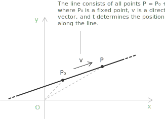

## From Cartesian to vector form

We have seen that the equation of a line can be written in [Cartesian form](../lines/), for example the explicit equation:

$$y = mx + q$$

In this form the line is described through coordinates in the plane. A line can also be expressed in vector form, through points and direction [vectors](../vectors/) that give its position and orientation.

Consider a directed vector $\vec{v}$. The line passing through a point $P_0$ and parallel to $\vec{v}$ consists of all points $P$ such that the vector $P-P_0$ is parallel to $\vec{v}$. The vector equation of a line is:

$$P-P_0 = t\vec{v} \quad \text{with}\ t \in \mathbb{R}$$

Here $P_0$ is a fixed point on the line, $\vec{v}$ is a direction vector, and $t$ is a real parameter. The point $P$ varies along the line as $t$ changes.

## From vector to parametric form

We now fix an [orthonormal basis](../vector-spaces/), a reference system whose axes are perpendicular and whose defining vectors have unit length. This is the standard Cartesian plane, where the x-axis is aligned with $\vec{i}=(1,0)$ and the y-axis with $\vec{j}=(0,1)$.

We write the fixed point $P_0$ and a generic point $P$ in coordinates:

$$P_0 = (x_0, y_0) \quad \text{and} \quad P = (x, y)$$

Using the vector equation of the line, we obtain:

$$
\begin{align}
P-P_0 &= (P-O) - (P_0-O) \\[6pt]
&= (x-x_0)\vec{i} + (y-y_0)\vec{j}
\end{align}
$$

In an orthonormal basis, any vector is a [linear combination](../linear-combinations/) of the axis vectors $\vec{i}$ and $\vec{j}$:

$$\vec{v} = \text{(movement along x)}\cdot\vec{i} + \text{(movement along y)}\cdot\vec{j}$$

We first decompose the direction vector as

$$\vec{v} = k\vec{i} + h\vec{j}$$

so the term $t\vec{v}$ on the right-hand side becomes

$$t\vec{v} = t(k\vec{i} + h\vec{j})$$

We now rewrite the vector equation of the line as

$$(x-x_0)\vec{i} + (y-y_0)\vec{j} = tk\vec{i} + th\vec{j}$$

By equating the components along the $\vec{i}$ and $\vec{j}$ directions, we obtain the system of parametric equations:

$$
\begin{cases}
x = x_0 + kt \\[6pt]
y = y_0 + ht
\end{cases}
$$

## Eliminating the parameter

The parametric equations give $x$ and $y$ in terms of the parameter $t$. When both components of the direction vector are nonzero, we can remove $t$ and recover a single relation between $x$ and $y$. Solving each equation for $t$ gives:

$$t = \frac{x-x_0}{k} \quad \text{and} \quad t = \frac{y-y_0}{h}$$

The two expressions equal the same parameter, so they equal each other:

$$\frac{x-x_0}{k} = \frac{y-y_0}{h}$$

This is the symmetric equation of the line. Clearing the denominators returns the explicit form, with slope $m=h/k$:

$$y-y_0 = \frac{h}{k}(x-x_0)$$

The ratio $h/k$ is the slope, since a step of $k$ along the x-axis is matched by a step of $h$ along the y-axis. When $k=0$ the direction vector is vertical and no slope exists, yet the parametric form still applies. The first equation reduces to $x=x_0$, a vertical line, which the explicit form $y=mx+q$ cannot describe.

## The line through two given points

We find the parametric equations of the line passing through the points:

$$P_0 = (2, 1) \quad \text{and} \quad P = (5, 4)$$

To define a line parametrically, we need a point and a direction. Since both $P_0$ and $P$ lie on the line, we compute the direction vector $\vec{v}$ by subtracting their coordinates:

$$\vec{v} = P-P_0 = (5-2,\ 4-1) = (3, 3)$$

This vector tells us how to move along the line from $P_0$, three units in the x-direction for every three units in the y-direction. We now use the parametric form of the line, which expresses each coordinate as a function of the parameter $t$:

$$
\begin{cases}
x = x_0 + kt \\[6pt]
y = y_0 + ht
\end{cases}
\quad t \in \mathbb{R}
$$

In our case we have:

+ coordinates of $P_0$: $x_0 = 2$, $y_0 = 1$
+ components of the direction vector $\vec{v}$: $k = 3$, $h = 3$

Substituting into the equations, we obtain:

$$
\begin{cases}
x = 2 + 3t \\[6pt]
y = 1 + 3t
\end{cases}
\quad t \in \mathbb{R}
$$

This system describes all the points on the line through $(2,1)$ and $(5,4)$. By varying $t$, we generate every point along the line in both directions. Eliminating the parameter gives the symmetric equation:

$$\frac{x-2}{3} = \frac{y-1}{3}$$

which simplifies to $y=x-1$, the explicit form of the same line. For any two points, we take the direction vector as their difference, then substitute its components into the parametric form.

## Choosing the point and the direction

A line does not fix its own parametric representation. Every choice made in setting it up can vary while the set of points stays the same.

The base point is free. Any point of the line can be taken as $P_0$. The direction vector is free up to a nonzero scalar, since $\vec{v}$ and $\lambda\vec{v}$ with $\lambda \neq 0$ give the same line. In the previous example the direction $(3,3)$ could be replaced by $(1,1)$ or $(-2,-2)$, and the equations still describe the same line with a rescaled parameter. Only the direction of $\vec{v}$ matters, and $\vec{v}$ itself need not lie on the line.

The range of $t$ selects how much of the line we obtain. With $t \in \mathbb{R}$ the equations cover the whole line. Restricting $t$ to the interval $[0,1]$ gives the segment from $P_0$ at $t=0$ to $P_0+\vec{v}$ at $t=1$, and restricting $t$ to $t \geq 0$ gives the ray from $P_0$ in the direction of $\vec{v}$. The sign of $t$ sets the orientation, with positive values moving from $P_0$ along $\vec{v}$ and negative values moving the opposite way.

## Lines in space

In the plane a line can be written as $y=mx+q$, a single equation in $x$ and $y$. In three dimensions this fails. A single linear equation in $x$, $y$, $z$ describes a plane, not a line, so the explicit form no longer isolates a line. The vector and parametric forms carry over unchanged, and they are the standard way to describe a line in space.

A line in space is fixed by a point $P_0=(x_0,y_0,z_0)$ and a direction vector $\vec{v}=(k,h,l)$. The vector equation keeps the same shape:

$$P-P_0 = t\vec{v} \quad \text{with}\ t \in \mathbb{R}$$

Reading it componentwise gives three parametric equations, one for each axis:

$$
\begin{cases}
x = x_0 + kt \\[6pt]
y = y_0 + ht \\[6pt]
z = z_0 + lt
\end{cases}
$$

When $k$, $h$, $l$ are all nonzero we again eliminate the parameter, solving each equation for $t$ and setting the results equal:

$$\frac{x-x_0}{k} = \frac{y-y_0}{h} = \frac{z-z_0}{l}$$

These are the symmetric equations of the line in space. If one component vanishes, say $h=0$, the matching coordinate stays constant and the parameter is removed only from the other two:

$$\frac{x-x_0}{k} = \frac{z-z_0}{l} \quad \text{and} \quad y=y_0$$

## Comparing the three forms

The three forms describe the same line through different information. The vector form builds every point $P$ from the base point $P_0$ and a displacement along $\vec{v}$:

$$P = P_0 + t\vec{v}$$

The parametric form writes this rule coordinate by coordinate, one equation per axis, using the components of the direction vector:

$$
\begin{cases}
x = x_0 + kt \\[6pt]
y = y_0 + ht
\end{cases}
\quad t \in \mathbb{R}
$$

The symmetric form removes the parameter and links the coordinates directly:

$$\frac{x-x_0}{k} = \frac{y-y_0}{h}$$

All three hold in any dimension and describe the same set of points. The vector form is compact and geometric, the parametric form is explicit and ready to calculate with, the symmetric form ties the coordinates together without a parameter. We use whichever fits the problem at hand.
