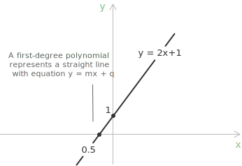
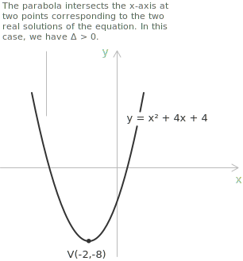
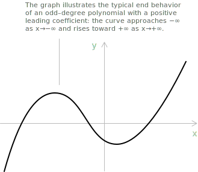

## Definition

Let $\mathbb{R}$ be the [field](../fields/) of [real numbers](../real-numbers/). A polynomial in one variable $x$ with coefficients in $\mathbb{R}$ has the following form:

$$a_{n}x^{n}+a_{n-1}x^{n-1}+\dotsb +a_{1}x+a_{0}$$

$n$ is a non-negative integer, and $a_0,a_1,\ldots,a_n\in\mathbb{R}$ are the coefficients, with $a_n\neq 0$. Each term $a_kx^k$ is a monomial of degree $k$. We usually write a polynomial as $P(x)$ or $p(x)$. The [set](../sets/) of all polynomials in $x$ with real coefficients is $\mathbb{R}[x]$.

The symbol $x$ is an indeterminate rather than a number to be chosen. Formally, the polynomial above is the coefficient sequence $(a_0,a_1,\ldots,a_n,0,0,\ldots)$, whose entries vanish from some index onward. Two polynomials are equal when their coefficient sequences are equal. The same definition applies over any [field](../fields/) $\mathbb{F}$, and the resulting polynomial ring is $\mathbb{F}[x]$. The sections concerning graphs and real-variable behavior specialize to $\mathbb{R}[x]$.

The set $\mathbb{R}[x]$ is a [ring](../rings/) under two standard operations. For two polynomials:

$$
\begin{align}
P(x) &= \sum_{k=0}^{n} a_k x^k \\[6pt]
Q(x) &= \sum_{k=0}^{m} b_k x^k
\end{align}
$$

their sum is defined by adding the coefficients of corresponding degrees:

$$(P + Q)(x) = \sum_{k=0}^{\max(n,m)} (a_k + b_k) x^k$$

The product of two polynomials is defined by the Cauchy convolution of their coefficient sequences:

$$(P \cdot Q)(x) = \sum_{k=0}^{n+m} \left( \sum_{j=0}^{k} a_j b_{k-j} \right) x^k$$

Coefficients with indices exceeding the degree of the respective polynomial are zero. Under these two operations, $\mathbb{R}[x]$ is a commutative ring with identity and an integral domain, since the product of two nonzero polynomials is never the zero polynomial.

Because $\mathbb{R}[x]$ has no zero divisors, it has the cancellation law. If $P(x)R(x)=Q(x)R(x)$ and $R(x)\neq 0$, then $(P(x)-Q(x))R(x)=0$, so $P(x)=Q(x)$.

> The ring $\mathbb{R}[x]$ is closed under addition, subtraction, and multiplication.

## Degree of a polynomial

The degree of a polynomial $P(x)$ is defined as the largest integer $k$ such that the coefficient $a_k$ is nonzero. This degree is denoted as $\deg P$ or $\deg P(x)$. For example, consider the polynomial:

$$P(x) = 2x^3 - 5x^2 + 3x - 7$$

$P(x)$ has degree 3, since the largest exponent appearing with a nonzero coefficient is 3. A polynomial may still be of degree 3 even if some intermediate terms are absent: the polynomial $P(x) = 4x^3 + x - 2$ is also of degree 3, despite the absence of the quadratic term.

The degree is well defined due to the requirement that $a_n \neq 0$ in the definition. The leading coefficient uniquely determines the highest-degree term, known as the leading term.

The zero polynomial, where all coefficients are zero, is the only polynomial that is not assigned a degree in the usual sense. By convention, $\deg 0 = -\infty$, a choice motivated by the requirement that the following identity remain valid even when one of the two factors is the zero polynomial:

$$\deg(P \cdot Q) = \deg P + \deg Q$$

## Interpolation and degree of a polynomial

Polynomial degree controls interpolation. For distinct points $\alpha_0,\alpha_1,\dots,\alpha_n\in\mathbb{R}$ and prescribed values $\beta_0,\beta_1,\dots,\beta_n\in\mathbb{R}$, a unique polynomial $p(x)\in\mathbb{R}[x]$ of degree at most $n$ satisfies:

$$p(\alpha_i) = \beta_i \quad \forall \, i = 0, 1, \dots, n$$

Thus $n+1$ distinct interpolation nodes determine a polynomial of degree at most $n$. Its construction is polynomial interpolation, and the Lagrange interpolation formula is a standard explicit method.

## Degree of a polynomial and its geometric interpretation

The degree constrains the shape of a polynomial graph. The graph of a first-degree, or linear, polynomial is a straight line of the form:

$$y = mx + q$$

In this equation $m$ is the slope and $q$ is the y-intercept. For example, the equation $y=2x+1$ is the line shown in the graph.

> For a differentiable function, the [derivative](../derivatives/) at a point is the slope of the tangent line at that point.

- - -
The graph of a second-degree, or quadratic, polynomial is a [parabola](../parabola/) of the form:

$$y = ax^2 + bx + c $$

The sign of $a$ determines whether the parabola opens upward or downward, the coefficients $a$, $b$, and $c$ determine the vertex, and $c$ is the y-intercept. The graph shows the parabola $y=x^2+4x-4$. It opens upward because the coefficient of $x^2$ is positive.

- - -
The graph of a third-degree, or cubic, polynomial is a cubic curve of the form:

$$y = ax^3 + bx^2 + cx + d $$

The leading coefficient $a$ determines the end orientation, the coefficients $b$ and $c$ affect the critical and inflection points, and $d$ is the y-intercept.

## End behavior of polynomial

The end behavior of a polynomial is determined exclusively by its leading term, that is, the term of highest degree $a_n x^n$. As $|x|$ approaches infinity, all lower-degree terms become [asymptotically](../asymptotes/) negligible compared to the growth imposed by the power $x^n$.

The two end limits depend on the parity of $n$ and the sign of the leading coefficient $a_n$.

+ When the degree is even, the function $x^n$ is non-negative for all real values of $x$, and the end behavior is therefore symmetric: the polynomial diverges to $+\infty$ if $a_n > 0$ and to $-\infty$ if $a_n < 0$.

+ When the degree is odd, the power $x^n$ changes sign with $x$, yielding a non-symmetric configuration in which the two ends of the graph point in opposite directions.

| Degree $n$ | $a_n$ | $x \to -\infty$ | $x \to +\infty$ | Direction              | End orientation    |
|----------------|-----------|----------------------|----------------------|------------------------|---------------|
| even           | $>0$  | $+\infty$        | $+\infty$        | same         | $\nwarrow$ $\nearrow$       |
| even           | $<0$  | $-\infty$        | $-\infty$        | same         | $\swarrow$ $\searrow$   |
| odd            | $>0$  | $-\infty$        | $+\infty$        | opposite    | $\swarrow$ $\nearrow$     |
| odd            | $<0$  | $+\infty$        | $-\infty$        | opposite    | $\nwarrow$  $\searrow$  |

> The leading term determines both end limits because the ratio of every lower-degree term to $a_nx^n$ tends to zero as $|x|$ increases.

- - -
To clarify the concept further, let us consider the case in the third row with the following polynomial:
$$ x^3 + 5x^2 + 5x + 1 $$

This polynomial has odd degree and a positive leading coefficient. Therefore it tends to $-\infty$ as $x\to-\infty$ and to $+\infty$ as $x\to+\infty$.

| Degree $n$ | $a_n$ | $x \to -\infty$ | $x \to +\infty$ | Direction              | End orientation    |
|----------------|-----------|----------------------|----------------------|------------------------|---------------|
| odd            | $>0$  | $-\infty$        | $+\infty$        | opposite    | $\swarrow$ $\nearrow$     |

Every odd-degree polynomial with a positive leading coefficient has this down-to-up end behavior. Its degree and leading coefficient determine the two end limits because $a_nx^n$ dominates all lower-degree terms as $|x|$ increases.

## Monomials, binomials, trinomials

A [monomial](../monomials/) is a polynomial expression comprising only one term, a constant, a single variable, or a combination of constants and variables raised to non-negative integer powers. For instance, $3x^2$ and $-5y$ are both monomials.

A [binomial](../binomials/) is a polynomial expression consisting of two terms: constants, variables, or the product of constants and variables raised to non-negative integer powers. For example, $3x + 7$ and $-2y^2 + 5y$ are both binomials.

A [trinomial](../trinomials/) is a polynomial expression consisting of three terms, which can also be constants, variables, or the product of constants and variables raised to non-negative integer powers. For instance, $x^2-2x + 4$ and $3y^3 + 2y^2- y$ are both trinomials.

## Sum or difference of two polynomials

The [sum or difference](../adding-and-subtracting-polynomials/) of two polynomials of degree $n$ has degree at most $n$. It has degree less than $n$ when the leading terms cancel.

The sum or difference of the two polynomials is obtained by adding or subtracting the corresponding coefficients of the like terms.

$$
\begin{align*}
P(x) + Q(x) &= (ax^n + bx^{n-1} + \ldots + z) + (px^n + qx^{n-1} + \ldots + w) \\[0.6em]
&= (a+p)x^n + (b+q)x^{n-1} + \ldots + (z+w) \\[0.6em]
P(x)-Q(x) &= (ax^n + bx^{n-1} + \ldots + z) - (px^n + qx^{n-1} + \ldots + w) \\[0.6em]
&= (a-p)x^n + (b-q)x^{n-1} + \ldots + (z-w)
\end{align*}
$$

## Example 1

Given two polynomials $P(x)$ and $Q(x)$, the sum $P(x) + Q(x)$ is computed as follows:

$$P(x) = x^2 + 3x - 1$$

$$Q(x) = 2x^2 - x + 5$$

The sum is given by:

$$P(x) + Q(x) = \left( x^2 + 3x - 1 \right) + \left( 2x^2 - x + 5 \right)$$

- - -
Removing the parentheses and collecting terms of equal degree we obtain:

$$
\begin{align}
P(x) + Q(x) &= x^2 + 3x - 1 + 2x^2 - x + 5 \\[0.5em]
&= (x^2 + 2x^2) + (3x - x) + (-1 + 5) \\[0.5em]
&= 3x^2 + 2x + 4
\end{align}
$$

The result of the two polynomials $P(x) + Q(x)$ is expressed as:

$$3x^2 + 2x + 4 $$

## Example 2

Consider two polynomials $P(x)$ and $Q(x)$ of degree $n$. As established above, their sum or difference is a polynomial of degree at most $n$. The following example illustrates the case in which the degree strictly decreases.

$$ P(x) = 2x^2+3x-1 $$
$$ Q(x) = 2x^2-x+5 $$

The difference $P(x)-Q(x)$ is:

$$ P(x)-Q(x) = \left( 2x^2+3x-1 \right)-\left( 2x^2-x+5 \right) $$

Expanding and collecting terms of equal degree:

$$
\begin{align*}
P(x)-Q(x) &= 2x^2+3x-1-2x^2+x-5 \\[0.5em]
&= (2x^2-2x^2)+(3x+x)+(-1-5) \\[0.5em]
&= 4x-6
\end{align*}
$$

> The leading terms of degree $n=2$ cancel exactly, reducing the result to a polynomial of degree $n-1=1$. This confirms that the degree of a sum or difference can be strictly less than the degree of the summands.

## How to multiply two polynomials

The [product of two polynomials](../multiplying-polynomials/) is obtained by repeated application of the distributive property: every term of one polynomial is multiplied by every term of the other, and the resulting monomials are collected by degree. Given $P(x) = \sum_i a_i x^i$ and $Q(x) = \sum_j b_j x^j$, the product is:

$$
(P \cdot Q)(x) = \sum_{k=0}^{n+m} \left( \sum_{i=0}^{k} a_i b_{k-i} \right) x^k
$$

The degree of the product satisfies $\deg(P \cdot Q) = \deg P + \deg Q$ whenever neither factor is the zero polynomial. Together with addition, multiplication endows the set $\mathbb{R}[x]$ with the structure of a commutative ring with unity and, since $\mathbb{R}$ is an integral domain, with no zero divisors. The dedicated page collects worked examples, the multivariate extension, and the connection with [notable products](../notable-products/) and the [FOIL method](../binomials/) for the special case of two [binomials](../binomials/).

## How to divide two polynomials

[Polynomial division](../polynomial-division/) asks for a quotient and a remainder. For polynomials $P(x)$ and $D(x)$ with $D(x)\neq 0$, unique polynomials $Q(x)$ and $R(x)$ satisfy:

$$P(x) = Q(x) D(x) + R(x) $$

+ $Q(x)$ is the quotient of the division.  
+ $R(x)$ is the remainder.  
+ The degree of $R(x)$ is strictly less than the degree of $D(x)$

> This is the polynomial division algorithm, or polynomial long division. Its remainder is zero or has degree strictly less than the degree of the divisor.

- - -
When the division between two polynomials is expressed as a reduced quotient (without explicitly showing the remainder), we obtain a rational function defined as:

$$
R(x) = \frac{P(x)}{Q(x)}
$$

where $P(x)$ and $Q(x)$ are polynomials and $Q(x) \ne 0$.

> [Rational equations](../rational-equations/) and rational inequalities contain quotients of polynomials.

## Factoring polynomials

A number $\alpha$ is said to be a [root](../roots-of-a-polynomial/) of the polynomial $P(x)$ if $P(\alpha) = 0$. The root $\alpha$ is called integer, rational, real, or complex depending on whether $\alpha$ is an integer, a [rational number](../types-of-numbers/), a real number, or a [complex number](../complex-numbers-introduction/).

- - -
The existence of roots over $\mathbb{C}$ is guaranteed by the [Fundamental Theorem of Algebra](../roots-of-a-polynomial/), which states that every non-constant polynomial with complex coefficients has at least one complex root. As a consequence, any polynomial of degree $n$ over $\mathbb{C}$ factors into exactly $n$ linear factors, counted with multiplicity. Over $\mathbb{R}$, the situation is more nuanced: real roots may not always exist, and irreducible quadratic factors with no real roots may appear in the factorization.

The general existence and uniqueness statement is developed in [unique factorization of polynomials](../unique-factorization-of-polynomials/). It distinguishes irreducible factors from units and explains why a factorization is unique only up to the order of the factors and multiplication by nonzero constants.

When all roots are known, every polynomial $P(x)$ with $P(0)\ne 0$ has the following factored form:

$$
P(x) = P(0) \prod_{\rho} \left(1 - \frac{x}{\rho} \right)
$$

The product has one factor for each root $\rho$, counted with multiplicity. Expanding the product and comparing coefficients gives [Vieta's formulas](../vieta-formulas/), in which every coefficient is an elementary symmetric polynomial in the roots.

## Polynomial equations

A [polynomial equation](../polynomial-equations/) is an equation of the form:

$$a_{n}x^{n}+a_{n-1}x^{n-1}+\dotsb +a_{2}x^{2}+a_{1}x+a_{0} = 0$$

Polynomial equations are classified according to the degree of the leading term. Depending on their degree, they are referred to as [linear](../linear-equations/) (degree 1), [quadratic](../quadratic-equations/) (degree 2), [cubic](../cubic-equations/) (degree 3), or of higher degree when $n > 3$.

## Polynomial functions

A [polynomial function](../polynomial-function/) is a [function](../functions/) of the form:

$$y = a_{n}x^{n}+a_{n-1}x^{n-1}+\dotsb +a_{2}x^{2}+a_{1}x+a_{0} $$

Each formal polynomial $P\in\mathbb{R}[x]$ has an associated function $x\mapsto P(x)$. Evaluation preserves the algebraic operations, since $(P+Q)(x)=P(x)+Q(x)$ and $(PQ)(x)=P(x)Q(x)$ for every real $x$.

Suppose that two polynomials $p(x)$ and $q(x)$ define the same function at every real value, so that:

$$ p(x) = q(x) \quad \forall \ x $$

Since $\mathbb{R}$ is infinite, the two polynomials are equal and have the same coefficients. This is the identity principle for polynomials.

> The distinction between a formal polynomial and its associated function matters over finite fields. In the field $\mathbb{F}_2=\{0,1\}$, the nonzero polynomial $h(x)=x^2+x$ satisfies $h(0)=h(1)=0$. It therefore induces the same function as the zero polynomial even though their coefficient sequences differ.

Polynomial functions have the following analytical properties.

+ Their domain is the entire real line $\mathbb{R}$, and they are [continuous](../continuous-functions/) and smooth at every point, with no [discontinuities](../discontinuities-of-real-functions/), singularities, cusps, or corners.
+ As a consequence of their global regularity, polynomial functions do not admit [asymptotes](../asymptotes/) of any kind.
+ Regarding [symmetry](../even-and-odd-functions/), an odd polynomial function has an [inflection point](../maximum-minimum-and-inflection-points/) at the origin $(0,0)$, while an even polynomial function attains a local maximum or minimum at $x = 0$.
