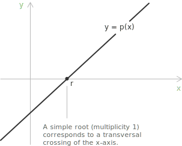
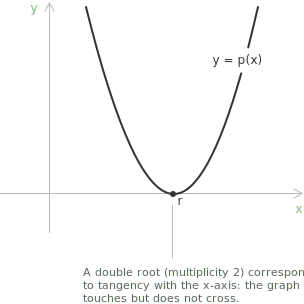
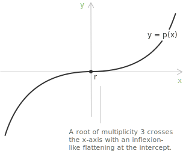

## Definition

Let $p(x)$ be a [polynomial](../polynomials/) with coefficients in a field $\mathbb{F}$, typically $\mathbb{R}$ or $\mathbb{C}$. A root, or zero, of $p$ is any element $r \in \mathbb{F}$ such that:

$$
p(r) = 0
$$

Given a polynomial of the form:

$$
p(x) = a_n x^n + a_{n-1} x^{n-1} + \cdots + a_1 x + a_0
$$

with $a_n \neq 0$, the element $r$ is a root precisely when the substitution $x = r$ produces the value:

$$p(r) = a_n r^n + a_{n-1} r^{n-1} + \cdots + a_1 r + a_0 = 0$$

The terms root and zero are used interchangeably.

For a polynomial $p : \mathbb{R} \to \mathbb{R}$, the real roots are the $x$-intercepts of its graph. The multiplicity of a root affects the graph locally. At a simple root, of multiplicity one, the graph crosses the $x$-axis cleanly and is not tangent to it.

For a root of even multiplicity, the graph touches the $x$-axis but does not cross it. Since $(x - r)^m \geq 0$ for even $m$, the polynomial does not [change sign](../sign-analysis-in-inequalities/) at $r$, and the graph bounces back to the same side of the axis.

For roots of odd multiplicity greater than one, that is $m \geq 3$, the graph crosses the axis but appears flatter at the intercept. The flattening becomes more pronounced as the multiplicity increases, giving the curve an [inflexion-like](../maximum-minimum-and-inflection-points/) appearance.

These properties follow from the local factorization:

$$
p(x) = (x - r)^m q(x)
$$

with $q(r) \neq 0$. Since $q$ is [continuous](../continuous-functions/) and nonzero at $r$, it maintains a constant sign in some neighborhood of $r$, so the sign of $p(x)$ near $r$ is determined entirely by the factor $(x - r)^m$.

+ When $m$ is odd, $(x - r)^m$ changes sign as $x$ passes through $r$, so $p$ crosses the axis.
+ When $m$ is even, $(x - r)^m \geq 0$ on both sides of $r$, so $p$ does not change sign and the graph returns to the same side of the axis.

A nonzero polynomial of degree $n$ over any field has at most $n$ distinct roots. The proof proceeds by induction on $n$. A nonzero constant has no roots. If a polynomial of positive degree has no root, the conclusion is immediate. Otherwise, choose a root $r$. The factor theorem gives $p(x)=(x-r)q(x)$ with $\deg q=n-1$. Any other root $s\neq r$ satisfies $0=(s-r)q(s)$, hence $q(s)=0$. The inductive hypothesis bounds the number of roots of $q$ by $n-1$, and adjoining $r$ gives at most $n$ roots of $p$.

The same degree count includes multiplicities. If the distinct roots are $r_1,\ldots,r_k$ with multiplicities $m_1,\ldots,m_k$, successive applications of the factor theorem show that $(x-r_1)^{m_1}\cdots(x-r_k)^{m_k}$ divides $p(x)$. Hence $m_1+\cdots+m_k\leq n$.

> Two distinct polynomials of degree at most $n$ cannot agree at more than $n$ points. If $p(x) - q(x)$ has degree at most $n$ and vanishes at $n + 1$ points, then $p \equiv q$.

## Multiplicity of a root

The notion of multiplicity refines the definition of a root by quantifying how many times a given value is a root. Let $p(x)$ be a polynomial with coefficients in a field $\mathbb{F}$, and let $r \in \mathbb{F}$ be a root of $p(x)$. The multiplicity of $r$ is the largest positive integer $m$ such that $(x - r)^m$ divides $p(x)$ in $\mathbb{F}[x]$, while $(x - r)^{m+1}$ does not. Equivalently, $p(x)$ admits the factorization:

$$
p(x) = (x - r)^m q(x)
$$

with $q(r) \neq 0$. The polynomial $q(x)$ collects all the remaining factors of $p(x)$, and the condition $q(r) \neq 0$ guarantees that the exponent $m$ cannot be increased.

A root of multiplicity one is called a simple root. A root of multiplicity two or more is called a multiple root, with specific names attached to the lowest cases: a root of multiplicity two is a double root, a root of multiplicity three is a triple root. The sum of the multiplicities of all the roots of a polynomial of degree $n$ cannot exceed $n$. When equality holds, the polynomial decomposes completely into linear factors over $\mathbb{F}$:

$$
p(x) = a_n (x - r_1)^{m_1} (x - r_2)^{m_2} \cdots (x - r_k)^{m_k}
$$

with $m_1 + m_2 + \cdots + m_k = n$. Over the field of complex numbers, the fundamental theorem of algebra states that this complete decomposition always exists.

Multiplicity has a differential characterization in terms of the [derivatives](../derivatives/) of $p(x)$. The element $r$ is a root of multiplicity $m$ of $p(x)$ if and only if:

$$
p(r) = p'(r) = p''(r) = \cdots = p^{(m-1)}(r) = 0
$$

and

$$
p^{(m)}(r) \neq 0
$$

Successive derivatives give a constructive test for the multiplicity of a known root. Evaluate them at $r$; the order of the first nonzero derivative is the multiplicity.

> The differential characterization explains the graphical behaviour described above. At a simple root, the polynomial vanishes but its derivative does not, so the graph crosses the $x$-axis with nonzero slope. At a root of multiplicity $m \geq 2$, the first $m-1$ derivatives also vanish at $r$, and the graph becomes increasingly flat at the intercept as $m$ grows.

## Rational root theorem

Given a polynomial with integer coefficients:

$$
p(x) = a_n x^n + \cdots + a_0 \in \mathbb{Z}[x]
$$

the [rational root theorem](../polynomial-equations/) identifies a finite set of candidates for rational roots. If $r = s/q$ in lowest terms, with $s, q \in \mathbb{Z}$ and $q > 0$, is a root of $p(x)$, then necessarily $s \mid a_0$ and $q \mid a_n$.

The theorem reduces the search for rational roots to a finite collection of fractions, each of which can be verified by direct substitution or [synthetic division](../synthetic-division/).

## The fundamental theorem of algebra

In the field of [complex numbers](../complex-numbers-introduction/) $\mathbb{C}$, every non-constant polynomial has at least one root. Applying the factor theorem repeatedly, any polynomial of degree $n \geq 1$ decomposes completely into linear factors over $\mathbb{C}$:

$$
p(x) = a_n (x - r_1)^{m_1}(x - r_2)^{m_2} \cdots (x - r_k)^{m_k}
$$

where $m_1 + m_2 + \cdots + m_k = n$. Counting roots with their multiplicities, a degree-$n$ polynomial has exactly $n$ roots in $\mathbb{C}$. The [unique factorization theorem](../unique-factorization-of-polynomials/) shows that the multiset of linear factors, and therefore the multiplicity assigned to each complex root, is uniquely determined. This property characterizes $\mathbb{C}$ as an algebraically closed [field](../fields/).

Over $\mathbb{R}$, the complex roots of a real polynomial occur in conjugate pairs. If $r = \alpha + \beta i$ with $\beta \neq 0$ is a root of $p \in \mathbb{R}[x]$, then $\bar{r} = \alpha - \beta i$ is also a root, and the two factors combine into an irreducible quadratic over $\mathbb{R}$:

$$
(x - r)(x - \bar{r}) = x^2 - 2\alpha x + (\alpha^2 + \beta^2)
$$

Every real polynomial of odd degree therefore has at least one real root. To relate roots and coefficients, expand the product:

$$
a_n(x - r_1)(x - r_2)\cdots(x - r_n)
$$

Compare this product with the standard form:

$$
a_n x^n + a_{n-1}x^{n-1} + \cdots + a_0
$$

Coefficient comparison gives [Vieta's formulas](../vieta-formulas/), which express each coefficient as an elementary symmetric polynomial in the roots. In particular:

$$
r_1 + r_2 + \cdots + r_n = \frac{-a_{n-1}}{a_n}
$$

$$
r_1 r_2 \cdots r_n = \frac{(-1)^n a_0}{a_n}
$$

The quadratic case is treated in detail in the page on [trinomials](../trinomials/).

## Finding roots: an overview of methods

For polynomials of degree 1 and 2, exact formulas are elementary. A linear polynomial $ax + b$ has the unique root $x = -b/a$. For a quadratic $ax^2 + bx + c$, the roots are given by the [quadratic formula](../quadratic-formula/):

$$
x = \frac{-b \pm \sqrt{b^2 - 4ac}}{2a}
$$

The quantity $\Delta = b^2 - 4ac$ is the discriminant.

+ If $\Delta > 0$, the polynomial has two distinct real roots.
+ If $\Delta = 0$, it has one real root of multiplicity 2.
+ If $\Delta < 0$, it has two complex conjugate roots.

> Closed-form solutions also exist for degree 3 (Cardano's formula) and degree 4 (Ferrari's method), though they are considerably more involved. For higher degrees, the problem requires more advanced techniques.

- - -
The roots of a polynomial are precisely the solutions to the corresponding [polynomial equation](../polynomial-equations/) $p(x) = 0$, and the methods outlined above apply directly to both settings.

[Partial fraction decomposition](../partial-fraction-decomposition/) uses the roots and multiplicities of the denominator $Q(x)$. Each simple root has one linear term, while a root of multiplicity $m$ has terms with denominator powers from $1$ through $m$.
