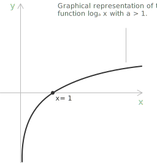
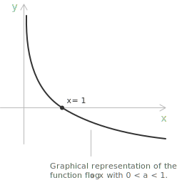
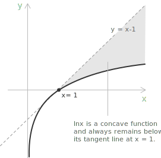

## Definition

If $a$ and $b$ are positive [real numbers](../properties-of-real-numbers/), with $a \neq 1$, the logarithm of $b$ to the base $a$, denoted by $\log_a(b)$, is defined as the real number $c$ such that $a^c = b$.

$$\log_a{b} = c \iff a^c = b$$

The following conditions must be satisfied:

$$a>0 \quad a \neq 1 \quad b > 0$$

For example, $\log{_2}8 = 3 \to 2^3 = 8$. In simple terms, the logarithm of a number is the exponent to which a given base must be raised to obtain that number. Therefore, the logarithm is the inverse operation of [exponentiation](../exponential-function/).

+ $a$ is the base of the logarithm.
+ $b$ is the argument of the logarithm.

The condition $a \neq 1$ is essential. In fact, when $a = 1$, the exponential expression $a^x$ becomes $1^x = 1$ for every $x \in \mathbb{R}$. In this case, the exponential function is constant and therefore not [invertible](../inverse-function/). Since the logarithm is defined as the inverse operation of exponentiation, it cannot be defined when the base is equal to $1$. For this reason, the base of a logarithm must satisfy $a > 0$ and $a \neq 1$.

## Basic identities

Understanding logarithms requires reviewing the concept of [powers](../powers/), as these two mathematical ideas are closely related. The following identities arise directly from the fact that logarithms are the inverse operation of exponentiation:

$$a^0 = 1 \Rightarrow \log{_a}1 = 0$$

$$a^1 = a \Rightarrow \log{_a}a = 1$$

Since the exponential is always positive, it is not possible to define the logarithm of a negative number. Formally, there does not exist a number $c \in \mathbb{R}$ such that $a^c < 0$.

+ Logarithms with base $e$, known as natural or Napierian logarithms, are typically denoted by $\ln a$ without explicitly indicating the base, where $e \approx 2.71828$ is [Euler's number](../euler-number-limit-sequence/), the base of the natural exponential function $e^x$.

+ Logarithms with base $10$, known as common logarithms, are typically denoted by $\text{Log} a$ without specifying the base.

> The base-10 logarithm is especially useful when dealing with very large or very small numbers because it compresses the scale, making values easier to interpret and compare.

## Logarithmic function

As previously discussed, the [logarithmic function](../logarithmic-function/) is the [inverse](../inverse-function/) of the exponential function. Consequently, its [domain](../determining-the-domain-of-a-function/) and range are interchanged relative to those of the [exponential function](../exponential-function/). A logarithmic function is typically written in the following form:

$$
\log_a : (0,+\infty) \to \mathbb{R}, \quad a > 0 \quad a \neq 1
$$

The domain is $x \in \mathbb{R}^+$ and the range is $\mathbb{R}$. The function is [continuous](../continuous-functions/) and [differentiable](../derivatives/) on $(0,+\infty)$.

The graph above illustrates the monotonic behaviour and asymptotic properties of the logarithmic function. For values of $a > 1$, the function $f(x) = \log_a x$ is strictly increasing on $(0,+\infty)$. It has a vertical [asymptote](../asymptotes/) at $x = 0$, and its limits are:

$$
\begin{aligned}
\lim_{x \to 0^+} \log_a x &= -\infty \\[6pt]
\lim_{x \to +\infty} \log_a x &= +\infty
\end{aligned}
$$

For $0 < a < 1$, the function is strictly decreasing on $(0,+\infty)$.

The line $x = 0$ is again a vertical asymptote, but the limiting behaviour is reversed:

$$
\begin{aligned}
\lim_{x \to 0^+} \log_a x &= +\infty \\[6pt]
\lim_{x \to +\infty} \log_a x &= -\infty
\end{aligned}
$$

> The logarithmic function is used across many disciplines, for example in computer science, where it is fundamental to the analysis of algorithmic complexity. Algorithms such as [binary search](../logarithmic-function/) exhibit logarithmic time complexity, meaning that their performance remains efficient even as input sizes grow large.

## Properties

The following identities describe how to manipulate logarithmic expressions. Each property is stated together with the conditions on the base and the arguments that ensure the expressions are well-defined in the [real numbers](../properties-of-real-numbers/). In every case, the base must satisfy $a > 0$ and $a \neq 1$, and every quantity appearing as an argument of a logarithm must be strictly positive.

Since the logarithm is defined as the inverse of the exponential function, the following identities hold:

$$
\begin{aligned}
a^{\log_a x} &= x \qquad \forall x \in (0,+\infty) \\[6pt]
\log_a(a^x) &= x \qquad \forall x \in \mathbb{R}
\end{aligned}
$$

These two identities express the fact that exponentiation with base $a$ and the logarithm to base $a$ are inverse functions on their respective [domains](../determining-the-domain-of-a-function/).

- - -

For $x, y > 0$, the logarithm of a product is the sum of the logarithms of the factors:

$$
\log_a(xy) = \log_a x + \log_a y
$$

This is the product rule. It transforms a multiplicative relationship into an additive one and follows directly from the corresponding law of exponents.

- - -

For $x, y > 0$, the logarithm of a quotient is the difference between the logarithm of the numerator and the logarithm of the denominator:

$$
\log_a{\frac{x}{y}} = \log_a x - \log_a y
$$

This is the quotient rule. As a particular case, setting $x = 1$ yields:

$$
\log_a{\frac{1}{y}} = -\log_a y
$$

Thus, the logarithm of the reciprocal of a number $1/y$ is the opposite of its logarithm. The quantity $-\log_a y$ is called the co-logarithm of $y$ and is denoted by:

$$
\text{colog}_a y = -\log_a y = \log_a{\frac{1}{y}}
$$

- - -

For $x > 0$ and $n \in \mathbb{R}$, the logarithm of a [power](../powers/) equals the product of the exponent and the logarithm of the base:

$$
\log_a x^n = n \cdot \log_a x
$$

This is called the power rule. It follows directly from the properties of exponentials: for a positive integer $n$ the expression $x^n$ is obtained by multiplying $x$ by itself $n$ times, and the identity then extends to all real exponents by continuity.

- - -

For $b > 0$ and $n \in \mathbb{N}$ with $n \ge 1$, the logarithm of a [radical](../radicals/) is equal to the logarithm of the radicand divided by the index of the root:

$$
\log_a\sqrt[n]{b} = \frac{1}{n}\log_a b
$$

This identity is a direct consequence of the power rule, since $\sqrt[n]{b} = b^{1/n}$.

- - -

For $a, p > 0$ with $a, p \neq 1$ and $b > 0$, a logarithm in base $a$ can be written as the ratio of two logarithms taken in a common base $p$:

$$
\log_a b = \frac{\log_p b}{\log_p a}
$$

This is the change of base formula. It is particularly useful when you can only compute logarithms in a specific base, such as the natural logarithm or the common (base-10) logarithm.

## Fundamental inequality for the natural logarithm

A fundamental inequality involving the natural logarithm $\ln$ is:

$$
\ln x \le x - 1 \qquad \forall \ x > 0
$$

Equality holds if and only if $x = 1$. This result follows directly from the fact that the function $\ln x$ is concave on the interval $(0,+\infty)$.

Indeed, its second derivative has the following form which shows that $\ln x$ is strictly concave on $(0,+\infty)$:

$$
(\ln x)^{\prime\prime} = -\frac{1}{x^2} < 0 \qquad \forall \ x > 0
$$

For any concave function, the graph lies below each of its tangent lines. In particular, consider the tangent at $x = 1$, where:

$$
\ln 1 = 0 \quad \text{and} \quad (\ln x)' \big|_{x=1} = 1
$$

The equation of this tangent line is:

$$
y = x - 1
$$

Thus, the inequality $\ln x \le x - 1$ expresses the geometric fact that the curve $y = \ln x$ never rises above its tangent line at $x = 1$, and it touches it only at $x = 1$.

## Logarithms in algebraic structure

The logarithm acts as a structural bridge between two distinct algebraic systems. On the [set](../sets/) of positive real numbers $(0,+\infty)$, multiplication is the fundamental operation, while on $\mathbb{R}$ it is addition. The logarithm connects these systems by transforming multiplicative relationships into additive ones. For example, consider the product:

$$
x^3 y^2
$$

Taking logarithms gives:

$$
\log_a(x^3 y^2) = 3\log_a x + 2\log_a y
$$

This process converts the multiplicative structure, characterised by products and powers, into an additive structure, characterised by sums and scalar multiples. In this sense, the logarithm functions as a homomorphism from the multiplicative group $(0,+\infty)$ to the additive group $\mathbb{R}$, preserving the underlying structure while changing the operation. The standard logarithmic rules provide exact algebraic formulations of this transformation.

> A [homomorphism](../homomorphisms-and-isomorphisms/) is a function between two algebraic structures that preserves the operation, meaning $\varphi(x \star y) = \varphi(x) \circ \varphi(y)$. Here $\star$ and $\circ$ denote the operations of the two algebraic structures, such as addition or multiplication.

## Example 1

Let's simplify the following logarithmic expression using the properties of logarithms:

$$
\log_a \left( \frac{x^3 \cdot y}{z^2} \right)
$$

First, apply the quotient rule, which states that the logarithm of a quotient is the difference of the logarithms of the numerator and the denominator:

$$
\log_a \left( \frac{x^3 \cdot y}{z^2} \right) = \log_a(x^3 \cdot y) - \log_a(z^2)
$$

Next, use the product rule, which says that the logarithm of a product is the sum of the logarithms of its factors:

$$
\log_a(x^3 \cdot y) = \log_a(x^3) + \log_a(y)
$$

Thus, the expression becomes:

$$
\log_a \left( \frac{x^3 \cdot y}{z^2} \right) = \log_a(x^3) + \log_a(y) - \log_a(z^2)
$$

Finally, apply the power rule, which states that the logarithm of a power is the exponent times the logarithm of the base:

$$
\log_a(x^3) = 3 \log_a(x) \quad \text{and} \quad \log_a(z^2) = 2 \log_a(z)
$$

Substituting these into the expression, we obtain:

$$
\log_a \left( \frac{x^3 \cdot y}{z^2} \right) = 3 \log_a(x) + \log_a(y) - 2 \log_a(z)
$$

## Changing the base of a logarithm

Any logarithm with base $a$ can be rewritten as a ratio of logarithms with a different, common base. More precisely, a logarithm with base $a$ and argument $b$ can be expressed using any other base $p$ as follows:

$$\log{_a}b = \frac{\log{_p}b}{\log{_p}a}$$

> This change-of-base formula is useful because it allows you to compute logarithms with bases that may not be directly supported by a calculator or software, by converting them into logarithms with a more convenient base (such as 10 or $e$).

- - -

Consider a simple example to illustrate the change of base formula for logarithms. By definition, the logarithm in base $a$ of a number $x$, denoted by $\log_a(x)$, is the exponent to which we must raise the base $a$ to obtain $x$. We can express the change of base property as:

$$\log_a(x) = \frac{\log_b(x)}{\log_b(a)}$$

Let's consider the substitution $y = \log_a(x)$, which means, according to the definition of logarithm, $a^y = x$. We have:

$$\log_b(a^y) = \log_b(x)$$

Using the power rule for logarithms, this becomes:

$$y \cdot \log_b(a) = \log_b(x)$$

Now, dividing both sides by $\log_b(a)$, we obtain:

$$y = \frac{\log_b(x)}{\log_b(a)}$$

Since $y = \log_a(x)$, we have proved that:

$$\log_a(x) = \frac{\log_b(x)}{\log_b(a)}$$

## Logarithmic equations

[Logarithmic equations](../logarithmic-equations/) are equations in which the variable appears inside a logarithm. Solving these [equations](../equations/) requires using the logarithmic properties, which are essential for isolating the variable and determining its value. A typical logarithmic equation has the form:

$$\log_a f(x) = g(x)$$

+ $a$, the base of the logarithm, must satisfy the condition $a > 0, a \neq 1$.

+ $f(x)$ is the argument of the logarithm and must be strictly positive, $f(x) > 0$, because the logarithm is defined only for positive real numbers.

## The natural logarithm

From an analytical standpoint, the natural logarithm can be defined independently of exponentiation using a [definite integral](../definite-integrals/). For every real number $x > 0$, the natural logarithm is given by:

$$
\ln x = \int_1^x \frac{1}{t} \ dt
$$

This definition ensures that $\ln x$ is well-defined for all positive real numbers, since the function $1/t$ is continuous on $(0,+\infty)$. By the [Fundamental Theorem of Calculus](../fundamental-theorem-of-calculus/), the natural logarithm is differentiable and satisfies:

$$
(\ln x)' = \frac{1}{x} \qquad x>0
$$

Moreover, the natural logarithm is [strictly increasing](../increasing-and-decreasing-functions/) because its [derivative](../derivatives/) is positive on $(0,+\infty)$. It is also concave, since:

$$
(\ln x)^{\prime\prime}= -\frac{1}{x^2} < 0
$$

- - -

The exponential function $e^x$ is defined as the inverse of the natural logarithm function $\ln x$. Once $\ln x$ has been established, logarithms with any base $a>0$, $a\neq 1$, are defined by:

$$
\log_a x = \frac{\ln x}{\ln a}
$$

This construction provides a rigorous analytical foundation for logarithms and explains their continuity, differentiability, and structural properties.

## Series expansion of the natural logarithm

The [integral](../definite-integrals/) definition of the natural logarithm provides a direct route to its power series representation. Starting from the identity:

$$
\ln(1+x) = \int_0^x \frac{1}{1+t} \ dt
$$

the integrand can be expanded as a [geometric series](../geometric-series/). For $|t| < 1$ we have:

$$
\frac{1}{1+t} = \sum_{n=0}^{\infty} (-1)^n \ t^n = 1-t+t^2-t^3+\cdots
$$

This [series](../series/) converges uniformly on every closed [subinterval](../intervals/) of $(-1,1)$, which justifies term-by-term integration. Integrating from $0$ to $x$ yields:

$$
\ln(1+x) = \sum_{n=0}^{\infty} \frac{(-1)^n}{n+1} \ x^{n+1} = x-\frac{x^2}{2}+\frac{x^3}{3}-\frac{x^4}{4}+\cdots
$$

The resulting series converges for $-1 < x \le 1$. The endpoint $x = -1$ is excluded because the series then reduces (up to sign) to the [harmonic series](../harmonic-series/), which diverges. At $x = 1$ the series converges by the alternating series test, giving the identity:

$$
\ln 2 = 1-\frac{1}{2}+\frac{1}{3}-\frac{1}{4}+\cdots
$$

The series provides a method for computing the natural logarithm and clarifies its local behaviour. Truncating the expansion after the first term gives the linear approximation:

$$
\ln(1+x) \approx x \qquad \text{for } x \to 0
$$

with an error of order $x^2$. Analytically, this is equivalent to the statement:

$$
\lim_{x \to 0} \frac{\ln(1+x)}{x} = 1
$$

which appears in calculations involving, for example, [limits](../limits/), [derivatives](../derivatives/), and the analysis of small perturbations. The same idea underlies the use of the natural logarithm in continuously compounded interest, in approximating small percentage changes, and in the local linearisation of multiplicative phenomena.

The series for $\ln(1+x)$ converges slowly when $x$ is close to $1$, making it impractical for direct numerical computation of values such as $\ln 2$. The transformation obtained by combining the series for $\ln(1+y)$ and $\ln(1-y)$ converges much more rapidly:

$$\ln\frac{1+y}{1-y} = 2\left(y+\frac{y^3}{3}+\frac{y^5}{5}+\cdots\right)$$

It forms the basis of efficient algorithms for computing logarithms.

## Logarithmic differentiation

A function of the form $y = f(x)^{g(x)}$, in which both the base and the exponent depend on the variable, cannot in general be differentiated by directly applying either the power rule or the exponential rule. The standard technique for handling such expressions is logarithmic differentiation. This method consists of taking the natural logarithm of both sides of the equation and then differentiating implicitly.

Applying the natural logarithm to $y = f(x)^{g(x)}$ and using the power rule for logarithms, we obtain:

$$
\ln y = g(x) \ \ln f(x)
$$

Differentiating both sides with respect to $x$, and applying the chain rule to the left-hand side and the product rule to the right-hand side, gives:

$$
\frac{y'}{y} = g'(x) \ \ln f(x)+g(x) \ \frac{f'(x)}{f(x)}
$$

Solving for $y'$ and substituting the original expression for $y$ yields the explicit derivative:

$$
y' = f(x)^{g(x)}\left[g'(x) \ \ln f(x)+g(x) \ \frac{f'(x)}{f(x)}\right]
$$

This technique requires the condition $f(x) > 0$ on the interval of interest, so that the logarithm is well-defined. As a concrete illustration, consider the derivative of $y = x^x$ for $x > 0$. Taking the natural logarithm of both sides gives the following:

$$
\ln y = x \ln x
$$

Differentiating both sides with respect to $x$, the left-hand side becomes $y'/y$ by the [chain rule](../the-derivative-of-a-composite-function/), while the right-hand side is computed using the product rule:

$$
\frac{y'}{y} = \ln x+x \cdot \frac{1}{x} = \ln x+1
$$

Multiplying both sides by $y = x^x$ yields the result:

$$
\frac{d}{dx} \ x^x = x^x \ (\ln x+1)
$$

The same method applies to any expression in which the variable appears in both the base and the exponent. It is also a convenient tool whenever a function can be expressed as a product of several factors, since the logarithm converts the product into sums and thereby simplifies the differentiation.

## The AM-GM inequality via logarithms

The [arithmetic mean](../arithmetic-mean/) and the [geometric mean](../geometric-mean/) of a finite set of positive real numbers satisfy a fundamental inequality: the arithmetic mean is always greater than or equal to the geometric mean. For positive real numbers $x_1, x_2, \ldots, x_n$, this can be written as:

$$
\frac{x_1 + x_2 + \cdots + x_n}{n} \geq \left( x_1 x_2 \cdots x_n \right)^{\frac{1}{n}}
$$

with equality if and only if $x_1 = x_2 = \cdots = x_n$. The key observation is that $\ln$ is a strictly concave function on $(0,+\infty)$, since its second derivative satisfies $(\ln x)'' = -1/x^2 < 0$ for all $x > 0$. Since $\ln$ is concave, Jensen's inequality implies that for any positive real numbers $x_1, \ldots, x_n$ we have:

$$
\frac{1}{n} \sum_{i=1}^{n} \ln x_i \leq \ln \left( \frac{1}{n} \sum_{i=1}^{n} x_i \right)
$$

The left-hand side is the arithmetic mean of $\ln x_1, \ldots, \ln x_n$, which by the logarithmic form of the [geometric mean](../geometric-mean/) equals $\ln M_g$. The right-hand side is $\ln M_a$, where $M_a$ denotes the [arithmetic mean](../arithmetic-mean/). The inequality therefore becomes:

$$
\ln M_g \leq \ln M_a
$$

Since $\ln$ is strictly increasing, this is equivalent to $M_g \leq M_a$, which is precisely the AM-GM inequality. Equality holds if and only if all arguments are equal, that is, $x_1 = x_2 = \cdots = x_n$.

> This proof makes explicit the structural role of the logarithm: by mapping the multiplicative structure of $M_g$ into the additive structure of $M_a$, it reduces the comparison between two different types of mean to a single analytic property of $\ln$.
