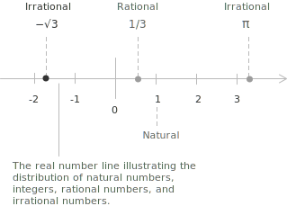
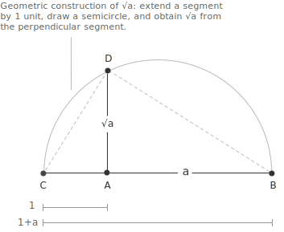

## Definition of radicals

Radicals arise from the problem of solving [equations](../equations/) of the form $x^n = a$, where $n \in \mathbb{N}$, $n \ge 2$, and $a \in \mathbb{R}$. In this context, the $n$-th root of a number is the value whose $n$-th [power](../powers/) yields the original number.

When $a \ge 0$, the principal real $n$-th root of $a$ is the unique non-negative real number $b$ such that $b^n = a$. This value is denoted by $\sqrt[n]{a}$. The defining property is that $\sqrt[n]{a} = b$ if and only if $b^n = a$ and $b \ge 0$. The condition $b \ge 0$ ensures uniqueness in the real case when $n$ is even.

The value $a$ is called the radicand, and the [integer](../integers/) $n$ is called the index of the root. This notation specifies both the root operation and its degree.

The properties of roots depend on whether the index is even or odd.

+ For even $n$, the equation $x^n = a$ has a real solution only if $a \ge 0$. In that case, the principal root $\sqrt[n]{a}$ is defined to be the non-negative solution.
+ For odd $n$, the equation $x^n = a$ has exactly one real solution for every real number $a$, so the function $a \mapsto \sqrt[n]{a}$ is defined for all $a \in \mathbb{R}$.

> For example, since $2^3 = 8$, it follows that $\sqrt[3]{8} = 2$, as 2 is the unique real number whose cube equals 8. More generally, extracting an $n$-th root is the inverse operation of raising a number to the $n$-th power. Thus, solving the equation $x^n = a$ is therefore equivalent to applying the $n$-th root to $a$.

- - -

Radicals such as $\sqrt{2}$, $\sqrt{3}$, and $\sqrt{5}$ are classified as [irrational numbers](../types-of-numbers/) because they cannot be expressed exactly as a fraction of two integers.

Their decimal expansions are infinite and non-repeating, exhibiting no repeating pattern. No rational number squared equals 2, 3, or 5. Nevertheless, these values occupy precise positions on the real number line, interspersed among the rational numbers, with no gaps between them.

Formally, if $a \in \mathbb{N}$ is not a perfect square, then $\sqrt{a} \notin \mathbb{Q}$.

> Square roots are not always irrational. The square root of a perfect square, such as $4$ or $9$, is rational. In contrast, the square root of a non-perfect square, such as $2$ or $5$, is irrational because it cannot be expressed as a fraction.

## The identity $\sqrt{a^2} = |a|$

A common source of confusion concerns the simplification of $\sqrt{a^2}$. It may seem natural to write $\sqrt{a^2} = a$, but this equality fails whenever $a$ is negative. The correct identity is:

$$
\sqrt{a^2} = |a| \qquad \forall a \in \mathbb{R}
$$

The reason lies in the definition of the principal square root. When the index is $2$, the symbol $\sqrt{\cdot}$ denotes the unique non-negative real number whose square equals the radicand. Since $a^2$ is always non-negative, $\sqrt{a^2}$ is defined for every real $a$, but the result must itself be non-negative. 

+ When $a \ge 0$ the value $a$ already satisfies this condition.
+ When $a < 0$ the non-negative number whose square is $a^2$ is $-a$. 
+ The [absolute value](../absolute-value/) provides a single expression valid in both cases.

> The same phenomenon occurs whenever the index is even. For $n \in \mathbb{N}$ with $n \ge 1$, the identity $\sqrt[2n]{a^{2n}} = |a|$ holds for every $a \in \mathbb{R}$. When the index is odd, the constraint disappears and we have $\sqrt[2n+1]{a^{2n+1}} = a$ for every $a \in \mathbb{R}$, since the function $x \mapsto x^{2n+1}$ is bijective on the real line.

- - -

Consider the case $a = -3$. The square of $-3$ is $9$, and the principal square root of $9$ is $3$. Thus:

$$
\sqrt{(-3)^2} = \sqrt{9} = 3 = |-3|
$$

Writing $\sqrt{(-3)^2} = -3$ would violate the convention that the principal square root is non-negative. The absolute value is therefore a structural requirement of the definition.

This identity also clarifies how to handle expressions of the form $\sqrt{x^2 - 2xy + y^2}$. Recognizing the radicand as the perfect square $(x-y)^2$, the correct simplification is:

$$
\sqrt{x^2-2xy+y^2} = \sqrt{(x-y)^2} = |x-y|
$$

The expression $x-y$, without absolute value, is correct only when the sign of $x-y$ is known in advance. Omitting the absolute value is one of the most frequent sources of error in algebraic manipulation involving even-indexed radicals.

## Why is $\sqrt{2}$ irrational?

To prove that $\sqrt{2}$ is not a rational number, consider a proof by contradiction. Assume that $\sqrt{2}$ is rational. Then it can be expressed as a fraction of two integers in lowest terms, where $a, b \in \mathbb{Z}$, $b \neq 0$, and $\gcd(a,b) = 1$:

$$ \sqrt{2} = \frac{a}{b} $$

> $\gcd(a,b)$ denotes the greatest common divisor of $a$ and $b$, namely the largest positive integer that divides both numbers. The condition $\gcd(a,b) = 1$ means that $a$ and $b$ are coprime. In other words, they have no common divisors other than 1. Consequently, the fraction $a/b$ is already in lowest terms.

- - - 

Squaring both sides:
$$
2 = \frac{a^2}{b^2} \to a^2 = 2b^2
$$

This implies that $a^2$ is even, which means $a$ must also be even.  So we can write $a = 2k$ for some integer $k$. Substituting back we get:

$$
(2k)^2 = 2b^2 \Rightarrow 4k^2 = 2b^2 \Rightarrow b^2 = 2k^2
$$

This means $b^2$ is also even, so $b$ must be even too. But if both $a$ and $b$ are even, they share a common factor of $2$ which contradicts our initial assumption that $a/b$ is in lowest terms. Therefore $\sqrt{2}$ is irrational.

## Powers with rational exponents

The connection between radicals and [powers](../powers/) becomes explicit when the exponent is a rational number. For $a \in \mathbb{R}^+$ and $n \in \mathbb{N}$ with $n \ge 1$, the $n$-th root of $a$ can be written as:

$$
\sqrt[n]{a} = a^{\frac{1}{n}}
$$

More generally, for $m \in \mathbb{Z}$, a radical whose radicand is raised to an integer power corresponds to a power with rational exponent $m/n$:

$$
\sqrt[n]{a^m} = a^{\frac{m}{n}}
$$

Since radicals are powers with rational exponents, all the standard rules of exponentiation apply to them without modification. For $a, b \in \mathbb{R}^+$ and $\frac{m}{n}, \frac{p}{q} \in \mathbb{Q}$:

$$
\begin{align}
a^{\frac{m}{n}} \cdot a^{\frac{p}{q}} &= a^{\frac{m}{n}+\frac{p}{q}} \\\\
a^{\frac{m}{n}}\div {a^{\frac{p}{q}}} &= a^{\frac{m}{n}-\frac{p}{q}} \\\\
\left(a^{\frac{m}{n}}\right)^{\frac{p}{q}} &= a^{\frac{m}{n} \cdot \frac{p}{q}}
\end{align}
$$

For example: $$\sqrt{a^3} = a^{\frac{3}{2}} \qquad  \sqrt[3]{a^2} = a^{\frac{2}{3}} \qquad \sqrt[4]{a} = a^{\frac{1}{4}}$$

## Properties

The following identities describe how to manipulate radicals. Each property is stated together with the conditions on the radicand and the index that ensure the expression is well-defined in the [real numbers](../real-numbers/). These conditions depend in particular on whether the index is even or odd.

For $a \ge 0$, $n \in \mathbb{N}$ with $n \ge 1$, and $m \in \mathbb{Z}$, every radical can be written as a power with rational exponent:

$$
\sqrt[n]{a^m} = a^{\frac{m}{n}}
$$

If $n$ is even, the condition $a \ge 0$ is necessary in order to remain in the real numbers.

---

For $n \in \mathbb{N}$ with $n \ge 2$, the $n$-th root distributes over multiplication and division:

$$
\sqrt[n]{ab} = \sqrt[n]{a}\\,\sqrt[n]{b}
$$

$$
\frac{\sqrt[n]{a}}{\sqrt[n]{b}} = \sqrt[n]{\frac{a}{b}}
$$

If $n$ is even, the product rule requires $a \ge 0$ and $b \ge 0$, and the quotient rule requires $a \ge 0$ and $b > 0$, in order to remain in the real numbers. If $n$ is odd, both identities hold for all admissible real values: any $a,\\, b \in \mathbb{R}$ for the product, and any $a \in \mathbb{R}$, $b \in \mathbb{R} \setminus \{0\}$ for the quotient.

---

For $a \ge 0$, $n \in \mathbb{N}$ with $n \ge 1$, and $m \in \mathbb{Z}$, raising a radical to an integer power is equivalent to raising the radicand to that power and then extracting the root:

$$
\left(\sqrt[n]{a}\right)^m = \sqrt[n]{a^m}
$$

If $n$ is even, the condition $a \ge 0$ is required to remain in the real numbers.

---

Let $k \in \mathbb{N}$ with $k \ge 1$. Multiplying both the index of the root and the exponent of the radicand by the same positive integer $k$ does not change the value of the radical:

$$
\sqrt[n]{a^m} = \sqrt[nk]{a^{mk}}
$$

This identity allows us to reduce the index of a radical to its lowest terms. For example the following simplification is obtained by dividing both exponents by $2$: 

$$\sqrt[4]{a^2} = \sqrt[2]{a} = \sqrt{a}$$
If $n$ is even, the condition $a \ge 0$ applies.

---

For $a \ge 0$ and $m, n \in \mathbb{N}$ with $m, n \ge 1$, a nested radical can be rewritten as a single radical whose index is the product of the two indices:

$$
\sqrt[m]{\sqrt[n]{a}} = \sqrt[mn]{a}
$$

If either $m$ or $n$ is even, the condition $a \ge 0$ is necessary to ensure the expression remain in the real numbers. If both $m$ and $n$ are odd, this identity holds for all $a \in \mathbb{R}$.

---

A radical of the form $\sqrt[n]{a^m}$ can be simplified when $m \ge n$ by writing the exponent as $m = nq+r$, where $q$ is the quotient and $0 \le r < n$ is the remainder of the division of $m$ by $n$.This allow us to factor out $a^q$ from the radical:

$$
\sqrt[n]{a^m} = \sqrt[n]{a^{nq+r}} = a^q \sqrt[n]{a^r}
$$

For example, $\sqrt{a^5} = \sqrt{a^4 \cdot a} = a^2\sqrt{a}$, since $5 = 2 \cdot 2+1$. Similarly, $\sqrt[3]{a^7} = a^2\sqrt[3]{a}$, since $7 = 3 \cdot 2+1$. When the index is even the condition $a \ge 0$ is required to keep the expression in the real numbers.

---

Two radicals are said to be like if they have the same index and the same radicand. Like radicals can be added and subtracted by combining their coefficients, in the same way as like terms in a [polynomial](../polynomials):

$$
p \sqrt[n]{a}+q \sqrt[n]{a} = (p+q) \sqrt[n]{a}
$$

For example:

$$
\begin{aligned}
3\sqrt{2}+5\sqrt{2} &= 8\sqrt{2} \\\\
7\sqrt[3]{5}-2\sqrt[3]{5} &= 5\sqrt[3]{5}
\end{aligned}
$$

Radicals with different indices or different radicands are not like radicals and cannot be combined in this way. However, sometimes simplifying the radicals first shows that they are actually like. For example:

$$ \sqrt{12}+\sqrt{3} = 2\sqrt{3}+\sqrt{3} = 3\sqrt{3} $$

since:
$$ \sqrt{12} = \sqrt{4 \cdot 3} = 2\sqrt{3} $$
## Example 1

Simplify the following expression and write the result in radical form:

$$
\frac{\sqrt{a}}{\sqrt[3]{a}}
$$

First convert each radical to an expression with a rational exponent:

$$
\sqrt{a} = a^{\frac{1}{2}} \qquad \sqrt[3]{a} = a^{\frac{1}{3}}
$$

Now apply the quotient rule for [exponents](../powers/):

$$
\frac{a^{\frac{1}{2}}}{a^{\frac{1}{3}}} = a^{\frac{1}{2}-\frac{1}{3}} = a^{\frac{1}{6}}
$$

Therefore, we obtain:

$$
\frac{\sqrt{a}}{\sqrt[3]{a}} = \sqrt[6]{a}
$$

## Rationalizing the denominator

An expression containing a radical in the denominator is often rewritten in an equivalent form where the denominator contains no radicals. This process is called rationalizing the denominator and relies on multiplying both  numerator and denominator by a suitably chosen expression so that the value of the fraction does not change. When the denominator is a single radical of the form $\sqrt[n]{a^m}$, the goal is to make the exponent of $a$ inside the radical a multiple of $n$. To do this, multiplying numerator and denominator by $\sqrt[n]{a^{n-m}}$ yields an integer in the denominator:

$$
\frac{1}{\sqrt[n]{a^m}} \cdot \frac{\sqrt[n]{a^{n-m}}}{\sqrt[n]{a^{n-m}}} = \frac{\sqrt[n]{a^{n-m}}}{\sqrt[n]{a^n}} = \frac{\sqrt[n]{a^{n-m}}}{a}
$$

The most common case is $n = 2$ and $m = 1$, where the denominator is a square root:

$$
\frac{1}{\sqrt{a}} \cdot \frac{\sqrt{a}}{\sqrt{a}} = \frac{\sqrt{a}}{a}
$$

When the denominator has the form $\sqrt{a}+\sqrt{b}$ or $\sqrt{a}-\sqrt{b}$, multiplying by the conjugate expression eliminates the radicals by applying the [difference of squares](../notable-products/) identity $(x+y)(x-y) = x^2-y^2$:

$$
\frac{1}{\sqrt{a}+\sqrt{b}} \cdot \frac{\sqrt{a}-\sqrt{b}}{\sqrt{a}-\sqrt{b}} = \frac{\sqrt{a}-\sqrt{b}}{a-b} \qquad a \ne b \quad a,b \ge 0
$$

For example:

$$
\begin{align}
\frac{1}{\sqrt{3}+\sqrt{2}} &= \frac{\sqrt{3}-\sqrt{2}}{(\sqrt{3})^2-(\sqrt{2})^2} \\\\
&= \frac{\sqrt{3}-\sqrt{2}}{3-2} \\\\
&= \sqrt{3}-\sqrt{2}
\end{align}
$$
## Example 2

Rationalization can also be applied to the numerator when this simplifies an expression. Consider the following [limit](../limits/), which appears in the definition of the [derivative](../derivatives/):

$$
\lim_{h \to 0} \frac{\sqrt{x+h}-\sqrt{x}}{h}
$$

Direct substitution of $h = 0$ yields the [indeterminate form](../indeterminate-forms/) $\frac{0}{0}$. To resolve this, we multiply the numerator and denominator by the conjugate of the numerator:

$$
\begin{aligned}
\frac{\sqrt{x+h}-\sqrt{x}}{h} &= \frac{\sqrt{x+h}-\sqrt{x}}{h} \cdot \frac{\sqrt{x+h}+\sqrt{x}}{\sqrt{x+h}+\sqrt{x}} \\[6pt]
&= \frac{(x+h)-x}{h\left(\sqrt{x+h}+\sqrt{x}\right)} \\[6pt]
&= \frac{h}{h\left(\sqrt{x+h}+\sqrt{x}\right)} \\[6pt]
&= \frac{1}{\sqrt{x+h}+\sqrt{x}}
\end{aligned}
$$

Now take the limit as $h \to 0$:

$$
\lim_{h \to 0} \frac{1}{\sqrt{x+h}+\sqrt{x}} = \frac{1}{2\sqrt{x}}
$$

> This result is the derivative of $\sqrt{x}$, obtained here without using the general power rule.

## Geometric construction of the segment $\sqrt{a}$

The square root $\sqrt{a}$ can be constructed as a segment using only a compass and straightedge. Given a segment of length $a$, follow these steps:

+ Draw a segment $AB$ of length $a$.
+ Extend the segment to the left by 1 unit. Let point $C$ be such that $CA = 1$. Now $CB = a + 1$.
+ Draw a semicircle with diameter $CB$.
+ From point $A$, draw a perpendicular to $CB$, intersecting the semicircle at point $D$.
+ Then the segment $AD$ has length $\sqrt{a}$.

In the right triangle $\triangle DAB$, the segment $AD$ is the height from point $A$ to the hypotenuse $CB$. According to Euclid’s theorem on right triangles, the height is the [geometric mean](../geometric-mean/) of the two segments into which it divides the hypotenuse. That is:
$$
\frac{AC}{AD} = \frac{AD}{AB}
$$

Multiplying both sides by $AD$, we obtain:
$$
AD^2 = AB \cdot AC
$$

Since $AC = 1$ and $AB = a$, we find:

$$
AD^2 = a \cdot 1 = a
\quad \Rightarrow \quad
AD = \sqrt{a}
$$

This completes the construction: the segment $AD$ has length $\sqrt{a}$.