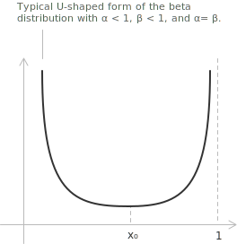
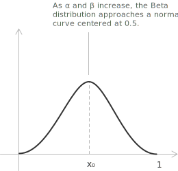

## Introduction to the beta distribution

The beta distribution is a continuous probability distribution on the open [interval](../intervals/) $(0, 1).$ It has two positive parameters $\alpha$ and $\beta,$ which determine the curvature of the density and the distribution of its mass along the interval. A beta-distributed random variable takes values only between $0$ and $1,$ so the distribution can model proportions, ratios, and probabilities. Its [probability density function](../continuous-random-variables/) is:

$$f(x; \alpha, \beta) = \frac{x^{\alpha - 1}(1 - x)^{\beta - 1}}{B(\alpha, \beta)} \quad 0 < x < 1$$

The normalizing constant $B(\alpha, \beta)$ is the beta function, which has the gamma-function representation:

$$B(\alpha, \beta) = \frac{\Gamma(\alpha)\Gamma(\beta)}{\Gamma(\alpha + \beta)}$$

Substitution gives the following equivalent form of the density:

$$f(x; \alpha, \beta) = \frac{\Gamma(\alpha + \beta)}{\Gamma(\alpha)\Gamma(\beta)} x^{\alpha - 1}(1 - x)^{\beta - 1}$$

Outside the interval $(0, 1),$ the density is zero. The gamma function $\Gamma(c),$ defined for every $c \in \mathbb{R}^+,$ has the [improper integral](../improper-integrals/) representation:

$$\Gamma(c) = \int_{0}^{+\infty} x^{c - 1} e^{-x} \ dx$$

For every [natural number](../natural-numbers/) $n,$ the identity $\Gamma(n + 1) = n!$ relates the gamma function to the [factorial](../factorial/). The function $x \mapsto \Gamma(x + 1)$ therefore extends the factorial to positive [real numbers](../real-numbers/). The [cumulative distribution function](../continuous-random-variables/) is $F(x) = P(X \le x).$ For $0 \le x \le 1,$ it has the integral representation:

$$F(x; \alpha, \beta) = \frac{1}{B(\alpha, \beta)} \int_{0}^{x} t^{\alpha - 1}(1 - t)^{\beta - 1} \ dt = I_x(\alpha, \beta)$$

The function $I_x(\alpha, \beta)$ is the regularized incomplete beta function, the incomplete integral divided by the complete beta function $B(\alpha, \beta).$ For positive integer parameters it equals an upper tail of a [binomial distribution](../binomial-distribution/) with $\alpha + \beta - 1$ trials:

$$I_x(\alpha, \beta) = \sum_{j = \alpha}^{\alpha + \beta - 1} \binom{\alpha + \beta - 1}{j} x^{j}(1 - x)^{\alpha + \beta - 1 - j}$$

## The shape of the beta distribution

The beta distribution has different shapes according to the values of $\alpha$ and $\beta.$ Its density can be unimodal, U-shaped, or [monotonic](../increasing-and-decreasing-functions/). When both parameters are greater than $1$ or both are less than $1,$ the density has the interior [critical point](../maximum-minimum-and-inflection-points/):

$$x_0 = \frac{\alpha - 1}{\alpha + \beta - 2}$$

The nature of this point depends on the parameters.

+ If $\alpha > 1$ and $\beta > 1,$ the point $x_0$ is a maximum, and the distribution is unimodal with its mode there.
+ If $0 < \alpha < 1$ and $0 < \beta < 1,$ the point $x_0$ is a minimum, and the density is U-shaped.
+ If one parameter is greater than or equal to $1$ and the other is less than or equal to $1,$ with $(\alpha, \beta) \neq (1, 1),$ the density is monotonic.
+ If $\alpha = \beta = 1,$ the density is constant.

Exchanging the two parameters reflects the density about the midpoint of the interval. If $X \sim \mathrm{Beta}(\alpha, \beta),$ then $1 - X \sim \mathrm{Beta}(\beta, \alpha).$ When $\alpha = \beta,$ this reflection leaves the density unchanged, so it is [symmetric](../even-and-odd-functions/) about the vertical line $x = \tfrac{1}{2}.$

- - -

The figure shows the symmetric case $0 < \alpha = \beta < 1.$ The density is U-shaped and tends to infinity near the endpoints of the interval $(0, 1).$ It has a minimum at $x = x_0,$ which is its lowest value on the [domain](../determining-the-domain-of-a-function/).

When $\alpha = \beta > 1,$ the beta distribution is symmetric about the vertical line $x = \tfrac{1}{2}$ and has its single mode there. As the common parameter increases, the density becomes more concentrated around $x = \tfrac{1}{2},$ and the normal distribution gives a closer approximation.

For large values of $\alpha$ and $\beta,$ the approximating [normal distribution](../normal-distribution/) has the following mean and variance:

$$\mu = \frac{\alpha}{\alpha + \beta} \qquad \sigma^2 = \frac{\alpha \beta}{(\alpha + \beta)^2 (\alpha + \beta + 1)}$$

In the symmetric case $\alpha = \beta = k,$ these parameters are:

$$\mu = \tfrac{1}{2} \qquad \sigma^2 = \frac{1}{4(2k + 1)} \approx \frac{1}{8k}$$

Thus, as $k \to \infty,$ the distributional approximation is:

$$\mathrm{Beta}(k, k) \approx \mathcal{N}\!\left(\tfrac{1}{2}, \frac{1}{4(2k + 1)}\right)$$

- - -

For $X \sim \mathrm{Beta}(\alpha, \beta),$ the probability density function, mean, variance, and [standard deviation](../variance-and-covariance-of-a-random-variable/) are:

[class="table-1"]

|  |
| :--- |
| $f(x; \alpha, \beta) = \dfrac{x^{\alpha - 1}(1 - x)^{\beta - 1}}{B(\alpha, \beta)}, \quad 0 < x < 1$ |
| $\mu = E(X) = \dfrac{\alpha}{\alpha + \beta}$ |
| $\sigma^{2} = \mathrm{Var}(X) = \dfrac{\alpha \beta}{(\alpha + \beta)^{2}(\alpha + \beta + 1)}$ |
| $\sigma = \sqrt{\dfrac{\alpha \beta}{(\alpha + \beta)^{2}(\alpha + \beta + 1)}}$ |

[/class]

## Mean of the beta distribution

A beta-distributed random variable has a [mean](../introduction-to-the-mean/), or [expected value](../mean-or-expected-value-of-a-random-variable/), determined by the shape parameters $\alpha$ and $\beta.$ By definition, its mean is:

$$\mu = E(X) = \int_{0}^{1} x f(x; \alpha, \beta) \ dx$$

Substituting the probability density function gives:

$$E(X) = \int_{0}^{1} x \frac{x^{\alpha - 1} (1 - x)^{\beta - 1}}{B(\alpha, \beta)} \ dx$$

Combining the powers of $x$ gives:

$$E(X) = \frac{1}{B(\alpha, \beta)} \int_{0}^{1} x^{\alpha} (1 - x)^{\beta - 1} \ dx$$

The integral on the right-hand side is the beta function $B(\alpha + 1, \beta),$ hence:

$$E(X) = \frac{B(\alpha + 1, \beta)}{B(\alpha, \beta)}$$

The beta function has the gamma-function representation:

$$B(\alpha, \beta) = \frac{\Gamma(\alpha)\Gamma(\beta)}{\Gamma(\alpha + \beta)}$$

Since the gamma function has the recurrence $\Gamma(c + 1) = c\Gamma(c),$ the ratio simplifies to:

$$E(X) = \frac{\alpha}{\alpha + \beta}$$

> The mean depends only on the two shape parameters. It exceeds $\tfrac{1}{2}$ when $\alpha > \beta$ and falls below $\tfrac{1}{2}$ when $\alpha < \beta.$

- - -

For each integer $k \geq 1,$ the same integral with $x^k$ in place of $x$ gives the corresponding moment of the distribution:

$$E(X^k) = \frac{B(\alpha + k, \beta)}{B(\alpha, \beta)} = \prod_{r = 0}^{k - 1} \frac{\alpha + r}{\alpha + \beta + r}$$

The mean is the case $k = 1,$ and the second moment $E(X^2),$ used in the next section for the variance, is the case $k = 2.$

## Variance of the beta distribution

The [variance](../variance-and-covariance-of-a-random-variable/) of the beta distribution is the expected squared deviation from the mean. Equivalently, it has the second-moment formula:

$$\sigma^2 = \mathrm{Var}(X) = E(X^2) - [E(X)]^2$$

The second moment has the integral representation:

$$
\begin{align}
E(X^2) &= \int_{0}^{1} x^2 f(x; \alpha, \beta) \ dx \\[6pt]
&= \frac{1}{B(\alpha, \beta)} \int_{0}^{1} x^{\alpha + 1} (1 - x)^{\beta - 1} \ dx \\[16pt]
&= \frac{B(\alpha + 2, \beta)}{B(\alpha, \beta)}
\end{align}
$$

Substituting this expression and the mean into the definition gives:

$$\sigma^2 = \frac{B(\alpha + 2, \beta)}{B(\alpha, \beta)} - \left(\frac{\alpha}{\alpha + \beta}\right)^2$$

The beta-gamma identity is:

$$B(\alpha, \beta) = \frac{\Gamma(\alpha)\Gamma(\beta)}{\Gamma(\alpha + \beta)}$$

Together with the recurrence $\Gamma(c + 1) = c\Gamma(c),$ this identity simplifies the variance to:

$$\sigma^2 = \frac{\alpha \beta}{(\alpha + \beta)^2 (\alpha + \beta + 1)}$$

> If the ratio $\alpha/(\alpha + \beta)$ is fixed, increasing the concentration $\alpha + \beta$ decreases the variance and concentrates the distribution around its mean.

## Special cases and related distributions

Particular values of the shape parameters reduce the beta distribution to other named distributions on the interval $(0, 1).$

The [uniform distribution](../uniform-distribution/) is the case $\alpha = \beta = 1.$ Its probability density function is constant on the interval $(0, 1).$ More generally, the continuous uniform distribution on an interval $(a, b)$ has the density:

$$
f(x) =
\begin{cases}
\dfrac{1}{b - a} & a < x < b \\[6pt]
0 & \mathrm{otherwise}
\end{cases}
$$

For $a = 0$ and $b = 1,$ this reduces to $f(x) = 1,$ which is exactly the $\mathrm{Beta}(1, 1)$ density, constant across $(0, 1).$

For $\alpha = \beta = \tfrac{1}{2},$ the beta distribution is the arcsine distribution. Its density is:

$$f\!\left(x; \tfrac{1}{2}, \tfrac{1}{2}\right) = \frac{1}{\pi \sqrt{x(1 - x)}}$$

This density diverges at both endpoints and has its minimum at $x = \tfrac{1}{2},$ as in the U-shaped case described above. The values $\alpha = 2$ and $\beta = 1$ give a triangular density that increases linearly on the interval:

$$f(x; 2, 1) = 2x$$

After exchanging the parameters, $\alpha = 1$ and $\beta = 2$ give the reflected density $f(x; 1, 2) = 2(1 - x).$ The identity $1 - X \sim \mathrm{Beta}(\beta, \alpha)$ maps one case to the other.

The beta distribution also arises from the gamma distribution. If $U$ and $V$ are independent gamma variables with shape parameters $\alpha$ and $\beta$ and the same scale, their normalized ratio is beta-distributed:

$$\frac{U}{U + V} \sim \mathrm{Beta}(\alpha, \beta)$$

The change of variables from $(U, V)$ to $(U/(U + V), U + V)$ gives this distributional identity and the relation between the beta and gamma functions.
