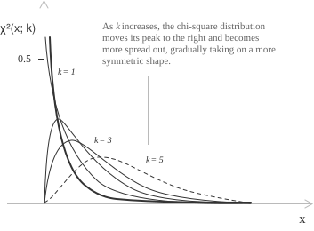
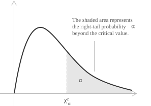

## Sum of squared normal variables

The chi-square distribution is the [continuous probability distribution](../continuous-random-variables/) of a sum of squared independent standard normal variables. Let $Z_1, Z_2, \dots, Z_k$ be independent random variables with the [standard normal distribution](../normal-distribution/) and density $\varphi(z)=\frac{1}{\sqrt{2\pi}}e^{-z^{2}/2}.$ Their sum of squares is given by:

$$X = \sum_{i=1}^{k} Z_i^{2}$$

The distribution of $X$ is the chi-square distribution with $k$ degrees of freedom, written $X \sim \chi^{2}_{k}.$ The positive integer $k$ is the number of independent squared terms in the sum. For $k=1$ the sum reduces to a single squared standard normal variable, $X=Z^{2}.$ For $x>0,$ its cumulative distribution function is:

$$
\begin{align}
F(x) &= P(Z^{2} \le x) \\[6pt]
&= P(-\sqrt{x} \le Z \le \sqrt{x}) \\[6pt]
&= \int_{-\sqrt{x}}^{\sqrt{x}} \varphi(z) \ dz = 2\Phi(\sqrt{x}) - 1
\end{align}
$$

Here $\Phi$ is the [standard normal cumulative distribution function](../standard-normal-z-table/). Differentiating with respect to $x$ gives the density of $X$:

$$f(x) = 2\varphi(\sqrt{x}) \cdot \frac{1}{2\sqrt{x}} = \frac{1}{\sqrt{2\pi x}}e^{-x/2}, \ x>0$$

This is the density of the chi-square distribution with one degree of freedom.

## Density as a special case of the gamma distribution

The density for $k=1$ is a [gamma density](../gamma-distribution/) with shape $\alpha=1/2$ and scale $\beta=2.$ Since $\Gamma(1/2)=\sqrt{\pi},$ this density is given by:

$$G\!\left(x;\tfrac{1}{2},2\right) = \frac{1}{2^{1/2}\Gamma(1/2)}x^{-1/2}e^{-x/2} = \frac{1}{\sqrt{2\pi x}}e^{-x/2}$$

The displayed expression is $f(x).$ A sum of independent gamma variables with the same scale has a gamma distribution whose shape parameter is the sum of the individual shape parameters. The sum of $k$ independent $\mathrm{Gamma}(1/2,2)$ variables has a $\mathrm{Gamma}(k/2,2)$ distribution, and the chi-square distribution with $k$ degrees of freedom has density:

$$
{\chi^2}(x;k) =
\begin{cases}
\dfrac{1}{2^{k/2}\Gamma(k/2)}x^{k/2-1}e^{-x/2} & x>0 \\[6pt]
0 & x \le 0
\end{cases}
$$

In this construction $k$ is a positive integer, but the formula for ${\chi^2}(x;k)$ is a probability density for every real $k>0,$ since a gamma density is defined for every positive shape parameter. For $k \le 2$ the density decreases monotonically on $(0,+\infty).$ For $k \ge 3$ it rises from $0,$ reaches one peak, and then decays.

- - -

For $X \sim \chi^{2}_{k}$ the density, mean, variance, and standard deviation are:

[class="table-1"]

|  |
| :--- |
| ${\chi^2}(x;k) = \dfrac{1}{2^{k/2}\Gamma(k/2)}x^{k/2-1}e^{-x/2}, \ x>0$ |
| $\mu = E(X) = k$ |
| $\sigma^{2} = \mathrm{Var}(X) = 2k$ |
| $\sigma = \sqrt{2k}$ |

[/class]

## Mean and variance of the chi-square distribution

The [expected value](../mean-or-expected-value-of-a-random-variable/) of $X \sim \chi^2_k$ is given by:

$$
\begin{align}
\mu = E(X) &= \int_{0}^{+\infty} x \cdot \frac{1}{2^{k/2}\Gamma(k/2)}x^{k/2-1}e^{-x/2} \ dx \\[12pt]
&= \frac{1}{2^{k/2}\Gamma(k/2)}\int_{0}^{+\infty}x^{k/2}e^{-x/2} \ dx
\end{align}
$$

With the [substitution](../integration-by-substitution/) $x=2t,$ so that $dx=2 \ dt,$ the integral becomes:

$$
\begin{align}
\mu &= \frac{1}{2^{k/2}\Gamma(k/2)}\int_{0}^{+\infty}(2t)^{k/2}e^{-t}\cdot 2 \ dt \\[12pt]
&= \frac{2^{k/2+1}}{2^{k/2}\Gamma(k/2)}\int_{0}^{+\infty}t^{k/2}e^{-t} \ dt \\[20pt]
&= \frac{2\Gamma(k/2+1)}{\Gamma(k/2)}
\end{align}
$$

The recurrence $\Gamma(k/2+1)=(k/2)\Gamma(k/2)$ gives $\mu=2\cdot(k/2)=k.$ The mean of the chi-square distribution equals its number of degrees of freedom.

- - -

The variance requires the second moment $E(X^2).$ The same substitution gives:

$$E(X^2) = \frac{1}{2^{k/2}\Gamma(k/2)}\int_{0}^{+\infty}x^{k/2+1}e^{-x/2} \ dx = \frac{4\Gamma(k/2+2)}{\Gamma(k/2)}$$

The recurrence $\Gamma(k/2+2)=(k/2+1)(k/2)\Gamma(k/2)$ gives:

$$E(X^2) = 4\left(\frac{k}{2}+1\right)\frac{k}{2} = k^{2}+2k$$

The [variance](../variance-and-covariance-of-a-random-variable/) is $\sigma^2=E(X^2)-\mu^2$:

$$\sigma^{2} = (k^{2}+2k) - k^{2} = 2k$$

The variance of the chi-square distribution is proportional to the number of degrees of freedom. Each additional squared normal term increases the variance by $2.$

## Moment generating function, moments, and additivity

For $t<1/2,$ the moment-generating function of $X \sim \chi^2_k$ is given by:

$$
\begin{align}
M(t) = E(e^{tX}) &= \frac{1}{2^{k/2}\Gamma(k/2)}\int_{0}^{+\infty}x^{k/2-1}e^{-x(1/2-t)} \ dx \\[6pt]
&= \frac{1}{2^{k/2}\Gamma(k/2)}\cdot\frac{\Gamma(k/2)}{(1/2-t)^{k/2}} \\[6pt]
&= (1-2t)^{-k/2}
\end{align}
$$

The second line uses $\int_{0}^{+\infty}x^{a-1}e^{-\lambda x} \ dx = \Gamma(a)/\lambda^{a}$ with $a=k/2$ and $\lambda=1/2-t.$ Expanding $M(t)$ as a [power series](../taylor-series/) in $t$ and comparing it with $M(t)=\sum_{n=0}^{\infty}E(X^n)t^n/n!$ gives the raw moments:

$$E(X^{n}) = k(k+2)(k+4)\cdots(k+2n-2)$$

This formula holds for every positive integer $n.$ For $n=1$ and $n=2,$ it gives $\mu=k$ and $E(X^2)=k^2+2k.$

- - -

Let $X_1,\dots,X_m$ be independent chi-square variables with $k_1,\dots,k_m$ degrees of freedom, and let $S=X_1+\cdots+X_m.$ Independence gives:

$$M_S(t) = \prod_{j=1}^{m}M_{X_j}(t) = \prod_{j=1}^{m}(1-2t)^{-k_j/2} = (1-2t)^{-(k_1+\cdots+k_m)/2}$$

This is the moment-generating function of a chi-square variable with $k_1+\cdots+k_m$ degrees of freedom, so $S \sim \chi^2_{k_1+\cdots+k_m}.$ A sum of independent chi-square variables is a chi-square variable whose number of degrees of freedom is the sum of the individual degrees of freedom.

- - -

The logarithm of the moment-generating function is $K(t)=-\frac{k}{2}\ln(1-2t).$ Expanding $\ln(1-2t)$ in its power series and matching coefficients with $K(t)=\sum_{n=1}^{\infty}\kappa_n t^n/n!$ gives the cumulants $\kappa_n=2^{n-1}(n-1)!k.$ The skewness and excess kurtosis are $\gamma_1=\kappa_3/\kappa_2^{3/2}$ and $\gamma_2=\kappa_4/\kappa_2^2.$ Their values are:

$$\gamma_1 = \sqrt{\frac{8}{k}} \ \gamma_2 = \frac{12}{k}$$

Both tend to $0$ as $k \to \infty.$ The variable $(X-k)/\sqrt{2k}$ converges in distribution to the standard normal distribution because it is the standardized sum of the independent and identically distributed variables $Z_i^2.$

## Cumulative distribution function

For $x>0,$ the cumulative distribution function of $X \sim \chi^2_k$ is given by:

$$F(x) = \int_{0}^{x}\frac{1}{2^{k/2}\Gamma(k/2)}u^{k/2-1}e^{-u/2} \ du$$

Under the substitution $u=2t,$ the upper limit is $x/2,$ and the cumulative distribution function is:

$$F(x) = \frac{1}{\Gamma(k/2)}\int_{0}^{x/2}t^{k/2-1}e^{-t} \ dt$$

The remaining integral is the lower incomplete gamma function, $\gamma(k/2,x/2)=\int_{0}^{x/2}t^{k/2-1}e^{-t} \ dt.$ Substitution gives:

$$F(x) = \frac{\gamma(k/2,x/2)}{\Gamma(k/2)}$$

This ratio is the regularized incomplete gamma function evaluated at $k/2$ and $x/2.$ For general $k,$ the integral has no elementary closed form, so [chi-square quantiles](../median-and-quantiles/) are computed numerically or read from tables.

## Mode and shape

The logarithmic derivative of the density is given by:

$$\frac{d}{dx}\ln{\chi^2}(x;k) = \frac{k/2-1}{x}-\frac{1}{2}$$

Setting this derivative equal to zero gives $x=k-2.$ For $k \ge 3$ this critical point lies in the support and is a maximum, so the mode of the chi-square distribution is $k-2.$ For $k \le 2$ the derivative is negative throughout $(0,+\infty),$ so the density decreases monotonically from its supremum at the left endpoint.

## Sampling distribution of the sample variance

Across repeated samples, the [sample variance](../variance/) $S^2$ is a random variable. Let the independent observations have the [normal distribution](../normal-distribution/):

$$X_1, X_2, \dots, X_n \sim \mathcal{N}(\mu,\sigma^{2})$$

Their sample variance is given by:

$$S^{2} = \frac{1}{n-1}\sum_{i=1}^{n}(X_i-\bar X)^{2}$$

With the divisor $n-1,$ the statistic $S^2$ is an unbiased estimator of $\sigma^2.$ Under these hypotheses, the standardized quantity has a chi-square distribution:

$$\frac{(n-1)S^{2}}{\sigma^{2}} \sim \chi^{2}_{n-1}$$

Each standardized deviation $(X_i-\mu)/\sigma$ has the standard normal distribution, and the sum of the $n$ squared deviations would have a $\chi^2_n$ distribution if $\mu$ were known. Because $\mu$ is estimated by $\bar X,$ the deviations satisfy the linear constraint $\sum_i(X_i-\bar X)=0,$ which removes one degree of freedom and reduces the chi-square parameter from $n$ to $n-1.$

- - -

This result is the basis of confidence intervals and hypothesis tests for $\sigma^2.$

## Chi-square critical values

Under normality, the variance statistic is given by:

$$\chi^{2} = \frac{(n-1)S^{2}}{\sigma^{2}}$$

For a sample of size $n,$ this statistic has a chi-square distribution with $k=n-1$ degrees of freedom. Testing whether an observed value of $\chi^2$ is compatible with a hypothesized $\sigma^2$ requires chi-square critical values. For $k$ degrees of freedom and $0<\alpha<1,$ the critical value $\chi^{2}_{\alpha,k}$ has right-tail probability $\alpha$:

$$P(\chi^{2}_{k} > \chi^{2}_{\alpha,k}) = \alpha$$

Because the chi-square density is asymmetric and its cumulative distribution function has no elementary inverse, these critical values have no closed formula. Tables list $\chi^2_{\alpha,k}$ for each number of degrees of freedom $k$ and tail probability $\alpha.$

- - -

This table is an excerpt. Its rows are the degrees of freedom $k,$ and its columns are right-tail probabilities $\alpha,$ with the associated critical values $\chi^2_{\alpha,k}.$

| $k$ | $\chi^2_{.995,k}$ | $\chi^2_{.990,k}$ | $\chi^2_{.975,k}$ | $\chi^2_{.950,k}$ | $\chi^2_{.900,k}$ | ... |
| --- | ----------------- | ----------------- | ----------------- | ----------------- | ----------------- | --- |
| 1   | 0.000              | 0.000              | 0.001              | 0.004              | 0.016              | ... |
| 2   | 0.010              | 0.020              | 0.051              | 0.103              | 0.211              | ... |
| 3   | 0.072              | 0.115              | 0.216              | 0.352              | 0.584              | ... |
| 4   | 0.207              | 0.297              | 0.484              | 0.711              | 1.064              | ... |
| 5   | 0.412              | 0.554              | 0.831              | 1.145              | 1.610              | ... |
| ... | ...                | ...                | ...                | ...                | ...                | ... |

Complete chi-square tables have entries for additional degrees of freedom and tail probabilities, including $\alpha=0.05,0.025,0.01,0.005$ in the upper tail of the distribution.

These critical values determine confidence intervals for the population variance. For a two-sided confidence level $1-\alpha,$ each tail has probability $\alpha/2.$ The bounds on the chi-square statistic are given by:

$$\chi^{2}_{1-\alpha/2,k} \le \chi^{2} \le \chi^{2}_{\alpha/2,k}$$

The left bound $\chi^2_{1-\alpha/2,k}$ has a large right-tail probability and is the smaller of the two values, while the right bound $\chi^2_{\alpha/2,k}$ has a small right-tail probability and is the larger one. If the computed statistic lies within these bounds, the sample variability is consistent with the hypothesized variance. If it falls outside, the data show either too little or too much dispersion for the assumed value of $\sigma^2.$

## Example 1

A manufacturer of industrial pressure sensors states that the output deviations of its devices have a normal distribution with standard deviation $\sigma=0.8$ PSI (pounds per square inch). An engineer tests four sensors selected at random, so $n=4,$ and records their deviations from the nominal pressure. The measurements and their deviations from the sample mean are:

| Sensor | Measured deviation (PSI) | $X_i-\bar X$ | $(X_i-\bar X)^2$ |
| ------ | ------------------------- | ------------- | ------------------ |
| 1      | 0.5                        | -0.075         | 0.005625            |
| 2      | 1.1                         | 0.525          | 0.275625            |
| 3      | -0.2                        | -0.775         | 0.600625            |
| 4      | 0.9                         | 0.325          | 0.105625            |

The sample mean is given by:

$$\bar X = \frac{0.5+1.1-0.2+0.9}{4} = 0.575$$

The sum of the squared deviations is $0.9875.$ The unbiased sample variance is:

$$S^{2} = \frac{1}{n-1}\sum_{i=1}^{n}(X_i-\bar X)^2 = \frac{0.9875}{3} \approx 0.329$$

The sample standard deviation is:

$$S = \sqrt{0.329} \approx 0.574 \text{ PSI}$$

Under the hypothesis that the population variance is $\sigma^{2}=0.8^{2}=0.64,$ the chi-square statistic is given by:

$$\chi^{2} = \frac{(n-1)S^{2}}{\sigma^{2}}$$

This statistic has a chi-square distribution with $n-1=3$ degrees of freedom. Substituting the exact sum of squared deviations gives:

$$\chi^{2} = \frac{0.9875}{0.64} \approx 1.543$$

For a two-sided test with $\alpha=0.05,$ the acceptance region for the $\chi^2_3$ statistic has endpoints $\chi^2_{0.975,3}=0.216$ and $\chi^2_{0.025,3}=9.348$:

$$0.216 \le \chi^{2} \le 9.348$$

Because the observed value $1.543$ is inside this range, the sample is compatible with the manufacturer's claim that $\sigma=0.8$ PSI.
