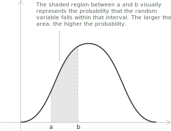

## Definition

A random variable on a probability space $(\Omega, \mathcal{F}, P)$ is a measurable [function](../functions/):

$$
X : \Omega \to \mathbb{R}
$$

The [set](../sets/) $\Omega$ contains the outcomes of the random experiment, $\mathcal{F}$ is the collection of events to which probabilities can be assigned, and $P$ is the probability measure. Measurability requires the following relation for every $x \in \mathbb{R}:$

$$
\{\ \omega \in \Omega \mid X(\omega) \le x\ \} \in \mathcal{F}
$$

The relation states that the outcomes for which $X(\omega) \le x$ form an event, so the probability $P(X \le x)$ is defined.

In the terminology used here, $X$ is a continuous random variable when its probability distribution has a probability density function. Equivalently, its distribution is absolutely continuous with respect to Lebesgue measure on the [real line](../real-numbers/). This property concerns the distribution of $X,$ not the cardinality of $\Omega.$ The same sample space may support both continuous and [discrete random variables](../discrete-random-variables/), and a continuous random variable may have a density supported on one [interval](../intervals/), several disjoint intervals, or an unbounded set.

> Some texts use continuous distribution for any distribution whose cumulative distribution function is continuous. That broader convention includes singular distributions, such as the Cantor distribution, which assign probability zero to every point but have no density. In this entry, continuous means absolutely continuous, so a density exists.

## Probability density function

A probability density function of $X$ is a measurable function $f_X : \mathbb{R} \to [0, +\infty)$ that satisfies the following relation for every measurable subset $A \subseteq \mathbb{R}:$

$$
P(X \in A) = \int_A f_X(x) \ dx
$$

Taking $A = \mathbb{R}$ gives the normalization condition, expressed by an [improper integral](../improper-integrals/):

$$
\int_{-\infty}^{+\infty} f_X(x) \ dx = 1
$$

In particular, if $a < b,$ the probability of the interval $(a, b]$ is the following [definite integral](../definite-integrals/):

$$
P(a < X \le b) = \int_a^b f_X(x) \ dx
$$

A single point has length zero, hence the probability of any single value is zero:

$$
P(X = x_0) = 0
$$

Adding or removing either endpoint therefore leaves the probability of an interval unchanged:

$$
P(a < X < b) = P(a \le X < b) = P(a < X \le b) = P(a \le X \le b)
$$

The value $f_X(x_0)$ is not the probability $P(X = x_0).$ A density may exceed $1.$ The following function is an example:

$$
f_X(x) =
\begin{cases}
2 & 0 \le x \le \dfrac{1}{2} \\[6pt]
0 & \mathrm{otherwise}
\end{cases}
$$

Its integral over the real line is $1,$ so it is a density. Its value on $[0, 1/2]$ is $2,$ while the probability of a subinterval is twice the length of that subinterval. Changing a density at finitely many points, or on any set of length zero, does not change the distribution.

## Cumulative distribution function

The cumulative distribution function of $X$ is defined for every real $x$ by:

$$
F_X(x) = P(X \le x)
$$

When $X$ has density $f_X,$ this definition becomes:

$$
F_X(x) = \int_{-\infty}^{x} f_X(t) \ dt
$$

The function $F_X$ is [non-decreasing](../increasing-and-decreasing-functions/) and satisfies the following [limiting conditions](../limits/):

$$
\lim_{x \to -\infty} F_X(x) = 0, \qquad \lim_{x \to +\infty} F_X(x) = 1
$$

Every cumulative distribution function is right-continuous. A cumulative distribution function obtained from a density is [continuous](../continuous-functions/) and, more precisely, absolutely continuous. For $a < b,$ the probability of an interval is:

$$
P(a < X \le b) = F_X(b) - F_X(a)
$$

Since a variable with a density has no point masses, the same difference gives the probability for any choice of endpoints.

The [fundamental theorem of calculus](../fundamental-theorem-of-calculus/) gives the relation between the cumulative distribution function and the density. If $f_X$ is continuous at $x,$ then:

$$
F_X'(x) = f_X(x)
$$

For an arbitrary density, this equality holds for almost every $x,$ but the derivative need not exist at every point. Thus $F_X$ is not necessarily an antiderivative of $f_X$ in the pointwise sense.

## An exponential example

Let $X$ be the lifetime in years of a component, and suppose that $X$ has an exponential distribution with rate $\lambda > 0.$ Its density is:

$$
f_X(x) =
\begin{cases}
\lambda e^{-\lambda x} & x \ge 0 \\[6pt]
0 & x < 0
\end{cases}
$$

The parameter $\lambda$ has units of inverse years. The normalization condition follows from the [integral of the exponential function](../integral-of-the-exponential-function/):

$$
\int_{-\infty}^{+\infty} f_X(x) \ dx
= \int_0^{+\infty} \lambda e^{-\lambda x} \ dx
= \left[-e^{-\lambda x}\right]_0^{+\infty}
= 1
$$

For $x \ge 0,$ integrating the density from $0$ to $x$ gives $1 - e^{-\lambda x}.$ The cumulative distribution function is therefore:

$$
F_X(x) =
\begin{cases}
0 & x < 0 \\[6pt]
1 - e^{-\lambda x} & x \ge 0
\end{cases}
$$

The probability that the component lasts between one and three years is:

$$
\begin{align}
P(1 < X < 3)
&= F_X(3) - F_X(1) \\[6pt]
&= \left(1 - e^{-3\lambda}\right) - \left(1 - e^{-\lambda}\right) \\[6pt]
&= e^{-\lambda} - e^{-3\lambda}
\end{align}
$$

If $\lambda = 0.5,$ then:

$$
P(1 < X < 3) = e^{-0.5} - e^{-1.5} \approx 0.3834
$$

Under this model, the probability that the lifetime lies between one and three years is about $38.3\%.$

> The exponential model assumes a constant instantaneous failure rate, so it fits a physical lifetime only when that assumption is reasonable.

## Mean and variance of a continuous random variable

A continuous random variable $X$ with density $f_X$ has a [mean or expected value](../mean-or-expected-value-of-a-random-variable/) and a [variance](../variance-and-covariance-of-a-random-variable/) whenever the corresponding integrals are finite:

$$
\begin{align}
\mu = E(X) &= \int_{-\infty}^{+\infty} xf_X(x) \ dx \\[6pt]
\mathrm{Var}(X) &= \int_{-\infty}^{+\infty} (x - \mu)^2f_X(x) \ dx
\end{align}
$$

The first integral weights each value by its density; the second is the expected squared deviation from $\mu.$

## Joint probability density

The pair $(X, Y)$ has a joint probability density $f_{X,Y} : \mathbb{R}^2 \to [0, +\infty)$ when this function is measurable and, for every measurable region $A \subseteq \mathbb{R}^2,$ satisfies:

$$
P\big((X, Y) \in A\big) = \iint_A f_{X,Y}(x, y) \ dx \ dy
$$

Taking $A = \mathbb{R}^2$ gives the normalization condition:

$$
\int_{-\infty}^{+\infty}\int_{-\infty}^{+\infty} f_{X,Y}(x, y) \ dy \ dx = 1
$$

For a rectangle $(a, b] \times (c, d],$ the defining relation becomes:

$$
P(a < X \le b, c < Y \le d)
= \int_a^b \int_c^d f_{X,Y}(x, y) \ dy \ dx
$$

Each variable has a marginal density, obtained by integrating out the other:

$$
\begin{align}
f_X(x) &= \int_{-\infty}^{+\infty} f_{X,Y}(x, y) \ dy \\[6pt]
f_Y(y) &= \int_{-\infty}^{+\infty} f_{X,Y}(x, y) \ dx
\end{align}
$$

The variables $X$ and $Y$ are independent exactly when the joint density factors, up to a set of area zero, as:

$$
f_{X,Y}(x, y) = f_X(x)f_Y(y)
$$

Marginal densities do not in general determine the joint density. Different joint distributions can have the same marginal densities and different dependence between $X$ and $Y.$ The existence of both marginal densities does not even guarantee a joint density. If $X$ has a density and $Y = X,$ then both variables have the same density, but the pair $(X, Y)$ lies on the line $y = x$ with probability $1.$ Since this line has area zero, the joint distribution has no density with respect to area in $\mathbb{R}^2.$
