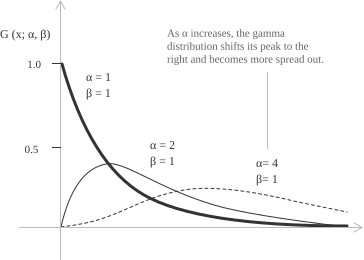

## Gamma function and density

The gamma distribution is a continuous probability distribution on the [positive half-line](../intervals/). It is used to model waiting times, durations, and sums of independent positive contributions. The gamma function is part of its density and, for $\alpha > 0,$ is defined by the following [improper integral](../improper-integrals/):

$$\Gamma(\alpha) = \int_{0}^{\infty} x^{\alpha - 1} e^{-x} \ dx$$

[Integration by parts](../integration-by-parts/) gives the recurrence relation:

$$
\begin{align}
\Gamma(\alpha + 1)
&= \int_{0}^{+\infty} x^{\alpha} e^{-x} \ dx \\[6pt]
&= \left[-x^{\alpha}e^{-x}\right]_{0}^{+\infty}
+ \alpha\int_{0}^{+\infty}x^{\alpha - 1}e^{-x} \ dx \\[6pt]
&= \alpha\Gamma(\alpha)
\end{align}
$$

The boundary term is zero for $\alpha > 0.$ Since $\Gamma(1) = 1,$ the recurrence gives $\Gamma(n) = (n - 1)!$ for every positive [integer](../integers/) $n.$ The gamma function is therefore an extension of the [factorial](../factorial/) to the positive [real numbers](../real-numbers/). The [Gaussian integral](../normal-distribution/) gives:

$$\Gamma\left(\frac{1}{2}\right) = \int_{0}^{+\infty}x^{-1/2}e^{-x} \ dx = \sqrt{\pi}$$

The gamma function is also part of the normalizing constant of the [beta distribution](../beta-distribution/). For large positive $t,$ [Stirling's approximation](../factorial/) gives

$$\Gamma(t + 1) \sim \sqrt{2\pi t}\left(\frac{t}{e}\right)^{t}$$

A [continuous random variable](../continuous-random-variables/) $X$ has a gamma distribution with shape parameter $\alpha > 0$ and scale parameter $\beta > 0$ if its probability density function is

$$
f(x;\alpha,\beta) =
\begin{cases}
\dfrac{1}{\beta^{\alpha}\Gamma(\alpha)} x^{\alpha - 1} e^{-x/\beta} & x > 0 \\[6pt]
0 & x \le 0
\end{cases}
$$

+ $\alpha$ is the shape parameter. For fixed $\beta,$ it determines the behavior near the origin and the skewness.
+ $\beta$ is the scale parameter. For fixed $\alpha,$ a larger value increases the mean and the variance.

The support is the positive half-line. For $\alpha > 1,$ the mode is $(\alpha - 1)\beta.$ For $0 < \alpha \le 1,$ the density is [decreasing](../increasing-and-decreasing-functions/) and has its supremum at the left endpoint.

- - -

A probability density has total integral $1.$ For the gamma density, this condition is

$$\int_{0}^{+\infty} \frac{1}{\beta^{\alpha}\Gamma(\alpha)} x^{\alpha - 1} e^{-x/\beta} \ dx = 1$$

With the [substitution](../integration-by-substitution/) $x = \beta t,$ we have $dx = \beta \ dt$ and the integral is

$$\int_{0}^{+\infty} \frac{1}{\beta^{\alpha}\Gamma(\alpha)} (\beta t)^{\alpha - 1} e^{-t} \beta \ dt$$

Collecting the powers of $\beta$ gives

$$\frac{1}{\Gamma(\alpha)} \int_{0}^{+\infty} t^{\alpha - 1} e^{-t} \ dt$$

The integral is $\Gamma(\alpha),$ and the normalized integral is

$$\frac{1}{\Gamma(\alpha)} \cdot \Gamma(\alpha) = 1$$

## Density, mean, and variance

For $X \sim \mathrm{Gamma}(\alpha, \beta),$ the density, mean, variance, and [standard deviation](../variance/) are

[class="table-1"]

|  |
| :--- |
| $f(x; \alpha, \beta) = \dfrac{1}{\Gamma(\alpha) \beta^{\alpha}} x^{\alpha - 1} e^{-x/\beta}, \quad x > 0$ |
| $\mu = E(X) = \alpha \beta$ |
| $\sigma^{2} = \mathrm{Var}(X) = \alpha \beta^{2}$ |
| $\sigma = \beta \sqrt{\alpha}$ |

[/class]

## Expected value of the gamma distribution

The [expected value of a continuous random variable](../mean-or-expected-value-of-a-random-variable/) is

$$\mu = E(X) = \int_{-\infty}^{+\infty} x f(x) \ dx$$

For a gamma distribution with shape $\alpha$ and scale $\beta,$ the density is

$$f(x;\alpha,\beta) = \frac{1}{\beta^{\alpha}\Gamma(\alpha)} x^{\alpha - 1} e^{-x/\beta} \quad x > 0$$

Its expected value is

$$\mu = E(X) = \int_{0}^{+\infty} x \frac{1}{\beta^{\alpha}\Gamma(\alpha)} x^{\alpha - 1} e^{-x/\beta} \ dx$$

Combining the powers of $x$ gives

$$E(X) = \frac{1}{\beta^{\alpha}\Gamma(\alpha)} \int_{0}^{+\infty} x^{\alpha} e^{-x/\beta} \ dx$$

With $x = \beta t$ and $dx = \beta \ dt,$ we have

$$
\begin{align}
E(X) &= \frac{1}{\beta^{\alpha}\Gamma(\alpha)} \int_{0}^{+\infty} (\beta t)^{\alpha} e^{-t} \beta \ dt \\[6pt]
&= \frac{\beta^{\alpha}\beta}{\beta^{\alpha}\Gamma(\alpha)} \int_{0}^{+\infty} t^{\alpha} e^{-t} \ dt \\[6pt]
&= \frac{\beta}{\Gamma(\alpha)} \int_{0}^{+\infty} t^{\alpha} e^{-t} \ dt
\end{align}
$$

The integral is $\Gamma(\alpha + 1)$

$$\int_{0}^{+\infty} t^{\alpha} e^{-t} \ dt = \Gamma(\alpha + 1)$$

The recurrence relation $\Gamma(\alpha + 1) = \alpha \Gamma(\alpha)$ gives

$$\mu = \alpha \beta$$

The mean is the product of the shape and scale parameters.

- - -

The rate parameter $\lambda = 1/\beta$ is the reciprocal of the scale. In this parametrization, the density is

$$f(x;\alpha,\lambda) = \frac{\lambda^{\alpha}}{\Gamma(\alpha)} x^{\alpha - 1} e^{-\lambda x} \quad x > 0$$

Its expected value is

$$E(X) = \frac{\alpha}{\lambda}$$

## Variance of the gamma distribution

For a continuous random variable with finite second moment, the [variance](../variance-and-covariance-of-a-random-variable/) is

$$\sigma^{2} = E(X^{2}) - [E(X)]^{2}$$

For the gamma density, the second moment is

$$E(X^{2}) = \int_{0}^{+\infty} x^{2} \frac{1}{\beta^{\alpha}\Gamma(\alpha)} x^{\alpha - 1} e^{-x/\beta} \ dx$$

Combining the powers of $x$ gives

$$E(X^{2}) = \frac{1}{\beta^{\alpha}\Gamma(\alpha)} \int_{0}^{+\infty} x^{\alpha + 1} e^{-x/\beta} \ dx$$

With $x = \beta t$ and $dx = \beta \ dt,$ the integral is

$$
\begin{align}
E(X^{2}) &= \frac{1}{\beta^{\alpha}\Gamma(\alpha)} \int_{0}^{+\infty} (\beta t)^{\alpha + 1} e^{-t} \beta \ dt \\[6pt]
&= \frac{\beta^{\alpha + 2}}{\beta^{\alpha}\Gamma(\alpha)} \int_{0}^{+\infty} t^{\alpha + 1} e^{-t} \ dt \\[6pt]
&= \frac{\beta^{2}}{\Gamma(\alpha)} \Gamma(\alpha + 2)
\end{align}
$$

The recurrence relation gives

$$\Gamma(\alpha + 2) = (\alpha + 1)\alpha \Gamma(\alpha)$$

Substitution of this identity gives

$$E(X^{2}) = \beta^{2} \alpha(\alpha + 1)$$

The mean of the gamma distribution is

$$E(X) = \alpha \beta$$

Substitution in the variance formula gives

$$\sigma^{2} = \beta^{2}\alpha(\alpha + 1) - (\alpha\beta)^{2} = \alpha\beta^{2}$$

With rate $\lambda = 1/\beta,$ the variance is

$$\mathrm{Var}(X) = \frac{\alpha}{\lambda^{2}}$$

## Special cases of the gamma distribution

For $\alpha = 1,$ the gamma distribution is the [exponential distribution](../exponential-distribution/). The [geometric distribution](../geometric-distribution/) is its discrete waiting-time analogue. With rate $\lambda = 1/\beta,$ its density is

$$
f(x;\lambda) =
\begin{cases}
\lambda e^{-\lambda x} & x > 0 \\[6pt]
0 & x \le 0
\end{cases}
$$

The parameter $\lambda$ is the rate. In a [Poisson process](../poisson-distribution/) with rate $\lambda,$ the time between successive events has this exponential distribution.

A chi-square random variable with $r$ degrees of freedom has the gamma distribution

$$X \sim \chi_{r}^{2} \quad \Longleftrightarrow \quad X \sim \mathrm{Gamma}\left(\frac{r}{2},2\right)$$

Here the second gamma parameter is the scale. In the rate parametrization, the rate is $1/2.$ For $r = 2,$ the chi-square distribution is an exponential distribution with rate $1/2.$ If $X$ has a gamma distribution with shape $\alpha$ and rate $\lambda,$ then

$$2\lambda X \sim \chi_{2\alpha}^{2}$$

## Moments, the moment-generating function, and sums

The mean and second moment are cases of the formula for the power moments. For any real $k > -\alpha,$ the moment $E(X^{k})$ exists and is

$$
\begin{align}
E(X^{k})
&= \frac{1}{\beta^{\alpha}\Gamma(\alpha)}
\int_{0}^{+\infty}x^{\alpha + k - 1}e^{-x/\beta} \ dx \\[6pt]
&= \beta^{k}\frac{\Gamma(\alpha + k)}{\Gamma(\alpha)}
\end{align}
$$

For a positive integer $k,$ the recurrence relation gives

$$E(X^{k}) = \beta^{k}\alpha(\alpha + 1)\cdots(\alpha + k - 1)$$

With rate $\lambda = 1/\beta,$ the formula is

$$E(X^{k}) = \frac{\Gamma(\alpha + k)}{\Gamma(\alpha)\lambda^{k}}$$

For $\lambda > 0,$ substitution in the gamma integral gives

$$\int_{0}^{+\infty}x^{\alpha - 1}e^{-\lambda x} \ dx = \frac{\Gamma(\alpha)}{\lambda^{\alpha}}$$

For scale $\beta$ and $t < 1/\beta,$ the moment-generating function is

$$
\begin{align}
M_{X}(t)
&= E(e^{tX}) \\[6pt]
&= \frac{1}{\beta^{\alpha}\Gamma(\alpha)}
\int_{0}^{+\infty}x^{\alpha - 1}e^{-x(1/\beta - t)} \ dx \\[6pt]
&= (1 - \beta t)^{-\alpha}
\end{align}
$$

With rate $\lambda,$ it is

$$M_{X}(t) = \left(\frac{\lambda}{\lambda - t}\right)^{\alpha}, \qquad t < \lambda$$

- - -

Let $X_{1},\ldots,X_{m}$ be independent gamma random variables with shapes $\alpha_{1},\ldots,\alpha_{m}$ and common rate $\lambda.$ For $S = X_{1} + \cdots + X_{m},$ independence gives

$$
\begin{align}
M_{S}(t)
&= \prod_{j=1}^{m}M_{X_{j}}(t) \\[6pt]
&= \prod_{j=1}^{m}
\left(\frac{\lambda}{\lambda - t}\right)^{\alpha_{j}} \\[6pt]
&= \left(\frac{\lambda}{\lambda - t}\right)^{\alpha_{1}+\cdots+\alpha_{m}}
\end{align}
$$

This is the moment-generating function of a gamma random variable with shape $\alpha_{1}+\cdots+\alpha_{m}$ and rate $\lambda.$ Therefore $S$ has this gamma distribution. If $X_{1},\ldots,X_{n}$ are independent exponential random variables with rate $\lambda,$ then

$$X_{1}+\cdots+X_{n} \sim \mathrm{Gamma}(n,\lambda)$$

In a Poisson process with rate $\lambda,$ the variables $X_{j}$ are the successive interarrival times. Their sum is the waiting time until the $n$th event.
