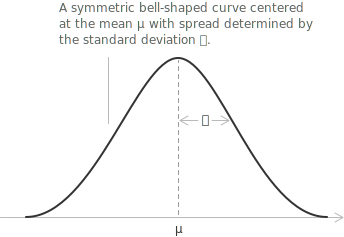
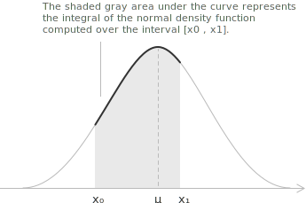
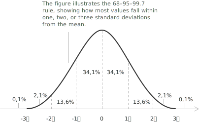

## Definition of the normal distribution

The normal distribution, also called the Gaussian distribution, is a continuous probability distribution whose density function is symmetric and bell-shaped. It models a [continuous random variable](../continuous-random-variables/) $X$ whose values cluster around a central value and whose larger deviations are progressively less frequent. The distribution has two parameters: the [mean](../introduction-to-the-mean/) $\mu,$ which is its center, and the [standard deviation](../variance/) $\sigma > 0,$ which determines its spread. We write:

$$X \sim \mathcal{N}(\mu, \sigma^{2})$$

The density is symmetric about $x = \mu$ and has the following properties.

+ The total area under the curve equals $1,$ since the integral of the density over the whole real line, from $-\infty$ to $+\infty,$ is $1.$
+ The curve is symmetric about the mean $\mu,$ so half of the probability lies to the left of $\mu$ and half to the right.
+ The curve has two [inflection points](../maximum-minimum-and-inflection-points/), at $x = \mu - \sigma$ and $x = \mu + \sigma,$ where the [curvature changes sign](../sign-analysis-in-inequalities/).
+ The curve is [asymptotic](../asymptotes/) to the horizontal axis as $x$ moves away from the mean in either direction.

The parameter $\mu$ shifts the whole curve along the horizontal axis without altering its shape. The parameter $\sigma$ stretches or compresses the curve about the mean, so a smaller $\sigma$ concentrates the probability in a narrow, tall peak and a larger $\sigma$ spreads it into a low, wide curve.

## Key features

For $X \sim \mathcal{N}(\mu, \sigma^{2})$ the density, mean, variance, and standard deviation are as follows. The parameters $\mu$ and $\sigma^{2}$ are respectively the mean and the variance of the distribution.

[class="table-1"]

|                                                                                                  |
| ------------------------------------------------------------------------------------------------ |
| $\mathcal{N}(x; \mu, \sigma) = \frac{1}{\sigma\sqrt{2\pi}} e^{-\frac{(x-\mu)^{2}}{2\sigma^{2}}}$ |
| $E(X) = \mu$                                                                                     |
| $\mathrm{Var}(X) = \sigma^{2}$                                                                   |
| $\mathrm{SD}(X) = \sigma$                                                                        |

[/class]

> The density is determined by the mean $\mu$ and the standard deviation $\sigma.$ The mean is the center of the bell, while the standard deviation determines its width.

## Probability density function of the normal distribution

A random variable $X$ with this distribution is a normal random variable. Its probability density [function](../functions/) is:

$$\mathcal{N}(x; \mu, \sigma) = \frac{1}{\sqrt{2\pi}\sigma} e^{-\frac{(x-\mu)^{2}}{2\sigma^{2}}}$$

The density is defined for every [real number](../real-numbers/) $x.$ It gives the relative concentration of probability across the values of $X$ and depends only on $\mu$ and $\sigma.$ For the mean, variance, and standard deviation of a random variable, whether [discrete](../discrete-random-variables/) or [continuous](../continuous-random-variables/), see [mean or expected value of a random variable](../mean-or-expected-value-of-a-random-variable/) and [variance and covariance of a random variable](../variance-and-covariance-of-a-random-variable/).

- - -

The [improper integral](../improper-integrals/) of the density over the whole real line equals $1$:

$$\frac{1}{\sqrt{2\pi}\sigma} \int_{-\infty}^{+\infty} e^{-\frac{(x-\mu)^{2}}{2\sigma^{2}}} \ dx = 1$$

To find the area under the curve between two points $x_0$ and $x_1,$ we evaluate the [definite integral](../definite-integrals/) of the density over that [interval](../intervals/).

This area is the probability that $X$ falls in $[x_0, x_1],$ so the probability that $X$ lies between $x_0$ and $x_1$ is:

$$
\begin{align}
P(x_0 < X < x_1) &= \int_{x_0}^{x_1} \mathcal{N}(x; \mu, \sigma) \ dx \\[6pt]
&= \frac{1}{\sqrt{2\pi}\sigma} \int_{x_0}^{x_1} e^{-\frac{(x-\mu)^{2}}{2\sigma^{2}}} \ dx
\end{align}
$$

The density has no elementary antiderivative, so this integral has no elementary closed form. It can be approximated by [numerical integration](../numerical-integration/).

## Standard normal distribution

Every normal random variable $X$ has a standardized form $Z,$ defined by:

$$Z = \frac{X - \mu}{\sigma}$$

The variable $Z$ has the standard normal distribution, which has mean $0$ and standard deviation $1,$ written $Z \sim \mathcal{N}(0, 1).$ Subtracting $\mu$ centers the variable at $0,$ and dividing by $\sigma$ rescales the spread to $1.$ The transformation is reversible because $X = \sigma Z + \mu,$ so every normal distribution corresponds to the same standard curve. This reduces every probability calculation to a single reference distribution, whose values are read from [the standard normal Z table](../standard-normal-z-table/) instead of a separate integral for each pair $\mu,$ $\sigma.$

- - -

For a generic interval $[x_0, x_1]$ the probability is:

$$P(x_0 < X < x_1) = \frac{1}{\sqrt{2\pi}\sigma} \int_{x_0}^{x_1} e^{-\frac{(x-\mu)^{2}}{2\sigma^{2}}} \ dx$$

Applying [integration by substitution](../integration-by-substitution/) with $z = (x-\mu)/\sigma,$ we have $dx = \sigma \ dz,$ and the interval for $X$ is equivalent to an interval for $Z$:

$$P(x_0 < X < x_1) = P\left(\frac{x_0 - \mu}{\sigma} < Z < \frac{x_1 - \mu}{\sigma}\right)$$

The standardized bounds are $z_0 = (x_0-\mu)/\sigma$ and $z_1 = (x_1-\mu)/\sigma.$ The factor $\sigma$ cancels, and the same probability is an integral of the standard density:

$$
\begin{align}
P(x_0 < X < x_1) &= \frac{1}{\sqrt{2\pi}\sigma} \int_{x_0}^{x_1} e^{-\frac{(x-\mu)^{2}}{2\sigma^{2}}} \ dx \\[6pt]
&= \frac{1}{\sqrt{2\pi}} \int_{z_0}^{z_1} e^{-\frac{z^{2}}{2}} \ dz = P(z_0 < Z < z_1)
\end{align}
$$

Standardization links every normal distribution to the standard normal curve, so a probability for $X$ is obtained from tabulated values of $Z.$

## Cumulative distribution function

The cumulative distribution function of the standard normal variable is denoted by $\Phi.$ For every real number $z,$ it is the probability to the left of $z$:

$$\Phi(z) = P(Z \le z) = \frac{1}{\sqrt{2\pi}} \int_{-\infty}^{z} e^{-\frac{t^{2}}{2}} \ dt$$

The value $\Phi(z)$ is the area under the standard normal curve to the left of $z.$ It increases from $0$ to $1$ as $z$ runs over the real line, and $\Phi(0) = 1/2$ by symmetry. The symmetry identity is:

$$\Phi(-z) = 1 - \Phi(z)$$

The values for negative arguments follow from this identity and the values with $z \ge 0.$ For a general variable $X \sim \mathcal{N}(\mu, \sigma^{2}),$ the probability $P(X \le x)$ equals $\Phi((x-\mu)/\sigma)$ after standardization. The [standard normal Z table](../standard-normal-z-table/) tabulates $\Phi$ and shows how to read its values and combine them for specific probabilities.

## Quantiles of the standard normal distribution

In some problems the probability is known and the corresponding value is unknown, so the inverse of $\Phi$ is required. For $\alpha \in (0, 1),$ the [quantile](../median-and-quantiles/) $z_\alpha$ of the standard normal distribution is the value with probability $\alpha$ to its left:

$$P(Z \le z_\alpha) = \Phi(z_\alpha) = \alpha$$

The quantile $z_\alpha$ is the argument corresponding to $\alpha$ in the table of $\Phi.$ The quantiles that recur in interval estimation are:

| $\alpha$   | $0.90$ | $0.95$  | $0.975$ | $0.99$ | $0.995$ |
| ---------- | ------ | ------- | ------- | ------ | ------- |
| $z_\alpha$ | $1.28$ | $1.645$ | $1.96$  | $2.33$ | $2.58$  |

By symmetry, for $t > 0,$ the interval $[-t, t]$ has probability:

$$P(|Z| \le t) = 2\Phi(t) - 1$$

Requiring $P(|Z| \le t) = 0.95$ gives $\Phi(t) = 0.975,$ hence $t = 1.96.$ The event $-1.96 \le Z \le 1.96$ therefore has probability $0.95,$ and the endpoint $1.96$ is the quantile used in a $95\%$ confidence statement.

## Three-sigma rule

In a normal distribution the probability of an interval depends only on its distance from the mean, measured in standard deviations. The 68-95-99.7 rule, also called the three-sigma rule, describes the concentration of probability near the center.

+ About $68\%$ of the values lie within one standard deviation of the mean, split as $34.1\%$ on each side.
+ About $95\%$ lie within two standard deviations, which adds a further $13.6\%$ on each side of the first band.
+ About $99.7\%$ lie within three standard deviations, which adds a further $2.1\%$ on each side.

> These percentages are the standard normal values $2\Phi(1) - 1,$ $2\Phi(2) - 1,$ and $2\Phi(3) - 1.$ Beyond three standard deviations only about $0.3\%$ of the probability remains, divided equally between the two tails.

## Central limit theorem

Under the conditions below, the normal distribution is the limiting law of standardized sums and averages. Let $X_1, X_2, \dots, X_n$ be independent and identically distributed random variables, each with mean $E(X_i) = \mu$ and finite variance $\mathrm{Var}(X_i) = \sigma^{2} > 0.$

Consider first their sum:

$$S_n = X_1 + X_2 + \cdots + X_n$$

By linearity of the mean and independence of the terms, the sum has mean and variance:

$$E(S_n) = n\mu \quad \text{and} \quad \mathrm{Var}(S_n) = n\sigma^{2}$$

For large $n$ the distribution of $S_n$ is approximately $\mathcal{N}(n\mu, n\sigma^{2}),$ and the standardized sum approaches the standard normal distribution:

$$\frac{S_n - n\mu}{\sigma\sqrt{n}} \xrightarrow{d} \mathcal{N}(0, 1) \quad \text{as } n \to \infty$$

The same statement holds for the [sample mean](../arithmetic-mean/) $\bar{X}_n = S_n/n.$ Dividing the sum by $n$ gives:

$$\bar{X}_n = \frac{1}{n} \sum_{i=1}^{n} X_i$$

The sample mean has mean $E(\bar{X}_n) = \mu$ and variance $\mathrm{Var}(\bar{X}_n) = \sigma^{2}/n.$ Its standardized form has the same limit:

$$\frac{\bar{X}_n - \mu}{\sigma / \sqrt{n}} \xrightarrow{d} \mathcal{N}(0, 1) \quad \text{as } n \to \infty$$

Under these hypotheses, the sum and the sample mean have approximately normal distributions for large $n.$

> The notation $\xrightarrow{d}$ denotes convergence in distribution. The distribution of the standardized variable approaches the standard normal distribution as $n$ increases. A common working guideline is $n > 30,$ though the required sample size depends on how far the original distribution departs from symmetry.

## Example with the central limit theorem

A courier depot processes $n = 200$ parcels in a shift. The parcel weights are independent, each with mean $\mu = 12$ kg and standard deviation $\sigma = 5$ kg, and the shift total is $S = X_1 + \cdots + X_{200}.$ We estimate the probability that the total exceeds $2500$ kg.

The total has mean and standard deviation:

$$E(S) = n\mu = 200 \times 12 = 2400 \quad \text{and} \quad \sigma\sqrt{n} = 5\sqrt{200} \approx 70.7$$

By the central limit theorem $S$ is approximately $\mathcal{N}(2400, 5000).$ The standardized threshold is:

$$z = \frac{2500 - 2400}{70.7} \approx 1.41$$

The upper-tail probability is therefore:

$$P(S > 2500) \approx P(Z > 1.41) = 1 - \Phi(1.41) = 1 - 0.9207 = 0.0793$$

The shift total exceeds $2500$ kg with probability about $0.079,$ or $7.9\%.$

## Related distributions and approximations

The normal distribution is the limiting or approximating model for several others. A [binomial](../binomial-distribution/) variable $X \sim \mathrm{Bin}(n, p)$ is a sum of $n$ independent [Bernoulli variables](../bernoulli-distribution/), so the central limit theorem applies to it. The de Moivre-Laplace theorem states that the standardized binomial converges to the standard normal:

$$\frac{X - np}{\sqrt{np(1-p)}} \xrightarrow{d} \mathcal{N}(0, 1) \quad \text{as } n \to \infty$$

The approximation is usually applied when $np > 5$ and $n(1-p) > 5.$ Since the binomial is discrete and the normal continuous, replacing each integer bound $k$ by $k \pm 0.5,$ the continuity correction, sharpens the estimate of interval probabilities. The [binomial distribution](../binomial-distribution/) page develops this approximation with a worked example.

The normal distribution is also the large-sample reference for two distributions built from it. The [chi-square distribution](../chi-square-distribution/) with $n$ degrees of freedom is the law of a sum of $n$ squared independent standard normal variables, with $E(X) = n$ and $\mathrm{Var}(X) = 2n$; after standardization it approaches the standard normal, so its quantiles satisfy $\chi^{2}_\alpha(n) \approx z_\alpha\sqrt{2n} + n$ for large $n.$ [Student's t distribution](../student-t-distribution/) with $n$ degrees of freedom approaches the standard normal directly as $n$ grows, so $t_\alpha(n) \approx z_\alpha$ for large $n.$
