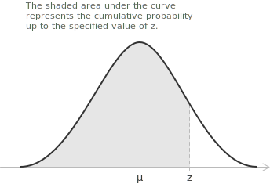
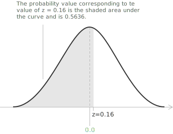
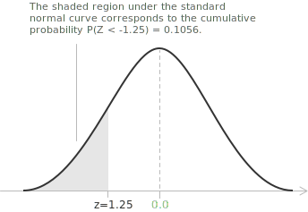

## From the normal to the standard normal distribution

If $X$ has a [normal distribution](../normal-distribution/) $\mathcal{N}(\mu, \sigma^{2}),$ its standardized variable $Z$ is defined by:

$$Z = \frac{X - \mu}{\sigma}$$

This transformation is called standardization. For each value $x$ of the [continuous random variable](../continuous-random-variables/) $X,$ the corresponding value $z$ is the difference between $x$ and the [mean](../mean-or-expected-value-of-a-random-variable/) $\mu,$ measured in [standard deviations](../variance-and-covariance-of-a-random-variable/). The variable $Z$ has the standard normal distribution $\mathcal{N}(0, 1),$ with mean $0$ and standard deviation $1.$

After standardization, every normal variable has the same distribution. Thus probabilities and [critical values](../median-and-quantiles/) for any normal distribution can be calculated from $\mathcal{N}(0, 1)$ using one reference table, the Z table, instead of evaluating a separate integral for each pair $(\mu, \sigma).$

## Standard Z table

The standard Z table lists, for each value of $z,$ the cumulative probability to its left. This probability is the [cumulative distribution function](../continuous-random-variables/) of the standard normal variable, written $\Phi(z)$:

$$\Phi(z) = P(Z \le z)$$

The value $\Phi(z)$ is the area under the standard normal curve from $-\infty$ up to $z.$

Since the standard normal distribution is continuous, every single value has probability zero, so $P(Z = z) = 0.$ Including or excluding the endpoint $z$ therefore does not change the cumulative probability:

$$P(Z < z) = P(Z \le z)$$

> The [normal distribution](../normal-distribution/) page defines $\Phi$ as an [improper integral](../improper-integrals/) of the standard normal density and derives its properties. Here its values are read from the table.

The full table covers a wide range of $z$ values. The extract below shows a portion of it, with probabilities rounded to four decimal places.

| z   | .00   | .01   | .02   | .03   | .04   | .05   | .06   | .07   | .08   | ... |
|-----|-------|-------|-------|-------|-------|-------|-------|-------|-------|-----|
| 0.0 | .5000 | .5040 | .5080 | .5120 | .5160 | .5199 | .5239 | .5279 | .5319 | ... |
| 0.1 | .5398 | .5438 | .5478 | .5517 | .5557 | .5596 | .5636 | .5675 | .5714 | ... |
| 0.2 | .5793 | .5832 | .5871 | .5910 | .5948 | .5987 | .6026 | .6064 | .6103 | ... |
| 0.3 | .6179 | .6217 | .6255 | .6293 | .6331 | .6368 | .6406 | .6443 | .6480 | ... |
| 0.4 | .6554 | .6591 | .6628 | .6664 | .6700 | .6736 | .6772 | .6808 | .6844 | ... |
| 0.5 | .6915 | .6950 | .6985 | .7019 | .7054 | .7088 | .7123 | .7157 | .7190 | ... |
| 0.6 | .7257 | .7291 | .7324 | .7357 | .7389 | .7422 | .7454 | .7486 | .7517 | ... |
| 0.7 | .7580 | .7611 | .7642 | .7673 | .7704 | .7734 | .7764 | .7794 | .7823 | ... |
| 0.8 | .7881 | .7910 | .7939 | .7967 | .7995 | .8023 | .8051 | .8078 | .8106 | ... |
| 0.9 | .8159 | .8186 | .8212 | .8238 | .8264 | .8289 | .8315 | .8340 | .8365 | ... |
| 1.0 | .8413 | .8438 | .8461 | .8485 | .8508 | .8531 | .8554 | .8577 | .8599 | ... |
| ... | ...   | ...   | ...   | ...   | ...   | ...   | ...   | ...   | ...   | ... |

> An [interactive Z table](https://ztable.io) computes cumulative probabilities for a given value of $z.$

The table is read by splitting $z$ into two parts.

+ The row gives the [integer](../integers/) part of $z$ and its first decimal.
+ The column gives the second decimal.
+ The cell at their intersection contains the cumulative probability $\Phi(z).$

## Example 1

For the standard normal variable $Z$ at $z = 0.16,$ the cumulative probability to its left is found in row $0.1$ and column $0.06.$ The entry at their intersection is $0.5636,$ so $\Phi(0.16) \approx 0.5636.$

| z   | .00   | .01   | .02   | .03   | .04   | .05   | .06   | .07   | .08   | ... |
|-----|-------|-------|-------|-------|-------|-------|-------|-------|-------|-----|
| 0.0 | .5000 | .5040 | .5080 | .5120 | .5160 | .5199 | .5239 | .5279 | .5319 | ... |
| 0.1 | .5398 | .5438 | .5478 | .5517 | .5557 | .5596 | .5636 | .5675 | .5714 | ... |
| ... | ...   | ...   | ...   | ...   | ...   | ...   | ...   | ...   | ...   | ... |

Thus about $56.36\%$ of values from the standard normal distribution are less than $0.16$:

$$P(Z < 0.16) \approx 0.5636$$

The total area under the curve equals $1,$ so the complementary probability is:

$$P(Z > 0.16) \approx 1 - 0.5636 = 0.4364$$

The probability that $Z$ lies between $0$ and $0.16$ is the difference between the cumulative values at $0.16$ and $0$:

$$P(0 < Z < 0.16) = \Phi(0.16) - \Phi(0) \approx 0.5636 - 0.5 = 0.0636$$

By symmetry about the mean, the interval $-0.16 < Z < 0.16$ has twice this probability:

$$P(-0.16 < Z < 0.16) = 2P(0 < Z < 0.16) \approx 0.1272$$

## Combining table values

A single entry gives $\Phi(z) = P(Z \le z).$ Other probabilities follow from it by complementation and difference.

+ The right tail is the complement of the entry, $P(Z > a) = 1 - \Phi(a).$
+ The probability of an [interval](../intervals/) is a difference of two entries, $P(a < Z < b) = \Phi(b) - \Phi(a).$

A table that lists only $z \ge 0$ can also be used for negative arguments through the symmetry of the curve about $0,$ where $\Phi(-z) = 1 - \Phi(z).$ The [normal distribution](../normal-distribution/) page derives this identity.

For an interval with one negative endpoint, we combine both rules. For $a = -1.37$ and $b = 2.01,$ the interval probability is:

$$P(-1.37 < Z \le 2.01) = \Phi(2.01) - \Phi(-1.37) = \Phi(2.01) + \Phi(1.37) - 1$$

The four-decimal table entries are $\Phi(2.01) \approx 0.9778$ and $\Phi(1.37) \approx 0.9147,$ so:

$$P(-1.37 < Z \le 2.01) \approx 0.9778 + 0.9147 - 1 = 0.8925$$

> The [normal approximation of the binomial distribution](../binomial-distribution/) uses the same subtraction of cumulative values after the discrete bounds have been adjusted and standardized.

## Example 2

The lifetime of a rechargeable battery is normally distributed with mean $\mu = 8.0$ hours and standard deviation $\sigma = 1.2$ hours. We find the probability that a battery lasts less than $6.5$ hours.

The probability $P(X < 6.5)$ is the area under the curve to the left of $6.5.$ We standardize the value:

$$z = \frac{x - \mu}{\sigma}$$

For $x = 6.5$ hours, the standardized value is:

$$z = \frac{6.5 - 8.0}{1.2} = \frac{-1.5}{1.2} = -1.25$$

The required probability is $P(Z < -1.25) = \Phi(-1.25).$

| z     | .00   | .01   | .02   | .03   | .04   | .05   | .06   | .07   | .08   | ... |
|--------|-------|-------|-------|-------|-------|-------|-------|-------|-------|-----|
| -1.0   | .1587 | .1562 | .1539 | .1515 | .1492 | .1469 | .1446 | .1423 | .1401 | ... |
| -1.2   | .1151 | .1131 | .1112 | .1093 | .1075 | .1056 | .1038 | .1020 | .1003 | ... |
| -1.3   | .0968 | .0951 | .0934 | .0918 | .0901 | .0885 | .0869 | .0853 | .0838 | ... |
| ...    | ...   | ...   | ...   | ...   | ...   | ...   | ...   | ...   | ...   | ... |

The entry in row $-1.2$ and column $0.05$ is $0.1056.$ The figure below shows this probability as the area under the standard normal curve to the left of $z = -1.25$:

$$P(Z < -1.25) \approx 0.1056$$

> The same value follows from symmetry for a table that lists only $z \ge 0,$ since $\Phi(-1.25) = 1 - \Phi(1.25) \approx 1 - 0.8944 = 0.1056.$

According to the model, about $10.56\%$ of the batteries last less than $6.5$ hours.

## Reading the table in reverse

In some problems, the cumulative probability is given and $z$ is unknown. To determine $z,$ locate the probability in the body of the table and read the corresponding value from its row and column.

Suppose that the probability to the left of $z$ is $0.85.$ Then:

$$\Phi(z) = P(Z \le z) = 0.85$$

The entry closest to $0.85$ is $0.8508,$ in row $1.0$ and column $0.04,$ so:

$$z \approx 1.04$$

The value with a prescribed probability $\alpha$ to its left is the [quantile](../median-and-quantiles/) $z_\alpha$ of the standard normal distribution. For example, $0.97$ lies between $\Phi(1.88) \approx 0.9699$ and $\Phi(1.89) \approx 0.9706,$ and is closer to $\Phi(1.88),$ so its quantile is approximately $1.88.$ The [normal distribution](../normal-distribution/) page lists quantiles commonly used in interval estimation.
