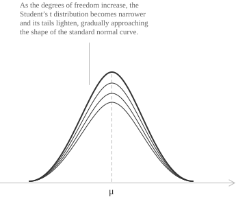
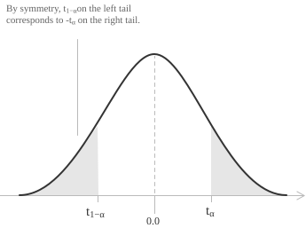

## Definition

For inference about the mean of a normal population, the [standard normal distribution](../normal-distribution/) $\mathcal{N}(0,1)$ is the reference model when the population [variance](../variance/) is known. When the variance is unknown and has to be estimated from the sample, the estimate has its own sampling error, and the standard normal distribution understates the spread of the resulting statistic. Student's $t$ distribution is the reference model that accounts for this extra variability.

The [continuous random variable](../continuous-random-variables/) $T$ is defined as the ratio:

$$T = \frac{Z}{\sqrt{V/k}}$$

+ $Z$ is a standard normal random variable
+ $V$ is a [chi-square random variable](../chi-square-distribution/) with $k$ degrees of freedom, independent of $Z$
+ $k$ is the number of degrees of freedom and determines how heavy the tails of the distribution are

Since the [expected value](../mean-or-expected-value-of-a-random-variable/) of $V$ is $E(V)=k,$ the square of the denominator has mean $1.$ The distribution of $T$ remains symmetric about zero and has a wider spread because the denominator is random. Since $Z$ and $V$ are independent, the density of their ratio is computable in closed form.

The name comes from the pseudonym of William Sealy Gosset, a chemist at the Guinness brewery in Dublin. His 1908 paper "The Probable Error of a Mean" appeared in Biometrika under the name "Student".

## Density of the distribution

For a variable $T$ with $k$ degrees of freedom the probability density function is:

$$f(t;k) = \frac{\Gamma\left(\frac{k+1}{2}\right)}{\Gamma\left(\frac{k}{2}\right)\sqrt{k\pi}}\left(1+\frac{t^{2}}{k}\right)^{-\frac{k+1}{2}}$$

Using the [beta function](../beta-distribution/) $B(a,b)=\Gamma(a)\Gamma(b)/\Gamma(a+b)$ and the identity $\Gamma(1/2)=\sqrt{\pi}$ for the [gamma function](../gamma-distribution/), the density has the equivalent form:

$$f(t;k) = \frac{1}{\sqrt{k}B\left(\frac{k}{2},\frac{1}{2}\right)}\left(1+\frac{t^{2}}{k}\right)^{-\frac{k+1}{2}}$$

Both forms depend on $t$ only through $t^{2},$ so the graph is symmetric about the origin. For large $|t|,$ the density decays like $|t|^{-(k+1)},$ a power law instead of the exponential decay $e^{-t^{2}/2}$ of the normal density. The tails are therefore heavier for small values of $k,$ and the shape of the curve depends only on $k.$

For $k=1$ the gamma factors are $\Gamma(1)=1$ and $\Gamma(1/2)=\sqrt{\pi},$ and the density is:

$$f(t;1) = \frac{1}{\pi\left(1+t^{2}\right)}$$

This is the Cauchy density, whose mean does not exist. At the other end, as $k \to \infty$ the second factor tends to $e^{-t^{2}/2}$ and the normalizing constant tends to $1/\sqrt{2\pi},$ so the density converges pointwise to the standard normal density.

> The curves become more concentrated around the origin as the degrees of freedom grow and approach the standard normal curve.

- - -

The graph of $f(t;k)$ has four properties that follow from the expression above.

+ The total area under the curve is $1.$ The [integral](../definite-integrals/) of the density over the whole real line equals $1$ for every $k>0$ by the choice of the normalizing constant.
+ The curve is [symmetric](../even-and-odd-functions/) about the origin. Half of the total probability lies on each side of the origin. When $k>1,$ the [mean](../introduction-to-the-mean/) exists and is equal to $0.$
+ The curve has two [inflection points](../maximum-minimum-and-inflection-points/), located at $t=\pm\sqrt{k/(k+2)}.$ They move away from the centre as $k$ grows and approach $\pm1,$ the inflection points of the standard normal curve.
+ The curve is [asymptotic](../asymptotes/) to the horizontal axis. The density tends to $0$ as $|t|$ grows, and for small $k$ it does so more slowly than the normal density.

## Mean, variance, and kurtosis

For $T \sim t_k$ the density, [mean](mean-or-expected-value-of-a-random-variable) and [variance](../variance-and-covariance-of-a-random-variable/), and excess kurtosis are:

[class="table-1"]

|  |
| :--- |
| $f(t;k) = \dfrac{\Gamma\left(\frac{k+1}{2}\right)}{\Gamma\left(\frac{k}{2}\right)\sqrt{k\pi}}\left(1+\frac{t^{2}}{k}\right)^{-\frac{k+1}{2}}$ |
| $\mu = E(T) = 0, \ k>1$ |
| $\sigma^{2} = \mathrm{Var}(T) = \dfrac{k}{k-2}, \ k>2$ |
| $\gamma_{2} = \dfrac{E\left[(T-\mu)^{4}\right]}{\sigma^{4}}-3 = \dfrac{6}{k-4}, \ k>4$ |

[/class]

The conditions on $k$ are conditions for convergence of the defining [improper integrals](../improper-integrals/). The moment of order $m$ requires the integrability of $|t|^{m}f(t;k),$ which behaves like $|t|^{m-k-1}$ at infinity and is integrable when $k>m.$ The mean exists for $k>1,$ the variance for $k>2,$ and the excess kurtosis, which needs the fourth moment, for $k>4.$ For $1<k\le2$ the mean is $0$ while the variance is infinite, and for $k\le1$ neither exists.

Writing the variance as $1+2/(k-2)$ separates it into the variance of the standard normal distribution and a positive excess that vanishes as $k$ grows. The coefficient $\gamma_{2}$ subtracts $3$ from the fourth standardized moment because that moment is equal to $3$ for every normal distribution, so $\gamma_{2}=0$ is the normal reference. For the $t$ distribution $\gamma_{2}=6/(k-4)$ is positive at every admissible $k$ and tends to $0.$ After a $t$ variable is rescaled to have variance $1,$ its density has a higher value at the origin and heavier tails than the standard normal density, and these differences decrease as $k$ grows. With $k=5,$ a $t$ variable lies more than four standard deviations from its mean with probability $3.6\cdot10^{-3},$ against $6.3\cdot10^{-5}$ for the normal model. The skewness is $0$ by symmetry whenever the third moment exists.

## Cumulative distribution function

The cumulative distribution function of $T$ is given by:

$$F(t;k) = \int_{-\infty}^{t} f(u;k) \ du$$

The integrand has no elementary primitive for general $k,$ and the standard closed form uses the regularized beta function $I_x(a,b)=B(x;a,b)/B(a,b),$ the ratio of the incomplete beta function to the complete one. For $t>0$ the [substitution](../integration-by-substitution/) $u=\sqrt{k}\sqrt{(1-x)/x}$ maps the tail integral onto an incomplete beta integral and gives:

$$F(t;k) = 1-\frac{1}{2}I_{\frac{k}{k+t^{2}}}\left(\frac{k}{2},\frac{1}{2}\right)$$

Symmetry extends this to negative arguments through $F(-t;k)=1-F(t;k).$ Critical values are [quantiles](../median-and-quantiles/) computed numerically and traditionally listed in t-tables.

## The t statistic for a sample mean

Let $X_1,X_2,\dots,X_n$ be independent observations from $\mathcal{N}(\mu,\sigma^{2}),$ with [sample mean](../arithmetic-mean/) $\bar X$ and unbiased [sample variance](../variance/):

$$S^{2} = \frac{1}{n-1}\sum_{i=1}^{n}\left(X_i-\bar X\right)^{2}$$

The sample mean standardized with the known $\sigma$ is a standard normal variable, and the scaled sample variance is an independent chi-square variable:

$$Z = \frac{\bar X-\mu}{\sigma/\sqrt{n}} \sim \mathcal{N}(0,1), \quad V = \frac{(n-1)S^{2}}{\sigma^{2}} \sim \chi^{2}_{n-1}$$

Substituting these two variables into the definition of $T$ with $k=n-1$ gives:

$$
\begin{align}
T &= \frac{Z}{\sqrt{V/(n-1)}} \\[6pt]
&= \frac{\left(\bar X-\mu\right)\sqrt{n}/\sigma}{\sqrt{S^{2}/\sigma^{2}}} \\[6pt]
&= \frac{\bar X-\mu}{S/\sqrt{n}}
\end{align}
$$

The unknown $\sigma$ cancels, and the random variable on the last line has Student's $t$ distribution with $n-1$ degrees of freedom. In a hypothesis test the null hypothesis specifies $\mu=\mu_0,$ and the statistic $(\bar X-\mu_0)/(S/\sqrt{n})$ is computable from the sample. One degree of freedom is lost with respect to the sample size because the deviations $X_i-\bar X$ satisfy the constraint $\sum_{i=1}^{n}\left(X_i-\bar X\right)=0,$ so only $n-1$ of them can be assigned independently.

## Symmetry of the t distribution

Symmetry about zero determines how critical values are read. Write $t_{\alpha}$ for the value that leaves probability $\alpha$ in the right tail, so that $P(T>t_{\alpha})=\alpha.$ Reflecting the curve across the vertical axis maps the right tail beyond $t_{\alpha}$ onto the left tail below $-t_{\alpha},$ and the two areas are equal. With this notation:

$$t_{1-\alpha} = -t_{\alpha}$$

The value with right-tail area $1-\alpha$ is the opposite of the value with right-tail area $\alpha.$ A single table entry therefore gives both tail boundaries. If $P(T>t_{\alpha})=\alpha,$ then $P(T<-t_{\alpha})=\alpha,$ and the two tails together have probability $2\alpha.$

> By symmetry, the shaded areas below $-t_{\alpha}$ and above $t_{\alpha}$ are equal.

- - -

A [z-table](../standard-normal-z-table/) usually reports cumulative probabilities for the standard normal distribution, while a t-table reports critical values for specified tail probabilities. Since the shape of the $t$ distribution depends on $k,$ each row of the t-table corresponds to a different number of degrees of freedom, and each column corresponds to a right-tail probability. The entry at their intersection is the critical value $t_{\alpha}$ for those two parameters.

> These tables give numerical probabilities or critical values without requiring a direct evaluation of the integral of the density.

## Example 1

Suppose we want the value of the $t$ statistic with $k=12$ degrees of freedom that leaves an area of $0.01$ in the left tail. A left-tail area of $0.01$ corresponds to a right-tail area of $0.99,$ so the value we are looking for is $t_{0.99},$ and by symmetry it is the opposite of the value with right-tail area $0.01$:

$$t_{0.99} = -t_{0.01}$$

The table gives $t_{0.01}$ directly. Reading the row $k=12$ and the column of right-tail probability $0.01,$ the entry at the intersection is:

| $k$ | 0.10 | 0.05 | 0.025 | 0.01 | ... |
| --- | ---- | ---- | ----- | ---- | --- |
| 10 | 1.372 | 1.812 | 2.228 | 2.764 | ... |
| 11 | 1.363 | 1.796 | 2.201 | 2.718 | ... |
| 12 | 1.356 | 1.782 | 2.179 | 2.681 | ... |
| 13 | 1.350 | 1.771 | 2.160 | 2.650 | ... |
| ... | ... | ... | ... | ... | ... |

Substituting $t_{0.01}=2.681$ into the symmetry relation gives:

$$t_{0.99} = -2.681$$

With $12$ degrees of freedom, the value that leaves $1\%$ of the total probability to its left is $-2.681.$

## Note on tail probabilities

For symmetric cutoffs $-a$ and $a,$ the probability contained in the two tails is twice the probability in one tail. In the example the right tail beyond $2.681$ has area $0.01,$ the left tail below $-2.681$ has the same area, and the probability outside the [interval](../intervals/) $[-2.681,2.681]$ is:

$$2 \times 0.01 = 0.02$$

The central area between the two critical values is the complement:

$$1-0.02 = 0.98$$

Applied to the statistic of the previous section, this pair of critical values determines a confidence interval. A sample of $13$ observations has $n-1=12$ degrees of freedom, and the inequality $-2.681 \le \left(\bar X-\mu\right)/\left(S/\sqrt{13}\right) \le 2.681$ holds with probability $0.98.$ Solving for $\mu$ gives the interval:

$$\bar X \pm 2.681\frac{S}{\sqrt{13}}$$

Under repeated sampling, this interval covers the unknown population mean in $98\%$ of the samples.
