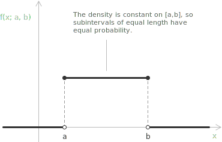

## Definition

The uniform distribution, also called the rectangular distribution, is a continuous distribution with constant density on a bounded [interval](../intervals/). Subintervals of equal length therefore have equal probability. This model is suitable when a quantity is known to lie between two bounds and the available information gives no reason to favor one part of the interval.

A [continuous random variable](../continuous-random-variables/) $X$ has a uniform distribution on the interval $[a,b],$ written $X \sim \mathrm{U}(a,b),$ if its probability density function is constant on that interval:

$$
f(x;a,b) =
\begin{cases}
\dfrac{1}{b-a} & a \le x \le b \\[6pt]
0 & \mathrm{otherwise}
\end{cases}
$$

Here $a$ and $b$ are the endpoints of the support, with $a < b.$ The graph of the density is a rectangle. Its base has length $b-a$ and its height is $1/(b-a),$ so its area is $1.$ When the interval is wider, the height is lower because the total area is fixed.

> The value of the density at the endpoints $a$ and $b$ is immaterial. A change of the density at finitely many points has no effect on any probability, so the constant part of the piecewise definition may include or exclude either endpoint.

If $I_1$ and $I_2$ are subintervals of $[a,b]$ with common length $w,$ they have the same probability:

$$
P(X \in I_1) = P(X \in I_2) = \frac{w}{b-a}
$$

The probability is determined by the length of the subinterval. Its position inside $[a,b]$ has no effect. A single point has length zero, so every individual value has probability zero:

$$
P(X = x_0) = 0
$$

## Main properties

For $X \sim \mathrm{U}(a,b),$ the probability density function, mean, variance, and [standard deviation](../variance/) are:

[class="table-1"]

|                                                          |
| :------------------------------------------------------- |
| $f(x;a,b) = \dfrac{1}{b-a}, \quad a \le x \le b$         |
| $\mu = E(X) = \dfrac{a+b}{2}$                            |
| $\sigma^{2} = \mathrm{Var}(X) = \dfrac{(b-a)^{2}}{12}$   |
| $\sigma = \dfrac{b-a}{2\sqrt{3}}$                        |

[/class]

The mean is the midpoint of the interval, while the variance depends only on the length $b-a.$ The density is constant on the whole interval, so the distribution has no unique mode. Under the displayed choice of density, every point of $[a,b]$ is a mode.

## Mean of the uniform distribution

The [mean](../introduction-to-the-mean/), or [expected value](../mean-or-expected-value-of-a-random-variable/), of the uniform distribution is the integral of $x$ against the density:

$$
\mu = E(X) = \int_{a}^{b} x f(x;a,b) \ dx
$$

On $[a,b]$ the density is the constant $1/(b-a),$ so this value can be taken outside the [integral](../definite-integrals/):

$$
E(X) = \frac{1}{b-a} \int_{a}^{b} x \ dx
$$

The antiderivative of $x$ is $x^{2}/2.$ The definite integral is therefore:

$$
\int_{a}^{b} x \ dx = \frac{b^{2}}{2} - \frac{a^{2}}{2} = \frac{b^{2} - a^{2}}{2}
$$

Since $b^{2} - a^{2} = (b-a)(b+a),$ the factor $b-a$ cancels:

$$
\begin{align}
E(X) &= \frac{1}{b-a} \cdot \frac{(b-a)(b+a)}{2} \\[6pt]
     &= \frac{a+b}{2}
\end{align}
$$

The mean is the midpoint of $[a,b].$

## Variance of the uniform distribution

The [variance](../variance-and-covariance-of-a-random-variable/) is the expected squared deviation from the mean. Since the density is the same at every point of $[a,b],$ the variance depends only on the length of the interval. The identity used here is:

$$
\sigma^{2} = \mathrm{Var}(X) = E(X^{2}) - [E(X)]^{2}
$$

The second moment is the integral of $x^{2}$ against the density, with the constant factored out as before:

$$
E(X^{2}) = \int_{a}^{b} x^{2} f(x;a,b) \ dx = \frac{1}{b-a} \int_{a}^{b} x^{2} \ dx
$$

The antiderivative of $x^{2}$ is $x^{3}/3,$ so the integral is:

$$
\int_{a}^{b} x^{2} \ dx = \frac{b^{3}}{3} - \frac{a^{3}}{3} = \frac{b^{3} - a^{3}}{3}
$$

The [factorization](../notable-products/) is $b^{3} - a^{3} = (b-a)(b^{2} + ab + a^{2}),$ so the factor $b-a$ cancels:

$$
E(X^{2}) = \frac{b^{2} + ab + a^{2}}{3}
$$

The square of the mean is:

$$
[E(X)]^{2} = \left( \frac{a+b}{2} \right)^{2} = \frac{a^{2} + 2ab + b^{2}}{4}
$$

Their difference, written with common denominator $12,$ is:

$$
\begin{align}
\mathrm{Var}(X) &= \frac{b^{2} + ab + a^{2}}{3} - \frac{a^{2} + 2ab + b^{2}}{4} \\[6pt]
&= \frac{4(b^{2} + ab + a^{2}) - 3(a^{2} + 2ab + b^{2})}{12} \\[6pt]
&= \frac{a^{2} - 2ab + b^{2}}{12} \\[6pt]
&= \frac{(b-a)^{2}}{12}
\end{align}
$$

The variance is proportional to the square of the interval length and does not depend on the position of the interval on the real line. The standard deviation is the positive square root:

$$
\sigma = \frac{b-a}{2\sqrt{3}}
$$

## Cumulative distribution function

The [cumulative distribution function](../continuous-random-variables/) is $F(x;a,b) = P(X \le x).$ For $x < a$ it is zero. For $x$ in $[a,b]$ it is:

$$
F(x;a,b) = \int_{a}^{x} \frac{1}{b-a} \ dt = \frac{x-a}{b-a}
$$

For $x > b$ the value is $1,$ because $X \le b$ with probability $1.$ The complete expression is:

$$
F(x;a,b) =
\begin{cases}
0 & x < a \\[6pt]
\dfrac{x-a}{b-a} & a \le x \le b \\[6pt]
1 & x > b
\end{cases}
$$

On $[a,b]$ the graph is the segment from $(a,0)$ to $(b,1),$ and its slope is $1/(b-a).$ For $a \le c \le d \le b,$ the probability of the interval $[c,d]$ is the difference of two values of $F$:

$$
P(c \le X \le d) = F(d;a,b) - F(c;a,b) = \frac{d-c}{b-a}
$$

The quantile function is obtained by solving $p = F(x;a,b)$ for $x.$ For $0 < p < 1,$ it is:

$$
F^{-1}(p) = a + p(b-a)
$$

For $p = 1/2$ the quantile is the midpoint $(a+b)/2.$ The median and the mean are therefore both equal to the midpoint.

## The standard uniform distribution

The uniform distribution with $a = 0$ and $b = 1$ is the standard uniform distribution $\mathrm{U}(0,1).$ Its density is $1$ on $[0,1],$ and its cumulative distribution function is $F(u;0,1) = u$ for $0 \le u \le 1.$ The mean is $1/2$ and the variance is $1/12.$

Every general uniform random variable is an affine transformation of a standard uniform random variable. If $U \sim \mathrm{U}(0,1),$ then:

$$
X = a + (b-a)U \sim \mathrm{U}(a,b)
$$

Conversely, if $X \sim \mathrm{U}(a,b),$ then $(X-a)/(b-a) \sim \mathrm{U}(0,1).$ The reflection $1-U$ of a standard uniform variable is again standard uniform, because $P(1-U \le u) = P(U \ge 1-u) = u$ for $0 \le u \le 1.$

Pseudo-random number generators have finite-precision outputs designed to emulate independent samples from $\mathrm{U}(0,1).$ The inversion method uses these outputs to obtain samples from other continuous distributions. Suppose that $F$ is a continuous and strictly increasing cumulative distribution function. If $U \sim \mathrm{U}(0,1),$ the variable $X = F^{-1}(U)$ has distribution function $F$ because:

$$
P(X \le x) = P(F^{-1}(U) \le x) = P(U \le F(x)) = F(x)
$$

The last equality holds because $P(U \le u) = u$ on $[0,1].$ For example, the exponential distribution with parameter $\lambda > 0$ has $F(x) = 1 - e^{-\lambda x}$ for $x \ge 0,$ with inverse $F^{-1}(p) = -\ln(1-p)/\lambda.$ Since $1-U$ is again standard uniform, the variable $X = -\ln(U)/\lambda$ has this exponential distribution.

## Relationship with the beta distribution

The standard uniform distribution is the special case of the [beta distribution](../beta-distribution/) with both shape parameters equal to one. The density of a beta distribution with parameters $\alpha > 0$ and $\beta > 0$ is:

$$
f(x;\alpha,\beta) = \frac{x^{\alpha-1}(1-x)^{\beta-1}}{B(\alpha,\beta)}, \qquad 0 < x < 1
$$

Here $B(\alpha,\beta)$ is the beta function. At $\alpha = \beta = 1$ it has the value:

$$
B(1,1) = \int_{0}^{1} dx = 1
$$

When $\alpha = \beta = 1,$ both exponents in the numerator are zero. The density is therefore:

$$
f(x;1,1) = 1, \qquad 0 < x < 1
$$

This is the density of $\mathrm{U}(0,1).$

## Example 1

An industrial cutting machine has a cycle time that varies slightly with mechanical tolerances and temperature. Suppose that the cycle time has constant density between $4.8$ and $5.4$ seconds. If $X$ is the cycle time in seconds, then:

$$
X \sim \mathrm{U}(4.8, 5.4)
$$

On this interval the density is the constant $1/(5.4 - 4.8) = 1/0.6.$

- - -

Since $X$ is continuous, $P(X < 5) = P(X \le 5).$ This probability is:

$$
P(X < 5) = P(X \le 5) = F(5; 4.8, 5.4) = \frac{5 - 4.8}{5.4 - 4.8} = \frac{0.2}{0.6} = \frac{1}{3}
$$

The probability is approximately $0.333.$

- - -

For the interval $[5.1,5.3],$ the probability is:

$$
P(5.1 \le X \le 5.3) = \frac{5.3 - 5.1}{5.4 - 4.8} = \frac{0.2}{0.6} = \frac{1}{3}
$$

Both probabilities are equal to $1/3$ because the two subintervals have length $0.2.$ Their positions inside the support have no effect on their probabilities.

- - -

The expected cycle time is the midpoint of the interval:

$$
E(X) = \frac{4.8 + 5.4}{2} = \frac{10.2}{2} = 5.1
$$

The mean cycle time is $5.1$ seconds.

- - -

The variance is:

$$
\mathrm{Var}(X) = \frac{(5.4 - 4.8)^{2}}{12} = \frac{0.36}{12} = 0.03
$$

The standard deviation is:

$$
\sigma = \sqrt{0.03} \approx 0.173
$$

The standard deviation of the cycle time is approximately $0.173$ seconds.
