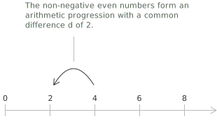
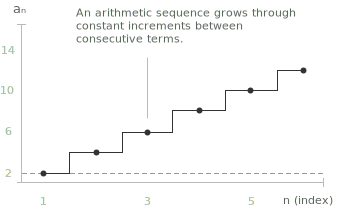

## What is an arithmetic sequence

**Definition 1.** A [sequence](../sequences/) $a_n$ is called an arithmetic sequence (or arithmetic progression) if it consists of numbers arranged in such a way that the difference between any term and the one before it is constant. It is characterized by terms of the form:

 $$a_1, a_2, \dots, a_n \quad \text{with} \quad a_n - a_{n-1} = d$$
 
+ By convention, the first term of an arithmetic progression is typically indexed with $n = 1.$
+ $d$ represents the difference between two consecutive terms in an arithmetic progression, and it is known as the common difference.
+ If $d > 0$, the progression is increasing.  
+ If $d < 0$, the progression is decreasing.  
+ If $d = 0$, the progression is constant.

Consider, for example, the sequence of non-negative even numbers:

$$0, 2, 4, 6, 8, 10, \dots$$

The first term is $a_1 = 0$ and the common difference is $d = 2$. 

Every term is obtained by adding $2$ to the preceding one, so the sequence satisfies the definition of an arithmetic progression.

- - -
An arithmetic sequence can also be defined recursively, by prescribing the first term and the rule that produces each subsequent term from the previous one:

$$
\begin{cases}
a_1 = a \\[0.5em]
a_n = a_{n-1} + d \quad \text{for } n \geq 2
\end{cases}
$$

with $a, d \in \mathbb{R}$. 

An arithmetic progression exhibits a characteristic stepwise pattern, where the height of each step corresponds to the common difference between consecutive terms in the sequence.

- - -
In an arithmetic progression, each term $a_n$ is obtained by adding the first term $a_1$ to the product of the common difference $d$ and $(n - 1)$. This gives the general formula for the $n$-th term:

$$
a_n = a_1 + (n - 1) \cdot d \quad \text{for } n \geq 1
$$

This formula allows you to compute any term in the sequence directly, without listing all the previous ones.

## Example 

Let's define an arithmetic sequence with first term $a_1 = 2$ and common difference $d = 3$. We use the formula:

$$
a_n = a_1 + (n - 1) \cdot d
$$

Plug in the values:

$$
a_n = 2 + (n - 1) \cdot 3
$$

Now calculate the first few terms:

+ $a_1 = 2$
+ $a_2 = 2 + 1 \cdot 3 = 5$
+ $a_3 = 2 + 2 \cdot 3 = 8$
+ $a_4 = 2 + 3 \cdot 3 = 11$
+ $a_5 = 2 + 4 \cdot 3 = 14$
T
he resulting sequence is:  
$$ 2,\ 5,\ 8,\ 11,\ 14,\ \dots $$

## Sum of $n$ terms of an arithmetic progression

The sum $S_n$ of the first $n$ terms $a_1, a_2, \dots, a_n$ of an arithmetic progression is equal to the product of $n$ and the average of the first and last term:

$$
S_n = n \cdot \frac{a_1 + a_n}{2}
$$

This formula allows you to quickly compute the total sum of a finite number of terms in an arithmetic progression. For example, consider the arithmetic progression of non-negative even numbers:  
$$
2,\ 4,\ 6,\ 8,\ 10
$$  

We want to calculate the sum of the first 5 terms $(n = 5).$ Using the formula, we have:  
$$
S_5 = 5 \cdot \frac{2 + 10}{2} = 5 \cdot 6 = 30
$$

> This illustrates the same reasoning behind Gauss's trick: by pairing the first and last terms, you can quickly compute the total sum of an arithmetic progression. The closed form of $S_n$ can also be established via the [principle of mathematical induction](../principle-of-mathematical-induction/), with $n = 1$ as the base case.

## Derivation of the sum formula

The closed-form expression for $S_n$ can be obtained by a symmetry argument that does not require induction. Write the sum twice, the second time in reverse order, and align the two rows term by term:

$$
\begin{aligned}
S_n &= a_1 + a_2 + a_3 + \cdots + a_{n-1} + a_n \\[6pt]
S_n &= a_n + a_{n-1} + a_{n-2} + \cdots + a_2 + a_1
\end{aligned}
$$

Each column contains a pair of terms that, by definition of arithmetic progression, has constant sum $a_1 + a_n$. Indeed, if $a_k = a_1 + (k-1) d$, then:

$$
a_k + a_{n-k+1} = \bigl(a_1 + (k-1)d\bigr) + \bigl(a_1 + (n-k)d\bigr) = 2a_1 + (n-1)d = a_1 + a_n
$$

Summing the two rows column by column gives $2 S_n = n (a_1 + a_n)$, from which the formula:

$$
S_n = n \cdot \frac{a_1 + a_n}{2}
$$

follows directly. Substituting $a_n = a_1 + (n-1)d$ yields the alternative expression:

$$
S_n = \frac{n}{2}\bigl(2 a_1 + (n-1) d\bigr)
$$

which depends only on the first term, the common difference, and the number of terms.

## Connection with linear functions

The general term $a_n = a_1 + (n-1) d$ is a linear function of the index $n$, with slope equal to the common difference $d$ and intercept $a_1 - d$. The graph of the sequence consists of evenly spaced points lying on a straight line, in contrast to the [geometric sequence](../geometric-sequence/), whose terms lie on the graph of an exponential function. This linear nature explains why an arithmetic progression models every quantity that grows or decreases by a fixed amount per unit step, from simple interest at a constant rate to the partial sums of a constant series.

