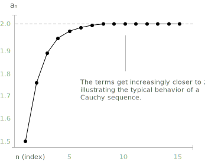

## Definition

A Cauchy sequence is a special type of [sequence](../sequences/) where, as you move further along, the terms get closer and closer to each other. It doesn't matter what the [limit](../limits/) is or even if you know it. What matters is that the difference between the terms becomes smaller and smaller. This idea is important because it helps us understand whether a sequence is behaving in a stable way, even before knowing exactly what it's approaching.

**Definition 1.** Let $\{a_n\}$ be a sequence of real numbers. The sequence is called a Cauchy sequence if for every $\varepsilon > 0$ there exists $\nu \in \mathbb{N}$ such that the following condition holds:

$$
|a_n - a_m| < \varepsilon \quad \forall n, m > \nu
$$

The condition refers only to the mutual distance between terms and does not involve any external limit. In the real line $\mathbb{R}$, a fundamental theorem (treated in detail below) asserts that a sequence is a Cauchy sequence if and only if it is [convergent](../convergent-and-divergent-sequences/). This equivalence is a structural property of $\mathbb{R}$ known as completeness, and it does not hold in every ordered field: in $\mathbb{Q}$, for example, there are Cauchy sequences of rationals whose limit is [irrational](../irrational-numbers/).

> The same criterion applies to [series](../series/) and allows convergence to be established without knowing the exact value of the sum. Instead of computing a limit, one checks whether the terms of the sequence of partial sums get arbitrarily close to one another, a strategy developed on the page about the [Cauchy convergence criterion for series](../cauchy-convergence-criterion-series/).

- - -
A sequence of the form $a_n = \frac{1}{n}$ is a Cauchy sequence, where the values get closer and closer to each other as $n$ increases. When plotted on a graph, it shows:

+ a curve starting from $a_1 = 1$ that decreases rapidly,  
+ points that become increasingly dense near zero,  
+ the distance between any two terms $a_n$ and $a_m$, for large $n$ and $m$, becomes smaller and smaller.

As $n$ increases, the terms become smaller and smaller, approaching zero. This is a classic example of a sequence that converges to 0.

Another example of a Cauchy sequence is given by the sequence defined as:

$$
a_n = 1 + \frac{1}{2} + \frac{1}{4} + \dots + \frac{1}{2^n}
$$

This is the sum of the first $n$ terms of a geometric progression with ratio $\frac{1}{2}$. This sequence is a Cauchy sequence because:

+ The terms get closer and closer to each other.  
+ Each new term adds less and less to the total sum.  
+ The distance between $a_n$ and $a_m$ (for $m > n$) becomes extremely small, since you are only adding values like:
$$\begin{align}\\[0.5em]\dfrac{1}{2^{n+1}}, \dfrac{1}{2^{n+2}}, \dots \end{align}$$

In the limit, this sequence converges to $2$, reinforcing that it is both a Cauchy and convergent sequence.

> In general, a numerical sequence is called a [geometric progression](../sequences/) when the ratio between each term and its previous one is constant

- - -

**Theorem 1.** Every convergent sequence $(x_n)_n$ is a Cauchy sequence.

> A Cauchy allows us to detect convergence based solely on how close the terms get to each other, without needing to know the actual limit. In complete spaces like the real numbers, this internal consistency is enough to ensure the sequence converges.

- - -
In fact, let $(x_n)$ be a convergent sequence in $\mathbb{R}$, and let $L \in \mathbb{R}$ be its limit. By definition of convergence we have:

$$
\forall \varepsilon > 0, \ \exists N \in \mathbb{N} \ \text{such that} \ |x_n - L| < \frac{\varepsilon}{2} \quad \forall  n \geq N
$$

Now, for any $n, m \geq N$, we apply the [triangle inequality](../absolute-value/):

$$
|x_n - x_m| = |x_n - L + L - x_m| \leq |x_n - L| + |x_m - L| < \frac{\varepsilon}{2} + \frac{\varepsilon}{2} = \varepsilon
$$

Thus, we have:

$$
\forall \varepsilon > 0, \ \exists N \in \mathbb{N} \ \text{such that} \ |x_n - x_m| < \varepsilon \quad \forall  n, m \geq N
$$

This is exactly the definition of a Cauchy sequence. Therefore, every convergent sequence is a Cauchy sequence.

- - -

**Theorem 2.** Every Cauchy sequence $(x_n)$ is also a [bounded sequence](../convergent-and-divergent-sequences/). In fact, by definition, if $(x_n)$ is a Cauchy sequence, then:

$$
\forall \varepsilon > 0, \ \exists N \in \mathbb{N} \ \text{such that} \ |x_n - x_m| < \varepsilon \quad \forall n, m \geq N
$$

Let's choose $\varepsilon = 1$. Then there exists $N \in \mathbb{N}$ such that:

$$
|x_n - x_m| < 1 \quad \forall n, m \geq N
$$

Fix $m = N$, so we get:

$$
|x_n - x_N| < 1 \Rightarrow |x_n| \leq |x_N| + 1 \quad \forall n \geq N
$$

Now define:

$$
M_1 := \max\{|x_0|, |x_1|, \dots, |x_{N-1}|\}, \quad M_2 := |x_N| + 1
$$

Let:

$$
M := \max\{M_1, M_2\} \Rightarrow |x_n| \leq M \quad \forall n \in \mathbb{N}
$$

Therefore, the sequence $(x_n)$ stays entirely within a finite interval and is thus bounded.

## Completeness of the real line

The two theorems above show that every convergent sequence is a Cauchy sequence and that every Cauchy sequence is bounded. The converse of the first statement, namely that every Cauchy sequence in $\mathbb{R}$ converges, is a deeper result and is one of the equivalent formulations of the completeness of the real line.

Theorem. Let $(x_n)$ be a Cauchy sequence in $\mathbb{R}$. Then $(x_n)$ converges to a real limit.

The proof combines the boundedness established above with the Bolzano-Weierstrass property, which asserts that every bounded sequence of real numbers admits a convergent subsequence. Let $(x_{n_k})$ be such a subsequence, with $x_{n_k} \to L \in \mathbb{R}$. 

Given $\varepsilon > 0$, the Cauchy condition yields an index $\nu$ such that $|x_n - x_m| < \varepsilon/2$ for every $n, m \geq \nu$, and the convergence of the subsequence yields an index $K$ such that $|x_{n_k} - L| < \varepsilon/2$ for every $k \geq K$. 

Choosing a sufficiently large $k$ with $n_k \geq \nu$, the triangle inequality gives:

$$
|x_n - L| \leq |x_n - x_{n_k}| + |x_{n_k} - L| < \frac{\varepsilon}{2} + \frac{\varepsilon}{2} = \varepsilon
$$

for every $n \geq \nu$, which is precisely the definition of convergence to $L$.

> The same statement fails in the field of [rational numbers](../rational-numbers/) $\mathbb{Q}$. The sequence of decimal approximations of $\sqrt{2}$, namely $1, 1.4, 1.41, 1.414, \dots$, is a Cauchy sequence in $\mathbb{Q}$ but does not converge in $\mathbb{Q}$, because its limit is [irrational](../irrational-numbers/). The completion of $\mathbb{Q}$ with respect to Cauchy sequences is one of the classical constructions of the [real numbers](../real-numbers/).

## Why Cauchy sequences matter

The Cauchy condition provides a criterion for convergence that does not refer to any candidate limit. This intrinsic character is useful in two settings. 

First, when one wants to prove that a sequence converges without computing its limit, it is often easier to estimate $|x_n - x_m|$ than $|x_n - L|$. 

Second, the notion of Cauchy sequence extends without modification to abstract metric spaces, where it provides the natural generalisation of convergence in $\mathbb{R}$. 

A metric space in which every Cauchy sequence converges is called complete, and completeness is the structural property that makes $\mathbb{R}$ suitable as the foundation for analysis.
