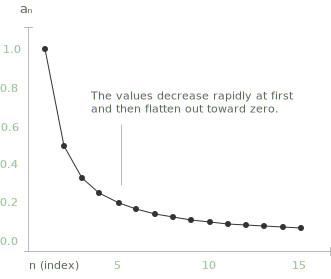
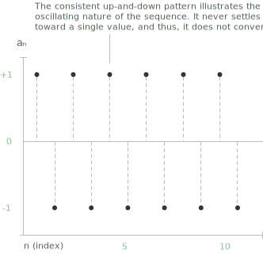
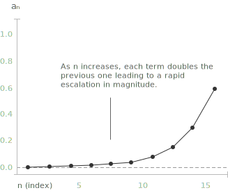

## Convergent sequence

[Sequences](../sequences/) are ordered collections of elements, each assigned to a specific position indexed by a [natural number](../types-of-numbers/). For every sequence $(a_n)_{n \in \mathbb{N}}$, there is an associated behavior of its terms $a_n$ that describes how they evolve as the index $n$ increases. 

Analyzing this behavior helps determine whether the sequence converges to a finite [limit](../limits/), diverges to infinity, or exhibits an oscillating pattern.

**Definition 1.** A sequence $(a_n)_{n \in \mathbb{N}}$ is said to be convergent to the limit $\ell \in \mathbb{R}$ if for every $\varepsilon > 0$, there exists $n_0 \in \mathbb{N}$ such that:

$$
|a_n - \ell| < \varepsilon \quad \text{for all } n \geq n_0.
$$

In this case, we write:

$$
\lim_{n \to +\infty} a_n = \ell
\quad \text{or} \quad
a_n \to \ell \quad \text{as } n \to +\infty.
$$

In other words, this means that the terms of the sequence get increasingly close to the number $\ell$ as $n$ grows larger. No matter how tight a margin $\varepsilon$, from a certain index onward all terms will stay within that distance from $\ell$. For example, consider the following sequence:
$$ a_n = \left( \frac{1}{n} \right)_{n \geq 1} = \left(1, \frac{1}{2}, \frac{1}{3}, \ldots \right) $$

As $n$ increases, the terms become smaller and smaller, approaching zero. 

This is a classic example of a sequence that converges to 0. A sequence is said to be infinitesimal when its terms get arbitrarily close to zero as the index grows and:
  
$$
\lim_{n \to +\infty} a_n = 0.
$$  

The limit of a sequence $(a_n)_{n \in \mathbb{N}}$, if it exists, is unique. Suppose, by contradiction, that the sequence converges both to $\ell_1$ and to $\ell_2$ with $\ell_1 \neq \ell_2$. 

Choosing $\varepsilon = |\ell_1 - \ell_2|/2 > 0$, the convergence to $\ell_1$ gives an index $n_1$ such that $|a_n - \ell_1| < \varepsilon$ for $n \geq n_1$, and the convergence to $\ell_2$ gives an index $n_2$ with $|a_n - \ell_2| < \varepsilon$ for $n \geq n_2$. 

For $n \geq \max\{n_1, n_2\}$ the [triangle inequality](../absolute-value/) yields a contradiction:

$$|\ell_1 - \ell_2| \leq |\ell_1 - a_n| + |a_n - \ell_2| < 2\varepsilon = |\ell_1 - \ell_2|$$

So, he two candidate limits must therefore coincide.

## Example

Let's consider the sequence defined by:

$$
a_n = \frac{n}{n + 2}
$$

We aim to demonstrate that this sequence converges to 1 as $n \to +\infty$, using the formal definition of convergence.

To prove this, we must show that for every $\varepsilon > 0$, there exists a natural number $n_0$ such that for all $n \geq n_0$:

$$
\left| \frac{n}{n + 2} - 1 \right| < \varepsilon
$$

Let's simplify the absolute value expression:

$$
\left| \frac{n}{n + 2} - 1 \right| = \left| \frac{-2}{n + 2} \right| = \frac{2}{n + 2}.
$$

Now, we want:

$$
\frac{2}{n + 2} < \varepsilon
$$

Solving the inequality:

$$
n + 2 > \frac{2}{\varepsilon} \quad \Rightarrow \quad n > \frac{2}{\varepsilon} - 2
$$

So we can define:

$$
n_0 = \left\lceil \frac{2}{\varepsilon} - 2 \right\rceil
$$

From this point onward, every term of the sequence stays within a distance $\varepsilon$ of the limit $1.$ Hence, by definition:

$$
\lim_{n \to +\infty} \frac{n}{n + 2} = 1.
$$

## Divergent sequence

A sequence $(a_n)_{n \in \mathbb{N}}$ is said to be divergent if it does not converge to a finite limit. This can happen in the following ways.

A sequence diverges to $+\infty$ if, for every $M > 0$, there exists an index $n_0 \in \mathbb{N}$ such that  
  $$
  a_n > M \quad \forall \ n \geq n_0
  $$
  In this case, we write:
  $$
  \lim_{n \to +\infty} a_n = +\infty \quad \text{or} \quad a_n \to +\infty \text{ as } n \to +\infty
  $$

- - -
A sequence diverges to $-\infty$ if, for every $M < 0$, there exists an index $n_0 \in \mathbb{N}$ such that  
  $$
  a_n < M \quad \forall \ n \geq n_0
  $$
  In this case, we write:
  $$
  \lim_{n \to +\infty} a_n = -\infty \quad \text{or} \quad a_n \to -\infty \text{ as } n \to +\infty
  $$
## Bounded sequence

A bounded sequence is a sequence of numbers whose terms always stay within a fixed, finite [interval](../intervals/), no matter how large the index becomes. In formal terms, let $\{a_n\}$ be a sequence. We say that the sequence is bounded if there exists a constant $M > 0$ such that:

$$
|a_n| \leq M \quad \forall n \in \mathbb{N}
$$

We say that a sequence $\{a_n\}$ is bounded above if there exists a constant $M \in \mathbb{R}$ such that:

$$
a_n \leq M \quad \forall n \in \mathbb{N}
$$

We say that the sequence is bounded below if there exists a constant $M \in \mathbb{R}$ such that:

$$
a_n \geq M \quad \forall n \in \mathbb{N}
$$

## Oscillating sequence

Oscillating sequences are a special type of bounded sequence. Let us consider the sequence:

$$
(a_n)_{n \in \mathbb{N}} = ((-1)^n)_{n \in \mathbb{N}} = (+1, -1, +1, -1, +1, -1, \dots)
$$

As the index $n$ increases, the terms of the sequence alternate consistently between $+1$ and $-1$. 

This type of sequence does not approach any finite value and is called an oscillating sequence. It does not converge to a finite limit, nor does it diverge to $+\infty$ or $-\infty$, and its terms continue to fluctuate between different values. The extremal values around which the terms cluster for arbitrarily large indices are captured precisely by the [superior and inferior limits](../superior-and-inferior-limits-of-a-sequence/) of the sequence.

## Geometric sequence

Let us consider an example of a sequence, called a [geometric sequence](../geometric-sequence/), which can display different behaviors depending on the fixed real number $q$. In general, a numerical sequence is called a geometric progression when the ratio between each term and its previous one is constant. More precisely, a geometric sequence is defined as follows:

$$
a_n := q^n
$$

The behavior of the sequence depends entirely on the value of $q$:

+ It diverges to $+\infty$ if $q > 1$, since the powers $q^n$ grow without bound.
+ It is constant and equal to $1$ if $q = 1$, since $a_n = 1^n = 1$ for every $n$.
+ It is infinitesimal if $|q| < 1$, that is, for $-1 < q < 1$ with $q \neq 0$: the terms approach zero, alternating in sign when $q$ is negative.
+ It is a bounded oscillating sequence if $q = -1$, since $a_n$ alternates between $+1$ and $-1$ and admits no limit.
+ It diverges in an oscillatory manner if $q < -1$: the absolute values grow without bound and the sign alternates, so the sequence is unbounded and admits no limit.

As shown in the graph, when $q = 2$, the values of the geometric sequence $a_n = q^n$ grow [exponentially](../exponential-function/). As $n$ increases, each term doubles the previous one, leading to a rapid escalation in magnitude.

> Take a closer look at the difference between an [arithmetic progression](../arithmetic-sequence/) and a geometric progression to better understand how their structures and growth patterns differ.

## Algebra of limits

The [limit](../limits/) of a sequence interacts in a predictable way with the elementary operations of arithmetic. Let $(a_n)$ and $(b_n)$ be two convergent sequences, with $a_n \to \ell$ and $b_n \to m$. The following identities hold:

+ Sum: $\lim_{n \to \infty} (a_n + b_n) = \ell + m$.
+ Difference: $\lim_{n \to \infty} (a_n - b_n) = \ell - m$.
+ Product: $\lim_{n \to \infty} (a_n \cdot b_n) = \ell \cdot m$.
+ Quotient: $\lim_{n \to \infty} \dfrac{a_n}{b_n} = \dfrac{\ell}{m}$, provided $m \neq 0$ and $b_n \neq 0$ from some index onward.
+ Constant multiple: $\lim_{n \to \infty} (c \cdot a_n) = c \cdot \ell$ for every $c \in \mathbb{R}$.
+ Absolute value: $\lim_{n \to \infty} |a_n| = |\ell|$.

These rules follow directly from the $\varepsilon$-definition of convergence and the triangle inequality. The identity for the sum, for instance, is obtained by splitting $\varepsilon$ into two equal parts: choose indices $n_1, n_2$ such that $|a_n - \ell| < \varepsilon/2$ for $n \geq n_1$ and $|b_n - m| < \varepsilon/2$ for $n \geq n_2$. 

Then for $n \geq \max\{n_1, n_2\}$ the triangle inequality gives:

$$
|(a_n + b_n) - (\ell + m)| \leq |a_n - \ell| + |b_n - m| < \varepsilon
$$

The other identities admit analogous proofs.

> When at least one of the two limits is infinite, the rules above remain valid in extended form whenever the result is unambiguous: for instance, $\ell + \infty = +\infty$ for every finite $\ell$. The configurations that produce no canonical value, such as $\infty - \infty$ or $0 \cdot \infty$, are known as [indeterminate forms](../indeterminate-forms/) and require additional analysis.

## The squeeze theorem

When a sequence is trapped between two others sequences that both converge to the same limit, then it also converges to that limit. This is the [squeeze theorem](h../squeeze-theorem/).

**Theorem 1.** Let $(a_n)$, $(b_n)$, $(c_n)$ be three sequences such that $a_n \leq b_n \leq c_n$ for every $n$ sufficiently large. If $\lim_{n \to \infty} a_n = \lim_{n \to \infty} c_n = \ell$, then $\lim_{n \to \infty} b_n = \ell$.

The proof is direct. Fix $\varepsilon > 0$. By convergence of $a_n$ and $c_n$ to $\ell$, there exists an index $n_0$ such that for every $n \geq n_0$ both $\ell - \varepsilon < a_n$ and $c_n < \ell + \varepsilon$ hold. The chain $\ell - \varepsilon < a_n \leq b_n \leq c_n < \ell + \varepsilon$ then yields $|b_n - \ell| < \varepsilon$, which is the definition of convergence.

The squeeze theorem is particularly useful when a sequence is too complicated to be handled directly, but admits clear upper and lower bounds. The sequence $b_n = \sin(n)/n$, for example, is squeezed between $-1/n$ and $1/n$, both of which tend to zero; the theorem gives $\lim b_n = 0$ at once.

## Sign permanence

If a sequence converges to a strictly positive limit, then its terms are eventually positive as well. More precisely, if $a_n \to \ell$ with $\ell > 0$, then there exists $n_0 \in \mathbb{N}$ such that $a_n > 0$ for every $n \geq n_0$. The symmetric statement for $\ell < 0$ also holds: the terms are eventually negative.

To see this, choose $\varepsilon = \ell/2 > 0$ in the definition of convergence. There exists $n_0$ such that $|a_n - \ell| < \ell/2$ for every $n \geq n_0$, which rearranges to $\ell/2 < a_n < 3\ell/2$. In particular $a_n > \ell/2 > 0$, as claimed.

> The hypothesis that the limit is strictly positive cannot be weakened to $\ell \geq 0$: the sequence $a_n = -1/n$ converges to $0$ but every term is negative. Sign permanence is a strict property of strictly positive (or strictly negative) limits.

## Subsequences and the Bolzano-Weierstrass theorem

A subsequence of $(a_n)$ is obtained by selecting an increasing collection of indices $n_1 < n_2 < n_3 < \cdots$ and considering the new sequence $(a_{n_k})_{k \in \mathbb{N}}$. Subsequences inherit the convergence of the parent sequence: if $a_n \to \ell$, then every subsequence also converges to $\ell$. This observation provides a frequently used criterion for non-convergence: if two subsequences of $(a_n)$ converge to different limits, then $(a_n)$ does not converge. The [superior and inferior limits](../superior-and-inferior-limits-of-a-sequence/) give a systematic account of this phenomenon, identifying the largest and smallest values that can be obtained as subsequential limits.

The converse question, whether a sequence that fails to converge nevertheless admits a convergent subsequence, is answered by the Bolzano-Weierstrass theorem.

**Theorem 2.** Every bounded sequence of real numbers admits a convergent subsequence.

The result is a structural property of the real line and follows from completeness. It plays a central role in the theory of [Cauchy sequences](../cauchy-sequence/), where it is used to upgrade boundedness into convergence, and in the proof of [Weierstrass' theorem](../weierstrass-theorem/) on the attainment of extrema by continuous functions on a compact interval.
