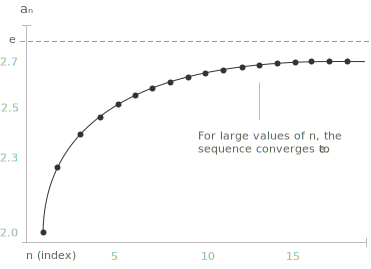

## How a sequence reveals $e$

Euler's number, denoted by $e$, is one of the most important constants in mathematics. There are several equivalent ways to introduce it: through infinite [series](../series/), through the natural [exponential function](../exponential-functions/), or through the limit of a [sequence](../sequences/). This page focuses on the latter approach.

We consider the sequence $\{a_n\}$ with $n \in \mathbb{N}$ defined by the following expression:

$$
a_n = \left(1 + \frac{1}{n}\right)^n
$$

As shown in the sections below, this sequence is strictly increasing and bounded above. By the monotone convergence theorem, it therefore converges to a finite limit. That [limit](../limits/) is taken as the definition of Euler's number, and we write:

$$
e := \lim_{n \to \infty} \left(1 + \frac{1}{n}\right)^n
$$

The symbol $:=$ indicates that this is a definition: the number $e$ is introduced
as the value to which the sequence converges. Its decimal expansion begins as
$e \approx 2.71828$, and $e$ can be shown to be both irrational and transcendental.

Irrationality means that $e$ cannot be expressed as a ratio of two [integers](../integers/). Transcendence is a stronger property: it means that $e$ is not the root of any non-zero [polynomial equation](../polynomial-equations/) with rational coefficients.

The graph below illustrates how the terms of the sequence behave as $n$ grows. The values increase rapidly for small $n$, then rise more slowly, approaching $e$ from below without ever reaching it.

> Each term $a_n$ is strictly less than $e$, and the gap closes as $n$ grows, though the rate of convergence is slow enough that even large values of $n$ yield only a rough approximation of the limit.

The following table of values illustrates how the sequence behaves for increasing indices.
$$
\begin{align}
n = 1:& \quad a_1 = \left(1 + \frac{1}{1}\right)^1 = 2 \\[6pt]
n = 10:& \quad a_{10} = \left(1 + \frac{1}{10}\right)^{10} \approx 2.59374 \\[6pt]
n = 100:& \quad a_{100} = \left(1 + \frac{1}{100}\right)^{100} \approx 2.70481 \\[6pt]
n = 1000:& \quad a_{1000} = \left(1 + \frac{1}{1000}\right)^{1000} \approx 2.71692
\end{align}
$$
The terms increase steadily and approach $e \approx 2.71828$ from below, with each successive value capturing more decimal places of the limit. The convergence is monotone but slow: even at $n = 1000$, the approximation agrees with $e$ only to the second decimal place.

## Demonstrating the monotonicity of the sequence

To prove that the sequence $\{a_n\}$ is strictly increasing, we expand each term using the [Binomial Theorem](../binomial-theorem/). Applied to the expression $\left(1 + \frac{1}{n}\right)^n$, the expansion gives the following:

$$
a_n = \sum_{k=0}^{n} \binom{n}{k} \frac{1}{n^k}
= \sum_{k=0}^{n} \frac{1}{k!} \cdot \frac{n(n-1)\cdots(n-k+1)}{n^k}
$$

Each factor of the form: 

$$\frac{n(n-1)\cdots(n-k+1)}{n^k}$$ 

can be written as a product of $k$ terms of the type $\left(1 - \frac{j}{n}\right)$, for $j = 0, 1, \ldots, k-1$. The expansion therefore takes the form:

$$
a_n = \sum_{k=0}^{n} \frac{1}{k!} \prod_{j=0}^{k-1} \left(1 - \frac{j}{n}\right)
$$

Now consider the analogous expression for $a_{n+1}$, obtained by replacing $n$ with $n+1$ throughout. Two things happen: the upper limit of the sum increases by one, adding a new positive term, and each existing factor $\left(1 - \frac{j}{n}\right)$ is replaced by $\left(1 - \frac{j}{n+1}\right)$, which is strictly larger since the subtracted quantity decreases. 

Every term in the sum for $a_{n+1}$ is therefore strictly greater than the corresponding term in the sum for $a_n$, and the sum itself contains one additional positive term. It follows that $a_{n+1} > a_n$ for all $n \in \mathbb{N}$, so the sequence is strictly increasing.

## Demonstrating the boundedness of the sequence

It remains to show that the sequence is bounded. Since $a_1 = 2$ and the sequence is strictly increasing, we have $a_n > 2$ for all $n \geq 1$. It therefore suffices to establish an upper bound. We claim that $a_n < 3$ for all $n \in \mathbb{N}$. 

Starting from the expansion derived in the previous section, and observing that each factor $\left(1 - \frac{j}{n}\right)$ is at most $1$, we obtain the following estimate:

$$
a_n = \sum_{k=0}^{n} \frac{1}{k!} \prod_{j=0}^{k-1} \left(1 - \frac{j}{n}\right) < \sum_{k=0}^{n} \frac{1}{k!}
$$

To bound this sum from above, we use the inequality $k! \geq 2^{k-1}$, which holds for all $k \geq 1$ and follows from the fact that each of the $k-1$ factors in $2 \cdot 3 \cdots k$ is at least $2$. This gives:

$$
\sum_{k=0}^{n} \frac{1}{k!} \leq 1 + \sum_{k=1}^{n} \frac{1}{2^{k-1}} = 1 + \sum_{k=0}^{n-1} \frac{1}{2^k}
$$

The sum on the right is a partial sum of a [geometric series](../geometric-series/) with ratio $\frac{1}{2}$. Its value is:

$$
\sum_{k=0}^{n-1} \frac{1}{2^k} = 2\left(1 - \frac{1}{2^n}\right) < 2
$$

Combining these estimates, we conclude that $a_n < 1 + 2 = 3$ for all $n \in \mathbb{N}$. Together with the lower bound $a_n > 2$, this confirms that the sequence is bounded.

## Connection with the series definition of $e$

The proof of boundedness reveals something more than a mere upper estimate. The quantity:

$$\sum_{k=0}^{n} \frac{1}{k!}$$ 

that appears as an upper bound for $a_n$ is itself a partial sum of the series:

$$
\sum_{k=0}^{\infty} \frac{1}{k!} = 1 + 1 + \frac{1}{2!} + \frac{1}{3!} + \cdots
$$

This series converges, and its sum is exactly $e$. In fact, the following identity shows that the two definitions are equivalent:

$$
e = \lim_{n \to \infty} \left(1 + \frac{1}{n}\right)^n = \sum_{k=0}^{\infty} \frac{1}{k!}
$$

The series representation, which arises from the Taylor expansion of the exponential function, converges considerably faster than the sequence $\{a_n\}$ and provides a more efficient route to computing decimal approximations of $e$.
