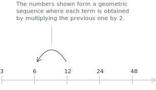
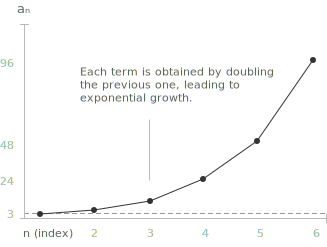
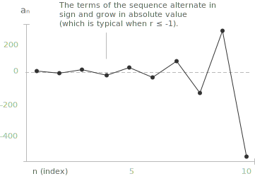

	
## Definition

**Definition 1.** A [sequence](../sequences/) $a_n$ is called a geometric sequence (or geometric progression) if it consists of numbers arranged in such a way that the ratio between any term and the one before it is constant. It is characterized by terms of the form:

$$
a_1, a_2, \ldots, a_n \quad \text{with} \quad \frac{a_n}{a_{n-1}} = r
$$

+ By convention, the first term of a geometric progression is typically indexed with $n = 1$.
+ $r$ represents the ratio between two consecutive terms in a geometric progression, and it is known as the common ratio.
+ If $r > 1$, the progression is increasing ([exponentially](../exponential-function/)).
+ If $0 < r < 1$, the progression is decreasing toward zero.
+ If $r = 1$, the progression is constant.
+ If $r < 0$, the progression alternates in sign.

Let us consider, for example, the sequence with general term:

$$a_n = 3 \cdot 2^{n-1}$$

This sequence is a geometric progression starting at 3, where each term is obtained by multiplying the previous one by $r = 2$.

- - -
A geometric progression can also be defined recursively, meaning that each term is determined from the previous one. The recursive definition is given by:

$$
\begin{cases}
a_1 = a \\[0.5em]
a_n = a_{n-1} \cdot r \quad \text{for } n \geq 2
\end{cases}
$$

+ $a \in \mathbb{R}$ is the first term,
+ $r \in \mathbb{R}$ is the common ratio,
+ $a_n$ is the general term of the sequence.

A geometric progression exhibits a characteristic exponential growth pattern, where the ratio between consecutive terms remains constant, leading to rapid increases (or decreases) in magnitude.

> An [arithmetic progression](../arithmetic-sequence/), instead, exhibits a characteristic linear growth pattern, where the difference between consecutive terms remains constant, resulting in a steady increase (or decrease) over time.

- - -
In a geometric progression, each term $a_n$ is obtained by multiplying the first term $a_1$ by the common ratio $r$ raised to the power $(n - 1)$. This gives the general formula for the $n$-th term:

$$
a_n = a_1 \cdot r^{n - 1} \quad \text{for } n \geq 1
$$

This formula allows you to compute any term in the sequence directly, without knowing or listing all the previous ones.

The key difference between the explicit form and the recursive form of a sequence lies in how each term is defined:

+ In the explicit form, each term $a_n$ is directly defined as a function of $n$.  
  You can compute any term independently, without needing the previous ones.

+ In the recursive form, each term $a_n$ is defined based on one or more previous terms in the sequence. To compute a given term, you must first know the preceding ones.

## Example
Let us define a geometric sequence with first term $a_1 = 2$ and common ratio $r = 3$. We use the formula:

$$
a_n = a_1 \cdot r^{n - 1}
$$

Plug in the values:

$$
a_n = 2 \cdot 3^{n - 1}
$$

Now calculate the first few terms:

+ $a_1 = 2$
+ $a_2 = 2 \cdot 3^1 = 6$
+ $a_3 = 2 \cdot 3^2 = 18$
+ $a_4 = 2 \cdot 3^3 = 54$
+ $a_5 = 2 \cdot 3^4 = 162$
The resulting sequence is:
$$
2,\ 6,\ 18,\ 54,\ 162,\ \dots
$$

## Sum of $n$ terms of a geometric progression

The sum $S_n$ of the first $n$ terms $a_1, a_2, \dots, a_n$ of a geometric progression with common ratio $r \neq 1$ is given by the formula:

$$
S_n = a_1 \cdot \frac{1 - r^n}{1 - r}
$$

The closed form follows from a short algebraic argument that exploits the multiplicative structure of the sequence. Write the sum and the sum multiplied by $r$:

$$
\begin{aligned}
S_n   &= a_1 + a_1 r + a_1 r^2 + \cdots + a_1 r^{n-1} \\[6pt]
r S_n &= a_1 r + a_1 r^2 + a_1 r^3 + \cdots + a_1 r^n
\end{aligned}
$$

Subtracting the second equation from the first eliminates every term except the first and the last:

$$
S_n - r S_n = a_1 - a_1 r^n = a_1 (1 - r^n)
$$

Factoring $S_n$ on the left-hand side gives $S_n (1 - r) = a_1 (1 - r^n)$, and dividing by $1 - r$ produces the closed form. When $r = 1$ the formula is not applicable, but the sequence is constant and the sum is simply $S_n = n \, a_1$. The same identity can be established by [induction](../principle-of-mathematical-induction/) on $n$, and the limit $n \to \infty$ of $S_n$ for $|r| < 1$ leads to the [geometric series](../geometric-series/) with sum $a_1 / (1 - r)$.

This formula allows you to quickly compute the total sum of a finite number of terms in a geometric progression. For example, consider the geometric progression:

$$
2,\ 4,\ 8,\ 16,\ 32
$$

We want to calculate the sum of the first 5 terms ($n = 5$). Using the formula, we have:

$$
S_5 = 2 \cdot \frac{1 - 2^5}{1 - 2} = 2 \cdot \frac{1 - 32}{-1} = 2 \cdot 31 = 62
$$

## Limit behavior of a geometric sequence

Regarding the [limit](../convergent-and-divergent-sequences/) of a geometric sequence $a_n = a_1 \cdot r^{n-1}$, the behavior depends entirely on the common ratio $r$:

+ It diverges to $+\infty$ if $r > 1$ and $a_1 > 0$, and to $-\infty$ if $r > 1$ and $a_1 < 0$.
+ It is constant and equal to $a_1$ if $r = 1$.
+ It is infinitesimal if $|r| < 1$, that is for $-1 < r < 1$: the terms approach zero, alternating in sign when $r$ is negative.
+ It is a bounded oscillating sequence if $r = -1$: the terms alternate between $a_1$ and $-a_1$ and the sequence admits no limit.
+ It diverges in an oscillatory manner if $r < -1$: the absolute values grow without bound while the sign alternates, so the sequence is unbounded and admits no limit.

The previously shown progression:

$$
a_n = 2 \cdot 3^{n - 1}
$$

diverges because the common ratio between its terms is $r = 3$, which satisfies $r > 1$. As a result, the terms grow exponentially and tend to $+\infty$ as $n$ increases.

Let us consider, for example, the geometric progression shown in the figure:

$$
a_n = (-2)^{n - 1}
$$

Expanding the sequence, we observe that the common ratio is $r = -2$, which satisfies $r < -1$. 

As a result, the sequence displays an unbounded oscillatory behavior, alternating the sign of each term while the absolute values grow exponentially.
