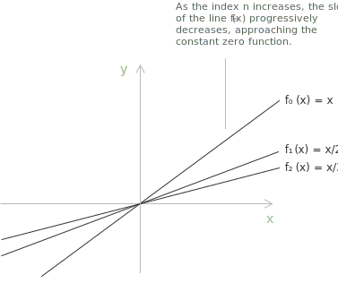

## Introduction

Imagine you have a list of different [functions](../functions/), where each function in the list is linked to a number $n = 1, 2, 3… \in \mathbb{N}$. So, for each $n$, you get a different function, and that ordered list of functions is essentially what a [sequence](../sequences/) of functions is. 

**Definition 1.** Let $A \subseteq \mathbb{R}$ be a non-empty subset and suppose that for each $n \in \mathbb{N}$ we have a function $f_n: A \rightarrow \mathbb{R}$. We then say that $(f_n) = (f_1, f_2, f_3, \dots)$ is a sequence of functions on $A.$

Let's consider a simple practical example. Let $(f_n)$ be a sequence of functions, with $n \in \mathbb{N}_0$ and $x \in \mathbb{R}$, defined by:

$$
f_n(x) = \frac{x}{n+1}
$$

This is a family of functions where each function is linear, and the slope decreases as $n$ increases. For $n = 0, 1, 2, 3, ...$, we have:

$$
\begin{aligned}
f_0(x) &= \frac{x}{0+1} = x \\[0.5em]
f_1(x) &= \frac{x}{1+1} = \frac{x}{2} \\[0.5em]
f_2(x) &= \frac{x}{2+1} = \frac{x}{3} \\[0.5em]
f_3(x) &= \frac{x}{3+1} = \frac{x}{4} \\[0.5em]
\vdots
\end{aligned}
$$

Thus, the sequence of functions is:

$$
(f_n) = \left( x, \frac{x}{2}, \frac{x}{3}, \frac{x}{4}, \dots \right)
$$

Graphically, this situation can be observed as follows:

The graph shows how, as the index $n$ increases, the slope of the line $f_n(x)$ progressively decreases. This reflects the fact that the function flattens toward the zero function $f(x) = 0$ for every $x$. In other words, the sequence of functions $f_n(x)$ converges pointwise to the zero function as $n$ approaches infinity.

## Pointwise convergence

**Definition 2.** Let $\lbrace f_n(x) \rbrace$ be a sequence of functions defined on a common [domain](../determining-the-domain-of-a-function/) $A \subseteq \mathbb{R}$, with $n \in \mathbb{N}$. We say that the sequence $\lbrace f_n(x) \rbrace$ converges pointwise on a set $C \subseteq A$ if, for every $x \in C$, the numerical sequence $\lbrace f_n(x) \rbrace$ converges. In this case, the [limit](../limits/) function $f(x)$ is defined as:

$$
f(x) = \lim_{n \to +\infty} f_n(x) \quad \forall  x \in C
$$

The set $C$ is called the pointwise convergence set of the sequence $\{f_n(x)\}$.

Pointwise convergence can also be expressed as follows. Let $(f_n)$ be a sequence of functions defined on a set $A$. Then $(f_n)$ converges pointwise to $f : A \to \mathbb{R}$ if and only if $\forall  x \in A$ and  $\forall \varepsilon > 0$ exists $K \in \mathbb{N}$ such that:

$$|f_n(x) - f(x)| < \varepsilon \quad \forall  n \geq K$$

> In other words, for each fixed point $x$, we can make $f_n(x)$ as close as we like to $f(x)$ by choosing $n$ large enough. The index $K$ required to achieve the desired accuracy may vary depending on $x$ and $\varepsilon$.

- - -
Let us consider the sequence of functions as previously discussed:

$$
f_n(x) = \frac{x}{n+1}, \quad x \in \mathbb{R}, \quad n \in \mathbb{N}_0
$$

Let us examine what happens for each $x$ as $n \to \infty$. If we fix a generic $x$, for example $x = 2$, the associated sequence is:

$$
\begin{aligned}
f_0(2) &= 2 \\[0.5em]
f_1(2) &= 1 \\[0.5em]
f_2(2) &= \frac{2}{3} \\[0.5em]
f_3(2) &= \frac{2}{4} \\[0.5em]
&\vdots
\end{aligned}
$$

This sequence of numbers tends to zero as $n \to \infty$. In general, for every $x \in \mathbb{R}$:

$$
\lim_{n \to \infty} f_n(x) = \lim_{n \to \infty} \frac{x}{n+1} = 0
$$

Therefore, the limit function is:

$$
f(x) = 0 \quad \forall  x \in \mathbb{R}
$$

By the uniqueness of limits of sequences of real numbers, the pointwise limit of a sequence of functions $(f_n)$ is unique.

## Example

Let's study the behavior of the following sequence of functions in the interval $-1 < x < 1$:

$$
f_n(x) = x^n
$$

For a fixed value of $x$ in this interval, we know that the [absolute value](../absolute-value/) of $x$ is less than $1$, that is, $|x| < 1$. This means we are considering [powers](../powers/) of a number smaller than $1$ in absolute value. By properties of [exponents](../exponential-function/), when the base has an absolute value less than $1$, the sequence $x^n$ tends to zero as $n$ tends to infinity:

$$
\lim_{n \to \infty} x^n = 0
$$

The sequence of powers of a real number $x$ with $|x| < 1$ converges to zero.

Therefore, for every $x$ in the interval $-1 < x < 1$, the sequence of functions $f_n(x) = x^n$ converges pointwise to the zero function.

$$
f(x) = 0 \quad \forall  x \in (-1,1)
$$

## Consequences of pointwise convergence

**Definition 3.** Let $\{f_n\}$ be a sequence of functions $f_n : A \to \mathbb{R}$ that converges pointwise to a function $f : A \to \mathbb{R}$. The following properties hold:

+ If each $f_n(x) \geq 0$ for all $x \in A$, then $f(x) \geq 0$ for all $x \in A$. In practice, if each function $f_n(x)$ is non-negative on $A$, then the limit function $f(x)$ will also be non-negative on $A$. This reflects the fact that the limit of a sequence of non-negative real numbers cannot be negative.

+ If each $f_n$ is non-decreasing on $A$, then $f$ is non-decreasing on $A$. Consequently, if each function $f_n$ is non-decreasing on $A$, then the limit function $f$ will also be non-decreasing on $A$. In other words, the property of monotonicity is preserved under pointwise convergence.

## Uniform convergence

Let $(f_n)$ be a sequence of functions defined on a set $A \subseteq \mathbb{R}$. We say that $(f_n)$ converges uniformly on $A$ to the function $f : A \to \mathbb{R}$ if, for any $\varepsilon > 0$, there exists a [natural number](../natural-numbers/) $K$ such that, for all $n \geq K$ and all $x \in A$, the following inequality holds:

$$
|f_n(x) - f(x)| < \varepsilon
$$

If $(f_n)$ converges uniformly to $f$, then $(f_n)$ also converges pointwise to $f.$

- - -
Let us consider the sequence of functions:

$$
f_n(x) = \frac{x}{n}, \quad x \in [0,1], \quad n \in \mathbb{N}.
$$

For each fixed $x$ in the interval $[0,1]$, we have:

$$
\lim_{n \to \infty} f_n(x) = 0
$$

This means that the sequence $f_n(x)$ converges pointwise to the function $f(x) = 0$. Let us now check whether the convergence is uniform on $[0,1]$. We compute the difference between $f_n(x)$ and the limit function $f(x)$:

$$
|f_n(x) - f(x)| = \left| \frac{x}{n} - 0 \right| = \frac{x}{n}
$$

The maximum value of this difference on the interval $[0,1]$ is:

$$
\sup_{x \in [0,1]} |f_n(x) - f(x)| = \frac{1}{n}
$$

Given any $\varepsilon > 0$, we can choose $N$ such that:

$$
\frac{1}{N} < \varepsilon
$$

Therefore, for all $n \geq N$ and for all $x \in [0,1]$, we have:

$$
|f_n(x) - f(x)| < \varepsilon
$$

This confirms that the sequence of functions $f_n(x) = \frac{x}{n}$ converges uniformly to the limit function $f(x) = 0$ on the interval $[0,1]$.

## Pointwise convergence is not enough

Pointwise and uniform convergence behave very differently with respect to the analytical properties of the limit. The standard example that shows the gap is the sequence:

$$
f_n(x) = x^n \qquad x \in [0, 1]
$$

Each function $f_n$ is [continuous](../continuous-functions/) on $[0, 1]$, and the pointwise limit is:

$$
f(x) = \lim_{n \to \infty} x^n =
\begin{cases}
0 & \text{if } 0 \leq x < 1 \\[6pt]
1 & \text{if } x = 1
\end{cases}
$$

The limit function jumps at $x = 1$ and is therefore discontinuous, even though every member of the sequence is continuous. The convergence is not uniform on $[0, 1]$: the difference $|f_n(x) - f(x)| = x^n$ approaches $1$ as $x \to 1^-$, so the supremum of the difference over $[0, 1]$ equals $1$ for every $n$ and does not tend to zero.

The discrepancy explains the importance of uniform convergence in analysis: pointwise convergence preserves very little, while uniform convergence preserves a number of structural properties that one would like the limit function to inherit from the members of the sequence.

## Properties preserved by uniform convergence

Uniform convergence is the natural mode under which several classical properties of functions transfer to the limit. The following theorems summarise the three most important transfer results.

**Theorem 1.** Let $(f_n)$ be a sequence of functions defined on a set $A \subseteq \mathbb{R}$, each continuous at a point $x_0 \in A$. If $f_n \to f$ uniformly on $A$, then the limit function $f$ is continuous at $x_0$. In particular, if every $f_n$ is continuous on $A$, then so is $f$.

The argument is the standard $\varepsilon/3$ decomposition. Fix $\varepsilon > 0$. By uniform convergence, choose $N$ such that $|f_n(x) - f(x)| < \varepsilon/3$ for every $x \in A$ and every $n \geq N$. By continuity of $f_N$ at $x_0$, choose a neighbourhood of $x_0$ in which $|f_N(x) - f_N(x_0)| < \varepsilon/3$. The triangle inequality then yields:

$$
|f(x) - f(x_0)| \leq |f(x) - f_N(x)| + |f_N(x) - f_N(x_0)| + |f_N(x_0) - f(x_0)| < \varepsilon
$$

on that neighbourhood, which is the definition of continuity of $f$ at $x_0$.

- - -
**Theorem 2.** Let $(f_n)$ be a sequence of continuous functions on a closed and bounded interval $[a, b]$, and suppose that $f_n \to f$ uniformly on $[a, b]$. Then:

$$
\lim_{n \to \infty} \int_a^b f_n(x) \, dx = \int_a^b f(x) \, dx
$$

In other words, uniform convergence allows the [integral](../definite-integrals/) and the limit to be exchanged. Pointwise convergence is not sufficient: the standard counterexample involves a sequence of tall thin spikes whose areas remain bounded away from zero while the spikes are pushed to the right, so the pointwise limit vanishes but the integrals do not.

- - -
**Theorem 3.** Let $(f_n)$ be a sequence of functions differentiable on $[a, b]$, such that $(f_n(x_0))$ converges at some point $x_0 \in [a, b]$ and $(f_n')$ converges uniformly on $[a, b]$. Then $(f_n)$ converges uniformly to a function $f$ that is differentiable on $[a, b]$, and:

$$
f'(x) = \lim_{n \to \infty} f_n'(x)
$$

Differentiation is the most demanding of the three transfer theorems: it requires uniform convergence not of the sequence itself but of the sequence of derivatives, plus convergence at a single point. 

Pointwise convergence of $(f_n)$ does not preserve differentiability, and even uniform convergence of $(f_n)$ alone is not enough to allow term-by-term differentiation.

> Three classical examples illustrate the failure of pointwise convergence: $f_n(x) = x^n$ on $[0,1]$ does not preserve continuity, sequences of spikes do not preserve the value of the integral, and sequences of fast oscillations such as $f_n(x) = \sin(nx)/\sqrt{n}$ do not preserve differentiation. The uniform mode of convergence corrects each of these failures, and is for this reason the standard requirement in the analysis of sequences of functions.
