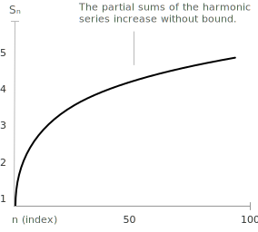

## Definition

The harmonic series is defined as the infinite sum:

$$
\sum_{k=1}^{\infty} \frac{1}{k}
$$

where each term is the reciprocal of a [natural number](../natural-numbers/). Despite the terms approaching zero, the [series](../series/) diverges, meaning the sum grows without bound. Because it is a series with [positive terms](../series-with-positive-terms/), the limit of the sequence of its partial sums exists, and the series diverges to positive infinity:

$$
S = \lim_{n \to +\infty} s_n = \lim_{n \to +\infty} \sum_{k=1}^{n} \frac{1}{k}
$$

One might think that, as $n \to \infty$, the terms tend to zero and so the series converges. This is a logical error, the terms $\frac{1}{n}$ do approach zero but not fast enough for the series to converge.

> Here is the graph of the partial sums of the harmonic series up to $n = 100.$ As can be seen, the curve rises slowly yet unceasingly, confirming that the series is divergent.

- - -

Several methods prove that the harmonic series diverges. One groups the terms of the [partial sums](../series/):

$$
\sum_{k=1}^{\infty} \frac{1}{k} = 1 + \frac{1}{2} + \left( \frac{1}{3} + \frac{1}{4} \right) + \left( \frac{1}{5} + \frac{1}{6} + \frac{1}{7} + \frac{1}{8} \right) + \cdots
$$

Each group contains twice as many terms as the previous one. By observing that each group adds at least $\frac{1}{2}$ to the sum, we conclude that the overall series grows without bound:

$$
\sum_{k=1}^{\infty} \frac{1}{k} = \infty
$$

Hence, the harmonic series diverges. Knowing how the harmonic series and its variants behave is useful, since the comparison test often lets us relate a complex series to a harmonic one to check whether it converges.

## Generalized harmonic series (p-series)

Raising the denominator to a [power](../powers/) $a$ produces the series:

$$
\sum_{k=1}^{\infty} \frac{1}{k^a}
$$

Unlike the standard harmonic series, its convergence depends on the exponent $a$:

+ If $a > 1$, the series converges.
+ If $a \leq 1$, the series diverges.

- - -

A necessary condition for the convergence of a series $\sum a_k$ is that the general term tends to zero:

$$
\lim_{k \to \infty} a_k = 0.
$$

If this condition is not satisfied, that is, if $\lim_{k \to \infty} a_k \neq 0$, then the series diverges. For the generalized harmonic series with exponent $a \leq 1$, this condition fails. For example, when $a = 0$, the terms become constant $a_k = 1$, and:

$$
\lim_{k \to \infty} \frac{1}{k^0} = \lim_{k \to \infty} 1 = 1 \neq 0.
$$

Hence, the series diverges because its general term does not tend to zero.

- - -

When $a > 1$, we apply the [integral test](../integral-test-for-series-convergence/) to determine whether the series converges. We consider the corresponding improper integral:

$$
\int_1^{\infty} \frac{1}{x^a} \ dx
$$

Since $a > 1$, we have:

$$
\int_1^{\infty} \frac{1}{x^a} \ dx
= \lim_{t \to \infty} \int_1^t x^{-a} \ dx 
$$

By evaluating the integral at the endpoints, we obtain:

$$
\lim_{t \to \infty} \left[ \frac{x^{1-a}}{1 - a} \right]_1^t
= \lim_{t \to \infty} \left( \frac{t^{1 - a}}{1 - a} - \frac{1}{1 - a} \right)
$$

Because $a > 1$, the exponent $1 - a < 0$, so $t^{1 - a} \to 0$. Therefore:

$$
\int_1^{\infty} \frac{1}{x^a} \ dx = \frac{1}{a - 1}
$$

which is finite. Hence the series converges for all $a > 1$.

## Logarithmically modified harmonic series

Inserting a logarithmic factor in the denominator gives the series:

$$
\sum_{k=2}^{\infty} \frac{1}{k (\log^\alpha k)}
$$

The [logarithmic](../logarithms/) term affects the rate at which the series converges or diverges, and convergence depends on the exponent $\alpha$:

+ If $\alpha > 1$, the series converges.
+ If $\alpha \leq 1$, the series diverges.

The summation starts at $k = 2$ to avoid the singularities at $k = 0$ (where $\log 0$ is undefined) and $k = 1$ (where $\log 1 = 0$, causing division by zero). To determine whether the series converges, we apply the improper integral test. We consider the function:

$$
f(x) = \frac{1}{x (\log x)^\alpha}
$$

which is positive, [continuous](../continuous-functions/), and [decreasing](../increasing-and-decreasing-functions/) for $x \geq 2$. We then evaluate the improper integral:

$$
\int_2^{\infty} \frac{1}{x (\log x)^\alpha} \ dx
$$

Using the substitution $u = \log x$, we get:

$$
\int_2^{\infty} \frac{1}{x (\log x)^\alpha} \ dx
= \int_{\log 2}^{\infty} \frac{1}{u^\alpha} \ du
$$

This integral converges if and only if $\alpha > 1$. Therefore, by the integral test, the series converges if and only if $\alpha > 1$. For example, determinate the nature of the following series:

$$
\sum_{n=2}^{\infty} \frac{1}{n \sqrt{\log n}}
$$

This series has the general form:

$$
\sum_{n=2}^{\infty} \frac{1}{n (\log n)^\alpha}
$$

with $\alpha = 1/2$. This is a logarithmically modified harmonic series. According to known results, the series converges if and only if $\alpha > 1$. In this case, since $\alpha = 1/2 < 1$, the series diverges.