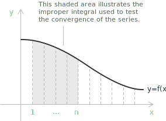

## What is the integral test

Finding the exact sum of an infinite [series](../series/) is rarely possible, so most questions about a series concern only its convergence. The integral test answers this question for [series with positive terms](../series-with-positive-terms/) by comparing the series with an [improper integral](../improper-integrals/) of an associated function.

Let $f$ be a continuous, positive, and [decreasing function](../increasing-and-decreasing-functions/) on the interval $[k, +\infty)$, and let $a_n = f(n)$. The integral test relates the series and the improper integral through two statements.

+ If $\int_k^{\infty} f(x) \ dx$ converges, then $\sum_{n=k}^{\infty} a_n$ converges.
+ If $\int_k^{\infty} f(x) \ dx$ diverges, then $\sum_{n=k}^{\infty} a_n$ diverges.

The lower limit of the integral must equal the index at which the series starts. With this condition the series and the integral share the same convergence behavior, so each one can be studied through the other.

## When the integral test applies

Continuity, positivity, and monotonic decrease are required by the proof, but in practice they need to hold only from some point onward. Suppose $f$ increases or takes negative values on a bounded initial range $k \leq n \leq N$, and is positive and decreasing for $n \geq N+1$. Then the series splits into two parts.

$$
\sum_{n=k}^{\infty} a_n = \sum_{n=k}^{N} a_n + \sum_{n=N+1}^{\infty} a_n
$$

The first part is a finite sum of finite terms, so it cannot affect convergence. The second part satisfies the hypotheses of the test, and the convergence of the whole series matches the convergence of this tail. For this reason it is enough that $f$ be eventually positive and decreasing.

## Comparing the series with an area

The test comes from reading the series as an estimate of the area under the curve $y = f(x)$. On each interval $[n, n+1]$ we draw a rectangle of width $1$, taking the value of $f$ at one endpoint as the height. The sum of the rectangle areas is a series, and comparing it with the exact area under the curve connects the two notions of convergence.

+ the curve $f(x)$ is the graph of the continuous [function](../functions/)
+ the shaded region is part of the improper integral, the area under the curve from $x = 1$ to some $x = n$
+ the rectangles represent the terms $f(n)$, each with base $1$ and height $f(n)$

> Comparing the discrete sum with the continuous area is the core of the test. Depending on whether the rectangles overestimate or underestimate the area, the integral bounds the series from above or from below, which fixes its convergence.

- - - 

Two classical series show both outcomes. Take the [harmonic series](../harmonic-series/) $\sum_{n=1}^{\infty} \frac{1}{n}$ together with $f(x) = \frac{1}{x}$ on $[1, +\infty)$. Using the left endpoint of each interval as the height, every rectangle overestimates the area beneath the curve, so the sum exceeds the integral.

$$
\sum_{n=1}^{\infty} \frac{1}{n} > \int_1^{\infty} \frac{1}{x} \ dx
$$

The improper integral diverges, so the series is larger than a divergent quantity and diverges as well.

- - -

Now take $\sum_{n=1}^{\infty} \frac{1}{n^2}$ together with $f(x) = \frac{1}{x^2}$ on $[1, +\infty)$. Using the right endpoint as the height, every rectangle underestimates the area, and these rectangles reproduce the series without its first term. Adding that term back gives an upper bound.

$$
\sum_{n=1}^{\infty} \frac{1}{n^2} = 1 + \sum_{n=2}^{\infty} \frac{1}{n^2} < 1 + \int_1^{\infty} \frac{1}{x^2} \ dx = 1 + 1 = 2
$$

The terms are positive, so the partial sums increase, and they stay bounded above by $2$. An increasing sequence bounded above converges, so the series converges.

## Proof

Consider the partial sum of the first $k$ terms.

$$
s_k = \sum_{n=1}^{k} f(n)
$$

Since the terms are positive, the [sequence](../sequences/) of partial sums $\{s_k\}$ is increasing and admits a limit as $k \to \infty$.

$$
\lim_{k \to +\infty} s_k = s \in [0, +\infty]
$$

The improper integral is defined in the same way, as the limit of the definite integral when the upper bound tends to infinity.

$$
\lim_{k \to +\infty} \int_1^k f(x) \ dx = \int_1^{+\infty} f(x) \ dx
$$

By additivity over adjacent intervals, the integral over $[1, k]$ decomposes into integrals over the unit subintervals $[n, n+1]$.

$$
\int_1^k f(x) \ dx = \sum_{n=1}^{k-1} \int_n^{n+1} f(x) \ dx
$$

These subintervals are disjoint and consecutive. Since $f$ is decreasing, for every $x \in [n, n+1]$ we have the bounds

$$
f(n+1) \leq f(x) \leq f(n)
$$

Integrating each side over $[n, n+1]$ preserves the inequalities.

$$
\int_n^{n+1} f(n+1) \ dx \leq \int_n^{n+1} f(x) \ dx \leq \int_n^{n+1} f(n) \ dx
$$

The outer integrands are constant, so the outer integrals equal $f(n+1)$ and $f(n)$.

$$
f(n+1) \leq \int_n^{n+1} f(x) \ dx \leq f(n)
$$

Summing these inequalities from $n = 1$ to $k-1$ gives

$$
\sum_{n=1}^{k-1} f(n+1) \leq \sum_{n=1}^{k-1} \int_n^{n+1} f(x) \ dx \leq \sum_{n=1}^{k-1} f(n)
$$

Taking the limit as $k \to \infty$, the middle term becomes the improper integral.

$$
\sum_{n=2}^{\infty} f(n) \leq \int_1^{\infty} f(x) \ dx \leq \sum_{n=1}^{\infty} f(n)
$$

The improper integral is trapped between two copies of the series that differ only by the first term $f(1)$. If the integral converges, the left inequality bounds the series above, and a positive-term series bounded above converges. If the integral diverges, the right inequality bounds the series below by a divergent quantity, and the series diverges.

## What the test does not give

The integral test settles whether a series converges, and it never produces the sum. The comparison with $\sum_{n=1}^{\infty} \frac{1}{n^2}$ shows this clearly. The argument gives the bound

$$
\sum_{n=1}^{\infty} \frac{1}{n^2} < 2
$$

while the exact value $\frac{\pi^2}{6} \approx 1.645$ requires entirely different methods. From here on the test is used only to classify a series as convergent or divergent, not to compute it.

## The p-series test

A direct consequence of the integral test concerns the p-series, the family

$$
\sum_{n=k}^{\infty} \frac{1}{n^p}
$$

with real exponent $p$ and $k > 0$. Applying the test to $f(x) = \frac{1}{x^p}$ reduces the question to the improper integral $\int_k^{\infty} \frac{1}{x^p} \ dx$, which converges when $p > 1$ and diverges when $p \leq 1$. The series follows the same rule, so $\sum \frac{1}{n^p}$ converges for $p > 1$ and diverges for $p \leq 1$.

The [harmonic series](../harmonic-series/) is the case $p = 1$, which diverges, while $p = 2$ gives the convergent series met above. The rule classifies many series at once: $\sum_{n=4}^{\infty} \frac{1}{n^7}$ converges because $p = 7 > 1$, and $\sum_{n=1}^{\infty} \frac{1}{\sqrt{n}}$ diverges because $p = \frac{1}{2} \leq 1$.

## Examples

Determine whether the following series converges or diverges.

$$
\sum_{n=2}^{\infty} \frac{1}{n\log n}
$$

The associated function is $f(x) = \frac{1}{x\log x}$, defined for $x \geq 2$. It is positive and continuous, and it is decreasing because the denominator grows with $x$, so the integral test applies. We evaluate the improper integral.

$$
\int_2^{\infty} \frac{1}{x\log x} \ dx
$$

The [substitution](../integration-by-substitution/) $u = \log x$ gives $du = \frac{1}{x} \ dx$, and the lower limit becomes $\log 2$.

$$
\int_{\log 2}^{\infty} \frac{1}{u} \ du = \lim_{t \to \infty} \int_{\log 2}^{t} \frac{1}{u} \ du = \lim_{t \to \infty} [\log u]_{\log 2}^{t} = \infty
$$

The integral diverges, so the series diverges by the integral test.

- - -

Determine whether the following series converges or diverges.

$$
\sum_{n=0}^{\infty} ne^{-n^2}
$$

The associated function is $f(x) = xe^{-x^2}$, positive for $x > 0$. This function is not decreasing on the whole interval, so we examine its derivative.

$$
f'(x) = e^{-x^2}(1 - 2x^2)
$$

The [derivative](../derivatives/) vanishes at $x = \frac{1}{\sqrt{2}}$, is positive before this point, and is negative after it. The function increases on $[0, \frac{1}{\sqrt{2}}]$ and decreases on $[\frac{1}{\sqrt{2}}, +\infty)$, so it is eventually decreasing, which is enough to apply the test. We evaluate the improper integral with the substitution $u = -x^2$, so $du = -2x \ dx$.

$$
\begin{align}
\int_0^{\infty} xe^{-x^2}\,dx
&= \lim_{t\to\infty}\int_0^t xe^{-x^2}\,dx \\[6pt]
&= \lim_{t\to\infty}\left[-\frac{1}{2}e^{-x^2}\right]_0^t \\[6pt]
&= \lim_{t\to\infty}\left(\frac{1}{2}-\frac{1}{2}e^{-t^2}\right) \\[7pt]
&= \frac{1}{2}
\end{align}
$$

The integral converges, so the series converges by the integral test.