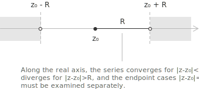
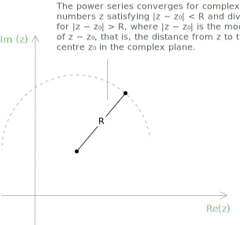

## Definition

A power series is a particular [function series](../function-series/) whose terms are the successive powers of the variable, each multiplied by a constant coefficient. It can be written in the form:

$$
\sum_{n=0}^{\infty} a_n x^n = a_0 + a_1 x + a_2 x^2 + \dots + a_n x^n + \dots$$

$$a_n \in \mathbb{R} \ \ \forall \ n \in \mathbb{N}, \ x \in \mathbb{R}$$

The [real numbers](../real-numbers/) $a_0, a_1, \dots, a_n, \dots$ are the coefficients of the series and $x$ is a real variable. By convention the symbol $a_0 x^0$ denotes $a_0$ for every $x$, including $x = 0,$ so that the term of index $0$ is always the constant $a_0.$ The $n$-th partial sum is the following polynomial of degree $n$:

$$
s_n(x) = a_0 + a_1 x + \dots + a_n x^n
$$

An example is:

$$
\sum_{n=0}^{\infty} 3^n x^n = 1 + 3x + 9x^2 + 27x^3 + 81x^4 + \dots
$$

whose coefficients are $a_n = 3^n$ and whose partial sums are the polynomials $s_n(x) = 1 + 3x + 9x^2 + \dots + 3^n x^n$.

The definition admits only non-negative integer powers of the variable, multiplied by coefficients that do not depend on $x$. Several expansions resemble a power series while violating one of these requirements.

An expansion that contains negative powers, is a Laurent series, not a power series. For example:

$$
\frac{1}{x} + a_0 + a_1 x + a_2 x^2 + \dots
$$

When the exponents are fractional, as in $\sum_{n=0}^{\infty} a_n x^{n/2}$, the expansion is a Puiseux series. 

An expression such as $\sum_{n=0}^{\infty}\cos(nx)x^n$, whose coefficients change with $x$, also fails the definition, because the coefficients must be constants.

A [polynomial](../polynomials/) fits the definition as the special case in which the coefficients vanish from some index onward. A power series therefore extends a polynomial to infinitely many terms, and every polynomial is a power series that terminates.

## Convergence and the theorem of Abel

Since power series are a special case of function [series](../series/), the definitions and theorems of function series apply to them. Their rigid structure, however, makes the set of convergence much easier to describe. Two facts organise the theory:

+ every power series converges at $x = 0$, where its sum is $a_0$
+ if a power series converges at a point $c \neq 0$, then it converges absolutely at every $x$ with $|x| < |c|$, and if it fails to converge at $c \neq 0$, then it fails to converge at every $x$ with $|x| > |c|$

The second statement is the theorem of Abel. Convergence at a single nonzero point therefore forces absolute convergence on the entire open interval up to that point, and divergence at a single point forces divergence everywhere beyond it.

- - -

Consider the series:

$$\sum_{n=0}^{\infty} \dfrac{x^n}{3^n}$$

At $x = 2$ it becomes a [geometric series](../geometric-series/) of ratio $2/3$, hence it converges. By Abel's theorem the series converges absolutely for $|x| < 2$, that is for $-2 < x < 2$. At $x = 6$ it becomes the geometric series $\sum_{n=0}^{\infty} 2^n$, which diverges, so by Abel's theorem the series cannot converge for $|x| > 6$ either.

## Interval and radius of convergence

Let $E$ be the set of real $x$ at which the power series converges. This set always contains $x = 0$, so it is non-empty, and the radius of convergence is its supremum in absolute value:

$$
r = \sup\{\ |x| : x \in E \ \}
$$

This number is the distance from the origin to the farthest point at which the series still converges, with $r = +\infty$ when $E$ is unbounded. By Abel's theorem $E$ is an interval symmetric about the origin, so the series converges for every $x \in (-r, r)$ and does not converge for $|x| > r$. 

The interval $(-r, r)$ is the interval of convergence and $r$ is the radius of convergence.

+ If $r = +\infty$ the series converges for every real $x$.
+ If $r = 0$ the series converges only at $x = 0$.

The term radius becomes transparent once the variable is allowed to be complex. A power series $\sum_{n=0}^{\infty} a_n z^n$ in a [complex](../complex-numbers/) variable converges absolutely on the open disk $|z| < r$, the disk of convergence, and diverges at every $z$ with $|z| > r$. More generally, a series centred at $z_0$ converges on the disk $|z - z_0| < r$. The real interval of convergence is the intersection of this disk with the real axis, so on the line we see the diameter of the disk while $r$ is its radius in the plane.

The behaviour at the endpoints $x = r$ and $x = -r$ is not determined by $r$ alone and must be examined separately in each case. To obtain the full set of convergence one finds the interval $(-r, r)$ and then studies the two endpoints individually.

## The ratio criterion for the radius

The radius is encoded in the coefficients, so it is reasonable to expect a formula that recovers $r$ from them. The first such result follows from the [ratio criterion](../ratio-test-for-series-convergence/) of d'Alembert. Given $\sum_{n=0}^{\infty} a_n x^n$ with $a_n \neq 0$ from a certain index on, suppose the following limit exists, finite or infinite.

$$
\lim_{n \to +\infty} \left|\frac{a_{n+1}}{a_n}\right| = l
$$

Then the radius of convergence is

$$
r =
\begin{cases}
\dfrac{1}{l} & l \neq 0 \\[8pt]
+\infty & l = 0 \\[8pt]
0 & l = +\infty
\end{cases}
$$

- - -

The result is proved by applying the ratio criterion to the series of absolute values. The hypothesis gives the limit of consecutive ratios,

$$
\lim_{n \to +\infty} \left|\frac{a_{n+1} x^{n+1}}{a_n x^n}\right| = l  |x|
$$

When $l \neq 0$ the series converges for $l|x| < 1$, that is for $|x| < \tfrac{1}{l}$, which identifies the interval $\left(-\tfrac{1}{l}, \tfrac{1}{l}\right)$ and the radius $\tfrac{1}{l}$. When $l = 0$ the limit $l|x| = 0 < 1$ for every $x$, so the series converges on all of $\mathbb{R}$. When $l = +\infty$ and $x \neq 0$ the limit is $+\infty$, so convergence occurs only at $x = 0$.

For the series $\sum_{n=1}^{\infty} \dfrac{n^2 x^n}{3^n}$ the ratio criterion gives the limit:

$$
\begin{align}
\lim_{n \to +\infty} \left|\frac{a_{n+1}}{a_n}\right|
&=
\lim_{n \to +\infty}
\frac{(n+1)^2}{3^{\,n+1}}
\cdot
\frac{3^n}{n^2}
\\[6pt]
&=
\frac{1}{3}
\lim_{n \to +\infty}
\left(\frac{n+1}{n}\right)^2
\\[6pt]
&=
\frac{1}{3}
\lim_{n \to +\infty}
\left(1+\frac{1}{n}\right)^2
\\[6pt]
&=
\frac{1}{3}
\end{align}
$$

So the radius of convergence is $r = 3$.

## The root criterion for the radius

The second formula follows from the [root criterion](../root-test-for-series-convergence/). Given $\sum_{n=0}^{\infty} a_n x^n$, suppose the following limit exists, finite or infinite:

$$
\lim_{n \to +\infty} \sqrt[n]{|a_n|} = l
$$

 Then the radius of convergence is

$$
r =
\begin{cases}
\dfrac{1}{l} & l \neq 0 \\[8pt]
+\infty & l = 0 \\[8pt]
0 & l = +\infty
\end{cases}
$$

- - -

The proof applies the root criterion to:

$$\sqrt[n]{|a_n x^n|} = |x|  \sqrt[n]{|a_n|}$$

The limit is $l|x|$, which leads to the same three cases as before. For example, for the series: 

$$\sum_{n=1}^{\infty} \dfrac{x^n}{(2n)^n}$$

the root criterion gives the following limit:

$$
\lim_{n \to +\infty} \sqrt[n]{\frac{1}{(2n)^n}} = \lim_{n \to +\infty} \frac{1}{2n} = 0
$$

The radius of convergence is infinite and the series converges for every real $x$.

## Power series centred at a point

Replacing $x$ by the difference $x - x_0$ shifts the centre of the series from the origin to the point $x_0$. A power series centred at $x_0 \in \mathbb{R}$ and $a_n \in \mathbb{R}$ is a function series of the form

$$
\sum_{n=0}^{\infty} a_n (x - x_0)^n = a_0 + a_1 (x - x_0) + a_2 (x - x_0)^2 + \dots
$$

The case $x_0 = 0$ recovers a power series in $x$. The substitution $X = x - x_0$ turns the series into an ordinary power series in $X$, so every definition and property carries over. If $r$ is the radius of convergence, the series converges where $-r < x - x_0 < r$, which is the same as

$$
x_0 - r < x < x_0 + r
$$

So the interval of convergence is the open interval $(x_0 - r, x_0 + r)$, centred at $x_0$ with radius $r$. Convergence at the endpoints $x_0 - r$ and $x_0 + r$ must be checked separately.

- - -

Consider the following series:

$$\sum_{n=1}^{\infty} \dfrac{(x+4)^n}{n}$$

It is centred at $x_0 = -4$. Setting $X = x + 4$ gives the power series:

$$\sum_{n=1}^{\infty} \dfrac{X^n}{n}$$

for which the ratio criterion yields

$$
\lim_{n \to +\infty} \left|\frac{a_{n+1}}{a_n}\right| = \lim_{n \to +\infty} \frac{n}{n+1} = 1
$$

so the radius is $1$ and the interval is $-1 < X < 1$. At $X = -1$ the series becomes the alternating harmonic series, which converges by the [Leibniz criterion](../leibniz-criterion/), while at $X = 1$ it becomes the [harmonic series](../harmonic-series/), which diverges. Returning to $x$, the original series converges for $-1 \leq x + 4 < 1$, that is $-5 \leq x < -3$.

## Series reducible to power series

A series whose powers are taken of an expression in $x$, rather than of $x$ or of $x - x_0$, is not a power series, but a substitution may turn it into one. 

Consider the series:

$$
\sum_{n=1}^{\infty} \frac{1}{n^2} (x^2 - 4)^n
$$

It is not a power series because the base $x^2 - 4$ is neither $x$ nor a binomial $x - x_0$. Setting $X = x^2 - 4$ produces the power series $\sum_{n=1}^{\infty} \dfrac{X^n}{n^2}$, whose radius is $1$ since

$$
\lim_{n \to +\infty} \left|\frac{a_{n+1}}{a_n}\right| = \lim_{n \to +\infty} \frac{n^2}{(n+1)^2} = 1
$$

The series in $X$ converges for $-1 \leq X \leq 1$, because at $X = 1$ it is the generalized harmonic series of order $2$ and at $X = -1$ it converges by the Leibniz criterion. Translating back, $-1 \leq x^2 - 4 \leq 1$ gives $3 \leq x^2 \leq 5$, hence $-\sqrt{5} \leq x \leq -\sqrt{3}$ or $\sqrt{3} \leq x \leq \sqrt{5}$.

## Algebraic operations on power series

Two power series with the same centre can be combined into new power series. Suppose the following series have radii of convergence $r_f$ and $r_g$:

$$
f(x) = \sum_{n=0}^{\infty} a_n x^n \qquad g(x) = \sum_{n=0}^{\infty} b_n x^n
$$

Their sum and difference are obtained by adding or subtracting the coefficients of equal degree,

$$
f(x) \pm g(x) = \sum_{n=0}^{\infty} (a_n \pm b_n) x^n
$$

The radius of this series is at least $\min(r_f, r_g)$, and it can be strictly larger when the dominant parts of the two coefficient sequences cancel.

The product is again a power series with the same centre, whose coefficients are the Cauchy products of the two sequences:

$$f(x)g(x) = \sum_{n=0}^{\infty} c_n x^n$$

$$c_n = \sum_{k=0}^{n} a_k b_{n-k}$$

Each $c_n$ collects every product $a_k b_{n-k}$ whose factors have degrees summing to $n$. This series converges at least on the smaller of the two intervals of convergence.

The quotient $f/g$ admits a power series expansion when $g(0) = b_0 \neq 0$. Writing $f/g = \sum_{n=0}^{\infty} d_n x^n$ and multiplying by $g$ turns the coefficients of $f$ into the Cauchy products of $(b_n)$ and $(d_n)$, so comparison of equal degrees gives

$$
a_n = \sum_{k=0}^{n} b_k d_{n-k}
$$

Since $b_0 \neq 0$, this relation determines $d_0, d_1, d_2, \dots$ one degree at a time,

$$
d_n = \frac{1}{b_0}\left(a_n - \sum_{k=1}^{n} b_k d_{n-k}\right)
$$

- - -

The increase of the radius for a sum appears with $a_n = 1$ and $b_n = 3^{-n} - 1$. Both series

$$
\sum_{n=0}^{\infty} x^n \qquad \sum_{n=0}^{\infty} (3^{-n} - 1) x^n
$$

have radius $1$, since their coefficients approach constants of modulus $1$. Adding them gives coefficients $a_n + b_n = 3^{-n}$, hence the series $\sum_{n=0}^{\infty}\left(\frac{x}{3}\right)^n$, whose radius is $3$.

## Uniform convergence of a power series

On any closed interval strictly inside the interval of convergence a power series converges totally, hence uniformly. A power series with radius $r > 0$ converges totally, and therefore uniformly, on every interval $[a, b]$ whose endpoints are interior points of the interval of convergence.

Consider the series:

$$\sum_{n=1}^{\infty} \dfrac{x^n}{n  2^n}$$

The ratio criterion gives interval of convergence $(-2, 2)$. Choosing a closed interval with interior endpoints, for example $[-0.5, 1]$, every $x$ in it satisfies:

$$
\left|\frac{x^n}{n  2^n}\right| \leq \frac{1}{n  2^n} \qquad \forall \ n \in \mathbb{N}
$$

Since the series $\sum_{n=1}^{\infty} \dfrac{1}{n2^n}$ converges, the Weierstrass criterion gives uniform convergence on $[-0.5, 1]$. On every closed and bounded interval contained in the interval of convergence a power series therefore enjoys the properties of uniformly convergent series, including continuity of the sum and differentiation and integration term by term.

## Term-by-term differentiation

The derived series of $\sum_{n=0}^{\infty} a_n x^n$ is the power series obtained by differentiating each term,

$$
\sum_{n=1}^{\infty} n  a_n x^{n-1}
$$

The derived series is again a power series, and it has the same interval of convergence as the original one. Since the terms of a power series are [monomials](../monomials/), hence continuous and differentiable, the theorems on continuity and term-by-term differentiation apply, giving the following statement. If $\sum_{n=0}^{\infty} a_n x^n$ has interval of convergence $(-r, r)$ with $r > 0$ and sum $f(x)$, then $f$ is continuous and [differentiable](../derivatives/) at every point of $(-r, r)$, and

$$
f'(x) = \sum_{n=1}^{\infty} n  a_n x^{n-1} = a_1 + 2 a_2 x + 3 a_3 x^2 + \dots
$$

Because the derived series is itself a power series with the same radius, the argument can be repeated, so the sum of a power series is differentiable infinitely many times on the open interval of convergence, and every derivative is obtained by differentiating the series term by term.

- - -

The geometric series:

$$\sum_{n=0}^{\infty} x^n$$

has radius $1$ and sum $f(x) = \dfrac{1}{1-x}$ on $(-1, 1)$. Differentiating the sum gives:

$$f'(x) = \dfrac{1}{(1-x)^2}$$

Differentiating the series term by term gives $\sum_{n=1}^{\infty} n x^{n-1}$, so:

$$
\frac{1}{(1-x)^2} = \sum_{n=1}^{\infty} n  x^{n-1} \qquad x \in (-1, 1)
$$

A further differentiation yields

$$
\frac{2}{(1-x)^3} = \sum_{n=2}^{\infty} n(n-1)  x^{n-2} \qquad x \in (-1, 1)
$$

and the process continues indefinitely.

## Term-by-term integration

The argument that justifies differentiating a power series term by term applies equally to integration. The integrated series of $\sum_{n=0}^{\infty} a_n x^n$ is obtained by integrating each term from $0$ to $x$:

$$
\sum_{n=0}^{\infty} \frac{a_n}{n+1} x^{n+1}
$$

This is again a power series, and it has the same radius of convergence as the original one. If $\sum_{n=0}^{\infty} a_n x^n$ has interval of convergence $(-r, r)$ with $r > 0$ and sum $f(x)$, then $f$ is [integrable](../definite-integrals/) on every closed interval contained in $(-r, r)$, and the following holds:

$$
\int_0^x f(t) \ dt = \sum_{n=0}^{\infty} \frac{a_n}{n+1} x^{n+1} \qquad x \in (-r, r)
$$

The constant of integration is fixed by the value at $x = 0$, where both sides vanish.

- - -

The geometric series $\sum_{n=0}^{\infty} x^n$ has sum $\dfrac{1}{1-x}$ on $(-1, 1)$. Integrating both representations from $0$ to $x$ gives, on the left,

$$
\int_0^x \frac{dt}{1-t} = -\ln(1-x)
$$

and on the right the integrated series $\sum_{n=0}^{\infty} \dfrac{x^{n+1}}{n+1}$. Shifting the summation index produces the expansion

$$
-\ln(1-x) = \sum_{n=1}^{\infty} \frac{x^n}{n} \qquad x \in (-1, 1)
$$

which represents the logarithm as a power series throughout the interval of convergence.
