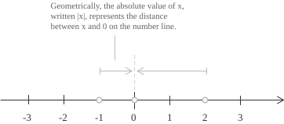
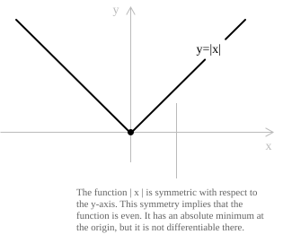

## Definition

The absolute value of a [real number](../real-numbers/) is its distance from zero on the real line, so it is always non-negative. It is denoted by $|x|$ and is defined by:

$$
|x| =
\begin{cases}
+x & \text{if } x \geq 0 \\[6pt]
-x & \text{if } x < 0
\end{cases}
\quad
\forall \ x \in \mathbb{R}
$$

For example, $|5|=5$ and $|-6|=-(-6)=6.$ As a function, $f(x):=|x|$ has [domain](../determining-the-domain-of-a-function/) $\mathbb{R}$ and image $f(\mathbb{R})=[0,+\infty).$

- - -

Geometrically, negative numbers have the same absolute values as their positive opposites, while non-negative numbers are unchanged.

More generally, $|x-a|$ is the distance between $x$ and $a$ on the real line. The symmetry of distance gives:

$$
|x-a| = |a-x|
$$

For instance, the distance between $3$ and $7$ is $|3-7|=4.$ Reversing the two points gives the same value, $|7-3|=4.$

- - -

The sign function gives another formula for the absolute value:

$$
|x| = x \cdot \mathrm{sgn}(x)
$$

The [sign function](../sign-function/) is defined by:

$$
\mathrm{sgn}(x) =
\begin{cases}
-1 & \text{if } x < 0 \\[6pt]
0 & \text{if } x = 0 \\[6pt]
1 & \text{if } x > 0
\end{cases}
$$

The product is non-negative in each case:

+ If $x > 0$, then $\mathrm{sgn}(x) = 1$ and $x \cdot \mathrm{sgn}(x) = x$.
+ If $x < 0$, then $\mathrm{sgn}(x) = -1$ and $x \cdot \mathrm{sgn}(x) = -x$.
+ If $x = 0$, then $\mathrm{sgn}(x) = 0$ and $x \cdot \mathrm{sgn}(x) = 0$.

## Properties

A real number and its opposite are at the same distance from the origin, so they have the same absolute value. For instance, $|3|=|-3|=3.$

$$
|x| = |-x| \quad \forall \ x \in \mathbb{R}
$$

- - -

For every real number $x,$ one of the numbers $x$ and $-x$ is $|x|,$ while the other is $-|x|.$ Thus $x$ lies between $-|x|$ and $|x|:$

$$
-|x| \leq x \leq |x| \quad \forall \ x \in \mathbb{R}
$$

Equivalently, the absolute value is the larger of $x$ and $-x:$

$$
|x| = \max\{x,-x\} \quad \forall \ x \in \mathbb{R}
$$

- - -

The absolute value of a product equals the product of the absolute values. Repeated application gives $|x_1 \cdot x_2 \cdots x_n|=|x_1| \cdot |x_2| \cdots |x_n|$ for every finite product. In particular, setting $y=x$ gives $|x^2|=|x|^2=x^2.$

$$
|x \cdot y| = |x| \cdot |y| \quad \forall \ x, y \in \mathbb{R}
$$

- - -

Two real numbers have equal absolute values if and only if they are equal or opposite. Geometrically, $|x|=|y|$ means that $x$ and $y$ are at the same distance from the origin, which occurs exactly when $x=y$ or $x=-y.$

$$
|x| = |y| \iff x = \pm y \quad \forall \ x, y \in \mathbb{R}
$$

This equivalence is used when solving [absolute value equations](../absolute-value-equations/).

- - -

The square function is strictly increasing on the non-negative real numbers. Since $|x|$ and $|y|$ are non-negative and have squares $x^2$ and $y^2,$ respectively, comparison of the absolute values is equivalent to comparison of the squares.

$$
|x| \leq |y| \iff x^2 \leq y^2 \quad \forall \ x, y \in \mathbb{R}
$$

- - -

The absolute value of a quotient equals the quotient of the absolute values, provided the denominator is non-zero. For $y \ne 0,$ the product identity applied to $yy^{-1}=1$ gives $|y^{-1}|=|y|^{-1}.$ Hence the quotient identity is:

$$
\left| \frac{x}{y} \right| = \frac{|x|}{|y|} \quad \forall \ x, y \in \mathbb{R},\ y \ne 0
$$

- - -

The [principal square root](../radicals/) of $x^2$ is the absolute value of $x,$ not $x$ itself. Since the square root symbol denotes the non-negative root, we have $\sqrt{x^2}=x$ only when $x \geq 0,$ and $\sqrt{x^2}=-x$ when $x<0.$ Thus the identity $\sqrt{x^2}=x$ is valid only for non-negative values of $x.$

$$
\sqrt{x^2} = |x| \quad \forall \ x \in \mathbb{R}
$$

## Triangle inequality

For all $a,b \in \mathbb{R},$ the absolute value satisfies the triangle inequality:

$$
|a + b| \le |a| + |b|
$$

The distance of $a+b$ from zero is at most the sum of the distances of $a$ and $b$ from zero. Equality holds exactly when $ab \geq 0.$ If $ab<0,$ cancellation makes the inequality strict.

- - -

To prove the inequality, consider the possible signs of $a$ and $b$:

$$
\begin{align}
(1)\quad & a \ge 0, \quad b \ge 0 \\[6pt]
(2)\quad & a \le 0, \quad b \le 0 \\[6pt]
(3)\quad & a \ge 0, \quad b \le 0 \\[6pt]
(4)\quad & a \le 0, \quad b \ge 0
\end{align}
$$

In case $(1)$, we have $a + b \geq 0$:

$$
|a + b| = a + b = |a| + |b|
$$

In case $(2)$, we have $a + b \leq 0$:

$$
|a + b| = -(a + b) = (-a) + (-b) = |a| + |b|
$$

In case $(3)$, since $a \ge 0$ and $b \le 0$, we have $|a| = a$ and $|b| = -b$, and therefore $|a| + |b| = a - b$. We must show that $|a + b| \le a - b$:

+ When $a + b \ge 0$, we have $|a + b| = a + b \le a - b$, since $b \le 0$.
+ When $a + b \le 0$, we obtain $|a + b| = -(a + b) = -a - b \le a - b$, which is equivalent to $-a \le a$, a condition that holds because $a \ge 0$.

Case $(4)$ follows from case $(3)$ after exchanging $a$ and $b.$

- - -

The reverse triangle inequality follows from the triangle inequality. For all $a,b \in \mathbb{R},$ we have:

$$
\bigl||a| - |b|\bigr| \le |a - b|
$$

The absolute difference between the distances of $a$ and $b$ from zero is at most the distance between $a$ and $b.$ Apply the triangle inequality to $a=(a-b)+b:$

$$
|a| = |(a - b) + b| \le |a - b| + |b|
$$

This gives $|a| - |b| \le |a - b|$. By symmetry, swapping $a$ and $b$ yields $|b| - |a| \le |a - b|$. Since both $|a| - |b|$ and its negative are bounded by $|a - b|$, we conclude:

$$
\bigl||a| - |b|\bigr| \le |a - b|
$$

## The graph of $y = |x|$

The identity $|-x|=|x|$ shows that the [absolute value function](../absolute-value-function/) is [even](../even-and-odd-functions/), so its graph is symmetric with respect to the $y$-axis:

$$
|{-x}| = |x| \quad \text{for all } x \in \mathbb{R}
$$

## Interpreting absolute value inequalities

An inequality with an absolute value is a condition on distance along the real line. The quantity $|A|$ is the distance of $A$ from zero. Let $k>0.$ The first case has the form:

$$
|A| < k
$$

The distance between $A$ and zero is smaller than $k,$ so $A$ is in the open [interval](../intervals/) centred at the origin with endpoints $-k$ and $k.$ Equivalently:

$$
-k < A < k
$$

- - -

The second case has the form:

$$
|A| > k
$$

In this case, the distance of $A$ from zero exceeds $k,$ so $A$ is outside the interval $(-k,k).$ Equivalently:

$$
A < -k \quad \text{or} \quad A > k
$$

> The entry on [inequalities with absolute value](../inequalities-with-absolute-value/) gives the non-strict forms of these equivalences and treats the cases determined by the sign of the right-hand side.

## Absolute value as a norm

The absolute value is a norm on $\mathbb{R}.$ A norm on a real [vector space](../vector-spaces/) $V$ is a function $\|\cdot\|:V \to [0,+\infty)$ with the following three properties for all $x,y \in V$ and all $\lambda \in \mathbb{R}:$

$$
\|x\| = 0 \iff x = 0
$$

$$
\|\lambda x\| = |\lambda| \cdot \|x\|
$$

$$
\|x + y\| \le \|x\| + \|y\|
$$

The absolute value has all three properties. The first is part of its definition, since $|x|=0$ if and only if $x=0.$ The second is the product identity applied to $\lambda x,$ and the third is the triangle inequality proved above.

> The norm $|\cdot|$ defines the [usual distance](../topology-of-the-real-line/) $d(x,y)=|x-y|$ on $\mathbb{R}.$ For this distance, the triangle inequality is the estimate used in the $\varepsilon$-definition of convergence for [sequences](../convergent-and-divergent-sequences/) and in the definition of [Cauchy sequences](../cauchy-sequence/).
