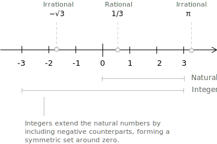

## Definition

Among the different [types of numbers](../types-of-numbers/), the integers are the extension of the [natural numbers](../natural-numbers/) obtained by adjoining the additive opposite of every positive quantity. The enlarged system contains all whole quantities, positive and negative, together with zero. The [set](../sets/) is denoted by $\mathbb{Z}$. Symbolically we write:

$$
\mathbb{Z} = \\{\ldots,-3,-2,-1,0,1,2,3,\ldots\\}
$$

The integers are an infinite collection of evenly spaced points along the number line and embed into the [rational numbers](../rational-numbers/) through the identification $n \mapsto n/1$; the rationals in turn are contained in the [real numbers](../real-numbers/) and the [complex numbers](../complex-numbers/). 

The chain of inclusions $\mathbb{N} \subset \mathbb{Z} \subset \mathbb{Q} \subset \mathbb{R} \subset \mathbb{C}$ traces the successive extensions through which each new system resolves a limitation of the previous one.

A rigorous construction models each integer as a class of ordered pairs of natural numbers. Take pairs $(a,b)$ with $a,b \in \mathbb{N}$, and say that two pairs belong to the same class whenever:

$$
(a,b) \sim (c,d) \quad \longleftrightarrow \quad a + d = b + c
$$

The pair $(a,b)$ represents the difference $a - b$:

+ Pairs with equal components form the class corresponding to $0$.
+ Pairs where the first component is larger form the positive integers.
+ Pairs where the second component is larger form the negative ones.

For example, consider the pair of natural numbers $(2,5)$. Since the second component is larger than the first, the pair corresponds to a negative integer:

$$
2 - 5 = -3
$$

Two pairs represent the same integer exactly when they belong to the same equivalence class. For instance, the pair $(4,7)$ lies in the same class as $(2,5)$, because:

$$
4 + 5 = 9 \qquad \text{and} \qquad 7 + 2 = 9
$$

Although the components differ, both pairs represent the same difference, the integer $-3$.

## The integers as an algebraic ring

When we say that the integers form a [ring](../rings/), we mean that the set $\mathbb{Z}$ has two operations, addition and multiplication, satisfying a fixed list of axioms.

The ring axioms for $(\mathbb{Z}, +, \cdot)$ are the following. For all $a, b, c \in \mathbb{Z}$:

+ Closure: the sum and product of any two integers are again integers, $a + b \in \mathbb{Z}$ and $ab \in \mathbb{Z}$.
+ Associativity: both operations are associative, $a + (b+c) = (a+b) + c$ and $a(bc) = (ab)c$.
+ Identity elements: both operations have a neutral element, $a + 0 = a$ and $a \cdot 1 = a$.
+ Additive inverses: every integer has an opposite, so that $(\mathbb{Z}, +)$ is an abelian [group](../groups/), with $a + (-a) = 0$.
+ Commutativity of addition: the order of summands does not affect the result, $a + b = b + a$.
+ Distributivity: multiplication distributes over addition, $a(b+c) = ab + ac$.

Multiplication in $\mathbb{Z}$ is also commutative, that is, $ab = ba$ for all $a, b \in \mathbb{Z}$, which makes $(\mathbb{Z}, +, \cdot)$ a commutative ring. Integers do not have multiplicative inverses in general. The only integers $a$ for which $a^{-1} \in \mathbb{Z}$ are $a = 1$ and $a = -1$, which is why $\mathbb{Z}$ is a ring but not a field.

> A [field](../fields/) extends the ring structure by requiring that every non-zero element also has a multiplicative inverse. The [rational numbers](../rational-numbers/) $\mathbb{Q}$ and the [real numbers](../real-numbers/) $\mathbb{R}$ are standard examples; the integers are not, since $2^{-1} \notin \mathbb{Z}$.

A further property refines the ring structure of $\mathbb{Z}$. A product of two integers is zero only when at least one of the factors is zero, so $\mathbb{Z}$ has no zero divisors. A commutative ring with this property is called an integral domain, and the absence of zero divisors makes the multiplicative cancellation law valid: from $ab = ac$ with $a \neq 0$ one can conclude $b = c$. The same property fails in more general rings such as $\mathbb{Z}/n\mathbb{Z}$ when $n$ is composite, where products of nonzero classes may vanish.

## Fundamental properties of the integers

Compatibility with equality: whenever two integers satisfy $a = b$, any operation applied to both sides preserves the equality. In particular:

$$
a + c = b + c
$$

$$
ac = bc
$$

- - -

Commutative laws: the order of the operands does not affect the result:

$$
a + b = b + a
$$

$$
ab = ba
$$

- - -

Associative laws: grouping the terms does not change the outcome:

$$
a + (b + c) = (a + b) + c
$$

$$
a(bc) = (ab)c
$$

- - -

Distributive law: multiplication distributes over addition:

$$
a(b + c) = ab + ac
$$

- - -

The integers also have neutral elements for the two operations. Adding zero leaves any integer unchanged, and multiplying by one preserves its value:

$$
a + 0 = a \qquad a \cdot 1 = a
$$

## Order on the integers

The set $\mathbb{Z}$ inherits a total order from the [natural numbers](../natural-numbers/) and extends it to the negative range. Given two integers $a, b \in \mathbb{Z}$, the relation $a \leq b$ holds when the difference $b - a$ is a non-negative integer. The relation is reflexive, antisymmetric, transitive, and total, which makes $\mathbb{Z}$ a totally ordered set. The trichotomy law applies: for any $a, b \in \mathbb{Z}$ exactly one of $a < b$, $a = b$, $b < a$ holds.

The order is compatible with the [ring](../rings/) operations. For all $a, b, c \in \mathbb{Z}$:

+ If $a \leq b$, then $a + c \leq b + c$.
+ If $a \leq b$ and $c \geq 0$, then $ac \leq bc$.

A structural property distinguishes $\mathbb{Z}$ from $\mathbb{N}$. The natural numbers are well-ordered, in the sense that every non-empty subset of $\mathbb{N}$ has a least element. The property fails in $\mathbb{Z}$, since the set itself has no smallest element and the negative integers extend without lower bound. Well-ordering is recovered by restricting to subsets of $\mathbb{Z}$ that are bounded below, and this restricted form is the one used in elementary number theory.

The [absolute value](../absolute-value/) measures the distance of an integer from zero. For any integer $a$, the value $|a|$ equals $a$ when $a \geq 0$ and $-a$ otherwise. This non-negative measure allows comparisons between positive and negative integers and appears in the bound on the remainder of the Euclidean division.

## Integers in base 10

Integers are typically written using the decimal system, that is, base 10. Each digit in a number has a positional weight determined by a corresponding power of ten. By combining these weighted digits, we can reconstruct the value of the integer. Consider the number $235$. Using the positional principle, we can express the number as a sum of powers of ten:

$$
235 = 2 \times 10^{2} + 3 \times 10^{1} + 5 \times 10^{0}
$$

The decomposition shows how each digit contributes to the final value. The following table summarises the structure of the number:

| Digit | Place value         | Contribution               |
|-------|---------------------|----------------------------|
| 2     | $10^{2}$ (hundreds) | $2 \times 10^{2} = 200$    |
| 3     | $10^{1}$ (tens)     | $3 \times 10^{1} = 30$     |
| 5     | $10^{0}$ (units)    | $5 \times 10^{0} = 5$      |

Adding the contributions together recovers the integer:

$$
235 = 200 + 30 + 5
$$

> The same mechanism applies to any integer written in decimal notation. Each digit is a coefficient of a specific power of ten, and the integer itself is obtained by summing all the positional contributions.

## The binary system

Although integers are commonly written in base 10, other numeral systems are equally valid and sometimes more convenient. A widely used alternative is base 2, or the binary system, which uses only the digits $0$ and $1$. This representation is standard in computer science and digital electronics, where information is stored and processed using two-state devices. In base 2, each position corresponds to a power of two rather than a power of ten. Any integer can be rewritten in binary by expanding it as a sum of weighted powers of two. Consider the integer $53$. To convert it to binary, we repeatedly divide by $2$ and record the remainders. Reading the remainders from bottom to top yields the binary expansion.

| Division by 2  | Quotient | Remainder |
|---------------:|:--------:|:---------:|
| $53 \div 2$    | $26$     | $1$       |
| $26 \div 2$    | $13$     | $0$       |
| $13 \div 2$    | $6$      | $1$       |
| $6 \div 2$     | $3$      | $0$       |
| $3 \div 2$     | $1$      | $1$       |
| $1 \div 2$     | $0$      | $1$       |

Reading the remainders upward gives the binary representation $53 = 110101$. We can check the conversion by expanding the binary digits in powers of two:

| Binary digit | Power of two | Contribution            |
|--------------|--------------|-------------------------|
| $1$          | $2^{5}$      | $1 \times 2^{5} = 32$   |
| $1$          | $2^{4}$      | $1 \times 2^{4} = 16$   |
| $0$          | $2^{3}$      | $0 \times 2^{3} = 0$    |
| $1$          | $2^{2}$      | $1 \times 2^{2} = 4$    |
| $0$          | $2^{1}$      | $0 \times 2^{1} = 0$    |
| $1$          | $2^{0}$      | $1 \times 2^{0} = 1$    |

The sum of the contributions confirms the conversion:

$$
32 + 16 + 0 + 4 + 0 + 1 = 53
$$

## Divisibility and Euclidean division

Within $\mathbb{Z}$ the operation of division is not always possible without remainder. For two integers $a$ and $b$, with $b \neq 0$, we say that $b$ divides $a$, written $b \mid a$, when there exists an integer $q$ such that:

$$
a = bq
$$

The divisibility relation is the entry point for the classical theory of factorisation, prime numbers, and greatest common divisors. The integer $q$ is the quotient of the exact division.

When $b$ does not divide $a$, the Euclidean division theorem guarantees that the quotient and the remainder still exist in a controlled form. For every pair of integers $a$ and $b$ with $b \neq 0$, there exist unique integers $q$ and $r$ such that:

$$
a = bq + r \qquad \text{with} \qquad 0 \leq r < |b|
$$

The integer $q$ is the quotient and $r$ the remainder of the division of $a$ by $b$. The [absolute value](../absolute-value/) in the bound on $r$ allows the statement to cover negative divisors uniformly. The [modulo operator](../modulo-operator/) and modular arithmetic are built on the uniqueness of the pair $(q, r)$. An analogous statement holds for [polynomials](../polynomial-division/) over a field, where the absolute value of the divisor is replaced by its degree.

For example, dividing $17$ by $5$ gives $q = 3$ and $r = 2$, since $17 = 3 \cdot 5 + 2$. Dividing $-17$ by $5$ gives $q = -4$ and $r = 3$, since $-17 = (-4) \cdot 5 + 3$. The remainder is again non-negative, in agreement with the convention $0 \leq r < |b|$.

## The modulo operator

Modular arithmetic describes how integers behave when we are interested only in their remainders after division by a fixed integer $n$. Within $\mathbb{Z}$, two integers are equivalent [modulo](../modulo-operator/) $n$ when they differ by a multiple of $n$. In arithmetic modulo $12$, the integers $14$ and $2$ represent the same residue class because $14 - 2 = 12$. Addition and multiplication are carried out as usual, but the final result is replaced by its remainder upon division by $n$. For example:

$$
7 + 9 \equiv 4 \pmod{12}
$$

$$
5 \times 7 \equiv 11 \pmod{12}
$$

In the case of $5 \times 7$, the product is $35 = 24 + 11$. Since $24$ is a multiple of $12$, the value of the product modulo $12$ is the remainder $11$.

> Modular arithmetic is widely used beyond pure mathematics. In computer science, the modulo operator is used to extract remainders, generate cyclic patterns, and keep values within a bounded range. The months of the year are a familiar example. Adding $n$ months is handled modulo $12$, since month counts wrap around after December.

## Integers and the role of induction

Several structural properties of the integers depend on the recursive nature of the natural numbers. The naturals are the base from which the integers are constructed, and many statements about $\mathbb{Z}$ can be traced back to properties first established on $\mathbb{N}$. The mechanism behind these stepwise constructions and proofs is the [principle of mathematical induction](../principle-of-mathematical-induction/).

Consider a set $A \subseteq \mathbb{N}$ defined by a property $p(n)$, such that $A = \\{ n \in \mathbb{N} \mid p(n) \\}$. Suppose the following conditions hold:

+ $p(0)$ is true, that is, $0 \in A$.
+ $p(n) \rightarrow p(n+1) \ \forall \ n \in \mathbb{N}$. If $n \in A$, then $n+1 \in A$.

It follows that $p(n)$ is true for every $n \in \mathbb{N}$. A concrete illustration shows how the principle carries over to the integers. Consider the claim that the sum of the first $n$ positive integers equals:

$$
\frac{n(n+1)}{2}
$$

The base case $n = 1$ is immediate, since both sides equal $1$. For the inductive step, assuming the identity holds for some $n$, one adds $n+1$ to both sides and verifies that the result matches the formula evaluated at $n+1$. Since the natural numbers embed into $\mathbb{Z}$ as the non-negative integers, the identity holds in $\mathbb{Z}$ as well, and the same method extends to any statement about $\mathbb{Z}$ that can be reduced to a property of $\mathbb{N}$ through the construction of the integers from ordered pairs of naturals.
