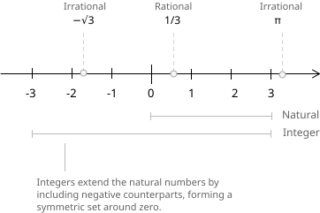

## Definition

Among the different [types of numbers](../types-of-numbers/), the integers are the extension of the [natural numbers](../natural-numbers/) obtained by adjoining the additive opposite of every positive quantity. The enlarged system contains all whole quantities, positive and negative, together with zero. The set is denoted by $\mathbb{Z}.$ Symbolically we write:

$$
\mathbb{Z} = \{\ldots,-3,-2,-1,0,1,2,3,\ldots\}
$$

The integers are an infinite collection of evenly spaced points along the number line and embed into the [rational numbers](../rational-numbers/) through the identification $n \mapsto n/1;$ the rationals in turn are contained in the [real numbers](../real-numbers/) and the [complex numbers](../complex-numbers/).

Although $\mathbb{N}$ is a proper subset of $\mathbb{Z},$ the two sets have the same cardinality. An explicit bijection between them is given in [cardinality and countable sets](../cardinality-and-countable-sets/).

The inclusions $\mathbb{N} \subset \mathbb{Z} \subset \mathbb{Q} \subset \mathbb{R} \subset \mathbb{C}$ record successive extensions, each of which permits an operation or equation unavailable in the preceding system.

A rigorous construction models each integer as a class of [ordered pairs](../sets/) $(a,b)$ of natural numbers. Two pairs belong to the same class whenever:

$$
(a,b) \sim (c,d) \quad \longleftrightarrow \quad a + d = b + c
$$

The pair $(a,b)$ is intended to represent the formal difference $a-b.$ This interpretation motivates the construction but does not define it, since the equivalence relation itself uses only addition on $\mathbb{N}:$

+ Pairs with equal components form the class corresponding to $0.$
+ Pairs where the first component is larger form the positive integers.
+ Pairs where the second component is larger form the negative ones.

For example, consider the pair of natural numbers $(2,5).$ Since the second component is larger than the first, the pair corresponds to a negative integer:

$$
2 - 5 = -3
$$

Two pairs represent the same integer exactly when they belong to the same equivalence class. For instance, the pair $(4,7)$ lies in the same class as $(2,5),$ because:

$$
4 + 5 = 9 \qquad \text{and} \qquad 7 + 2 = 9
$$

Although the components differ, both pairs represent the same difference, the integer $-3.$

Write $[(a,b)]$ for the equivalence class of $(a,b).$ The relation above is reflexive and symmetric. It is also transitive. If $(a,b) \sim (c,d)$ and $(c,d) \sim (e,f),$ then $a+d=b+c$ and $c+f=d+e.$ Adding these equalities and cancelling $c+d$ gives $a+f=b+e,$ so $(a,b) \sim (e,f).$

Addition and multiplication are defined directly on the classes by:

$$
[(a,b)]+[(c,d)] := [(a+c,b+d)]
$$

$$
[(a,b)][(c,d)] := [(ac+bd,ad+bc)]
$$

These definitions must be independent of the chosen representatives. Suppose $(a,b) \sim (a',b'),$ so $a+b'=b+a'.$ For addition, adding $c+d$ to this equality shows that $(a+c,b+d) \sim (a'+c,b'+d).$ For multiplication, the two equalities

$$
ac+b'c=bc+a'c
$$

$$
ad+b'd=bd+a'd
$$

follow by multiplying $a+b'=b+a'$ by $c$ and $d,$ respectively. Adding the first equality to the reverse of the second gives the equality required for $(ac+bd,ad+bc) \sim (a'c+b'd,a'd+b'c).$ The same argument applies to a change of representative in the second factor. Hence both operations are well-defined.

The map $n \mapsto [(n,0)]$ embeds $\mathbb{N}$ into $\mathbb{Z}$ and preserves addition and multiplication. Under this identification, $0=[(0,0)]$ and $1=[(1,0)].$ Negation is given by $-[(a,b)]=[(b,a)],$ since:

$$
[(a,b)]+[(b,a)]=[(a+b,a+b)]=0
$$

The trichotomy law on $\mathbb{N}$ now shows that every integer has exactly one of three forms. If $a>b,$ then $[(a,b)]=[(a-b,0)]$ is positive; if $a=b,$ then $[(a,b)]=0;$ if $a<b,$ then $[(a,b)]=-[(b-a,0)]$ is negative.

## The integers as an algebraic ring

The integers form a [ring](../rings/) because addition and multiplication satisfy the following axioms.

The ring axioms for $(\mathbb{Z}, +, \cdot)$ are the following. For all $a, b, c \in \mathbb{Z}:$

+ Closure: the sum and product of any two integers are again integers, $a + b \in \mathbb{Z}$ and $ab \in \mathbb{Z}.$
+ Associativity: both operations are associative, $a + (b+c) = (a+b) + c$ and $a(bc) = (ab)c.$
+ Identity elements: both operations have a neutral element, $a + 0 = a$ and $a \cdot 1 = a.$
+ Additive inverses: every integer has an opposite, so that $(\mathbb{Z}, +)$ is an abelian [group](../groups/), with $a + (-a) = 0.$
+ Commutativity of addition: the order of summands does not affect the result, $a + b = b + a.$
+ Distributivity: multiplication distributes over addition, $a(b+c) = ab + ac.$

Multiplication in $\mathbb{Z}$ is also commutative, that is, $ab = ba$ for all $a, b \in \mathbb{Z},$ which makes $(\mathbb{Z}, +, \cdot)$ a commutative ring. Integers do not have multiplicative inverses in general. The only integers $a$ for which $a^{-1} \in \mathbb{Z}$ are $a = 1$ and $a = -1,$ which is why $\mathbb{Z}$ is a ring but not a field.

> A [field](../fields/) is a ring in which every nonzero element has a multiplicative inverse. The [rational numbers](../rational-numbers/) $\mathbb{Q}$ and the [real numbers](../real-numbers/) $\mathbb{R}$ are fields; the integers are not, since $2^{-1} \notin \mathbb{Z}.$

A further property refines the ring structure of $\mathbb{Z}.$ A product of two integers is zero only when at least one factor is zero, so $\mathbb{Z}$ has no zero divisors. A commutative ring with this property is an integral domain. Consequently, $ab=ac$ with $a\neq0$ implies $b=c.$ The same property fails in rings such as $\mathbb{Z}/n\mathbb{Z}$ when $n$ is composite, where products of nonzero classes may vanish.

## Fundamental properties of the integers

Operations preserve equality. If two integers satisfy $a=b,$ then, in particular:

$$
a + c = b + c
$$

$$
ac = bc
$$

- - -

The commutative laws state that the order of the operands does not affect the result:

$$
a + b = b + a
$$

$$
ab = ba
$$

- - -

The associative laws state that grouping the terms does not change the outcome:

$$
a + (b + c) = (a + b) + c
$$

$$
a(bc) = (ab)c
$$

- - -

The distributive law states that multiplication distributes over addition:

$$
a(b + c) = ab + ac
$$

- - -

The integers also have neutral elements for the two operations. Adding zero leaves any integer unchanged, and multiplying by one preserves its value:

$$
a + 0 = a \qquad a \cdot 1 = a
$$

## Order on the integers

The set $\mathbb{Z}$ inherits a total order from the [natural numbers](../natural-numbers/) and extends it to the negative range. Given two integers $a,b\in\mathbb{Z},$ the relation $a\leq b$ holds when the difference $b-a$ is a non-negative integer. The relation is reflexive, antisymmetric, transitive, and total. Thus, for any $a,b\in\mathbb{Z},$ exactly one of $a<b,$ $a=b,$ or $b<a$ holds.

The order is compatible with the [ring](../rings/) operations. For all $a, b, c \in \mathbb{Z}:$

+ If $a \leq b,$ then $a + c \leq b + c.$
+ If $a \leq b$ and $c \geq 0,$ then $ac \leq bc.$

The order on $\mathbb{Z}$ differs from the order on $\mathbb{N}.$ Every non-empty subset of $\mathbb{N}$ has a least element, whereas $\mathbb{Z}$ itself has none because the negative integers have no lower bound. Every non-empty subset of $\mathbb{Z}$ that is bounded below does have a least element, and elementary number theory uses this restricted form of well-ordering.

The [absolute value](../absolute-value/) measures the distance of an integer from zero. For any integer $a,$ the value $|a|$ equals $a$ when $a \geq 0$ and $-a$ otherwise. This non-negative measure allows comparisons between positive and negative integers and appears in the bound on the remainder of the Euclidean division.

## Integers in base 10

Integers are typically written using the decimal system, that is, base 10. Each digit has a positional weight given by a power of ten. The number $235,$ for example, is a sum of powers of ten:

$$
235 = 2 \times 10^{2} + 3 \times 10^{1} + 5 \times 10^{0}
$$

The decomposition shows how each digit contributes to the value. The following table summarises the number:

| Digit | Place value         | Contribution               |
|-------|---------------------|----------------------------|
| 2     | $10^{2}$ (hundreds) | $2 \times 10^{2} = 200$    |
| 3     | $10^{1}$ (tens)     | $3 \times 10^{1} = 30$     |
| 5     | $10^{0}$ (units)    | $5 \times 10^{0} = 5$      |

Adding the contributions recovers the integer:

$$
235 = 200 + 30 + 5
$$

> The same mechanism applies to any integer written in decimal notation. Each digit is a coefficient of a specific power of ten, and the integer itself is obtained by summing all the positional contributions.

## The binary system

Although integers are commonly written in base 10, other numeral systems are equally valid. The binary system uses only the digits $0$ and $1$ and is used in computer science and digital electronics, where two-state devices store and process information. In base 2, each position corresponds to a power of two rather than a power of ten. Repeated division of $53$ and each successive quotient by $2$ produces the binary digits as remainders. Reading them from bottom to top yields the binary expansion.

| Division by 2  | Quotient | Remainder |
|---------------:|:--------:|:---------:|
| $53 \div 2$    | $26$     | $1$       |
| $26 \div 2$    | $13$     | $0$       |
| $13 \div 2$    | $6$      | $1$       |
| $6 \div 2$     | $3$      | $0$       |
| $3 \div 2$     | $1$      | $1$       |
| $1 \div 2$     | $0$      | $1$       |

Reading the remainders upward gives the binary representation $53=(110101)_2.$ Expanding the binary digits in powers of two checks the conversion:

| Binary digit | Power of two | Contribution            |
|--------------|--------------|-------------------------|
| $1$          | $2^{5}$      | $1 \times 2^{5} = 32$   |
| $1$          | $2^{4}$      | $1 \times 2^{4} = 16$   |
| $0$          | $2^{3}$      | $0 \times 2^{3} = 0$    |
| $1$          | $2^{2}$      | $1 \times 2^{2} = 4$    |
| $0$          | $2^{1}$      | $0 \times 2^{1} = 0$    |
| $1$          | $2^{0}$      | $1 \times 2^{0} = 1$    |

The sum of the contributions confirms the conversion:

$$
32 + 16 + 0 + 4 + 0 + 1 = 53
$$

## Divisibility and Euclidean division

Divisibility records when one integer is a multiple of another. For integers $a$ and $b,$ we say that $b$ divides $a,$ written $b\mid a,$ when some integer $q$ satisfies:

$$
a=bq
$$

The integer $b$ is a divisor of $a,$ and $a$ is a multiple of $b.$ When $b\neq0,$ the integer $q$ is the quotient of the exact division. The definition also covers zero. Every integer divides $0,$ since $0=b\cdot0,$ while $0\mid a$ holds only when $a=0.$

For all integers $a,b,c,s,t,$ divisibility has these properties:

+ Every integer divides itself, so $a\mid a.$
+ If $a\mid b$ and $b\mid a,$ then $a=\pm b.$
+ If $a\mid b$ and $b\mid c,$ then $a\mid c.$
+ If $a\mid b$ and $a\mid c,$ then $a\mid sb+tc.$

For transitivity, write $b=au$ and $c=bv.$ Then $c=a(uv),$ so $a\mid c.$ If $b=au$ and $c=av,$ then $sb+tc=a(su+tv),$ which proves the last property. For mutual divisibility, suppose that $b=au$ and $a=bv.$ If $a=0,$ then also $b=0.$ If $a\neq0,$ cancellation in the integral domain $\mathbb{Z}$ gives $uv=1.$ The only units of $\mathbb{Z}$ are $1$ and $-1,$ hence $b=a$ or $b=-a.$

For a nonzero divisor $b,$ Euclidean division writes $a$ as a multiple of $b$ plus a bounded remainder. More precisely, unique integers $q$ and $r$ satisfy:

$$
a=bq+r \qquad \text{with} \qquad 0\leq r<|b|
$$

The integer $q$ is the quotient and $r$ the remainder of the division of $a$ by $b.$ Because the bound contains the [absolute value](../absolute-value/) of $b,$ it applies to positive and negative divisors. The [modulo operator](../modulo-operator/) assigns this unique remainder to $a.$ For [polynomial division](../polynomial-division/) over a field, the corresponding bound compares the degree of the remainder with the degree of the divisor.

To prove existence, set $d=|b|,$ so $d>0,$ and consider the set:

$$
S:=\{\ a-kd\mid k\in\mathbb{Z},\ a-kd\geq0\ \}
$$

The set $S$ is non-empty. If $a\geq0,$ the choice $k=0$ gives $a\in S.$ If $a<0,$ take $k=-|a|.$ Then $a-kd=a+|a|d\geq0,$ since $d\geq1.$ By the [well-ordering property](../natural-numbers/), the set $S$ has a least element $r=a-kd.$ If $r\geq d,$ the non-negative integer $r-d=a-(k+1)d$ would belong to $S$ and be smaller than $r.$ Thus $0\leq r<d.$ When $b=d,$ set $q=k,$ and when $b=-d,$ set $q=-k.$ In both cases $a=bq+r.$

For uniqueness, suppose that $a=bq+r=bq'+r',$ where both remainders lie between $0$ and $|b|-1.$ Subtracting the two expressions gives:

$$
r-r'=b(q'-q)
$$

If $q\neq q',$ then the absolute value of the right-hand side is at least $|b|,$ whereas $|r-r'|<|b|.$ Hence $q=q',$ and then $r=r'.$

For example, dividing $17$ by $5$ gives $q=3$ and $r=2,$ since $17=3\cdot5+2.$ Dividing $-17$ by $5$ gives $q=-4$ and $r=3,$ since $-17=(-4)\cdot5+3.$ The remainder is again non-negative, in agreement with the convention $0\leq r<|b|.$

## Greatest common divisors and the Euclidean algorithm

Let $m$ and $n$ be integers that are not both zero. A positive integer $d$ is a greatest common divisor of $m$ and $n$ when it satisfies two conditions:

+ The integer $d$ divides both $m$ and $n.$
+ Every common divisor of $m$ and $n$ divides $d.$

The two conditions determine $d$ uniquely. If positive integers $d$ and $e$ both satisfy them, then $d\mid e$ and $e\mid d,$ which forces $d=e.$ We denote the common value by $\gcd(m,n).$ Moreover, every positive common divisor divides $d$ and is at most $d,$ so this definition agrees with the usual meaning of "greatest."

The Euclidean algorithm computes the greatest common divisor by repeated division with remainder. If one integer is zero, the greatest common divisor is the absolute value of the other, since $\gcd(m,0)=|m|.$ When $mn\neq0,$ set $a=\max\{\ |m|,|n|\ \}$ and $b=\min\{\ |m|,|n|\ \},$ so $a\geq b>0.$ If $b\mid a,$ then $\gcd(a,b)=b.$ Otherwise, successive divisions give:

$$
\begin{align}
a &= q_1b+r_1, \qquad 0<r_1<b \\[6pt]
b &= q_2r_1+r_2, \qquad 0<r_2<r_1 \\[6pt]
  &\ \vdots \\[6pt]
r_{k-2} &= q_kr_{k-1}+r_k, \qquad 0<r_k<r_{k-1} \\[6pt]
r_{k-1} &= q_{k+1}r_k
\end{align}
$$

The positive remainders form a strictly decreasing sequence, so the process ends. At each step $x=qy+r,$ the pairs $(x,y)$ and $(y,r)$ have the same common divisors. A common divisor of $x$ and $y$ divides $r=x-qy,$ while a common divisor of $y$ and $r$ divides $x=qy+r.$ The final nonzero remainder $r_k$ is therefore $\gcd(a,b)=\gcd(m,n).$

For example, the Euclidean algorithm applied to $252$ and $198$ gives:

$$
\begin{align}
252 &= 1\cdot198+54 \\[6pt]
198 &= 3\cdot54+36 \\[6pt]
54 &= 1\cdot36+18 \\[6pt]
36 &= 2\cdot18
\end{align}
$$

The last nonzero remainder is $18,$ so $\gcd(252,198)=18.$ Reversing the divisions expresses the greatest common divisor as an integer linear combination of the original numbers:

$$
\begin{align}
18 &= 54-36 \\[6pt]
   &= 54-(198-3\cdot54) \\[6pt]
   &= 4\cdot54-198 \\[6pt]
   &= 4(252-198)-198 \\[6pt]
   &= 4\cdot252-5\cdot198
\end{align}
$$

Back-substitution always expresses the greatest common divisor as an integer linear combination of the original pair. The resulting equation is Bézout's identity. For integers $m$ and $n$ that are not both zero, some integers $s$ and $t$ satisfy:

$$
sm+tn=\gcd(m,n)
$$

Set $d=\gcd(m,n).$ Since $d$ divides both $m$ and $n,$ it divides every integer linear combination $sm+tn.$ Bézout's identity expresses $d$ as one such combination, and multiplication by an arbitrary integer produces every multiple of $d.$ Hence:

$$
\{\ sm+tn\mid s,t\in\mathbb{Z}\ \}=d\mathbb{Z}
$$

Two nonzero integers are relatively prime, or coprime, when their greatest common divisor is $1.$ By Bézout's identity, this is equivalent to $sm+tn=1$ for some integers $s$ and $t.$ Coprimality also implies that $a\mid x$ and $b\mid x$ together force $ab\mid x.$ Write $x=a\alpha=b\beta$ and $1=sa+tb.$ Multiplication by $x$ gives:

$$
x=sax+tbx=sab\beta+tba\alpha=ab(s\beta+t\alpha)
$$

Repeated application of the two-integer algorithm defines the greatest common divisor of any finite list of nonzero integers. The integers $a_1,\ldots,a_k$ are relatively prime as a family when $\gcd(a_1,\ldots,a_k)=1,$ and they are pairwise relatively prime when $\gcd(a_i,a_j)=1$ whenever $i\neq j.$ Pairwise relative primality is stronger. The numbers $6,10,15$ have greatest common divisor $1,$ although each pair has a common divisor greater than $1.$

## Prime numbers and unique factorization

A natural number $p$ is prime when $p>1$ and its only positive divisors are $1$ and $p.$ A natural number greater than $1$ that is not prime is composite. The number $1$ is neither prime nor composite.

Every natural number $n\geq2$ is a product of prime numbers. Strong [mathematical induction](../principle-of-mathematical-induction/) proves the assertion. The base value $2$ is prime. For $n>2,$ assume that every integer from $2$ through $n-1$ is a product of primes. A prime $n$ already has a factorization with one factor. If $n$ is composite, then $n=ab$ for some integers satisfying $1<a<n$ and $1<b<n.$ Both factors have prime factorizations by the induction hypothesis, and multiplying them gives a prime factorization of $n.$

There are infinitely many prime numbers. Assume, for contradiction, that $p_1,\ldots,p_k$ are all the primes, and define:

$$
N=p_1p_2\cdots p_k+1
$$

Division of $N$ by any $p_i$ leaves remainder $1,$ so none of the listed primes divides $N.$ The existence result gives a prime divisor of $N,$ and this divisor differs from every $p_i.$ The assumed list was therefore incomplete.

Euclid's lemma provides the divisibility step used in the uniqueness proof. If a prime $p$ divides a product $ab,$ then $p\mid a$ or $p\mid b.$ Suppose that $p\nmid a.$ A positive common divisor of $p$ and $a$ divides $p,$ so it is either $1$ or $p.$ The second possibility would imply $p\mid a.$ Hence $\gcd(p,a)=1,$ and Bézout's identity gives integers $s$ and $t$ such that $sp+ta=1.$ Multiplying by $b$ gives:

$$
b=spb+tab
$$

The first term on the right is a multiple of $p,$ and the hypothesis $p\mid ab$ makes the second term a multiple of $p$ as well. Thus $p\mid b.$ Induction on the number of factors gives the corresponding statement for any finite product.

Every natural number greater than $1$ has a unique prime factorization up to the order of the factors. Suppose that:

$$
n=p_1p_2\cdots p_r=q_1q_2\cdots q_s
$$

Euclid's lemma applied to the right-hand product shows that $p_1\mid q_j$ for some $j.$ Both numbers are prime, so $p_1=q_j.$ After moving $q_j$ to the first position, cancellation reduces the equality to two shorter products. Successive cancellations match every factor. No factors can remain on only one side, because a nonempty product of primes cannot equal $1.$ The two factorizations therefore contain the same primes with the same multiplicities.

For every nonzero integer $n,$ the result can be written in the form:

$$
n=\varepsilon p_1^{e_1}\cdots p_k^{e_k}
$$

Here $\varepsilon\in\{\ -1,1\ \},$ the numbers $p_1,\ldots,p_k$ are distinct primes, and the exponents $e_1,\ldots,e_k$ are positive integers. The sign, the prime factors, and their exponents are unique, apart from the order of the factors. For $n=1$ or $n=-1,$ the product of prime factors is the empty product.

If pairwise relatively prime integers $a_1,\ldots,a_k$ each divide an integer $x,$ their product divides $x.$ Unique prime factorization implies that $a_1\cdots a_{j-1}$ is relatively prime to $a_j.$ Applying the two-factor divisibility result successively gives $a_1\cdots a_k\mid x.$

## The modulo operator

Modular arithmetic records only the remainders after division by a fixed integer $n.$ Within $\mathbb{Z},$ two integers are equivalent [modulo](../modulo-operator/) $n$ when they differ by a multiple of $n.$ In arithmetic modulo $12,$ the integers $14$ and $2$ represent the same residue class because $14-2=12.$ Addition and multiplication are carried out as usual, and the result is replaced by its remainder upon division by $n.$ For example:

$$
7 + 9 \equiv 4 \pmod{12}
$$

$$
5 \times 7 \equiv 11 \pmod{12}
$$

In the case of $5 \times 7,$ the product is $35 = 24 + 11.$ Since $24$ is a multiple of $12,$ the value of the product modulo $12$ is the remainder $11.$

> Computer science uses the modulo operator to extract remainders, generate cyclic patterns, and keep values within a bounded range. Month calculations give a familiar example. Adding $n$ months is handled modulo $12,$ since month counts restart after December.

## Integers and the role of induction

Several properties of the integers follow from the recursive structure of the natural numbers. Since $\mathbb{Z}$ is constructed from $\mathbb{N},$ many statements about integers reduce to statements proved by the [principle of mathematical induction](../principle-of-mathematical-induction/).

Consider a set $A \subseteq \mathbb{N}$ defined by a property $p(n),$ such that $A = \{n \in \mathbb{N} \mid p(n)\}.$ Suppose the following conditions hold:

+ $p(0)$ is true, that is, $0 \in A.$
+ $p(n) \rightarrow p(n+1)$ for every $n \in \mathbb{N}.$ If $n \in A,$ then $n+1 \in A.$

It follows that $p(n)$ is true for every $n \in \mathbb{N}.$ For example, consider the claim that the sum of the first $n$ positive integers equals:

$$
\frac{n(n+1)}{2}
$$

The base case $n = 1$ is immediate, since both sides equal $1.$ For the inductive step, assuming the identity holds for some $n,$ one adds $n+1$ to both sides and verifies that the result matches the formula evaluated at $n+1.$ Since the natural numbers embed into $\mathbb{Z}$ as the non-negative integers, the identity holds in $\mathbb{Z}$ as well, and the same method applies to statements about $\mathbb{Z}$ that reduce to properties of $\mathbb{N}.$

Ordinary induction from $0$ does not prove a property for every integer. Consider $p(n)$ given by $n \geq 0.$ The statement $p(0)$ is true, and $p(n)$ implies $p(n+1)$ for every $n \in \mathbb{Z}.$ Nevertheless, $p(-1)$ is false. A proof covering all of $\mathbb{Z}$ therefore needs a separate argument for negative integers, such as induction applied to $p(-n)$ for $n \in \mathbb{N}.$
