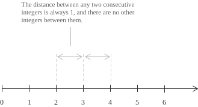

## Axiomatic construction

As discussed in the [general introduction to numbers](../types-of-numbers/), number systems form a hierarchy in which each set is contained in the next:

$$
\mathbb{N} \subset \mathbb{Z} \subset \mathbb{Q} \subset \mathbb{R} \subset \mathbb{C} \tag{1}
$$

The natural numbers, whose set is denoted by $\mathbb{N},$ form the first set in the hierarchy shown in $(1)$ and arise informally from the need to count objects. They can be represented as discrete points on the [real line](../real-numbers/). Starting at $0,$ which we include in $\mathbb{N}$ by convention, they occupy equally spaced positions to the right, corresponding to $0, 1, 2, 3, \dots,$ and extend indefinitely in that direction.

Discreteness is one of the properties that distinguish the [integers](../integers/) from the [rational](../rational-numbers/) and [irrational numbers](../irrational-numbers/), which are densely distributed along the line and can lie between two integers. As the figure shows, the diagram omits the negative integers, which do not belong to $\mathbb{N}$ and are introduced when the natural numbers are extended to $\mathbb{Z}.$

Formally, the natural numbers are introduced through the Peano axioms. These describe $\mathbb{N}$ by specifying some of its defining properties, including a distinguished element, zero, and a successor function $S : \mathbb{N} \to \mathbb{N},$ subject to the following conditions:

$$
\begin{align}
&\text{(P1)} \quad 0 \in \mathbb{N} \\[6pt]
&\text{(P2)} \quad \forall \ n \in \mathbb{N}, \ S(n) \in \mathbb{N} \\[6pt]
&\text{(P3)} \quad \forall \ n \in \mathbb{N}, \ S(n) \neq 0 \\[6pt]
&\text{(P4)} \quad \forall \ m, n \in \mathbb{N}, \ S(m) = S(n) \implies m = n \\[6pt]
&\text{(P5)} \quad \text{principle of induction}
\end{align}
$$

These axioms have the following meanings:

+ $(P1)$ ensures that $\mathbb{N}$ has an initial element from which to begin the construction of the set.
+ $(P2)$ concerns the successor operation $S$ and states that the successor of a natural number is again a natural number.
+ $(P3)$ states that $0$ is not the successor of any natural number.
+ $(P4)$ ensures that distinct natural numbers have distinct successors. Together with $(P3),$ it ensures that repeatedly applying $S$ from $0$ produces a new element at each step.
+ $(P5)$ is the [principle of induction](../principle-of-mathematical-induction/), which states that a subset $A\subseteq\mathbb{N}$ coincides with $\mathbb{N}$ if it contains $0$ and the successor of each of its elements.

> To prove that a property holds for all natural numbers, the principle of induction requires us to verify it for $0$ and to prove that, for every $n\in\mathbb{N},$ if it holds for $n,$ then it also holds for $S(n).$

## Set-theoretic construction

The Peano axioms do not provide an explicit model of $\mathbb{N}.$ They specify the properties that natural numbers must have without specifying the objects that represent them. Modern mathematics provides a construction of $\mathbb{N}$ within [set theory](../sets/), in which zero is identified with the empty set and the successor of a natural number is defined as the union of that number with the singleton containing it:

$$ \tag{1}
\begin{align}
&0 = \varnothing \\[6pt]
&S(n) = n \cup \{n\}
\end{align}
$$

Repeatedly applying $S$ produces a sequence of sets that realises the natural numbers. For example, to obtain the natural number $1,$ we apply $S$ to $0=\varnothing,$ since $1$ is the successor of $0.$ This gives $1=S(0)=0\cup\{0\}=\{\varnothing\}.$ The same procedure gives the other numbers:

$$
\begin{align}
&\vdots\\[6pt]
&2 = \{0, 1\} = \{\varnothing, \{\varnothing\}\} \\[6pt]
&3 = \{0, 1, 2\} \\[6pt]
&4 = \{0, 1, 2, 3\} \\[6pt]
&\vdots
\end{align}
$$

In the construction shown in $(1),$ each natural number coincides with the set of all natural numbers preceding it, so the number $n$ has exactly $n$ elements.

## Addition of natural numbers

To study addition, we fix a natural number $m$ and construct a [sequence](../sequences/) that starts at $m$ and moves to the successor at each step. After $n$ steps, the result is the sum $m + n,$ in which the first summand gives the starting point and the second gives the number of applications of $S.$ We write $S^n$ for the function that applies the successor $n$ times. When $n = 0,$ no step is taken, so $S^0(m) = m.$ Each further step is described by the relation $S^{S(n)}(m) = S(S^n(m)).$ This allows us to define addition as the binary operation $+ : \mathbb{N} \times \mathbb{N} \to \mathbb{N}$ given by:

$$
m + n := S^n(m) \tag{2}
$$

Definition $(2)$ is equivalent to the following recursive conditions, which hold for every $m, n \in \mathbb{N}$:

$$ \tag{3}
\begin{align}
&m + 0 = m \\[6pt]
&m + S(n) = S(m + n)
\end{align}
$$

The first condition specifies the initial value, while the second allows us to calculate the sum once the sum for the preceding value of the second summand is known. For fixed $m,$ the sum defines a function $\mathbb{N} \to \mathbb{N}.$ Since $S$ maps each natural number to another natural number, the result of addition is also a natural number. For example, we can apply the recursive definition in $(3)$ to the sum $4 + 2.$ Since $2=S(1),$ the sum $4+2$ is the successor of $4+1.$ In turn, since $1=S(0),$ the sum $4+1$ is the successor of $4+0.$ We therefore obtain:

$$
\begin{align}
4+2 &= S(4+1) \\[6pt]
&= S(S(4+0)) \\[6pt]
&= S(S(4)) \\[6pt]
&= S(5) \\[6pt]
&= 6
\end{align}
$$

Thus, adding two numbers $m$ and $n$ means starting at $m$ and applying the successor function $n$ times.

- - -

Having described the construction of addition on the natural numbers, we turn to associativity, which states that regrouping the summands does not change the sum. For any three numbers $a, b, c \in \mathbb{N},$ the following equality holds:

$$
(a + b) + c = a + (b + c) \tag{4}
$$

We fix $a$ and $b$ and proceed by induction on $c.$ When $c = 0,$ both sides reduce to $a + b.$ Suppose that $(4)$ holds for a natural number $c.$ We must show that it also holds for its successor, that is, that the following equality holds:

$$(a+b)+S(c)=a+(b+S(c))$$

Starting from the left-hand side, we use the recursive definition of addition and the inductive hypothesis to obtain:

$$
\begin{align}
(a+b)+S(c) &= S((a+b)+c) \\[6pt]
&= S(a+(b+c)) \\[6pt]
&= a+S(b+c) \\[6pt]
&= a+(b+S(c))
\end{align}
$$

We have therefore proved that, if $(4)$ holds for $c,$ then it also holds for $S(c).$ Since it holds for $c=0,$ the principle of induction ensures that it holds for every $c\in\mathbb{N}.$

- - -

We now prove commutativity, which states that exchanging the summands does not change the sum. We want to show that the following equality holds for every $a,n\in\mathbb{N}$:

$$a+n=n+a \tag{5}$$

First, we must prove that $0+n=n$ for every $n\in\mathbb{N}.$ We compare the functions $u(n)=0+n$ and $v(n)=n.$ For $n=0,$ the first relation in $(3)$ gives $u(0)=0+0=0,$ while the definition of $v$ gives $v(0)=0.$ The two functions therefore have the same initial value. Passing from $n$ to $S(n),$ we obtain the following identities from $(3)$ and the definitions of the functions:

$$ \tag{6}
\begin{align}
u(S(n)) &= 0+S(n)=S(0+n)=S(u(n)) \\[6pt]
v(S(n)) &= S(n)=S(v(n))
\end{align}
$$

The equalities in $(6)$ show that $u$ and $v$ obtain their values at $S(n)$ by applying the successor to their respective values at $n.$ Since they start from the same value and follow the same rule, the uniqueness part of the recursion theorem ensures that the following equality holds for every $n\in\mathbb{N}$:

$$u(n)=v(n) \tag{7}$$

For now, we take this result as given; it will be explained below. Substituting the definitions of $u$ and $v$ into $(7)$ gives $0+n=n.$ Together with the identity $n+0=n,$ already included in $(3),$ this proves that $0$ is the identity element for addition.

Second, we must show that applying the successor to the first summand has the same effect as applying it to the sum. This is expressed by the following equality:

$$S(a)+n=S(a+n)$$

For this purpose, we fix $a$ and compare the following functions:

$$
\begin{align}
p(n) &= S(a)+n \\[6pt]
q(n) &= S(a+n)
\end{align}
$$

At $0,$ both functions have the value $S(a),$ and $(3)$ gives:

$$ \tag{8}
\begin{align}
p(S(n)) &= S(a)+S(n)=S(S(a)+n)=S(p(n)) \\[6pt]
q(S(n)) &= S(a+S(n))=S(S(a+n))=S(q(n))
\end{align}
$$

Again, uniqueness in the recursion theorem implies that the two functions coincide, so $S(a)+n=S(a+n).$ We can now complete the proof by fixing $a$ and comparing two further functions:

$$
\begin{align}
f(n) &= a+n \\[6pt]
g(n) &= n+a
\end{align}
$$

The identities involving zero give:

$$f(0)=a+0=a=0+a=g(0)$$

At the successor, we obtain:

$$
\begin{align}
f(S(n)) &= a+S(n)=S(a+n)=S(f(n)) \\[6pt]
g(S(n)) &= S(n)+a=S(n+a)=S(g(n))
\end{align}
$$

By uniqueness in the recursion theorem, $f=g,$ and hence $a+n=n+a$ for every $n\in\mathbb{N}.$ This proves the commutativity of addition.

- - -

We briefly state the recursion theorem, since only its conclusion is needed here. Given a set $X,$ an element $x_0\in X$ and a function $T:X\to X,$ the theorem asserts that a unique function $h:\mathbb{N}\to X$ satisfies $h(0)=x_0$ and $h(S(n))=T(h(n))$ for every $n\in\mathbb{N}.$

Thus, if two functions $h$ and $k$ satisfy these conditions, they have the same initial value, $h(0)=k(0)=x_0.$ Both also calculate their value at $S(n)$ by applying the same function $T$ to their respective values at $n$:

$$ \tag{9}
\begin{align}
h(S(n)) &= T(h(n)) \\[6pt]
k(S(n)) &= T(k(n))
\end{align}
$$

Assuming that $h(n)=k(n),$ we obtain from $(9)$:

$$h(S(n))=T(h(n))=T(k(n))=k(S(n))$$

Induction shows that the functions coincide at every natural number. In the case of $u$ and $v$ in $(7),$ the set $X$ is $\mathbb{N},$ the initial value is $0,$ and the function $T$ is the successor $S.$

- - -

We next establish a useful consequence of combining associativity and commutativity to change the grouping and order of the summands. The following equalities interchange two summands by applying associativity, commutativity and then associativity again:

$$
\begin{align}
(a+b)+c &= a+(b+c) \\[6pt]
&= a+(c+b) \\[6pt]
&= (a+c)+b
\end{align}
$$

With more summands, we obtain the interchange law, which can simplify calculations by regrouping the summands:

$$
\begin{align}
(a+b)+(c+d) &= ((a+b)+c)+d \\[6pt]
&= ((a+c)+b)+d \\[6pt]
&= (a+c)+(b+d)
\end{align}
$$

- - -

Finally, addition satisfies the cancellation property, expressed as follows:

$$a+c=b+c\ \Longrightarrow\ a=b \tag{10}$$

When $c=0,$ the equality reduces directly to $a=b.$ Suppose that the property holds for a natural number $c,$ and consider an equality $a+S(c)=b+S(c).$ Using the recursive definition of addition in $(3),$ we can rewrite it as:

$$S(a+c)=S(b+c)$$

In this equality, the numbers $a+c$ and $b+c$ have the same successor. By the [injectivity](../injective-surjective-and-bijective-functions/) of $S,$ given by $(P4),$ we therefore obtain $a+c=b+c.$ The inductive hypothesis states that cancellation holds when the common summand is $c.$ Applying it to the equality just obtained, we conclude that $a=b.$ We have thus proved that, if the property holds for $c,$ then it also holds for its successor $S(c).$ Since it holds for $c=0,$ the principle of induction ensures that it holds for every $c\in\mathbb{N}.$

## Addition and iteration of functions

We have seen that addition is constructed through a sequence of steps in an iterative process. We can generalise this construction to other functions by taking a set $X,$ a function $f : X \to X$ and defining an iterate $f^n$ obtained by applying $f$ a total of $n$ times. The iterates of $f$ are defined recursively by the following relations, valid for every $x\in X$ and $n\in\mathbb{N}$:

$$ \tag{11}
\begin{align}
f^0(x) &= x \\[6pt]
f^{S(n)}(x) &= f(f^n(x))
\end{align}
$$

For $f = S,$ we recover the iteration of the successor used to define addition in $(3).$ For an arbitrary function, applying it $m$ times and then another $n$ times amounts to applying it $m + n$ times. This gives the identity:

$$\tag{12}
f^{m+n}(x) = f^n(f^m(x))
$$

We can prove this identity by induction on $n,$ keeping $m$ and $x$ fixed. When $n = 0,$ the left-hand side is $f^m(x)$ because $m + 0 = m,$ and the right-hand side has the same value because $f^0$ is the identity function. Suppose that the result holds for $n.$ The definition of addition and $(11)$ give:

$$
\begin{align}
f^{m+S(n)}(x) &= f^{S(m+n)}(x) \\[6pt]
&= f(f^{m+n}(x)) \\[6pt]
&= f(f^n(f^m(x))) \\[6pt]
&= f^{S(n)}(f^m(x))
\end{align}
$$

Since addition has been shown to be commutative, interchanging the two indices gives:

$$
f^n(f^m(x)) = f^{m+n}(x) = f^m(f^n(x))
$$

The iterates of the same function can therefore be [composed](../composite-functions/) in either order with the same result.

## Multiplication and powers

So far, we have studied addition, its definition and its properties. We define multiplication similarly, using a new recursion and imposing the following relations for every $m \in \mathbb{N}$:

$$ \tag{12}
\begin{align}
&m \cdot 0 = 0 \\[6pt]
&m \cdot S(n) = m \cdot n + m
\end{align}
$$

As the definition shows, multiplication is built from addition. For example, we can calculate the product $3 \cdot 2$ using the multiplication rules in $(12)$ to obtain:

$$
\begin{align}
3 \cdot 2 &= 3 \cdot S(S(0)) \\[6pt]
&= 3 \cdot S(0) + 3 \\[6pt]
&= (3 \cdot 0 + 3) + 3 \\[6pt]
&= (0 + 3) + 3 \\[6pt]
&= 6
\end{align}
$$

The calculation repeatedly applies the multiplication clause until the multiplier is reduced to zero. The rules of addition then suffice to obtain the result.

- - -

[Exponentiation](../powers/) is constructed from multiplication by a similar recursion. The analogous recursive relations are given in $(13)$:

$$ \tag{13}
\begin{align}
&m^0 = 1 \\[6pt]
&m^{S(n)} = m^n \cdot m
\end{align}
$$

The second equality reduces a power with base $m$ and a successor exponent to one further multiplication by $m.$ As we have seen, each of these arithmetic operations is defined recursively in terms of the preceding operation.

- - -

To complete the discussion, multiplication is associative and commutative, has $1$ as its identity element, and is distributive over addition. The following equalities therefore hold for every $a, b, c \in \mathbb{N}$:

$$
\begin{align}
&(a \cdot b) \cdot c = a \cdot (b \cdot c) \\[6pt]
&a \cdot b = b \cdot a \\[6pt]
&a \cdot 1 = a \\[6pt]
&a \cdot (b + c) = a \cdot b + a \cdot c
\end{align}
$$

Multiplication also satisfies cancellation of nonzero factors. For every $a, b, c \in \mathbb{N},$ the equality $a \cdot c = b \cdot c$ implies $a = b$ when $c \neq 0.$ Finally, the natural numbers have no zero divisors, meaning that the product of two natural numbers is zero only if at least one of the two factors is zero.

- - -

We now prove that multiplication is distributive over addition, that is, that the following relation holds for every $a,b,c\in\mathbb{N}$:

$$ \tag{14}
a\cdot(b+c)=a\cdot b+a\cdot c
$$

Fix two natural numbers $a$ and $b$ and proceed by induction on $c.$ When $c=0,$ the sum $b+0$ equals $b$ and the product $a\cdot 0$ equals $0,$ so the two sides of the equality agree:

$$
\begin{align}
a\cdot(b+0) &= a\cdot b \\[6pt]
&= a\cdot b+0 \\[6pt]
&= a\cdot b+a\cdot 0
\end{align}
$$

Suppose that $(14)$ holds for an arbitrary natural number $c.$ We must show that $a\cdot(b+S(c))=a\cdot b+a\cdot S(c).$ By $(3),$ we have $b+S(c)=S(b+c).$ Applying the recursive definition of multiplication gives:

$$
\begin{align}
a\cdot(b+S(c)) &= a\cdot S(b+c) \\[6pt]
&= a\cdot(b+c)+a
\end{align}
$$

In the last expression, the induction hypothesis allows us to replace $a\cdot(b+c)$ with $a\cdot b+a\cdot c.$ We then use the associativity of addition to group the last two summands and obtain:

$$
\begin{align}
a\cdot(b+c)+a &= (a\cdot b+a\cdot c)+a \\[6pt]
&= a\cdot b+(a\cdot c+a) \\[6pt]
&= a\cdot b+a\cdot S(c)
\end{align}
$$

The property therefore holds for every $c\in\mathbb{N},$ and since $a$ and $b$ were chosen arbitrarily, distributivity is proved for all natural numbers. The commutativity of multiplication also gives distributivity when the first factor is a sum:

$$
\begin{align}
(a+b)\cdot c &= c\cdot(a+b) \\[6pt]
&= c\cdot a+c\cdot b \\[6pt]
&= a\cdot c+b\cdot c
\end{align}
$$

## Order

The set $\mathbb{N}$ has a total order, which can be defined directly in terms of addition. Given two natural numbers $m$ and $n,$ the relation $m \leq n$ holds if and only if a natural number $k$ satisfies the following equality:

$$
n = m + k \tag{14}
$$

The number $k$ exists precisely when $m\leq n$ and gives the number of applications of the successor needed to reach $n$ from $m.$ Totality means that, for any two natural numbers $m$ and $n,$ at least one of the relations $m\leq n$ or $n\leq m$ holds. The order defined in this way has two further properties:

+ Trichotomy states that, for every $m, n \in \mathbb{N},$ exactly one of the relations $m < n,$ $m = n,$ $n < m$ holds.
+ Discreteness states that no natural number lies strictly between two consecutive natural numbers. Thus, for every $n \in \mathbb{N},$ no $k \in \mathbb{N}$ satisfies $n < k < S(n).$

The order described here is a well-ordering, meaning that every non-empty subset of $\mathbb{N}$ has a least element with respect to $\leq.$
