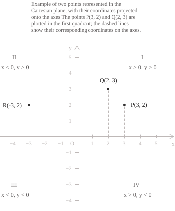
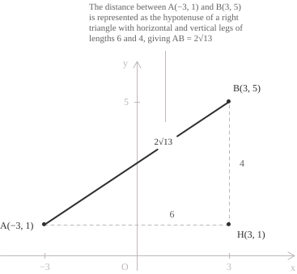
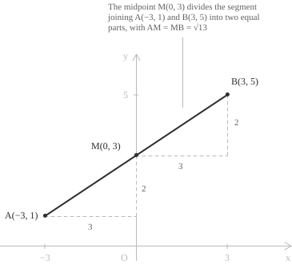
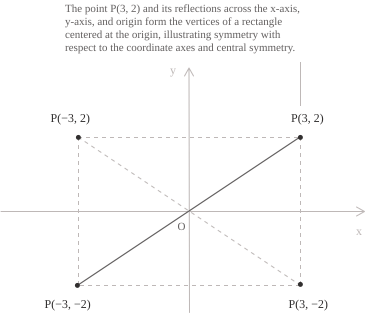
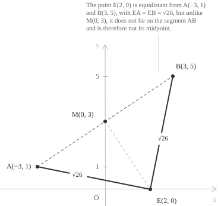

## Construction

On the [real number line](../real-numbers/), each point is identified by a single number. In the plane, however, we need two coordinates to determine a point's position. This is the basis of the Cartesian coordinate plane, which is constructed from two [perpendicular lines](../lines/), called the coordinate axes. They intersect at the origin $O=(0,0),$ the only point they have in common. The horizontal axis, or $x$-axis, is also called the axis of abscissas, while the vertical axis, or $y$-axis, is called the axis of ordinates. We choose the same unit of length on both axes.

Consider an arbitrary point $P$ in the plane and draw lines through it parallel to the axes. The line parallel to the $y$-axis meets the $x$-axis at the point with coordinate $a,$ while the line parallel to the $x$-axis meets the $y$-axis at the point with coordinate $b.$ We can therefore identify $P$ by the ordered pair $(a,b)$ and write:

$$P(a,b) \tag{1}$$

The construction also works in reverse. Given two real numbers $a$ and $b,$ the vertical line through $(a,0)$ and the horizontal line through $(0,b)$ intersect at a unique point, which is our point $P.$ This gives a [one-to-one correspondence](../injective-surjective-and-bijective-functions/) between the points of the plane and the ordered pairs of real numbers that specify their positions. The set of these pairs is the [Cartesian product](../sets/) of $\mathbb{R}$ with itself, so we can write:

$$\mathbb{R}^2 = \mathbb{R} \times \mathbb{R} = \{(x,y) \mid x \in \mathbb{R},\ y \in \mathbb{R}\}$$

The coordinates in $(1)$ form an ordered pair, so their order matters when identifying a point. Consider, for example, the points $P=(3,2)$ and $Q=(2,3).$ These are distinct points, even though the same numbers appear in both pairs. In general, two pairs identify the same point if and only if their corresponding coordinates are equal:

$$ (a,b)=(c,d) \quad \Longleftrightarrow \quad a=c \text{ and } b=d $$

The coordinate axes divide the plane into four quadrants, numbered counterclockwise from the upper right. The coordinates satisfy the following conditions in each quadrant:

+ I: $x>0$ and $y>0$
+ II: $x<0$ and $y>0$
+ III: $x<0$ and $y<0$
+ IV: $x>0$ and $y<0$

For example, the point $R(-3,2)$ lies in the second quadrant and satisfies the conditions, $x<0$ and $y>0.$ The point $S(-3/2,-\sqrt{2})$ lies in the third quadrant and satisfies the conditions, $x<0$ and $y<0.$

## Euclidean distance

Once we have located two points in the plane, we may want to know how far apart they are. The answer is given by the Euclidean distance $d(A,B)$ between $A(x_1,y_1)$ and $B(x_2,y_2),$ which is the length of the line segment joining them. When the points coincide, their distance is zero. Suppose first that $x_1\ne x_2$ and $y_1\ne y_2.$ Introduce the point $H(x_2,y_1)$ and join it to $A$ and $B$ to form a triangle with a right angle at $H.$ The segment $AH$ is the horizontal leg, and $HB$ is the vertical leg. Their lengths are:

$$AH=|x_2-x_1| \qquad HB=|y_2-y_1|$$

We apply the [Pythagorean theorem](../pythagorean-theorem/) to find the length of the hypotenuse, which is precisely the distance we want to determine between $A$ and $B.$ Recall that we use [absolute values](../absolute-value/) for the lengths because a difference of coordinates may be negative, whereas a length is always nonnegative:

$$
\begin{align}
d(A,B)^2 &= |x_2-x_1|^2+|y_2-y_1|^2 \\[6pt]
&= (x_2-x_1)^2+(y_2-y_1)^2 \tag{2}
\end{align}
$$

We obtain $d(A,B)$ from $(2)$ by taking the nonnegative [square root](../radicals/), since a distance cannot be negative:

$$d(A,B)=\sqrt{(x_2-x_1)^2+(y_2-y_1)^2} \tag{3}$$

If $y_1=y_2,$ the segment is horizontal and $(3)$ gives $|x_2-x_1|.$ If $x_1=x_2,$ the segment is vertical and the formula gives $|y_2-y_1|.$ If the points coincide, it gives zero. The formula therefore also applies when the construction does not form a triangle.

Formula $(3)$ gives the distance between any two points in the plane. Let us apply it to a specific example with $A=(-3,1)$ and $B=(3,5).$ Moving from $A$ to $B,$ the horizontal change is $3-(-3)=6,$ and the vertical change is $5-1=4.$ The figure shows the [right triangle](../right-triangle-trigonometry/) constructed from these two changes.

The leg $AH$ has length $|3-(-3)|=6,$ while the leg $HB$ has length $|5-1| = 4.$ Substituting these values into $(3)$ gives:

$$
\begin{align}
d(A,B)&=\sqrt{(3-(-3))^2+(5-1)^2} \\[6pt]
&=\sqrt{36+16}=\sqrt{52} \\[6pt]
&=2\sqrt{13}
\end{align}
$$

The distance between the two points is therefore $2\sqrt{13}.$ Notice that interchanging $A$ and $B$ changes the signs of the differences but leaves their squares unchanged, so $d(A,B)=d(B,A).$

## The midpoint

The midpoint of a line segment $AB$ is the point $M$ on the segment that is equidistant from its endpoints. The coordinates of $M$ are therefore the [arithmetic means](../arithmetic-mean/) of the corresponding coordinates of the endpoints:

$$
\begin{align}
x_M&=x_1+\frac{x_2-x_1}{2}=\frac{x_1+x_2}{2} \\[6pt]
y_M&=y_1+\frac{y_2-y_1}{2}=\frac{y_1+y_2}{2}
\end{align}
$$

We can therefore write:

$$M=\left(\frac{x_1+x_2}{2},\frac{y_1+y_2}{2}\right) \tag{4}$$

To obtain $M,$ we start at $A$ and halve both the horizontal and the vertical changes needed to reach $B.$ This takes us halfway along the segment $AB,$ so $M$ lies on the segment.

To check the distance from $M$ to $A,$ we apply $(3)$ and obtain:

$$d(A,M)=\sqrt{\left(\frac{x_2-x_1}{2}\right)^2+\left(\frac{y_2-y_1}{2}\right)^2}=\frac{d(A,B)}{2}$$

The differences between the coordinates of $B$ and those of $M$ are the same, so the same result holds for $d(M,B).$ Returning to our earlier example with $A=(-3,1)$ and $B=(3,5),$ we use $(4)$ to find the midpoint:

$$M=\left(\frac{-3+3}{2},\frac{1+5}{2}\right)=(0,3)$$

The midpoint is therefore $M=(0,3).$ To find its distances from $A$ and $B,$ we substitute the coordinates into $(3)$ and obtain:

$$
\begin{align}
d(A,M)&=\sqrt{(0-(-3))^2+(3-1)^2}=\sqrt{13} \\[6pt]
d(M,B)&=\sqrt{(3-0)^2+(5-3)^2}=\sqrt{13}
\end{align}
$$

As we would expect from the definition of the midpoint, both distances are $\sqrt{13}.$ The figure illustrates the calculation:

The calculation also works in reverse. If we know $A=(x_1,y_1)$ and the midpoint $M=(u,v),$ the equalities $2u=x_1+x_2$ and $2v=y_1+y_2$ allow us to find the other endpoint directly:

$$B=(2u-x_1,\ 2v-y_1) \tag{5}$$

For example, with $A=(-3,1)$ and $M=(0,3),$ we readily obtain:

$$B=(2\cdot0-(-3),\ 2\cdot3-1)=(3,5)$$

## Symmetry of points

Formula $(5)$ also gives the rule for central symmetry. Two points are symmetric about a centre $C$ when $C$ is the midpoint of the segment joining them. For example, if $C$ is the origin, we set $u=v=0$ and find that the point symmetric to $P=(a,b)$ is:

$$P_O=(-a,-b)$$

Geometrically, this transformation is a [rotation](../angles-and-angular-measure/) through $180^\circ$ about $O.$ The same construction applies to any centre $C=(u,v)$ and gives the point $(2u-a,\ 2v-b).$

A similar argument applies to symmetry about the coordinate axes. Reflection in the $x$-axis leaves a point's horizontal coordinate unchanged and reverses the sign of its vertical coordinate. The point symmetric to an arbitrary point $P=(a,b)$ is therefore:

$$P_x=(a,-b)$$

For reflection in the $y$-axis, we obtain:

$$P_y=(-a,b)$$

For a concrete example, consider $P=(3,2).$ Reflection in the $x$-axis gives $P_x=(3,-2),$ reflection in the $y$-axis gives $P_y=(-3,2),$ and central symmetry about the origin gives $P_O=(-3,-2).$ In the figure, the four points are the vertices of a rectangle centred at the origin.

As you can see, reflecting first in one axis and then in the other reverses the signs of both coordinates, producing central symmetry. The origin is the only point left fixed by central symmetry about $O,$ since the conditions $a=-a$ and $b=-b$ require $a=b=0.$

## Final remarks

Cartesian coordinates also allow us to find points from their geometric properties. For example, fix a centre $C=(a,b)$ and a length $r>0.$ By $(3),$ a point $P=(x,y)$ lies at distance $r$ from $C$ if and only if it satisfies:

$$\sqrt{(x-a)^2+(y-b)^2}=r$$

Squaring both sides gives the equation of the [circle](../circumference/) with centre $C$ and radius $r:$

$$ (x-a)^2+(y-b)^2=r^2 $$

For another example, we seek a point $E$ on the $x$-axis that is equidistant from $A=(-3,1)$ and $B=(3,5).$ Since $E$ lies on the $x$-axis, we can write $E=(t,0).$ Both distances are nonnegative, so they are equal if and only if their squares are equal. We can therefore write:

$$ (t+3)^2+1=(t-3)^2+25 $$

Expanding and solving for $t$ gives:

$$
\begin{align}
t^2+6t+10&=t^2-6t+34 \\[6pt]
12t&=24 \\[6pt]
t&=2
\end{align}
$$

The point we seek is therefore $E=(2,0).$ Checking the distances gives:

$$
\begin{align}
d(E,A)&=\sqrt{5^2+(-1)^2}=\sqrt{26} \\[6pt]
d(E,B)&=\sqrt{(-1)^2+(-5)^2}=\sqrt{26}
\end{align}
$$

The point $E$ is equidistant from $A$ and $B,$ but it is not the midpoint of the segment. In our earlier examples, we found $M=(0,3),$ which differs from $E.$ This example explains why the definition of the midpoint must also require that the point lie on the segment.
