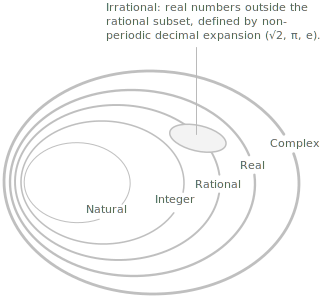

## Introduction

Numbers organise into nested families, each extending the previous one to accommodate quantities that the smaller family cannot represent. The main numerical [sets](../sets/), listed in order of inclusion, are the natural numbers $\mathbb{N}$, the [integers](../integers/) $\mathbb{Z}$, the [rational numbers](../rational-numbers/) $\mathbb{Q}$, the [real numbers](../real-numbers/) $\mathbb{R}$, and the [complex numbers](../complex-numbers/) $\mathbb{C}$. The [irrational numbers](../irrational-numbers/) $\mathbb{I}$ occupy a complementary position within $\mathbb{R}$ rather than forming a separate step in the hierarchy. The inclusion relationships among these sets are the following:

$$
\mathbb{N} \subset \mathbb{Z} \subset \mathbb{Q} \subset \mathbb{R} \subset \mathbb{C}, \qquad \mathbb{I} \subset \mathbb{R}
$$

A further classification, transversal to this hierarchy, partitions $\mathbb{R}$ into the algebraic numbers $\mathbb{A}$ and the transcendental ones, refining the distinction between rational and irrational. The structure of these sets reflects how each extension resolves a limitation of the previous one, until $\mathbb{C}$ is reached, within which every [polynomial equation](../polynomial-equations/) has a solution.
## Natural numbers

The set of [natural numbers](../natural-numbers/), denoted by $\mathbb{N}$, is the collection of non-negative integers used to count discrete quantities:

$$
\mathbb{N} = \\{0, 1, 2, 3, 4, \ldots\\}
$$

Each element is obtained by adding one to the previous, starting from $0$. Because natural numbers express how many elements a collection contains, they are also called cardinal numbers. Whether zero belongs to $\mathbb{N}$ is a matter of convention that varies across traditions; the two most common choices are recorded below:

$$
\mathbb{N}_0 = \\{0, 1, 2, 3, \ldots\\}
$$

$$
\mathbb{N}^+ = \\{1, 2, 3, \ldots\\}
$$

From a foundational point of view, $\mathbb{N}$ is the smallest inductive set contained in $\mathbb{R}$. It contains $0$ and, whenever it contains an element $n$, it also contains $n+1$. This property is the basis of the [principle of mathematical induction](../principle-of-mathematical-induction/).

## Integers

The set of integers, denoted by $\mathbb{Z}$, extends $\mathbb{N}$ by adjoining a negative counterpart to every positive natural number:

$$
\mathbb{Z} = \\{\ldots, -3, -2, -1, 0, 1, 2, 3, \ldots\\}
$$

Every integer is either positive, negative, or zero. The set $\mathbb{Z}$ can be expressed as the union of the natural numbers and their negatives:

$$
\mathbb{Z} = \mathbb{N} \cup \\{-n : n \in \mathbb{N}^+\\}
$$

When the sign or the exclusion of zero are relevant, the following subsets are used:

$$
\begin{align}
\mathbb{Z}^+ &= \{1, 2, 3, \ldots\} \\[6pt]
\mathbb{Z}^- &= \{-1, -2, -3, \ldots\} \\[6pt]
\mathbb{Z}^* &= \mathbb{Z} \setminus \{0\}
\end{align}
$$

The passage from $\mathbb{N}$ to $\mathbb{Z}$ makes subtraction always well-defined: for any $a, b \in \mathbb{Z}$ the difference $a - b$ is again an integer. A subtraction such as $3 - 5$, which has no value inside $\mathbb{N}$, produces the integer $-2$ as soon as the negative counterparts are available. From an algebraic standpoint, $(\mathbb{Z}, +)$ is an abelian [group](../groups/) and $(\mathbb{Z}, +, \cdot)$ is a commutative [ring](../rings/) with unity, although not a field, since most integers lack a multiplicative inverse. A dedicated entry covers the properties of [integers](../integers/) in detail.

## Rational numbers

The set of [rational numbers](../rational-numbers/), denoted by $\mathbb{Q}$, consists of all numbers that can be expressed as a ratio of two integers with a nonzero denominator:

$$
\mathbb{Q} = \left \{ \frac{p}{q} : p, q \in \mathbb{Z}, \ q \neq 0 \right\}
$$

Every integer is rational, since any $n \in \mathbb{Z}$ can be written as $n/1$. The decimal expansion of a rational number is either terminating or eventually periodic. For example, $1/4 = 0.25$ and $1/3 = 0.\overline{3}$. The following are further examples of rational numbers:

$$
\frac{-5}{4}, \quad \frac{12}{7}, \quad -8, \quad \frac{25}{19}
$$

The passage from $\mathbb{Z}$ to $\mathbb{Q}$ makes division by any nonzero integer always well-defined. In algebraic terms, $\mathbb{Q}$ is the smallest [field](../fields/) containing $\mathbb{Z}$, constructed by adjoining a multiplicative inverse to every nonzero integer.

## Irrational numbers

A real number is [irrational](../irrational-numbers/) if it cannot be expressed as a ratio of two integers. The set of irrational numbers is denoted by $\mathbb{I}$, and it satisfies $\mathbb{R} = \mathbb{Q} \cup \mathbb{I}$ with $\mathbb{Q} \cap \mathbb{I} = \emptyset$. The decimal expansion of an irrational number is non-terminating and non-periodic. Familiar examples include the following:

$$
\sqrt{2}, \quad \sqrt{3}, \quad \pi, \quad e, \quad -\sqrt[3]{5}
$$

The irrationality of $\sqrt{2}$ is one of the oldest results in mathematics and admits a concise proof by contradiction. Assuming $\sqrt{2} = p/q$ in lowest terms leads to the conclusion that both $p$ and $q$ are even, contradicting the assumption. 

The numbers $\pi$ and $e$ are irrational, but belong to a further distinguished class: they are transcendental, that is, they are not roots of any nonzero polynomial with rational coefficients.

## Real numbers

The set of [real numbers](../real-numbers/), denoted by $\mathbb{R}$, is the union of the rational and irrational numbers:

$$
\mathbb{R} = \mathbb{Q} \cup \mathbb{I}
$$

The passage from $\mathbb{Q}$ to $\mathbb{R}$ fills the gaps left by the rationals, ensuring that every convergent [sequence](../sequences/) has a [limit](../limits/) within the set. Every real number admits a decimal representation of the form:

$$
p.\alpha_0 \ \alpha_1 \ \alpha_2 \ \alpha_3\ \ ldots
$$

The components are interpreted as follows:

+ $p \in \mathbb{Z}$ is the integer part, which may be positive, negative, or zero.
+ $\alpha_0, \alpha_1, \alpha_2, \ldots$ are the decimal digits, each belonging to $\\{0, 1, \ldots, 9\\}$.
+ The index $k \in \mathbb{N}$ ranges over all natural numbers, so the decimal expansion continues indefinitely.

For rational numbers the decimal expansion is eventually periodic. For irrational numbers it is non-terminating and non-periodic.

- - -

Geometrically, $\mathbb{R}$ corresponds to the points of a continuous straight line, the real number line, with no gaps.

Completeness is what distinguishes $\mathbb{R}$ from $\mathbb{Q}$. The sequence of rational approximations to $\sqrt{2}$, for instance, has no limit within $\mathbb{Q}$, but its limit exists in $\mathbb{R}$. The topic of least upper bounds is treated in the entry on [supremum and infimum](../supremum-and-infimum/).

The set $\mathbb{R}$ is totally ordered: for any two real numbers $x$ and $y$, exactly one of the relations $x < y$, $x = y$, or $x > y$ holds. $\mathbb{R}$ satisfies the Archimedean property: for every real number $x$ there exists a natural number $n$ such that $n > x$. The property rules out the existence of infinitely large or infinitely small elements within $\mathbb{R}$.

Both $\mathbb{Q}$ and $\mathbb{I}$ are dense in $\mathbb{R}$: every open interval, however small, contains both rational and irrational numbers. The two families interleave at every scale of the real line, although they will turn out to differ profoundly in size.

A further structural distinction separates $\mathbb{Q}$ from $\mathbb{R}$ at the level of cardinality. The rational numbers form a countable set, meaning their elements can be put in one-to-one correspondence with $\mathbb{N}$. The real numbers, by contrast, are uncountable, as shown by Cantor's diagonal argument. In this precise sense, the irrational numbers constitute the vast majority of the real line. The properties of the real number system are discussed further in the entry on [properties of real numbers](../properties-of-real-numbers/).

Since zero carries no sign, it does not belong to either the positive or negative reals. The following terminology is standard: a non-negative real number satisfies $x \geq 0$, while a non-positive real number satisfies $x \leq 0$.

## Algebraic and transcendental numbers

A real number is algebraic if it is a root of some nonzero polynomial with rational coefficients, and transcendental otherwise. The set of algebraic numbers is denoted by $\mathbb{A}$, and every real number belongs to exactly one of the two classes:

$$
\mathbb{R} = \mathbb{A} \cup (\mathbb{R} \setminus \mathbb{A})
$$

$$
\mathbb{A} \cap (\mathbb{R} \setminus \mathbb{A}) = \emptyset
$$

Every rational number $p/q$ is algebraic, since it is a root of the linear polynomial $qx - p$. Several familiar irrational numbers are algebraic as well: $\sqrt{2}$ is a root of $x^2 - 2$, and $\sqrt[3]{5}$ is a root of $x^3 - 5$. The classification into algebraic and transcendental numbers refines the partition into rational and irrational, and produces a finer subdivision of $\mathbb{R}$:

$$
\mathbb{Q} \subset \mathbb{A}, \qquad \mathbb{A} \setminus \mathbb{Q} \subset \mathbb{I}
$$

The transcendental numbers are the real numbers that lie outside $\mathbb{A}$. The two most important examples are $\pi$ and $e$.

> The set $\mathbb{A}$ is countable, because the polynomials with rational coefficients form a countable family and each polynomial has finitely many roots. Since $\mathbb{R}$ is uncountable, the transcendental numbers form an uncountable set, and in this sense almost every real number is transcendental, even though explicit examples are comparatively rare.

## Complex numbers

The set of [complex numbers](../complex-numbers/), denoted by $\mathbb{C}$, extends $\mathbb{R}$ by introducing an element $i$ satisfying $i^2 = -1$. Every complex number admits a unique decomposition into a real and an imaginary component, written as follows:

$$
z = a + bi
$$

In this expression $a$ and $b$ are real numbers, called respectively the real part and the imaginary part of $z$. When $b = 0$ the number reduces to a real number, so $\mathbb{R} \subset \mathbb{C}$. When $a = 0$ and $b \neq 0$ the number is purely imaginary, as in the cases $i$, $-3i$, and $\sqrt{2}\ i$.

Geometrically, $\mathbb{C}$ is identified with the Euclidean plane by representing $z = a + bi$ as the point of coordinates $(a, b)$. The horizontal axis corresponds to the real numbers and the vertical axis to the purely imaginary ones, and the algebraic operations acquire a direct geometric interpretation, developed in the dedicated entry.

The passage to $\mathbb{C}$ makes it possible to take square roots of negative numbers and, more generally, to factor every polynomial completely. By the fundamental theorem of algebra, every non-constant polynomial with complex coefficients has at least one root in $\mathbb{C}$. 

This closure property is not shared by $\mathbb{R}$: the polynomial $x^2 + 1$, for instance, has no real roots. A full treatment of complex numbers is given in the dedicated entry on [complex numbers](../complex-numbers/).
