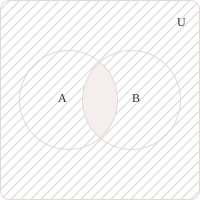

## Definition

De Morgan's laws describe the relationships between union, intersection, and set complementation. Consider two subsets $A$ and $B$ of the same universal [set](../sets/) $U,$ and write $A^c = U \setminus A$ for the complement of $A$ with respect to $U.$ The two laws state that:

$$ \tag{1}
\begin{align}
(A \cup B)^c &= A^c \cap B^c \\[6pt]
(A \cap B)^c &= A^c \cup B^c
\end{align}
$$

The first law states that the complement of the union of two sets equals the intersection of their complements. Indeed, an element of $U$ does not belong to $A \cup B$ if and only if it belongs to neither $A$ nor $B,$ which is equivalent to belonging to both $A^c$ and $B^c,$ and hence to their intersection.

$$(A \cup B)^c = A^c \cap B^c$$

The second law states that the complement of the intersection of two sets equals the union of their complements. Indeed, an element of $U$ does not belong to $A \cap B$ if and only if at least one of the two sets does not contain it. The element therefore belongs to at least one of $A^c$ and $B^c,$ that is, to their union.

$$(A \cap B)^c = A^c \cup B^c$$

These laws extend to an arbitrary family of subsets $(A_i)_{i\in I}$ of the same universal set $U,$ with no restriction on the [cardinality](../cardinality-and-countable-sets/) of the index set $I.$ All complements are taken with respect to $U,$ and the following identities hold, analogous to those in $(1):$

$$ \tag{2}
\begin{align}
\left(\bigcup_{i \in I} A_i\right)^c &= \bigcap_{i \in I} A_i^c \\[6pt]
\left(\bigcap_{i \in I} A_i\right)^c &= \bigcup_{i \in I} A_i^c
\end{align}
$$

The first equality states that an element of $U$ lies outside the union if and only if it belongs to none of the sets $A_i,$ that is, if it belongs to all the complements $A_i^c.$ The second equality states that an element of $U$ lies outside the intersection if and only if at least one $A_i$ does not contain it, that is, if it belongs to the union of the complements.

> When $I = \emptyset,$ we adopt the conventions $\bigcup_{i\in\emptyset} A_i = \emptyset$ and $\bigcap_{i\in\emptyset} A_i = U.$ With these conventions, the identities in $(2)$ also hold for the empty family.

- - -

The preceding argument relies on negating membership conditions and can also be expressed using [logical connectives](../propositional-logic/). For two sets, for example, fix an element $x\in U$ and let $P$ denote the proposition $x\in A$ and $Q$ the proposition $x\in B.$ The element $x$ belongs to the union $A\cup B$ if and only if at least one of the two propositions is true, whereas it belongs to the intersection $A\cap B$ if and only if both are true.

Union therefore corresponds to disjunction $\lor,$ intersection to conjunction $\land,$ and complementation to negation $\neg.$ De Morgan's laws express this relationship through the following equivalences, which hold for any two propositions:

$$ \tag{3}
\begin{align}
\neg(P \lor Q) &\equiv \neg P \land \neg Q \\[6pt]
\neg(P \land Q) &\equiv \neg P \lor \neg Q
\end{align}
$$

The first equivalence in $(3)$ states that negating the assertion that at least one of the two propositions is true is equivalent to asserting that both are false. The second states that negating the assertion that both are true is equivalent to asserting that at least one is false. We can verify these equivalences using truth tables, considering all combinations of the truth values of $P$ and $Q$ and using $\mathrm{T}$ for true and $\mathrm{F}$ for false. For the first equivalence in $(3)$ we obtain:

$$
\begin{array}{cc|cc}
P & Q & \neg(P\lor Q) & \neg P\land\neg Q \\[6pt]
\hline
\mathrm{T} & \mathrm{T} & \mathrm{F} & \mathrm{F} \\[6pt]
\mathrm{T} & \mathrm{F} & \mathrm{F} & \mathrm{F} \\[6pt]
\mathrm{F} & \mathrm{T} & \mathrm{F} & \mathrm{F} \\[6pt]
\mathrm{F} & \mathrm{F} & \mathrm{T} & \mathrm{T}
\end{array}
$$

For the second equivalence in $(3),$ the table is as follows:

$$
\begin{array}{cc|cc}
P & Q & \neg(P\land Q) & \neg P\lor\neg Q \\[6pt]
\hline
\mathrm{T} & \mathrm{T} & \mathrm{F} & \mathrm{F} \\[6pt]
\mathrm{T} & \mathrm{F} & \mathrm{T} & \mathrm{T} \\[6pt]
\mathrm{F} & \mathrm{T} & \mathrm{T} & \mathrm{T} \\[6pt]
\mathrm{F} & \mathrm{F} & \mathrm{T} & \mathrm{T}
\end{array}
$$

In each table, the last two columns agree in every row, verifying the equivalence of the two sides. Applying these equivalences to the membership conditions for every $x\in U,$ we obtain the two set identities. For example, we derive the first equality in $(1)$ by fixing an arbitrary element $x\in U.$ The definitions of union and complement allow us to translate membership in $(A\cup B)^c$ into the negation of a disjunction. We then apply the first logical equivalence in $(3)$ to obtain:

$$
\begin{align}
x\in(A\cup B)^c &\iff \neg\bigl((x\in A)\lor(x\in B)\bigr) \\[6pt]
&\iff (x\notin A)\land(x\notin B) \\[6pt]
&\iff (x\in A^c)\land(x\in B^c) \\[6pt]
&\iff x\in A^c\cap B^c
\end{align}
$$

Since these equivalences hold for every $x\in U,$ the two sets have the same elements. We therefore conclude that $(A\cup B)^c = A^c\cap B^c.$

## Example

Let $U = \{1, 2, 3, 4, 5, 6, 7, 8, 9, 10\}$ be the universal set. Consider the two subsets:

$$ \tag{4}
\begin{align}
A &= \{1, 2, 3, 4, 6\} \\[6pt]
B &= \{2, 4, 6, 8, 10\}
\end{align}
$$

The definitions of set union and intersection give:

$$
\begin{align}
A \cup B &= \{1, 2, 3, 4, 6, 8, 10\} \\[6pt]
A \cap B &= \{2, 4, 6\}
\end{align}
$$

To compute the complements with respect to $U,$ we select the elements of the universal set that do not belong to $A$ and $B,$ respectively. We obtain:

$$
\begin{align}
A^c &= \{5, 7, 8, 9, 10\} \\[6pt]
B^c &= \{1, 3, 5, 7, 9\}
\end{align}
$$

We then verify the first De Morgan law by computing its two sides separately. The elements of $U$ excluded from the union are $5,$ $7,$ and $9,$ so:

$$
(A \cup B)^c = U \setminus (A \cup B) = \{5, 7, 9\}
$$

The same elements belong to both complements, so we can write:

$$
\begin{align}
A^c \cap B^c &= \{5, 7, 8, 9, 10\} \cap \{1, 3, 5, 7, 9\} \\[6pt]
&= \{5, 7, 9\}
\end{align}
$$

The two sets coincide, verifying the first law for the chosen sets.

- - -

Using the same sets, we verify the [inclusion-exclusion principle](../inclusion-exclusion-principle/), the formula that computes the cardinality of the union of two finite sets by adding their cardinalities and subtracting the cardinality of their intersection. Each of the two sets in $(4)$ has five elements, and their intersection has three:

$$
|A| = 5 \quad |B| = 5 \quad |A \cap B| = 3
$$

In the sum $|A| + |B|,$ the common elements are counted twice, and subtracting the cardinality of the intersection ensures that each element of the union is counted exactly once:

$$
|A \cup B| = 5 + 5 - 3 = 7
$$

Counting the elements of $A \cup B = \{1, 2, 3, 4, 6, 8, 10\}$ directly confirms that $|A \cup B| = 7,$ as predicted by the principle.

- - -

Finally, we compute the [symmetric difference](../sets/), which contains the elements that belong to exactly one of the two sets. By definition, the following equality holds:

$$
A \triangle B = (A \setminus B) \cup (B \setminus A)
$$

The elements of $A$ that do not belong to $B$ form the set $A \setminus B = \{1, 3\},$ while the elements of $B$ that do not belong to $A$ form the set $B \setminus A = \{8, 10\}.$ Their union is therefore:

$$
A \triangle B = \{1, 3, 8, 10\}
$$

The same result can be obtained by removing the elements of the intersection from the union, since these are the elements that belong to both sets:

$$
\begin{align}
(A \cup B) \setminus (A \cap B) &= \{1, 2, 3, 4, 6, 8, 10\} \setminus \{2, 4, 6\} \\[6pt]
&= \{1, 3, 8, 10\}
\end{align}
$$

Both expressions therefore give $A\triangle B = \{1, 3, 8, 10\}.$
