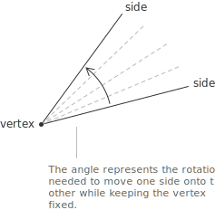
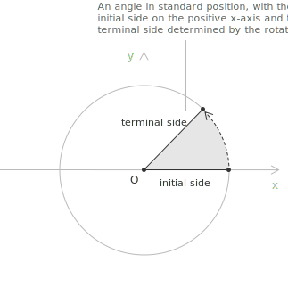

## Definition

**Definition 1.** An angle is a geometric figure formed by two rays sharing a common endpoint. The shared endpoint is the vertex of the angle, and the two rays are its sides. 

The same configuration admits a dynamic interpretation, in which the angle is the amount of rotation needed to bring one side onto the other while keeping the vertex fixed. Trigonometry inherits both readings from geometry:
the static one is convenient when the angle is treated as a region of the plane, and the dynamic one when the angle is treated as a rotation.

The dynamic interpretation requires a choice of direction. By convention, the counterclockwise sense of rotation is taken as positive and the clockwise sense as negative. A null rotation, which leaves the two sides coincident, corresponds to the angle $0$, while a complete rotation brings the moving side back onto the initial one.

> The sign convention chosen here is the one used throughout analytic geometry and complex analysis. It guarantees that the trigonometric functions on the [unit circle](../unit-circle/) and the argument of a [complex number](../complex-numbers/) are governed by the same orientation.

## Standard position

**Definition 2.** An angle is said to be in standard position when its vertex coincides with the origin of the Cartesian plane and one of its sides, called the initial side, lies along the positive $x$-axis. The remaining side, called the terminal side, is determined by the magnitude and the orientation of the rotation. In this configuration, every angle is identified by the position of its terminal side alone.

**Definition 3.** Two angles in standard position are said to be coterminal when their terminal sides coincide. 

Coterminal angles differ by an integer multiple of a complete revolution, and from the trigonometric point of view, they are indistinguishable: every trigonometric function takes the same value on any pair of coterminal angles. This periodic redundancy is the geometric reason for which the trigonometric functions are defined [modulo](../modulo-operator/) a full turn.

## Degree measure

In the sexagesimal system, the complete revolution is divided into $360$ equal parts, each of which is called a degree. A right angle measures $90°$, a straight angle $180°$, and a complete revolution $360°$.

Finer subdivisions of the degree are obtained by introducing two smaller units, the arcminute and the arcsecond. Each degree is divided into $60$ arcminutes, and each arcminute into $60$ arcseconds:

$$
1° = 60', \quad 1' = 60''
$$

> The arcminute is written with a single prime and the arcsecond with a double prime. For most analytical purposes the decimal form of the degree is preferred, in which the fractional part is expressed as a decimal number.

## Radian measure

**Definition 4.** The radian is defined through the geometry of the circle. Consider a circle of radius $r$ and an angle $\theta$ placed at its centre. The angle subtends on the [circumference](../circumference/) an arc whose length is denoted by $s$. The radian measure of $\theta$ is defined as the ratio of the arc length to the radius:

$$
\theta = \frac{s}{r}
$$

This definition makes the radian a dimensionless quantity, since both the numerator and the denominator have the dimension of a length. The same ratio is obtained for any concentric circle on which the angle is centred, because doubling the radius doubles the length of the subtended arc and leaves the ratio unchanged. 

The radian measure depends therefore on the angle alone and not on the circle used to evaluate it.

When the radius is taken equal to $1$, the radian measure of $\theta$ coincides with the length of the arc subtended on the [unit circle](../unit-circle/). The arc corresponding to a complete revolution is the entire circumference of the circle, of length $2\pi r$, and the radian measure of a full turn is therefore:

$$
\theta_{\mathrm{full}} = \frac{2\pi r}{r} = 2\pi
$$

A straight angle corresponds to $\pi$, a right angle to $\pi/2$, and the null angle to $0$.

> When an angle is expressed without specifying a unit, the value is understood to be in radians. The notation $\theta = 3$, for instance, denotes an angle of $3$ radians and not of $3$ degrees, which would require the explicit symbol.

## Conversion between degrees and radians

The complete revolution measures $360°$ in degrees and $2\pi$ in radians. The two systems are therefore proportional, and the identity:

$$
360° = 2\pi \ \mathrm{rad}
$$

determines the conversion factor between them. Dividing both sides of this identity by $360$ gives the radian value of one degree:

$$
1° = \frac{\pi}{180}\ \mathrm{rad}
$$

Dividing instead by $2\pi$ gives the degree value of one radian:

$$
1\ \mathrm{rad} = \frac{180°}{\pi} \approx 57.2958°
$$

To convert an angle from degrees to radians one multiplies its degree measure by the factor $\pi/180$. The inverse conversion, from radians to degrees, is performed by multiplying the radian measure by $180/\pi$. The following list collects the values of the most common angles in both systems:

$$
\begin{align}
0° &= 0 &\quad& 135° = \dfrac{3\pi}{4} \\[6pt]
30° &= \dfrac{\pi}{6} &\quad& 150° = \dfrac{5\pi}{6} \\[6pt]
45° &= \dfrac{\pi}{4} &\quad& 180° = \pi \\[6pt]
60° &= \dfrac{\pi}{3} &\quad& 270° = \dfrac{3\pi}{2} \\[6pt]
90° &= \dfrac{\pi}{2} &\quad& 360° = 2\pi \\[6pt]
120° &= \dfrac{2\pi}{3}
\end{align}
$$

## The role of the radian in analysis

Two angular measures coexist in classical mathematics because each is suited to a different context. The degree is preferred in elementary geometry, in applied measurements, and in any setting where round integer values of the angle are convenient. The radian is the measure required by mathematical analysis, and several fundamental results depend on its use.

The first such result is the limit:

$$
\lim_{x \to 0} \frac{\sin(x)}{x} = 1
$$

which holds if and only if $x$ is expressed in radians. From this limit follow the [derivatives](../derivatives/) of the trigonometric functions in their simplest form:

$$
\begin{align}
\frac{d}{dx}\sin(x) &= \cos(x) \\[6pt]
\frac{d}{dx}\cos(x) &= -\sin(x)
\end{align}
$$

If the angle were measured in degrees, the same derivatives would acquire a conversion factor $\pi/180$ that would propagate through every subsequent computation, including power series, integrals, and differential equations.

The second result is the formula for the length of a circular arc, $s = r\theta$, which is the definition of the radian rearranged. The same formula written in degrees acquires an extra factor $\pi/180$ and loses its geometric transparency. The economy of the radian formulation, both in calculus and in the geometry of the circle, is the reason for which the radian is the unit of angular measure adopted throughout the rest of trigonometry, of analysis, and of complex analysis.

## Example

Consider the angle $\theta = 22°30'$, given in the degree-minute-second form. To convert this angle to radians, the minutes are first reduced to a decimal fraction of a degree. Since one degree corresponds to $60$ arcminutes, the conversion gives:

$$
30' = \frac{30}{60}° = 0.5°
$$

The angle expressed in decimal degrees is therefore:

$$
\theta = 22° + 0.5° = 22.5°
$$

Multiplying by the conversion factor $\pi/180$ produces the radian measure:

$$
\theta = 22.5 \times \frac{\pi}{180} = \frac{22.5\pi}{180} = \frac{\pi}{8}
$$

The angle has the compact radian form $\pi/8$. Reading the conversion in the opposite direction confirms the result: multiplying $\pi/8$ by $180/\pi$ returns $22.5°$, which corresponds to $22°30'$ in the sexagesimal notation.

> The example illustrates a recurring feature of the two systems: angles that appear cumbersome in one notation often become compact in the other. The choice between degrees and radians is therefore not only a matter of context, but also a matter of computational convenience.
