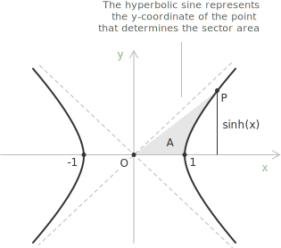
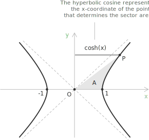
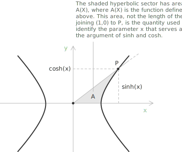
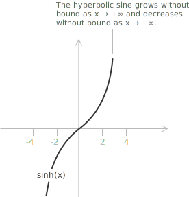
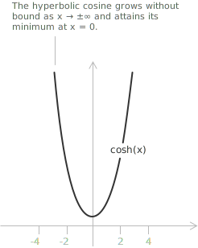

## Introduction to hyperbolic sine and cosine

We have seen that the [sine](../sine-and-cosine/) of an angle can be introduced geometrically by looking at how a point moves along the [unit circle](../unit-circle/). The hyperbolic sine, instead, is obtained by relating a point on the right branch of the equilateral [hyperbola](../hyperbola/):

$$
X^{2} - Y^{2} = 1
$$

to the area of a corresponding hyperbolic sector. For any real value $x$, we select a point:

$$
P(X_{P}, Y_{P})
$$

on the branch with $X>0$ such that the signed area enclosed by the $OX$ axis, the segment from the origin to $P$, and the portion of the hyperbola between $(1,0)$ and $P$ is equal to $x/2$.

The notion of signed area makes it possible to accommodate both positive and negative values in a continuous way: when $x>0$ the sector lies in the first quadrant, while for $x<0$ it extends into the fourth quadrant, without breaking the correspondence between the parameter $x$ and the position of $P$. Once this point has been determined, the hyperbolic sine of $x$ is simply its vertical coordinate:

$$
\sinh(x) := Y_{P}
$$

Specularly to what has just been shown for the hyperbolic sine, we can introduce the hyperbolic cosine by looking at the same equilateral hyperbola. Once the point:
$$
P(X_{P}, Y_{P})
$$
has been identified as the one corresponding to a signed hyperbolic sector of area $x/2$, the hyperbolic cosine of $x$ is defined simply as its horizontal coordinate.

While $\sinh(x)$ reflects how far the point rises or falls along the branch of the hyperbola, $\cosh(x)$ captures its horizontal position:

$$
\cosh(x) := X_{P}
$$

In this geometric interpretation, the pair $\bigl(\cosh(x), \sinh(x)\bigr)$ represents the coordinates of the unique point $P$ that produces the assigned sector $A$.

## Definition via the area of a hyperbolic sector

The geometric description above introduces the hyperbolic sine and cosine as coordinates of a point on the equilateral hyperbola, but it relies on the intuitive notion of signed area of a hyperbolic sector, which has not been defined independently. A rigorous treatment based on integral calculus removes this dependency by measuring the parameter $x$ directly through a [definite integral](../definite-integrals/).

For $X \geq 1$, let $A(X)$ denote the area of the hyperbolic sector bounded by the horizontal axis, by the half-line joining the origin to the point $\bigl(X, \sqrt{X^{2}-1}\bigr)$ on the right branch of the hyperbola, and by the arc of the hyperbola connecting this point to $(1, 0)$. The sector area decomposes as the difference between the area of the right triangle with vertices $O = (0,0)$, $(X, 0)$, $\bigl(X, \sqrt{X^{2}-1}\bigr)$ and the area lying under the upper branch from $1$ to $X$:

$$
A(X) = \frac{X\sqrt{X^{2}-1}}{2} - \int_{1}^{X} \sqrt{t^{2}-1} \ dt
$$

The function $A$ is [continuous](../continuous-functions/) on $[1, +\infty)$ and increases monotonically from $A(1) = 0$ to $+\infty$. For $X > 1$, the [Fundamental Theorem of Calculus](../fundamental-theorem-of-calculus/) yields the derivative:

$$
A'(X) = \frac{1}{2\sqrt{X^{2}-1}}
$$

The positive sign confirms that $A$ is strictly increasing on the interior of its domain.

- - -

The hyperbolic cosine and sine on $[0, +\infty)$ are now defined as the coordinates of the unique point on the right branch of the equilateral hyperbola that bounds a sector of area $x/2$. For $x \geq 0$, the hyperbolic cosine of $x$ is the unique value in $[1, +\infty)$ satisfying:

$$
A(\cosh x) = \frac{x}{2}
$$

The hyperbolic sine of $x$ is then defined by:

$$
\sinh x = \sqrt{\cosh^{2} x - 1}
$$

Existence and uniqueness of $\cosh x$ are guaranteed by the continuity and strict monotonicity of $A$ on $[1, +\infty)$, by the intermediate value theorem. The fundamental hyperbolic identity $\cosh^{2} x - \sinh^{2} x = 1$ holds by construction.

- - -

The extension to negative values of $x$ relies on the parity of the two functions. The hyperbolic cosine is even and the hyperbolic sine is odd, so for $x < 0$ one sets:

$$
\begin{align}
\cosh x &= \cosh(-x) \\[6pt]
\sinh x &= -\sinh(-x)
\end{align}
$$

This procedure produces functions defined on all of $\mathbb{R}$, in full agreement with the geometric description given earlier.

## Fundamental hyperbolic identity

The hyperbolic sine and hyperbolic cosine satisfy a relationship that plays a role analogous to the [Pythagorean identity](../pythagorean-identity/). This relationship is known as the fundamental hyperbolic identity:

$$
\cosh^{2} x - \sinh^{2} x = 1
$$

From a geometric point of view, this equality expresses the fact that the point $\bigl(\cosh(x), \sinh(x)\bigr)$ lies exactly on the right branch of the equilateral hyperbola:

$$
X^{2} - Y^{2} = 1
$$

Here the horizontal coordinate $\cosh(x)$ and the vertical coordinate $\sinh(x)$ play roles similar to those of the adjacent and opposite sides in the unit-circle setting, but the geometry is governed by a hyperbola instead of a circle. The identity emerges from this construction: the coordinates of the point must satisfy the defining equation of the hyperbola, and this is precisely what leads to $\cosh^{2} x - \sinh^{2} x = 1$.

## Hyperbolic identities

The hyperbolic sine and cosine satisfy a family of identities that decompose double angles, sums, and differences into products of the two functions evaluated at simpler arguments. They follow algebraically from the exponential expressions of $\sinh$ and $\cosh$, and their structure mirrors the circular case, with sign differences imposed by the geometry of the equilateral hyperbola.

$$
\begin{align}
&\sinh(2x) = 2\sinh(x)\cosh(x) \\[6pt]
&\cosh(2x) = 1 + 2\sinh^{2}(x) \\[6pt]
&\sinh(x+y) = \sinh(x)\cosh(y) + \cosh(x)\sinh(y) \\[6pt]
&\cosh(x+y) = \cosh(x)\cosh(y) + \sinh(x)\sinh(y) \\[6pt]
&\sinh(x-y) = \sinh(x)\cosh(y) - \cosh(x)\sinh(y) \\[6pt]
&\cosh(x-y) = \cosh(x)\cosh(y) - \sinh(x)\sinh(y)
\end{align}
$$

> Geometrically, each formula translates a manipulation of the hyperbolic parameter (a sum, a difference, or a doubling of the sector area) into a relation between the coordinates of the corresponding point on the hyperbola.

## Analytical expression of the hyperbolic sine

A first derivation comes directly from the [exponential function](../exponential-function/). If we look at how $e^{x}$ and $e^{-x}$ behave, we notice that they naturally split into a symmetric and an antisymmetric part. Writing them as:

$$e^{x} = \cosh(x) + \sinh(x)$$
$$e^{-x} = \cosh(x) - \sinh(x)$$

we can treat these two expressions as a simple system in the unknowns $\cosh(x)$ and $\sinh(x)$. Subtracting one equation from the other isolates the antisymmetric component, giving:

$$
e^{x} - e^{-x} = 2\sinh(x)
$$

and therefore:

$$
\sinh(x) = \frac{e^{x} - e^{-x}}{2}
$$

A complementary way to obtain the same formula is to go back to geometry. The point $(\cosh(x), \sinh(x))$ belongs to the equilateral hyperbola:

$$
X^{2} - Y^{2} = 1
$$

Since we already know that the horizontal coordinate satisfies:

$$
X = \cosh(x) = \frac{e^{x} + e^{-x}}{2}
$$

we can plug this expression directly into the hyperbola’s equation and solve for $Y$. We have:

$$
Y^{2}
= X^{2} - 1
= \left(\frac{e^{x} + e^{-x}}{2}\right)^{2} - 1
$$

Expanding the square and simplifying leads to:

$$
Y^{2}
= \left(\frac{e^{x} - e^{-x}}{2}\right)^{2}
$$

Taking the square root requires paying attention to the sign of $Y$.

+ If $x > 0$, the point lies in the first quadrant and $Y$ is positive.
+ If $x < 0$, it lies in the fourth quadrant and $Y$ is negative.

In both cases, the correct choice is:
$$
Y = \frac{e^{x} - e^{-x}}{2}
$$

Thus the analytical expression emerges naturally from the geometry of the hyperbola:

$$
\sinh(x) = \frac{e^{x} - e^{-x}}{2}
$$

## Analytical expression of the hyperbolic cosine

Compared to the derivation of the hyperbolic sine, there is another way to obtain the analytical expression of the hyperbolic cosine, and it emerges directly from the classical geometric construction. In this approach, we start from the computation of the signed area $A$ of the hyperbolic sector on the right branch of the equilateral hyperbola. The integral that describes this area leads to the relation:

$$
A = \frac{1}{2}\ln \bigl(X + \sqrt{X^{2}-1}\bigr)
$$

This motivates the introduction of the hyperbolic parameter $x$, which is defined so that it depends only on the horizontal coordinate $X$:

$$
x = \ln \bigl(X + \sqrt{X^{2}-1}\bigr) = 2A
$$

Once this link between the sector area and the coordinate $X$ has been established, we can reverse the relation to express $X$ in terms of $x$. Exponentiating gives:

$$
X + \sqrt{X^{2}-1} = e^{x}
$$

and from here we isolate the square root:

$$
\sqrt{X^{2}-1} = e^{x} - X
$$

Squaring both sides and simplifying the resulting expression shows that the admissible solution must satisfy:

$$
X = \frac{e^{x} + e^{-x}}{2}
$$

This value is therefore taken as the analytical definition of the hyperbolic cosine:

$$
\cosh(x) = \frac{e^{x} + e^{-x}}{2}
$$

## Analytical hyperbolic definitions

The two derivations carried out in the previous sections converge on the same pair of closed-form expressions, which can now be collected as the analytic counterpart of the geometric construction:

$$
\begin{align}
\sinh(x) &= \frac{e^{x} - e^{-x}}{2} \\[6pt]
\cosh(x) &= \frac{e^{x} + e^{-x}}{2}
\end{align}
$$

> These analytic definitions express the hyperbolic sine and cosine directly in terms of the [exponential function](../exponential-function/). Their symmetry follows from the structure of the equilateral hyperbola.

## Algebraic verification of the fundamental identity

Once the analytical expressions of $\cosh$ and $\sinh$ are available, the fundamental hyperbolic identity admits a direct algebraic verification. Substituting the exponential forms one obtains:

$$
\cosh^{2} x - \sinh^{2} x = \left(\frac{e^{x} + e^{-x}}{2}\right)^{2} - \left(\frac{e^{x} - e^{-x}}{2}\right)^{2}
$$

Factoring the right-hand side as a difference of squares gives:

$$
\cosh^{2} x - \sinh^{2} x = \frac{\bigl[(e^{x} + e^{-x}) - (e^{x} - e^{-x})\bigr]\bigl[(e^{x} + e^{-x}) + (e^{x} - e^{-x})\bigr]}{4}
$$

The first bracket simplifies to $2 e^{-x}$ and the second to $2 e^{x}$, so that:

$$
\cosh^{2} x - \sinh^{2} x = \frac{(2 e^{-x})(2 e^{x})}{4} = e^{x} e^{-x} = 1
$$

The identity emerges therefore as a pure algebraic consequence of the analytical definitions, independently of any geometric interpretation.

## Hyperbolic sine and cosine function

The hyperbolic sine function $f(x) = \sinh(x)$ associates each [real number](../types-of-numbers/) $x$ with a value derived from the exponential function. Unlike the circular sine, it does not oscillate: its graph grows exponentially for large positive or negative values of $x$, crossing the origin with slope $1$. The function $f(x) = \sinh(x)$ is defined for all real numbers, and its range also spans the entire real line.

+ Domain: $x \in \mathbb{R}$
+ Range: $y \in \mathbb{R}$
+ Periodicity: not periodic; grows exponentially as $|x|$ increases
+ Parity: [odd](../even-and-odd-functions/), $\sinh(-x) = -\sinh(x)$

The hyperbolic cosine function $f(x) = \cosh(x)$ assigns to each real number $x$ a value obtained from the symmetric part of the exponential function. Unlike the circular cosine, it is not periodic: its graph has a minimum at $x = 0$, where $\cosh(0) = 1$, and increases exponentially as the [absolute value](../absolute-value/) of $x$ becomes larger. The function $f(x) = \cosh(x)$ is defined for all real numbers, and its range is given by $\cosh(x) \geq 1$.

+ Domain: $x \in \mathbb{R}$
+ Range: $y \in \mathbb{R} : y \geq 1$
+ Periodicity: not periodic; grows exponentially as $|x|$ increases
+ Parity: [even](../even-and-odd-functions/), $\cosh(-x) = \cosh(x)$

## Relation to the circular sine and cosine

Hyperbolic sine and cosine originate from the geometry of the equilateral hyperbola:
$$
x^{2} - y^{2} = 1
$$
where a hyperbolic sector determines a parameter $x$. The point on the hyperbola associated with this area has coordinates:

$$
X_{P} = \cosh(x) = \frac{e^{x} + e^{-x}}{2}
$$
$$
Y_{P} = \sinh(x) = \frac{e^{x} - e^{-x}}{2}
$$

In the circular setting, the corresponding quantities arise from the [unit circle](../unit-circle/) of radius $1$, where a central angle $\theta$ determines the circular [sine and cosine](../sine-and-cosine/), identified by the point:
$$
P(X_{P}, Y_{P}) = P(\cos\theta, \sin\theta)
$$

> Both constructions follow the same basic idea: whether on a circle or on a hyperbola, a sector picks out a point on the curve. In the circular case this leads to the familiar sine and cosine, while in the hyperbolic case it gives the hyperbolic sine and cosine, which mirror the circular behaviour but within the geometry of the hyperbola.

