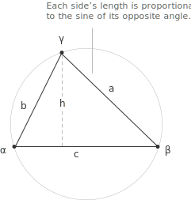

## Definition

The law of sines states that in any triangle, the ratio between the length of a side and the [sine](../sine-and-cosine/) of its opposite [angle](../angles-and-angular-measure/) is the same for all three sides. For a triangle with sides $a, b, c$ opposite to angles $\alpha, \beta, \gamma$ respectively, this common ratio equals twice the radius $r$ of the circumscribed circle:

$$
\frac{a}{\sin \alpha} = \frac{b}{\sin \beta} = \frac{c}{\sin \gamma} = 2r
$$

The quantity $2r$ is the diameter of the circumcircle, that is, the unique circle passing through all three vertices of the triangle.

The law of sines is particularly useful when some sides or angles of a triangle are known and the remaining ones must be determined, since each unknown can be recovered through a simple proportion.

To establish the equality of the three ratios, consider the altitude $h$ drawn from the vertex opposite to side $c$ to the side $c$ itself. By the [right-triangle definition](../right-triangle-trigonometry/) of the sine function applied to angles $\alpha$ and $\beta$, one has $\sin(\alpha) = h/b$ and $\sin(\beta) = h/a$, from which $b\sin(\alpha) = h = a\sin(\beta)$. Dividing both sides by $\sin(\alpha)\sin(\beta)$ yields:

$$
\frac{a}{\sin(\alpha)} = \frac{b}{\sin(\beta)}
$$

An identical argument applied to the altitude from the vertex opposite to side $a$ gives $\sin(\beta) = h'/c$ and $\sin(\gamma) = h'/b$, and therefore:

$$
\frac{b}{\sin(\beta)} = \frac{c}{\sin(\gamma)}
$$

Since the first ratio equals the second and the second equals the third, all three are equal.

To see why the common value is $2r$, note that when the triangle is inscribed in its circumcircle of radius $r$, the inscribed angle theorem implies that the chord of length $a$ subtends a central angle of $2\alpha$. The relationship between a chord and the radius of the circle then gives $a = 2r\sin(\alpha)$, from which $a/\sin(\alpha) = 2r$. The same holds for the other two sides by symmetry.

> The law of sines is often used in conjunction with the [law of cosines](../law-of-cosines/), which provides a complementary approach to solving triangles when different combinations of sides and angles are known.

## Example 1

Consider a triangle in which $\alpha = 40^\circ$, $\beta = 65^\circ$ and $a = 10$. The goal is to determine the length of side $b$, which lies opposite to $\beta$. Since the interior angles of any triangle sum to $180^\circ$, the third angle is $\gamma = 180^\circ - 40^\circ - 65^\circ = 75^\circ$. Applying the law of sines to the pair involving $a$ and $b$ gives:

$$
\frac{10}{\sin 40^\circ} = \frac{b}{\sin 65^\circ}
$$

Multiplying both sides by $\sin 65^\circ$ isolates $b$:

$$
b = \frac{10 \cdot \sin 65^\circ}{\sin 40^\circ} = \frac{10 \cdot 0.9063}{0.6428} \approx 14.1
$$

The length of side $b$ is approximately $14.1$ units.

## The ambiguous case

In the Side-Side-Angle (SSA) configuration, where two sides $a$ and $b$ and an angle $\alpha$ opposite to one of them are given, the law of sines does not necessarily determine a unique triangle. Isolating $\sin(\beta)$ from the proportion yields:

$$
\sin(\beta) = \frac{b \sin(\alpha)}{a}
$$

Since the [reduction identity](../reduction-formulas-and-reference-angles/) $\sin(\theta) = \sin(180^\circ - \theta)$ holds for every $\theta \in (0^\circ, 180^\circ)$, this value may correspond to two distinct angles, $\beta$ and $180^\circ - \beta$. Whether neither, one, or both of these yield a valid triangle depends on the relative magnitudes of $a$, $b$, and the altitude from the vertex opposite to $c$. Each candidate value of $\beta$ must therefore be examined individually to verify that the resulting angles sum to less than $180^\circ$ and that all sides are positive.

## Example 2

Consider a triangle in which $\alpha = 35^\circ$, $a = 7$ and $b = 10$. The goal is to determine all possible values of angle $\beta$ and, for each, the corresponding triangle. Applying the law of sines to isolate $\sin(\beta)$ gives:

$$
\begin{align}
\sin(\beta) &= \frac{b \sin(\alpha)}{a} \\[6pt]
&= \frac{10 \cdot \sin 35^\circ}{7} \\[6pt]
&= \frac{10 \cdot 0.5736}{7} \\[6pt]
&\approx 0.8194
\end{align}
$$

Since $0 < 0.8194 < 1$, the equation $\sin(\beta) = 0.8194$ admits two solutions in $(0^\circ, 180^\circ)$, obtained from the [arcsine](../arcsine-and-arccosine/) and its supplementary angle:

$$
\begin{align}
\beta_1 &= \arcsin(0.8194) \approx 55.0^\circ \\[6pt]
\beta_2 &= 180^\circ - 55.0^\circ = 125.0^\circ
\end{align}
$$

Each value must be checked against the constraint that all three angles sum to $180^\circ$. For $\beta_1 = 55.0^\circ$, the third angle is:
$$\gamma_1 = 180^\circ - 35^\circ - 55^\circ = 90^\circ$$

This angle is positive, so the first triangle is valid. For $\beta_2 = 125.0^\circ$, the third angle is:
$$\gamma_2 = 180^\circ - 35^\circ - 125^\circ = 20^\circ$$

This case is also positive, so the second triangle is valid as well. The two triangles are non-congruent: the first has angles $35^\circ, 55^\circ, 90^\circ$ and the second has angles $35^\circ, 125^\circ, 20^\circ$.

Both are consistent with the given data $\alpha = 35^\circ$, $a = 7$, $b = 10$, confirming that two distinct triangles can satisfy the same initial conditions.

## A geometric criterion for the ambiguous case

The algebraic analysis of the ambiguous case can be complemented by a geometric criterion that allows the number of valid triangles to be determined before performing any computation. Given the angle $\alpha$ and the two sides $a$ and $b$, the quantity $b \sin(\alpha)$ coincides with the altitude of the triangle measured from the vertex opposite to side $c$. Comparing this altitude with the length of $a$ is sufficient to predict how many triangles are compatible with the given data.

Four situations arise depending on the relative size of $a$ with respect to $b \sin(\alpha)$ and $b$.

+ When $a < b \sin(\alpha)$, the side $a$ is too short to reach the base from the vertex of $\alpha$, and no triangle exists.
+ When $a = b \sin(\alpha)$, the side $a$ coincides with the altitude itself, producing exactly one right triangle with the right angle at the vertex opposite to $c$.
+ When $b \sin(\alpha) < a < b$, the side $a$ reaches the base in two distinct points, and two non-congruent triangles satisfy the given data.
+ When $a \geq b$, only one of the two possible positions yields a geometrically consistent triangle, and the configuration is again uniquely determined.

> The expression $b \sin(\alpha)$ should be read as the altitude from the vertex of angle $\alpha$ to the line containing side $c$. This interpretation makes the criterion easy to recall, since the question reduces to whether $a$ falls short of this altitude, equals it, lies between it and $b$, or exceeds $b$.

- - -

The criterion is consistent with the second example discussed above. With $\alpha = 35^\circ$ and $b = 10$, the altitude is:

$$
b \sin(\alpha) = 10 \cdot \sin 35^\circ \approx 5.74
$$

Since $a = 7$ satisfies $5.74 < 7 < 10$, the configuration falls in the range where two triangles coexist, which is precisely the outcome obtained from the algebraic analysis.

## The law of tangents

The law of sines admits a companion identity, known as the law of tangents, which relates the difference and the sum of two sides to the half-difference and half-sum of the opposite angles. For a triangle with sides $a, b$ opposite to angles $\alpha, \beta$, the identity reads:

$$
\frac{a-b}{a+b} = \frac{\tan\left(\frac{\alpha - \beta}{2}\right)}{\tan\left(\frac{\alpha + \beta}{2}\right)}
$$

The derivation rests entirely on the law of sines. From the proportion $a = 2r\sin(\alpha)$ and $b = 2r\sin(\beta)$, the factor $2r$ cancels in the ratio on the left-hand side, leaving:

$$
\frac{a-b}{a+b} = \frac{\sin(\alpha) - \sin(\beta)}{\sin(\alpha) + \sin(\beta)}
$$

Applying the [sum-to-product identities](../trigonometric-identities/) $\sin(\alpha) \pm \sin(\beta) = 2\sin\left(\frac{\alpha \pm \beta}{2}\right)\cos\left(\frac{\alpha \mp \beta}{2}\right)$ to numerator and denominator yields:

$$
\frac{\sin(\alpha) - \sin(\beta)}{\sin(\alpha) + \sin(\beta)} = \frac{2\cos\left(\frac{\alpha+\beta}{2}\right)\sin\left(\frac{\alpha-\beta}{2}\right)}{2\sin\left(\frac{\alpha+\beta}{2}\right)\cos\left(\frac{\alpha-\beta}{2}\right)} = \frac{\tan\left(\frac{\alpha-\beta}{2}\right)}{\tan\left(\frac{\alpha+\beta}{2}\right)}
$$

This identity becomes useful when two sides and the included angle $\gamma$ are known. In that situation the sum $\alpha + \beta = 180^\circ - \gamma$ is determined immediately, and the half-difference $(\alpha - \beta)/2$ can be recovered from the formula above. Combining the two values produces $\alpha$ and $\beta$ without any intermediate use of inverse sines or cosines.

## Spherical analog

The law of sines extends to triangles drawn on the surface of a sphere, where the sides are arcs of great circles rather than straight segments. For a spherical triangle on the unit sphere with arc-lengths $a, b, c$ and opposite angles $\alpha, \beta, \gamma$, the spherical law of sines states:

$$
\frac{\sin(a)}{\sin(\alpha)} = \frac{\sin(b)}{\sin(\beta)} = \frac{\sin(c)}{\sin(\gamma)}
$$

The structural difference with the planar version lies in the role played by the sides: in the Euclidean setting each side enters the proportion linearly, while on the sphere it enters through its sine. The two formulations agree in the limit of small triangles, since $\sin(x) \approx x$ for $x$ close to $0$, and a sufficiently small spherical triangle is geometrically indistinguishable from a planar one.

> The common value of the three ratios in the spherical case does not coincide with the diameter of a circumscribed circle, as in the plane, but with a quantity depending on the radius of the sphere. On a sphere of radius different from $1$, the arc-lengths must be replaced by $\sin(a/R)$, $\sin(b/R)$, $\sin(c/R)$, where $R$ is the radius.
