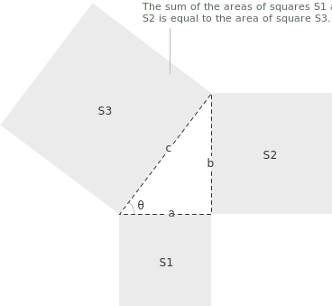
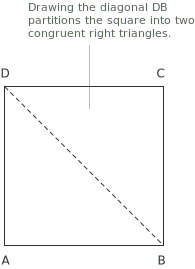
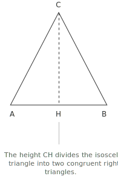
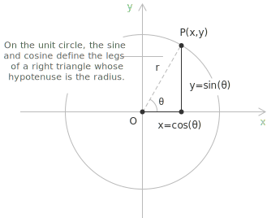

## Statement

The Pythagorean theorem states that in every right triangle, the square of the hypotenuse is equal to the sum of the squares of the two legs:

$$
a^2 + b^2 = c^2
$$

In this relation $c$ denotes the hypotenuse, while $a$ and $b$ denote the two legs. The theorem applies exclusively to right triangles, that is, triangles containing exactly one [angle](../angles-and-angular-measure/) of $90^\circ$.

From the identity $a^2 + b^2 = c^2$ one can isolate each side in turn, obtaining the hypotenuse as a function of the two legs and each leg as a function of the hypotenuse and the other leg:

$$
\begin{align}
c &= \sqrt{a^2 + b^2} \\[6pt]
a &= \sqrt{c^2 - b^2} \\[6pt]
b &= \sqrt{c^2 - a^2}
\end{align}
$$

The square roots are taken with the positive sign because $a$, $b$ and $c$ represent lengths. The converse of the theorem also holds. If in a triangle with sides $a$, $b$ and $c$ the relation

$$
a^2 + b^2 = c^2
$$

is satisfied, then the triangle is right-angled, and the right angle is the one opposite the side $c$.

## Applications

The Pythagorean theorem can be applied whenever a figure admits a decomposition that isolates a right triangle. This makes it possible to determine the length of sides, diagonals or other segments belonging to the original figure. A first illustration is provided by a square $ABCD$. 

Drawing the diagonal $\overline{DB}$ partitions the square into two congruent right triangles, each having the diagonal as hypotenuse and two sides of the square as legs. The Pythagorean theorem applied to either of them gives:

$$
\begin{align}
\overline{DB}^2 &= \overline{AB}^2 + \overline{AD}^2 \\[6pt]
\overline{DB} &= \sqrt{\overline{AB}^2 + \overline{AD}^2}
\end{align}
$$

The same principle extends to isosceles and equilateral triangles, which can be split into two right triangles by drawing the height from the apex to the base.

Denoting by $H$ the foot of the height drawn from $C$ to the base $AB$, the right triangle $CHB$ has hypotenuse $\overline{CB}$ and legs $\overline{CH}$ and $\overline{HB}$. Applying the theorem and its inverse forms yields:

$$
\begin{align}
\overline{CB} &= \sqrt{\overline{CH}^2 + \overline{HB}^2} \\[6pt]
\overline{CH} &= \sqrt{\overline{CB}^2 - \overline{HB}^2} \\[6pt]
\overline{HB} &= \sqrt{\overline{CB}^2 - \overline{CH}^2}
\end{align}
$$

> The same principle extends to any figure that can be partitioned into right triangles, such as rectangles, rhombi or portions of trapezoids.

## Pythagorean triples

A Pythagorean triple is a set of three positive [integers](../integers/) $(a, b, c)$ satisfying the relation:

$$
a^2 + b^2 = c^2
$$

The smallest examples are the following:

$$
\begin{align}
&(3,\ 4,\ 5) \\[6pt]
&(5,\ 12,\ 13) \\[6pt]
&(7,\ 24,\ 25) \\[6pt]
&(8,\ 15,\ 17)
\end{align}
$$

A Pythagorean triple whose three entries are pairwise coprime is called a primitive triple. Every non-primitive triple is obtained by multiplying a primitive one by a positive integer, so that $(6, 8, 10)$ and $(9, 12, 15)$ are both non-primitive triples derived from $(3, 4, 5)$. All primitive triples are therefore Pythagorean, but the converse does not hold.

## Discovery of irrational lengths

The Pythagorean triples display the cases in which the theorem produces a right triangle with all three sides of integer length. The simplest of all right triangles, however, exhibits the opposite behaviour. Applying the theorem to the isosceles right triangle with both legs equal to $1$ produces a hypotenuse of length:

$$
c = \sqrt{1^2 + 1^2} = \sqrt{2}
$$

This length cannot be expressed as the ratio of two integers, and its identification is traditionally associated with the Pythagorean school. The recognition that $\sqrt{2}$ lies outside the rationals marks the first historical encounter with the [irrational numbers](../irrational-numbers/), and it shows that the rationals, despite their density on the real line, do not suffice to measure every length produced by elementary geometric figures. 

> A full proof of the irrationality of $\sqrt{2}$, together with a broader discussion of how irrational magnitudes arise from geometric constructions, is given in the dedicated entry.

## Pythagorean identity on the unit circle

On the [unit circle](../unit-circle/), the [sine and cosine](../sine-and-cosine/) of an angle $\theta$ admit a direct geometric interpretation. Dropping a perpendicular from the point on the circle identified by $\theta$ to the horizontal axis produces a right triangle whose hypotenuse is the radius, whose horizontal leg has length $\cos\theta$ and whose vertical leg has length $\sin\theta$.

Applying the Pythagorean theorem to this triangle, with legs of length $\sin\theta$ and $\cos\theta$ and hypotenuse of length $1$, yields the [fundamental trigonometric identity](../pythagorean-identity/):

$$
\sin^2\theta + \cos^2\theta = 1
$$

The identity therefore holds for every real $\theta$ and is simply the Pythagorean theorem expressed in trigonometric form. The [law of cosines](../law-of-cosines/) generalises this relation to arbitrary triangles, reducing to the Pythagorean theorem when the angle between the two known sides is right, while the [law of sines](../law-of-sines/) expresses a different link between sides and opposite angles and is used to solve triangles in which a side-angle pair is known.

## Distance in the Cartesian plane and in space

Given two points $P_1 = (x_1, y_1)$ and $P_2 = (x_2, y_2)$ in the Cartesian plane, the segment joining them is the hypotenuse of a right triangle whose legs are parallel to the coordinate axes. The horizontal leg has length $|x_1 - x_2|$ and the vertical leg has length $|y_1 - y_2|$. The Pythagorean theorem applied to this triangle yields the distance formula:

$$
d(P_1, P_2) = \sqrt{(x_1 - x_2)^2 + (y_1 - y_2)^2}
$$

The squares of the differences eliminate the absolute values, so that the orientation chosen for each difference is irrelevant. The identity reduces the metric structure of the plane to a single algebraic relation built entirely on the theorem of Pythagoras.

The same construction extends to three dimensions through a double application of the theorem. Given two points $P_1 = (x_1, y_1, z_1)$ and $P_2 = (x_2, y_2, z_2)$ in Cartesian space, project the segment $\overline{P_1 P_2}$ onto the horizontal plane $Oxy$. The projection is itself a hypotenuse in the plane, with length:

$$
\sqrt{(x_1 - x_2)^2 + (y_1 - y_2)^2}
$$

This projection and the vertical segment of length $|z_1 - z_2|$ form the two legs of a new right triangle whose hypotenuse coincides with the segment $\overline{P_1 P_2}$. A second application of the Pythagorean theorem to this triangle produces:

$$
d(P_1, P_2) = \sqrt{(x_1 - x_2)^2 + (y_1 - y_2)^2 + (z_1 - z_2)^2}
$$

The same pattern persists in higher dimensions, each new coordinate contributing its squared difference under the radical sign. The Pythagorean theorem is therefore the algebraic foundation of the Euclidean notion of distance, and the formulas above describe its expression in the coordinate language of the plane and of three-dimensional space.

## Modulus of a complex number

A [complex number](../complex-numbers-introduction/) can be written in the algebraic form:

$$
z = a + bi
$$

The real part $a$ and the imaginary part $b$ identify the point of coordinates $(a, b)$ in the complex plane. The modulus $|z|$ is defined as the distance from the origin to this point, and since that distance is the hypotenuse of the right triangle with legs $a$ and $b$, the Pythagorean theorem gives:

$$
|z| = \sqrt{a^2 + b^2}
$$

The modulus of a complex number is therefore a direct geometric application of the Pythagorean theorem in the Cartesian plane.

This construction holds for every complex number $z = a + bi$. Its modulus is always the distance from the origin to the point $(a, b)$, computed through the Pythagorean theorem applied to the right triangle with legs $a$ and $b$.
