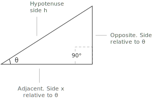
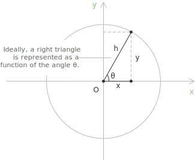
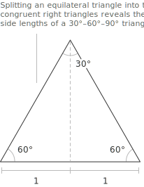
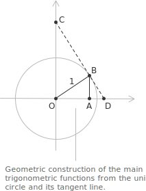

## Understanding the sides of a right triangle

Trigonometry studies the relationships between [angles](../angles-and-angular-measure/) and sides of triangles, and the right triangle is where the basic trigonometric functions are usually introduced: [sine](../sine-and-cosine/), [cosine](../sine-and-cosine/), and [tangent](../tangent-and-cotangent/). A right triangle has one interior angle of exactly $90^\circ$. The two sides meeting at the right angle are the legs, and the third side, opposite the right angle, is the hypotenuse, which is always the longest of the three. 

Fix an acute angle $\theta$ inside the triangle. The hypotenuse does not depend on the choice of $\theta$, but the two legs do. One lies opposite to $\theta$, the other borders it. The trigonometric functions arise from this asymmetry, as ratios between pairs of sides.

+ Hypotenuse $h$: the longest side, opposite the right angle.
+ Opposite leg $y$: the leg opposite to $\theta$.
+ Adjacent leg $x$: the leg that bounds $\theta$ together with the hypotenuse.

> The labels opposite and adjacent are not intrinsic properties of the two legs, but describe the position of each leg relative to the chosen angle. Switching attention from $\theta$ to the other acute angle, $90^\circ - \theta$, swaps the two roles, since the leg opposite to one of them is adjacent to the other. The hypotenuse, identified by its position relative to the right angle rather than to $\theta$, is unaffected by this choice.

- - -

These ratios depend only on $\theta$, not on the size of the triangle. Any two right triangles sharing the acute angle $\theta$ have the same set of interior angles, $90^\circ$, $\theta$, and $90^\circ - \theta$, and are therefore similar to one another. 

Similarity preserves the ratios between corresponding sides, so the six ratios attached to $\theta$ take the same value in every right triangle containing that angle. The trigonometric functions are for this reason well defined as functions of the angle alone.

## SOH-CAH-TOA method

Place a right triangle inside a [unit circle](../unit-circle/), with the acute angle $\theta$ at the origin of the Cartesian coordinate system and the hypotenuse running from the origin to a point on the circle. In this configuration the hypotenuse has length $h = 1$, and the two legs coincide with the horizontal and vertical coordinates of that point. 

The ratios that define the trigonometric functions take an especially transparent form here, because dividing by $h = 1$ leaves the coordinates themselves as the values of sine and cosine.

The name SOH-CAH-TOA is a mnemonic that encodes the three primary trigonometric functions as ratios of sides: [sine](../sine-and-cosine/) is opposite over hypotenuse, [cosine](../sine-and-cosine/) is adjacent to the hypotenuse, and [tangent](../tangent-and-cotangent/) is opposite over adjacent. Reading each triple from left to right gives the function on the left and the two sides forming the ratio on the right. The three reciprocal functions, [cosecant](../secant-and-cosecant/), [secant](../secant-and-cosecant/), and [cotangent](../tangent-and-cotangent/), follow by inverting each ratio.

The SOH group gives the sine of the angle and its reciprocal, the cosecant:

$$
\begin{align}
\sin(\theta) &= \frac{y}{h} \\[6pt]
\csc(\theta) &= \frac{h}{y}
\end{align}
$$

> Rearranging the SOH relation gives $y = h \sin(\theta)$, which returns the length of the opposite leg whenever the angle and the hypotenuse are known. The CAH and TOA relations can be rearranged in the same way to recover any missing side from the other two pieces of information.

- - -

The CAH group gives the cosine and its reciprocal, the secant:

$$
\begin{align}
\cos(\theta) &= \frac{x}{h} \\[6pt]
\sec(\theta) &= \frac{h}{x}
\end{align}
$$

The TOA group gives the tangent and its reciprocal, the cotangent:

$$
\begin{align}
\tan(\theta) &= \frac{y}{x} \\[6pt]
\cot(\theta) &= \frac{x}{y}
\end{align}
$$

The tangent can also be written directly in terms of sine and cosine, since $y/x = (y/h)/(x/h)$. This gives the identity $\tan(\theta) = \sin(\theta)/\cos(\theta)$, and by reciprocation $\cot(\theta) = \cos(\theta)/\sin(\theta)$. The six trigonometric functions are therefore not independent of each other: sine and cosine alone determine all of them.

## Range of values and complementary angles

The acute angle $\theta$ varies in the open interval $(0^\circ, 90^\circ)$. In any right triangle the hypotenuse is strictly longer than either leg, so the SOH and CAH ratios are strictly between zero and one:

$$0 < \sin(\theta) < 1, \qquad 0 < \cos(\theta) < 1$$

The tangent admits no such upper bound. The ratio $y/x$ between the two legs becomes arbitrarily small as the opposite leg shrinks toward zero, and arbitrarily large as it grows in comparison to the adjacent one. The tangent is therefore a positive quantity that ranges over the entire half-line $(0, +\infty)$ as $\theta$ moves through its admissible interval. Any positive real number can be realized as the tangent of some acute angle.

A symmetry between $\theta$ and its complement organizes the [functions](../functions/) in pairs. The two acute angles of a right triangle add up to $90^\circ$, so if one of them is $\theta$, the other is $90^\circ - \theta$. 

![IMG. 3][svg/right-triangle-trigonometry–3.svg]

The two legs exchange their roles when the point of view shifts from one angle to the other.The side opposite $\theta$ is the side adjacent to $90^\circ - \theta$, and vice versa. The hypotenuse remains the same. Reading the SOH-CAH-TOA ratios from the complementary angle gives the cofunction identities:

$$
\begin{align}
\sin(90^\circ - \theta) &= \cos(\theta) \\[6pt]
\tan(90^\circ - \theta) &= \cot(\theta) \\[6pt]
\sec(90^\circ - \theta) &= \csc(\theta)
\end{align}
$$

The prefix "co" in cosine, cotangent, and cosecant records this relation. Each cofunction of $\theta$ is the corresponding primary function evaluated at the complementary angle. Tables of trigonometric values traditionally exploited the identities to halve their size, listing only the values for $\theta$ between $0^\circ$ and $45^\circ$ and recovering the rest by complementarity.

## The Pythagorean identity

The sine and cosine of the same angle satisfy the [Pythagorean identity](../pythagorean-identity/), which in any right triangle with acute angle $\theta$ takes the form:

$$
\sin^2(\theta) + \cos^2(\theta) = 1
$$

The identity is a direct consequence of the [Pythagorean theorem](../pythagorean-theorem/). Starting from $x^2 + y^2 = h^2$ and dividing both sides by $h^2$, the equation becomes:

$$
\left(\frac{y}{h}\right)^2 + \left(\frac{x}{h}\right)^2 = 1
$$

The two ratios on the left coincide with $\sin(\theta)$ and $\cos(\theta)$ by the SOH and CAH relations, which gives the identity in its standard form. The same conclusion follows geometrically from the [unit circle](../unit-circle/). 

A point on the circle has coordinates $(\cos(\theta), \sin(\theta))$, and the equation of the circle, $x^2 + y^2 =1$, is exactly the [Pythagorean identity](../pythagorean-identity/) rewritten in those coordinates. A direct corollary of the identity, valid for every acute $\theta$, is that the sum of sine and cosine exceeds one. Squaring the sum and expanding gives:

$$
\begin{align}
(\sin(\theta) + \cos(\theta))^2
&= \sin^2(\theta) + \cos^2(\theta) + 2\sin(\theta)\cos(\theta) \\[6pt]
&= 1 + 2\sin(\theta)\cos(\theta)
\end{align}
$$

Both $\sin(\theta)$ and $\cos(\theta)$ are positive when $\theta$ is acute, so $2\sin(\theta)\cos(\theta) > 0$ and the right hand side is strictly greater than one. The positivity of the two terms allows taking square roots and yields:

$$\sin(\theta) + \cos(\theta) > 1$$

## Exact values for 30°, 45°, and 60°

For most acute angles the trigonometric ratios cannot be expressed in closed form by elementary means, and one falls back to decimal approximations. A small number of angles are exceptions, and their exact values appear often enough in computations to be usually committed to memory.

The three classical cases are $30^\circ$, $45^\circ$, and $60^\circ$, whose values come from the symmetries of the equilateral triangle and the square.

Take an equilateral triangle of side $2$, with all three angles equal to $60^\circ$. Dropping the perpendicular from one vertex to the midpoint of the opposite side splits the triangle into two congruent right triangles. 

Each of these has a hypotenuse of length $2$, a short leg of length $1$, equal to half the original side, and a third leg whose length follows from the [Pythagorean theorem](../pythagorean-theorem/):

$$x^2 + 1^2 = 2^2 \implies x = \sqrt{3}$$

The three angles in this right triangle are $30^\circ$ at the apex, $60^\circ$ at the base, and $90^\circ$ at the foot of the perpendicular. The SOH-CAH-TOA ratios for the two acute angles read directly from the side lengths:

$$
\begin{align}
\sin(30^\circ) &= \frac{1}{2} \qquad \cos(30^\circ) = \frac{\sqrt{3}}{2} \qquad \tan(30^\circ) = \frac{1}{\sqrt{3}} \\[6pt]
\sin(60^\circ) &= \frac{\sqrt{3}}{2} \qquad \cos(60^\circ) = \frac{1}{2} \qquad \tan(60^\circ) = \sqrt{3}
\end{align}
$$

The reciprocal values follow at once: $\csc(30^\circ) = 2$, $\sec(30^\circ) = 2/\sqrt{3}$, $\cot(30^\circ) = \sqrt{3}$, and $\csc(60^\circ) = 2/\sqrt{3}$, $\sec(60^\circ) = 2$, $\cot(60^\circ) = 1/\sqrt{3}$. The cofunction identities connect each value at $30^\circ$ with the corresponding value at $60^\circ$, which is one way to memorize the table.

The construction for $45^\circ$ uses the square in place of the equilateral triangle. Draw a unit square and trace one of its diagonals. The diagonal cuts the square into two congruent isosceles right triangles. 

Each has two legs of length $1$ and a hypotenuse of length $\sqrt{2}$, again by the Pythagorean theorem, and two acute angles of $45^\circ$. The SOH-CAH-TOA ratios become:

$$\sin(45^\circ) = \cos(45^\circ) = \frac{1}{\sqrt{2}}, \qquad \tan(45^\circ) = 1$$

The reciprocal values are $\csc(45^\circ) = \sec(45^\circ) = \sqrt{2}$ and $\cot(45^\circ) = 1$.

The ratios $1/\sqrt{2}$ and $1/\sqrt{3}$ are sometimes presented in the rationalized form $\sqrt{2}/2$ and $\sqrt{3}/3$, obtained by multiplying numerator and denominator by the radical that appears in the denominator. 

The rationalized form has a practical advantage for numerical evaluation, since dividing a decimal expansion of $\sqrt{2}$ or $\sqrt{3}$ by an integer is much easier than dividing $1$ by an irrational number. 

The original form, on the other hand, makes the reciprocal relation between the primary and reciprocal functions immediate: $\cos(45^\circ) = 1/\sqrt{2}$ sits next to $\sec(45^\circ) = \sqrt{2}$ as a transparent reciprocal pair, while the rationalized version partially hides this structure. Both expressions denote the same number, and either can be used in a calculation.

## Geometric interpretation on the unit circle

The unit circle introduced earlier reads sine and cosine as the coordinates of a point on the circle. The remaining four functions admit a similar geometric reading once the tangent line to the circle is brought into the picture.

Place the unit circle centered at the origin $O$, fix a point $B$ on the circle in the first quadrant, and let $\theta$ be the angle that the radius $OB$ makes with the positive $x$-axis. Drop the perpendicular from $B$ to the $x$-axis, meeting it at $A$. The right triangle $OAB$ has hypotenuse $OB = 1$, horizontal leg $OA$, and vertical leg $AB$, and the SOH-CAH-TOA ratios give:

$$OA = \cos(\theta) \qquad AB = \sin(\theta)$$

The two coordinates of $B$ are therefore the cosine and sine of $\theta$.

Now draw the line tangent to the circle at $B$. The tangent is perpendicular to the radius $OB$, so any right triangle formed by extending the tangent to one of the axes has its right angle at $B$. Let $D$ be the intersection of the tangent with the positive $x$-axis. In the right triangle $OBD$ the angle at $O$ is $\theta$, the angle at $B$ is $90^\circ$, and the side $OB = 1$ is adjacent to the angle at $O$. The remaining sides come out as:

$$BD = \tan(\theta) \qquad OD = \sec(\theta)$$

The tangent of $\theta$ appears as the length of the segment along the tangent line from the point of contact $B$ to the $x$-axis. The secant of $\theta$ appears as the distance from the center $O$ to that same intersection point.

Let $C$ be the intersection of the tangent with the positive $y$-axis. In the right triangle $OBC$ the angle at $O$ is $90^\circ - \theta$, the complement of $\theta$, since $OC$ runs along the $y$-axis, and the angle at $B$ is again $90^\circ$. The two remaining sides, by the cofunction identities, are:

$$BC = \cot(\theta) \qquad OC = \csc(\theta)$$

All six trigonometric functions are now visible as lengths of segments associated with the unit circle and its tangent at $B$. The coordinate segments $OA$ and $AB$ give cosine and sine, the segments $BD$ and $BC$ along the tangent line give tangent and cotangent, and the distances $OD$ and $OC$ from the center to where the tangent meets the axes give secant and cosecant.

## Solving a right triangle

A right triangle is fully determined by any two of its elements beyond the right angle itself, provided that at least one of the two is a side. The right angle fixes the shape up to similarity, and knowing one side sets the overall scale, so the remaining elements follow from SOH-CAH-TOA together with the Pythagorean identity. Three configurations cover all practical cases.

+ Two sides are known. The third side follows from the Pythagorean theorem, and the two acute angles follow from any of the SOH-CAH-TOA ratios.
+ One side and one acute angle are known. The other two sides follow from SOH-CAH-TOA, and the second acute angle is the complement $90^\circ - \theta$.
+ Two angles are known. The triangle is determined only up to similarity, and an additional piece of information, typically the length of one side, is needed to fix its size.

The configuration with one side and one acute angle is the most common in applications, since in problems involving heights, distances, and slopes the angle is usually measured directly and one length is known from the setting. The example below illustrates this case.

## Example

Consider a right triangle in which the leg opposite to the acute angle $\theta = 30^\circ$ measures $y = 5$, and suppose we want to determine the length of the adjacent leg $x$.

The two legs and the angle $\theta$ are linked by the TOA relation, which expresses the tangent of the angle as the ratio between the opposite and the adjacent leg:

$$
\tan(\theta) = \frac{y}{x}
$$

Substituting the known values, the equation becomes:

$$
\tan(30^\circ) = \frac{5}{x}
$$

Since the unknown $x$ appears in the denominator, we multiply both sides by $x$ to bring it to the numerator, and then divide by $\tan(30^\circ)$ to isolate it on the left:

$$
x = \frac{5}{\tan(30^\circ)}
$$

The tangent of $30^\circ$ is equal to $1/\sqrt{3}$, so the expression simplifies to $x = 5\sqrt{3}$, which is approximately $8.66$. The adjacent leg therefore measures about $8.66$ units.

