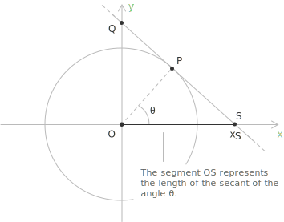
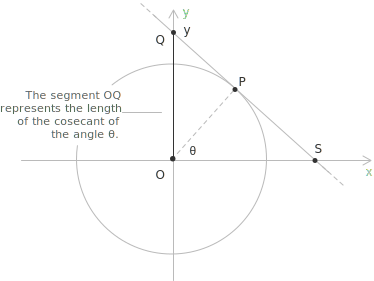
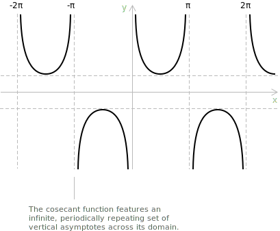

## Secant

Consider the [unit circle](../unit-circle/) centered at the origin $\text{O} = (0,0)$ with radius $1$. Let $\theta$ be an angle in standard position, and denote by $\text{P}$ the point on the circle where the terminal side of $\theta$ intersects it. Draw the tangent line to the circle at the point $\text{P}$, and let $\text{S}$ be the point where this tangent line meets the $x$-axis. The secant of the angle $\theta$ is defined as the signed length of the segment $\overline{OS}$, that is, the abscissa $x_S$ of the point $\text{S}$:

$$
\sec(\theta) = \overline{OS} = x_S
$$

To express this length in terms of familiar trigonometric quantities, consider the right triangle formed by $\text{O}$, $\text{P}$, and the foot of the perpendicular from $\text{P}$ to the $x$-axis. Since $\text{OP} = 1$ and the horizontal component of $\text{P}$ is $\cos(\theta)$, while the tangent at $\text{P}$ is perpendicular to the radius $\overline{OP}$, one can establish by similar triangles that:

$$
\sec(\theta) = \frac{1}{\cos(\theta)}
$$

Since the secant is the reciprocal of the [cosine](../sine-and-cosine/), it is defined only at angles where the cosine does not vanish. The cosine equals zero at all odd multiples of $\pi/2$, so the domain of the secant excludes precisely those values:

$$
\sec(\theta) = \frac{1}{\cos(\theta)}
\qquad \forall \theta \neq \frac{\pi}{2} + k\pi, \quad k \in \mathbb{Z}
$$

From the geometric construction, the secant measures the factor by which the unit radius must be extended to reach the point $\text{S}$ where the tangent line at $\text{P}$ meets the $x$-axis. This interpretation makes it evident why $|\sec(\theta)| \geq 1$ wherever the function is defined: the intersection point $\text{S}$ necessarily lies at a distance from the origin no smaller than the radius of the unit circle itself.

> This section examines the secant from a geometric point of view. For the analytical properties of the function, including domain, symmetry, limits, derivatives, and integrals, see the dedicated entry on the [secant function](../secant-function/).

## Common values of the secant

Below are some commonly known values of $\sec(\theta)$ for selected angles, useful in various applications of trigonometry:

$$
\begin{align}
\theta &= 0^\circ = 0\ \text{rad}      && \sec(\theta) = 1 \\[6pt]
\theta &= 30^\circ = \pi/6\ \text{rad} && \sec(\theta) = \tfrac{2\sqrt{3}}{3} \\[6pt]
\theta &= 45^\circ = \pi/4\ \text{rad} && \sec(\theta) = \sqrt{2} \\[6pt]
\theta &= 60^\circ = \pi/3\ \text{rad} && \sec(\theta) = 2 \\[6pt]
\theta &= 90^\circ = \pi/2\ \text{rad} && \sec(\theta) \text{ is undefined}
\end{align}
$$

## Trigonometric identities for the secant

The identities governing the secant follow from its definition as the reciprocal of the cosine. Dividing the fundamental relation $\sin^{2} x + \cos^{2} x = 1$ by $\cos^{2} x$ produces the Pythagorean identity that connects the secant to the tangent, while the even symmetry of the cosine transfers directly to the secant. The relations collected below summarise these connections together with the algebraic forms most often encountered in computations.

$$
\begin{align}
&\sec x = \frac{1}{\cos x} \\[6pt]
&1 + \tan^{2} x = \sec^{2} x \\[10pt]
&\sec(-x) = \sec x \\[6pt]
&\sec x \tan x = \frac{\sin x}{\cos^{2} x} \\[6pt]
&\sec^{2} x - \tan^{2} x = 1
\end{align}
$$

> These formulas collect the most useful identities involving the secant, including the reciprocal definition, the Pythagorean identity, the symmetry relation, and common algebraic transformations. For a broader overview, refer to the full collection of [trigonometric identities](../trigonometric-identities/).

## Cosecant

Consider again the same construction: the tangent line drawn at $\text{P}$ to the unit circle meets the $y$-axis at a point $\text{Q}$. The cosecant of the angle $\theta$ is defined as the signed length of the segment $\overline{OQ}$, that is, the ordinate $y_Q$ of the point $\text{Q}$:

$$
\csc(\theta) = \overline{OQ} = y_Q
$$

By an argument analogous to that given for the secant, applying similar triangles to the configuration yields the following expression in terms of the sine:

$$
\csc(\theta) = \frac{1}{\sin(\theta)}
$$

Since the cosecant is the reciprocal of the [sine](../sine-and-cosine/), it is defined only at angles where the sine does not vanish. The sine equals zero at all integer multiples of $\pi$, so the domain of the cosecant excludes precisely those values:

$$
\csc(\theta) = \frac{1}{\sin(\theta)} \qquad \forall \theta \neq k\pi, \quad k \in \mathbb{Z}
$$

Analogous to the secant, the cosecant measures the factor by which the unit radius must be extended to reach the point $\text{Q}$ where the tangent line at $\text{P}$ meets the $y$-axis. This interpretation makes it evident why $|\csc(\theta)| \geq 1$ wherever the function is defined: the intersection point $\text{Q}$ necessarily lies at a distance from the origin no smaller than the radius of the unit circle itself.

> This section examines the cosecant from a geometric point of view. For the analytical properties of the function, including domain, symmetry, limits, derivatives, and integrals, see the dedicated entry on the [cosecant function](../cosecant-function/).

## Geometric interpretation

Both definitions stem from a single geometric object: the [tangent](../tangent-and-cotangent/) line drawn at $\text{P}$ simultaneously determines the point $\text{S}$ on the $x$-axis and the point $\text{Q}$ on the $y$-axis, yielding the secant and the cosecant from one construction.

This also makes transparent the asymmetric behaviour of the two functions. When the terminal side of $\theta$ approaches a horizontal position, the tangent line at $\text{P}$ becomes nearly parallel to the $x$-axis, driving $\text{S}$ to infinity and making the secant unbounded, while $\text{Q}$ remains well-defined. The situation is reversed when the terminal side approaches a vertical position.

## Common values of the cosecant

Below are some commonly known values of $\csc(\theta)$ for selected angles, useful in various applications of trigonometry:

$$
\begin{align}
\theta &= 0^\circ = 0\ \text{rad}      && \csc(\theta) \text{ is undefined} \\[6pt]
\theta &= 30^\circ = \pi/6\ \text{rad} && \csc(\theta) = 2 \\[6pt]
\theta &= 45^\circ = \pi/4\ \text{rad} && \csc(\theta) = \sqrt{2} \\[6pt]
\theta &= 60^\circ = \pi/3\ \text{rad} && \csc(\theta) = \tfrac{2\sqrt{3}}{3} \\[6pt]
\theta &= 90^\circ = \pi/2\ \text{rad} && \csc(\theta) = 1
\end{align}
$$

## Trigonometric identities for the cosecant

The identities involving the cosecant arise in the same way from its definition as the reciprocal of the sine. Dividing the fundamental relation $\sin^{2} x + \cos^{2} x = 1$ by $\sin^{2} x$ yields the Pythagorean identity that links the cosecant to the cotangent, and the odd symmetry of the sine carries over to the cosecant through a change of sign. The relations listed below gather these properties alongside the algebraic forms that recur in practice.

$$
\begin{align}
&\csc x = \frac{1}{\sin x} \\[6pt]
&1 + \cot^{2} x = \csc^{2} x \\[8pt]
&\csc(-x) = -\csc x \\[6pt]
&\csc x \cot x = \frac{\cos x}{\sin^{2} x} \\[6pt]
&\csc^{2} x - \cot^{2} x = 1
\end{align}
$$

> These formulas collect the most useful identities involving the cosecant, including the reciprocal definition, the Pythagorean identity, the symmetry relation, and common algebraic transformations. For a broader overview, refer to the full collection of [trigonometric identities](../trigonometric-identities/).

## Secant and cosecant functions

The [secant function](../secant-function/) $f(x) = \sec(x)$ assigns to each angle $x$, measured in radians, the value $1/\cos(x)$. Its graph is a periodic curve with period $2\pi$ and features vertical [asymptotes](../asymptotes/) at the points where the cosine vanishes, that is, at $x = \pi/2 + k\pi$ for $k \in \mathbb{Z}$. The [domain](../determining-the-domain-of-a-function/) of $\sec(x)$ consists of all real numbers except those points, while its range is $(-\infty, -1] \cup [1, +\infty)$.

+ Domain: $\{ x \in \mathbb{R} : \cos(x) \neq 0 \} = \{ x \in \mathbb{R} : x \neq \pi/2 + k\pi \text{ for all } k \in \mathbb{Z} \}$
+ Range: $y \in (-\infty, -1] \cup [1, \infty)$
+ Periodicity: periodic in $x$ with period $2\pi$
+ Parity: [even](../even-and-odd-functions/), $\sec(-x) = \sec(x)$

The [cosecant function](../cosecant-function/) $f(x) = \csc(x)$ assigns to each angle $x$, measured in radians, the value $1/\sin(x)$. Its graph is a periodic curve with period $2\pi$ and features vertical asymptotes at the points where the sine vanishes, that is, at $x = k\pi$ for $k \in \mathbb{Z}$. The [domain](../determining-the-domain-of-a-function/) of $\csc(x)$ consists of all real numbers except those points, while its range is $(-\infty, -1] \cup [1, +\infty)$.

+ Domain: $\{ x \in \mathbb{R} : \sin(x) \neq 0 \} = \{ x \in \mathbb{R} : x \neq k\pi \text{ for all } k \in \mathbb{Z} \}$
+ Range: $y \in (-\infty, -1] \cup [1, \infty)$
+ Periodicity: periodic in $x$ with period $2\pi$
+ Parity: [odd](../even-and-odd-functions/), $\csc(-x) = -\csc(x)$

> A detailed treatment of the [secant function](../secant-function/) and the [cosecant function](../cosecant-function/), including notable values, limits, derivatives, and integrals, is provided in their respective entries.

