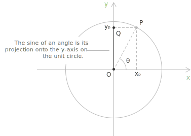
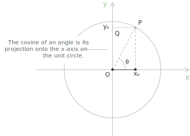
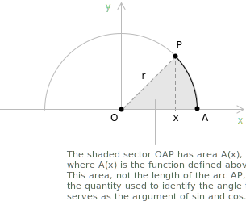

## Definition

Sine and cosine are the two primary trigonometric functions. Given an oriented angle $\theta$, represented on the [unit circle](../unit-circle/) by a point $P$, the sine and cosine of $\theta$ are defined respectively as the $y$-coordinate and the $x$-coordinate of $P$. The unit circle is the [circle](../circumference/) of radius $1$ centered at the origin, described by the [equation](../equations/):

$$
x^2+y^2=1
$$

An oriented angle is positive when described by a counterclockwise rotation and negative when described by a clockwise rotation. All angles differing by an integer multiple of $2\pi$ identify the same point on the unit circle, and are therefore represented as $\theta+2k\pi$ with $k \in \mathbb{Z}$.

- - -

**Definition 1.** Consider an oriented angle $\theta$ and the point $P$ on the [unit circle](../unit-circle/) associated with $\theta$. The sine of $\theta$ is defined as the $y$-coordinate of $P$. It coincides with the ratio between the leg $\overline{OQ}$ and the hypotenuse $\overline{OP}$ of the right triangle inscribed in the unit circle, and since $\overline{OP} = 1$, one obtains:

$$
\sin(\theta) = \frac{\overline{OQ}}{\overline{OP}} = \frac{\overline{OQ}}{1} = y_P
$$

**Definition 2.** Similarly, the cosine of $\theta$ is defined as the $x$-coordinate of $P$. It coincides with the ratio between the leg $\overline{OR}$ and the hypotenuse $\overline{OP}$, so that:

$$
\cos(\theta) = \frac{\overline{OR}}{\overline{OP}} = \frac{\overline{OR}}{1} = x_P
$$

> The sine and cosine of an angle are therefore nothing more than the projections of the point $P$ onto the coordinate axes: sine onto the $y$-axis and cosine onto the $x$-axis.

## Definition via the area of a circular sector

The geometric description above introduces sine and cosine as coordinates of a point on the unit circle, but it relies on the intuitive notion of arc length, which has not been defined independently of the trigonometric functions themselves. A rigorous treatment based on integral calculus avoids this logical dependency by measuring an oriented angle through the area of the corresponding circular sector, a quantity that can be computed directly through a [definite integral](../definite-integrals/).

The construction begins with an analytic definition of $\pi$ as twice the area enclosed by the upper half of the unit circle:

$$
\pi := 2\int_{-1}^{1}\sqrt{1-x^2} \ dx
$$

In this formulation $\pi$ is identified as a real number determined by a definite integral, without any reference to the length of a curve.

- - -

**Definition 3.** For $-1 \leq x \leq 1$, let $A(x)$ denote the area of the circular sector bounded by the horizontal axis, by the half-line joining the origin to the point $(x, \sqrt{1-x^2})$, and by the arc of the unit circle connecting this point to $(1, 0)$. The area $A(x)$ decomposes as the sum of the area of a right triangle and the area of a region lying under the upper half of the circle:

$$
A(x) = \frac{x\sqrt{1-x^2}}{2} + \int_x^1 \sqrt{1-t^2} \ dt
$$

The function $A$ is [continuous](../continuous-functions/) on $[-1, 1]$ and decreases monotonically from $A(-1) = \pi/2$ to $A(1) = 0$. For $-1 < x < 1$, the [Fundamental Theorem of Calculus](../fundamental-theorem-of-calculus/) yields the derivative:

$$
A'(x) = -\frac{1}{2\sqrt{1-x^2}}
$$

The negative sign confirms that $A$ is strictly decreasing on the interior of its domain.

- - -

The cosine and sine functions on the interval $[0, \pi]$ are now defined as the coordinates of the unique point on the unit circle that bounds a sector of area $\theta/2$. For $0 \leq \theta \leq \pi$, the cosine of $\theta$ is the unique value in $[-1, 1]$ satisfying:

$$
A(\cos\theta) = \frac{\theta}{2}
$$

The sine of $\theta$ is then defined by:

$$
\sin\theta = \sqrt{1 - \cos^2\theta}
$$

Existence and uniqueness of $\cos\theta$ are guaranteed by the continuity of $A$ on $[-1, 1]$, combined with the intermediate value theorem applied to the values it attains between $0$ and $\pi/2$. The [fundamental trigonometric identity](../pythagorean-identity/) $\sin^2\theta + \cos^2\theta = 1$ holds by construction.

- - -

The extension of $\sin$ and $\cos$ from $[0, \pi]$ to the entire real line proceeds in two stages. For $\pi \leq \theta \leq 2\pi$, the values are obtained by reflection:

$$
\begin{align}
\sin\theta &= -\sin(2\pi - \theta) \\[6pt]
\cos\theta &= \cos(2\pi - \theta)
\end{align}
$$

For an arbitrary real number $\theta$, write $\theta = 2k\pi + \theta'$ with $k \in \mathbb{Z}$ and $\theta' \in [0, 2\pi]$, and set:

$$
\begin{align}
\sin\theta &= \sin\theta' \\[6pt]
\cos\theta &= \cos\theta'
\end{align}
$$

This procedure produces functions defined on all of $\mathbb{R}$ and periodic of period $2\pi$, in full agreement with the geometric description given earlier.

> Within this analytic framework the [derivatives](../derivatives/) $\sin'(\theta) = \cos\theta$ and $\cos'(\theta) = -\sin\theta$ are not postulated, but obtained as theorems. They follow by recognizing $\cos$ as the inverse of the function $B(x) = 2A(x)$ and applying the differentiation rule for [inverse functions](../inverse-functions/).

## Fundamental trigonometric identity

The values of sine and cosine satisfy a property known as the [fundamental trigonometric identity](../pythagorean-identity/):

$$ \sin^2\theta + \cos^2\theta = 1 $$

Geometrically, this identity represents the [Pythagorean theorem](../pythagorean-theorem/) applied to the triangle $OPR$ inscribed in the unit circle, where $\overline{PR}$ and $\overline{OR}$ correspond to the legs, and $\overline{OP}$ is the hypotenuse of unit length.

## Trigonometric identities

The most frequently encountered identities involving sine and cosine fall into two families: the double-angle formulas, which express $\sin(2x)$ and $\cos(2x)$ in terms of $\sin x$ and $\cos x$, and the addition formulas, which decompose $\sin(x+y)$ and $\cos(x+y)$ into products of the two functions evaluated separately at $x$ and at $y$.

$$
\begin{align}
&\sin(2x) = 2\sin(x)\cos(x) \\[6pt]
&\cos(2x) = \cos^{2}(x) - \sin^{2}(x) \\[6pt]
&\cos(2x) = 1 - 2\sin^{2}(x) \\[6pt]
&\cos(2x) = 2\cos^{2}(x) - 1 \\[6pt]
&\sin(x+y) = \sin(x)\cos(y) + \cos(x)\sin(y) \\[6pt]
&\cos(x+y) = \cos(x)\cos(y) - \sin(x)\sin(y)
\end{align}
$$

> These identities capture the essential relationships between sine and cosine. They follow directly from the geometry of the unit circle and form the foundation of many trigonometric transformations. For a broader overview, refer to the full collection of [trigonometric identities](../trigonometric-identities/).

- - -

For example, starting from the addition formulas for sine and cosine, we want to prove that $\cos(3x) = 4\cos^3(x) - 3\cos(x)$ and obtain an analogous expression for $\sin(3x)$ in terms of $\sin(x)$ alone.

Writing $3x = 2x + x$ and applying the addition formula for the cosine, we obtain:

$$
\cos(3x) = \cos(2x)\cos(x) - \sin(2x)\sin(x)
$$

To reach a formula in $\cos(x)$ alone, we replace the double-angle terms with $\cos(2x) = 2\cos^2(x) - 1$ and $\sin(2x) = 2\sin(x)\cos(x)$, and then expand the products:

$$
\cos(3x) = 2\cos^3(x) - \cos(x) - 2\sin^2(x)\cos(x)
$$

The residual $\sin^2(x)$ is removed through the [Pythagorean identity](../pythagorean-identity) $\sin^2(x) = 1 - \cos^2(x)$, and collecting like terms yields:

$$
\cos(3x) = 4\cos^3(x) - 3\cos(x)
$$

The same strategy applies to $\sin(3x)$. The addition formula for the sine gives:

$$
\sin(3x) = \sin(2x)\cos(x) + \cos(2x)\sin(x)
$$

This time the appropriate variant of the double-angle identity is $\cos(2x) = 1 - 2\sin^2(x)$, which already involves $\sin^2(x)$. Substituting it together with $\sin(2x) = 2\sin(x)\cos(x)$ and expanding produces:

$$
\sin(3x) = 2\sin(x)\cos^2(x) + \sin(x) - 2\sin^3(x)
$$

Using $\cos^2(x) = 1 - \sin^2(x)$ to eliminate the last residual cosine and simplifying, we arrive at the analogous identity:

$$
\sin(3x) = 3\sin(x) - 4\sin^3(x)
$$

## Periodicity

Sine and cosine take values between $-1$ and $1$ because the lengths of segments $\overline{OR}$ and $\overline{PR}$ cannot exceed the radius, which is equal to 1.

If an [integer](../integers/) multiple of a full revolution is added to an angle $\theta$, the sine and cosine values remain unchanged because the point $P$ returns to the same position on the unit circle. From this property, it follows that sine and cosine are periodic [functions](../functions/) with a period of $2 \pi$:

$$
\begin{align}
\sin\theta &= \sin(\theta + 2\pi k) \quad k \in \mathbb{Z} \\[6pt]
\cos\theta &= \cos(\theta + 2\pi k) \quad k \in \mathbb{Z}
\end{align}
$$

This means that the functions repeat their values every $2 \pi$, reflecting the cyclic nature of circular motion.

## Tangent and cotangent

The ratio of the sine to the cosine of an angle $\theta$ is equal to the [tangent](../tangent-and-cotangent/) of that angle:

$$
\tan(\theta) = \frac{\sin(\theta)}{\cos(\theta)}
$$

The ratio of the cosine to the sine of an angle $\theta$ is equal to the [cotangent](../tangent-and-cotangent/) of that angle:

$$
\cot(\theta) = \frac{\cos(\theta)}{\sin(\theta)}
$$

## Common values

The following tables collect the values of sine at the most frequently encountered angles, expressed in radians.

$$
\begin{align}
x &= -\pi/2  &\quad& \sin(-\pi/2) = -1 \\[6pt]
x &= -\pi/3  &\quad& \sin(-\pi/3) = -\sqrt{3}/2 \\[6pt]
x &= -\pi/4  &\quad& \sin(-\pi/4) = -\sqrt{2}/2 \\[6pt]
x &= -\pi/6  &\quad& \sin(-\pi/6) = -1/2 \\[6pt]
x &= 0       &\quad& \sin(0) = 0 \\[6pt]
x &= \pi/6   &\quad& \sin(\pi/6) = 1/2 \\[6pt]
x &= \pi/4   &\quad& \sin(\pi/4) = \sqrt{2}/2 \\[6pt]
x &= \pi/3   &\quad& \sin(\pi/3) = \sqrt{3}/2 \\[6pt]
x &= \pi/2   &\quad& \sin(\pi/2) = 1
\end{align}
$$

The following tables collect the values of cosine at the most frequently encountered angles, expressed in radians.

$$
\begin{align}
x &= -\pi/2  &\quad& \cos(-\pi/2) = 0 \\[6pt]
x &= -\pi/3  &\quad& \cos(-\pi/3) = 1/2 \\[6pt]
x &= -\pi/4  &\quad& \cos(-\pi/4) = \sqrt{2}/2 \\[6pt]
x &= -\pi/6  &\quad& \cos(-\pi/6) = \sqrt{3}/2 \\[6pt]
x &= 0       &\quad& \cos(0) = 1 \\[6pt]
x &= \pi/6   &\quad& \cos(\pi/6) = \sqrt{3}/2 \\[6pt]
x &= \pi/4   &\quad& \cos(\pi/4) = \sqrt{2}/2 \\[6pt]
x &= \pi/3   &\quad& \cos(\pi/3) = 1/2 \\[6pt]
x &= \pi/2   &\quad& \cos(\pi/2) = 0
\end{align}
$$

## Sine and cosine function

The [sine function](../sine-function/) $f(x) = \sin(x)$ assigns to each angle $x$, expressed in radians, its corresponding sine value. Its graph is a periodic wave with a period of $2 \pi$ and an amplitude of 1, oscillating between -1 and 1. The function $f(x) = \sin x$ has all real numbers in its [domain](../determining-the-domain-of-a-function/), but its range is $-1 \leq \sin(x) \leq 1$.

+ Domain: $x \in \mathbb{R}$
+ Range: $y \in \mathbb{R} : -1 \leq y \leq 1$
+ Periodicity: periodic in $x$ with period $2 \pi$
+ Parity: [odd](../even-and-odd-functions/), $\sin(-x) = -\sin(x)$

- - -

The [cosine function](../cosine-function/) $f(x) = \cos(x)$ assigns to each angle $x$, expressed in radians, its corresponding cosine value. Its graph is a periodic wave with a period of $2 \pi$ and an amplitude of 1, oscillating between -1 and 1. The function $f(x) = \cos x$ has all real numbers in its domain, but its range is $-1 \leq \cos(x) \leq 1$.

+ Domain: $x \in \mathbb{R}$
+ Range: $y \in \mathbb{R} : -1 \leq y \leq 1$
+ Periodicity: periodic in $x$ with period $2\pi$
+ Parity: [even](../even-and-odd-functions/), $\cos(-x) = \cos(x)$

> A detailed treatment of the [sine function](../sine-function/) and the [cosine function](../cosine-function/), including notable values, limits, derivatives, and integrals, is provided in their respective entries.

## Sine and cosine in the hyperbolic setting

In the circular case, the sine and cosine of an angle $\theta$ are obtained from the [unit circle](../unit-circle/) of radius $1$, where the point on the circumference provides the coordinates $(\cos\theta, \sin\theta)$. A closely related construction exists in the hyperbolic context, where the reference curve is the equilateral [hyperbola](../hyperbola/)

$$
x^{2} - y^{2} = 1
$$

Here, instead of an angle determined by a circular sector, one considers a hyperbolic sector whose area identifies a parameter $x$. The point on the hyperbola associated with this area has coordinates:

$$
\begin{align}
\cosh(x) &= \frac{e^{x} + e^{-x}}{2} \\[6pt]
\sinh(x) &= \frac{e^{x} - e^{-x}}{2}
\end{align}
$$

These expressions mirror the circular definitions but arise from a different geometric framework. Just as $\cos\theta$ and $\sin\theta$ describe how a point moves around the unit circle, the [hyperbolic sine and cosine](../hyperbolic-sine-and-cosine/) ($\sinh(x), \cosh(x)$) describe how a point evolves along the hyperbola as the hyperbolic sector grows.

## Trigonometric structure of complex numbers

Sine and cosine are also the building blocks of the [trigonometric form of a complex number](../complex-numbers-trigonometric-form/). Any complex number $z = a + bi$ can be written as:

$$z = r(\cos\theta + i\sin\theta)$$

where $r = \sqrt{a^2 + b^2}$ is the modulus and $\theta = \arctan(b/a)$ is the argument. In this representation, sine and cosine no longer describe a point on a circle, but the direction and magnitude of a [complex number](../complex-numbers-introduction/) in the plane.

## Applications in integration

The identities and properties of sine and cosine are not limited to trigonometry. They become essential tools in [integrals](../indefinite-integrals/), particularly in the technique known as [trigonometric substitution](../trigonometric-substitution-for-integrals/), where expressions of the form:

$$
\begin{align}
\sqrt{a^2 - x^2} \\[6pt]
\sqrt{x^2 + a^2} \\[6pt]
\sqrt{x^2 - a^2}
\end{align}
$$

are simplified by replacing the variable $x$ with a suitable trigonometric function. The approach works precisely because the Pythagorean identities of sine and cosine turn the expression under the square root into a perfect square, eliminating the radical entirely.

## Orthogonality of sine and cosine

Beyond their geometric meaning on the unit circle, sine and cosine possess a deeper analytical property that emerges when they are considered over an entire period. When integrated across a full symmetric interval, trigonometric functions with different frequencies behave independently from one another. This phenomenon is known as orthogonality. More precisely, for any integers $n$ and $m$, the following relations hold on the interval $[-\pi, \pi]$:

$$
\begin{aligned}
\int_{-\pi}^{\pi} \sin(nx)\cos(mx) \ dx &= 0 \\[6pt]
\int_{-\pi}^{\pi} \cos(nx)\cos(mx) \ dx &=
\begin{cases}
\pi & n = m \neq 0 \\
0 & n \ne m
\end{cases} \\[6pt]
\int_{-\pi}^{\pi} \sin(nx)\sin(mx) \ dx &=
\begin{cases}
\pi & n = m \\
0 & n \ne m
\end{cases}
\end{aligned}
$$

These identities express the fact that trigonometric waves with distinct frequencies do not overlap when averaged through integration over $[-\pi,\pi]$. In other words, the contribution of one frequency disappears when tested against a different one across a complete period. This situation is analogous to perpendicular [vectors](../vectors/) in Euclidean geometry. There, two vectors are orthogonal if their dot product is zero. Here, the integral:

$$
\langle f, g \rangle =
\int_{-\pi}^{\pi} f(x)g(x) \ dx
$$

plays an analogous role (it acts as an inner product). When this integral vanishes, the functions behave as mutually perpendicular directions in a functional space.

> This property reveals that sine and cosine form a structurally independent system of oscillations. Because of this orthogonality, it becomes possible to isolate individual harmonic components inside a periodic function, an idea developed systematically in the theory of [Fourier Series](../fourier-series/).

