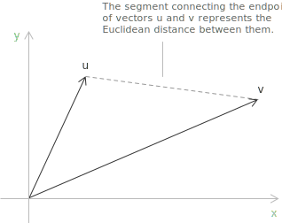
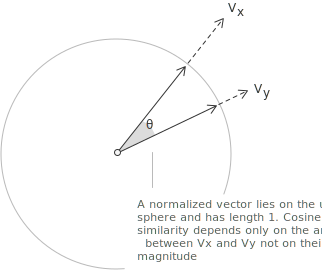

## What is cosine similarity

Large collections of text require a numerical measure of similarity between documents. Cosine similarity is a measure from linear algebra based on the [angle](../angles-and-angular-measure/) between two vectors.

A document has a [vector](../vectors/) representation in a high-dimensional space. Each component is a feature of the text, such as the frequency of a word or its contextual relevance. Two documents therefore have two corresponding vectors, and the [cosine](../cosine-function/) of their angle is their similarity score. The score depends only on the orientation of nonzero vectors. If either vector is multiplied by a positive scalar, the score is unchanged, so the total scale of the coordinates does not affect the comparison.

For two nonzero vectors, the formula is:

$$
C_s(V_x, V_y) = \frac{V_x \cdot V_y}{\|V_x\| \|V_y\|}
$$

A document vector may have term frequencies or TF-IDF weights as coordinates, or it may be a dense embedding produced by a language model. The same cosine formula applies to each representation, but the score is meaningful only in relation to the information in the coordinates. Cosine similarity is used in recommendation systems, automatic text classification, and semantic search, where many vectors must be compared.

> Cosine similarity has no semantic information beyond the vector representation. Bag-of-words vectors have lexical counts, while vectors from a language model may have contextual information. In both cases, the cosine is a comparison of directions.

## Distance between vectors and its limitations

[Euclidean distance](../pythagorean-theorem/) is a more elementary comparison of two vectors. For $u = (u_1, u_2, \ldots, u_n)$ and $v = (v_1, v_2, \ldots, v_n),$ it is:

$$
d(u, v) = \sqrt{\sum_{i=1}^{n} (u_i - v_i)^2}
$$

The vectors are points in $n$-dimensional space, and $d(u, v)$ is their straight-line distance. A small value means that the points are close, while a large value means that they are far apart.

Since Euclidean distance is unbounded, one bounded similarity score is:

$$
\mathrm{sim}(u, v) = \frac{1}{1 + d(u, v)}
$$

This transformation has values in $(0, 1].$ Identical vectors have distance $0$ and similarity $1.$ As the distance increases, the similarity decreases monotonically towards $0,$ without reaching it.

On raw term-count vectors, Euclidean distance is sensitive to the magnitude of the vectors as well as their direction. If one document contains each term exactly twice as often as another document, their vectors satisfy $v = 2u.$ They have the same relative term frequencies, but $d(u, v) = \|u\|,$ while their cosine similarity equals $1.$ Cosine similarity removes this effect by comparing the normalized vectors.

For nonzero vectors $u$ and $v,$ their normalized vectors are $\widehat{u} = u/\|u\|$ and $\widehat{v} = v/\|v\|.$ Their squared Euclidean distance is related to cosine similarity by:

$$
\begin{align}
\|\widehat{u} - \widehat{v}\|^2 &= \|\widehat{u}\|^2 + \|\widehat{v}\|^2 - 2\widehat{u} \cdot \widehat{v} \\[6pt]
&= 2\bigl(1 - C_s(u, v)\bigr)
\end{align}
$$

Hence maximizing cosine similarity is equivalent to minimizing Euclidean distance after normalization to unit length.

The quantity $d_c(u, v) = 1 - C_s(u, v)$ is often called cosine distance, but it is not a metric on nonzero vectors. If $v = 2u,$ then $d_c(u, v) = 0$ although $u \neq v.$ It also fails the triangle inequality. For three unit vectors $u,$ $v,$ and $w$ on the [unit circle](../unit-circle/) with directions $0^\circ,$ $60^\circ,$ and $120^\circ,$ respectively, the cosine distances satisfy $d_c(u, v) = d_c(v, w) = 1/2,$ while $d_c(u, w) = 3/2.$ The Euclidean distance $\|\widehat{u} - \widehat{v}\|$ is instead a metric on normalized vectors.

## How to calculate cosine similarity between two vectors

In a real inner product [vector space](../vector-spaces/), two nonzero vectors have a well-defined angle. For $V_x, V_y \in \mathbb{R}^n,$ their cosine similarity is:

$$
C_s(V_x, V_y) = \frac{\displaystyle\sum_{i=1}^{n} (V_x)_i(V_y)_i}{\sqrt{\displaystyle\sum_{i=1}^{n} ((V_x)_i)^2} \sqrt{\displaystyle\sum_{i=1}^{n} ((V_y)_i)^2}}
$$

With dot product and Euclidean norm notation, the same formula is:

$$
C_s(V_x, V_y) = \frac{V_x \cdot V_y}{\|V_x\| \|V_y\|}
$$

Here $V_x \cdot V_y$ is the dot product, while $\|V_x\|$ and $\|V_y\|$ are the Euclidean norms. The identity used in the [vector interpretation of the law of cosines](../law-of-cosines/) is:

$$
V_x \cdot V_y = \|V_x\| \|V_y\| \cos\theta
$$

The angle $\theta$ is in $[0, \pi].$ Both norms are positive, so division by their product gives the cosine similarity formula. By the [Cauchy-Schwarz inequality](../complex-number-fundamental-inequalities/), $|V_x \cdot V_y| \leq \|V_x\| \|V_y\|,$ and the quotient is in $[-1, 1].$ The zero vector has zero norm, so cosine similarity is undefined if either vector is zero.

Term-frequency and TF-IDF vectors have non-negative coordinates. Their dot product is non-negative, so their cosine similarity is in $[0, 1].$ A score close to $1$ corresponds to vectors in nearly the same direction, while a score close to $0$ means little coordinate overlap. Dense embeddings may have negative coordinates and may therefore have negative cosine similarity.

The symmetry of the dot product gives $C_s(V_x, V_y) = C_s(V_y, V_x).$ Equality in the Cauchy-Schwarz inequality characterizes the value $1.$ More precisely, $C_s(V_x, V_y) = 1$ if and only if $V_y = \lambda V_x$ for some $\lambda > 0.$ Thus a score of $1$ means that the vectors have the same direction, but they need not be equal.

> A score of $-1$ means that the vectors point in opposite directions and have an angle of $180^\circ.$ This occurs precisely when one vector is a negative scalar multiple of the other. Two nonzero vectors with non-negative coordinates cannot have this relation.

## Example 1

Consider the following three sentences:

+ $x$ = I am fond of reading thriller novels.
+ $y$ = I prefer reading thriller novels.
+ $z$ = Yesterday, I arrived late.

Sentences $x$ and $y$ have a common subject, while sentence $z$ has a different subject.

Each sentence has a vector over a shared vocabulary. In this example, capitalization and punctuation are already normalized, and "I", "am", and "of" are removed as stop words. Stop-word removal is optional and depends on the task because a removed word may be relevant to that task.

> If preprocessing removes every term from a document, its vector is zero and its cosine similarity with any vector is undefined.

|         | arrived | fond | late | novels | prefer | reading | thriller | yesterday |
|---------|---------|------|------|--------|--------|---------|----------|-----------|
| $V_x$   |       0 |    1 |    0 |      1 |      0 |       1 |        1 |         0 |
| $V_y$   |       0 |    0 |    0 |      1 |      1 |       1 |        1 |         0 |
| $V_z$   |       1 |    0 |    1 |      0 |      0 |       0 |        0 |         1 |

The table is a document-term [matrix](../matrices/). Each entry is $1$ if the word is in the corresponding sentence and $0$ otherwise. The entries are binary because each retained word occurs at most once per sentence; in general, they may instead be raw word frequencies or weights such as TF-IDF scores. Hence the three vectors are:

+ $V_x = [0, 1, 0, 1, 0, 1, 1, 0]$
+ $V_y = [0, 0, 0, 1, 1, 1, 1, 0]$
+ $V_z = [1, 0, 1, 0, 0, 0, 0, 1]$

For the pair $(V_x, V_y),$ the cosine similarity formula is:

$$
C_s(V_x, V_y) = \frac{V_x \cdot V_y}{\|V_x\| \|V_y\|}
$$

The dot product is the sum of the products of corresponding components:

$$
V_x \cdot V_y = (0 \cdot 0) + (1 \cdot 0) + (0 \cdot 0) + (1 \cdot 1) + (0 \cdot 1) + (1 \cdot 1) + (1 \cdot 1) + (0 \cdot 0) = 3
$$

The denominator is the product of the Euclidean norms. The first norm is:

$$
\|V_x\| = \sqrt{0^2 + 1^2 + 0^2 + 1^2 + 0^2 + 1^2 + 1^2 + 0^2} = \sqrt{4} = 2
$$

Likewise, the second norm is:

$$
\|V_y\| = \sqrt{0^2 + 0^2 + 0^2 + 1^2 + 1^2 + 1^2 + 1^2 + 0^2} = \sqrt{4} = 2
$$

Substitution in the cosine formula gives:

$$
C_s(V_x, V_y) = \frac{3}{2 \times 2} = \frac{3}{4} = 0.75
$$

The three retained words "novels", "reading", and "thriller" give the dot product $3.$ Each vector has four nonzero binary coordinates, so both norms are $2$ and the cosine similarity is $3/(2 \cdot 2) = 0.75.$

## The angle between vectors

The [arccosine](../arcsine-and-arccosine/) function gives the angle from $C_s(V_x, V_y) = \cos\theta:$

$$
\theta = \arccos(0.75) \approx 41.4^\circ
$$

The angle is acute and smaller than the right angle associated with zero cosine similarity. As the angle between two nonzero vectors decreases towards zero, their cosine similarity approaches $1.$

## Cosine similarity and vector orthogonality

For $V_x$ and $V_z,$ the dot product is:

$$
V_x \cdot V_z = (0 \cdot 1) + (1 \cdot 0) + (0 \cdot 1) + (1 \cdot 0) + (0 \cdot 0) + (1 \cdot 0) + (1 \cdot 0) + (0 \cdot 1) = 0
$$

Since their dot product is zero, the cosine similarity between $V_x$ and $V_z$ is zero and the vectors are orthogonal. Their supports are disjoint because sentences $x$ and $z$ have no retained words in common.

For vectors with non-negative coordinates, a zero dot product is equivalent to disjoint supports. General real vectors may be orthogonal even when both have nonzero entries in the same coordinates, since positive and negative products may cancel in the sum.

## Conclusions

Cosine similarity is invariant under positive rescaling. If every count in either term-count vector is multiplied by the same positive constant, the score is unchanged. The measure has only the semantic information already present in the vectors.

Term-frequency and TF-IDF vectors have sparse, non-negative coordinates and measure weighted lexical overlap. Dense embeddings may have contextual information and negative coordinates. The cosine formula is the same in both cases, but its numerical value has meaning only within the vector space in which it is calculated.
