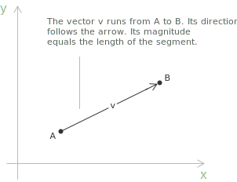
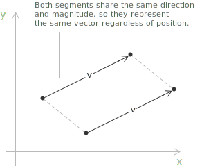
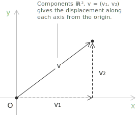
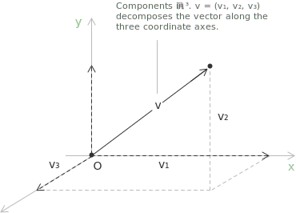
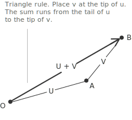
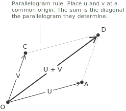

## Geometric representation

A vector is a quantity characterised by both a magnitude and a direction, in contrast to a scalar, which is described by magnitude alone. This distinction arises in geometry and physics, where quantities such as displacement, velocity, and force require directional information that a single real number cannot encode.

The formal treatment developed here is algebraic and applies to vectors in the Euclidean spaces $\mathbb{R}^2$ and $\mathbb{R}^3,$ which are sufficient for most basic applications in calculus, geometry, and mechanics. A vector in the plane or in three-dimensional space is represented as a directed line segment, that is, a segment with a specified initial point and a terminal point. The direction of the segment indicates the orientation of the vector, and its length is the magnitude.

Two directed segments that have the same length and the same direction are considered to represent the same vector, regardless of their position in space. This equivalence is the basis for the notion of a free vector, which is entirely characterised by its direction and magnitude, independently of where it is drawn.

When a fixed origin $O$ is chosen, every point $P$ in the plane or in space determines a vector, the directed segment from $O$ to $P,$ called the position vector of $P.$ This correspondence identifies points with vectors applied at the origin, and it links the geometric description of space to the algebraic description by coordinates developed in the next section. A free vector describes a displacement independent of any particular point, whereas a position vector singles out a specific location relative to the origin.

Vectors are commonly denoted by boldface letters such as $\mathbf{v},$ or by the arrow notation $\vec{v}.$ The zero vector, denoted $\mathbf{0},$ has zero magnitude and no defined direction, and it is the additive identity in vector arithmetic.

## Components and coordinate representation

In a Cartesian coordinate system, every vector in $\mathbb{R}^n$ can be expressed in terms of its components along the coordinate axes. A vector $\mathbf{v}$ in $\mathbb{R}^2$ is written as an ordered pair:

$$\mathbf{v} = (v_1, v_2) \in \mathbb{R}^2$$

A vector in $\mathbb{R}^3$ is written as an ordered triple.

$$\mathbf{v} = (v_1, v_2, v_3) \in \mathbb{R}^3$$

The [real numbers](../properties-of-real-numbers/) $v_1, v_2, v_3$ are called the components of $\mathbf{v}$ in the chosen coordinate system. More generally, a vector in $\mathbb{R}^n$ is an ordered $n$-tuple of real numbers $(v_1, v_2, \ldots, v_n),$ and the operations defined in this entry extend to this general setting, with the exception of the cross product, which is specific to $\mathbb{R}^3.$ Two vectors are equal when they belong to the same space and their corresponding components coincide, so the equality $\mathbf{u} = \mathbf{v}$ in $\mathbb{R}^n$ amounts to the $n$ scalar equalities $u_1 = v_1, \ldots, u_n = v_n.$

The standard basis vectors in $\mathbb{R}^3$ are defined as follows.

$$\mathbf{i} = (1, 0, 0) \qquad \mathbf{j} = (0, 1, 0) \qquad \mathbf{k} = (0, 0, 1)$$

Every vector in $\mathbb{R}^3$ can be expressed as a [linear combination](../linear-combinations/) of these basis vectors.

$$\mathbf{v} = v_1\mathbf{i} + v_2\mathbf{j} + v_3\mathbf{k}$$

In this expression the coefficient $v_1$ scales $\mathbf{i}$ along the $x$-axis, $v_2$ scales $\mathbf{j}$ along the $y$-axis, and $v_3$ scales $\mathbf{k}$ along the $z$-axis. The sum of these three scaled basis vectors reconstructs $\mathbf{v}$ exactly.

For example, the vector $(3, -1, 2)$ is written as $3\mathbf{i} - \mathbf{j} + 2\mathbf{k},$ meaning a displacement of three units in the $x$-direction, one unit in the negative $y$-direction, and two units in the $z$-direction. This representation makes explicit the decomposition of $\mathbf{v}$ into contributions along each coordinate direction.

> The same construction in $\mathbb{R}^n$ uses the standard unit vectors $\mathbf{e}_1, \ldots, \mathbf{e}_n,$ where $\mathbf{e}_i$ has $i$-th component equal to $1$ and all other components equal to $0.$ Every vector $\mathbf{v} \in \mathbb{R}^n$ decomposes as $\mathbf{v} = v_1\mathbf{e}_1 + \cdots + v_n\mathbf{e}_n,$ and the vectors $\mathbf{i}, \mathbf{j}, \mathbf{k}$ correspond to $\mathbf{e}_1, \mathbf{e}_2, \mathbf{e}_3.$

## Vector operations

The basic algebraic operations on vectors are addition, subtraction, and scalar multiplication. These operations are defined component-wise and admit clear geometric interpretations. Given two vectors $\mathbf{u} = (u_1, u_2, u_3)$ and $\mathbf{v} = (v_1, v_2, v_3)$ in $\mathbb{R}^3,$ their sum is defined as follows.

$$\mathbf{u} + \mathbf{v} = (u_1+v_1, u_2+v_2, u_3+v_3)$$

Geometrically, vector addition corresponds to placing the initial point of $\mathbf{v}$ at the terminal point of $\mathbf{u}.$ The resulting vector connects the initial point of $\mathbf{u}$ to the terminal point of $\mathbf{v}.$ This construction is known as the triangle rule.

An equivalent formulation, the parallelogram rule, places both vectors at a common initial point and identifies their sum with the diagonal of the parallelogram they determine.

Scalar multiplication by a real number $\lambda \in \mathbb{R}$ scales each component uniformly.

$$\lambda\mathbf{v} = (\lambda v_1, \lambda v_2, \lambda v_3)$$

When $\lambda > 0,$ the resulting vector has the same direction as $\mathbf{v}$ and magnitude scaled by $\lambda.$ When $\lambda < 0,$ the direction is reversed. When $\lambda = 0,$ the result is the zero vector. Subtraction is defined by combining the two preceding operations, $\mathbf{u} - \mathbf{v} = \mathbf{u} + (-1)\mathbf{v},$ which yields $(u_1-v_1, u_2-v_2, u_3-v_3).$

The difference $\mathbf{u} - \mathbf{v}$ also admits a direct geometric reading. When the two vectors are drawn from a common initial point, $\mathbf{u} - \mathbf{v}$ is the vector that joins the terminal point of $\mathbf{v}$ to the terminal point of $\mathbf{u},$ since adding $\mathbf{v}$ to it returns $\mathbf{u}.$ In the parallelogram determined by the two vectors, the sum corresponds to one diagonal and the difference to the other. In particular, if two points $P$ and $Q$ have position vectors $\mathbf{p}$ and $\mathbf{q},$ the difference $\mathbf{p} - \mathbf{q}$ is the displacement from $Q$ to $P.$

## Algebraic properties

The operations of vector addition and scalar multiplication satisfy a set of fundamental properties that hold for all vectors $\mathbf{u}, \mathbf{v}, \mathbf{w} \in \mathbb{R}^n$ and all scalars $\lambda, \mu \in \mathbb{R}.$

+ Addition is commutative, meaning that $\mathbf{u} + \mathbf{v} = \mathbf{v} + \mathbf{u},$ and associative, so that $(\mathbf{u} + \mathbf{v}) + \mathbf{w} = \mathbf{u} + (\mathbf{v} + \mathbf{w}).$
+ The zero vector $\mathbf{0}$ is the additive identity, satisfying $\mathbf{v} + \mathbf{0} = \mathbf{v}$ for every $\mathbf{v},$ and each vector $\mathbf{v}$ has an additive inverse $-\mathbf{v} = (-1)\mathbf{v}$ such that $\mathbf{v} + (-\mathbf{v}) = \mathbf{0}.$
+ Scalar multiplication distributes over vector addition according to $\lambda(\mathbf{u} + \mathbf{v}) = \lambda\mathbf{u} + \lambda\mathbf{v},$ and over scalar addition according to $(\lambda + \mu)\mathbf{v} = \lambda\mathbf{v} + \mu\mathbf{v}.$ It is compatible with multiplication of scalars, since $(\lambda\mu)\mathbf{v} = \lambda(\mu\mathbf{v}),$ and the scalar $1$ is the multiplicative identity, with $1 \cdot \mathbf{v} = \mathbf{v}.$

> Together these properties are the defining axioms of a vector space. The set $\mathbb{R}^n$ with these two operations is a vector space over the [field](../fields/) $\mathbb{R},$ examined in greater generality in the entry on [vector spaces](../vector-spaces/).

## Norm of a vector

The norm, or magnitude, of a vector $\mathbf{v} = (v_1, v_2, v_3)$ is a non-negative real number that measures its length. It is defined by the following expression:

$$\|\mathbf{v}\| = \sqrt{v_1^2 + v_2^2 + v_3^2}$$

This formula is a direct consequence of the [Pythagorean theorem](../pythagorean-theorem/) applied iteratively along the coordinate axes. In $\mathbb{R}^2,$ the analogous formula is the following:

$$\|\mathbf{v}\| = \sqrt{v_1^2 + v_2^2}$$

As an example, consider the vector $\mathbf{v} = (2, -3, 6)$ in $\mathbb{R}^3.$ Its norm is computed by summing the squares of its components and taking the square root:

$$
\begin{align}
\|\mathbf{v}\| &= \sqrt{2^2+(-3)^2+6^2} \\[6pt]
               &= \sqrt{4+9+36} \\[6pt]
               &= \sqrt{49} \\[6pt]
               &= 7
\end{align}
$$

Each term under the radical corresponds to the squared contribution of one coordinate direction, and the result confirms that $\mathbf{v}$ has length $7.$ A vector whose norm is equal to one is called a unit vector. Given any non-zero vector $\mathbf{v},$ dividing it by its norm produces a unit vector in the same direction. This operation is called normalisation.

$$\hat{\mathbf{v}} = \frac{\mathbf{v}}{\|\mathbf{v}\|}$$

The resulting vector $\hat{\mathbf{v}}$ satisfies $\|\hat{\mathbf{v}}\| = 1$ by construction.

## Dot product

The dot product, also called the scalar product or inner product, is a binary operation that takes two vectors and returns a real number. For $\mathbf{u}, \mathbf{v} \in \mathbb{R}^n,$ it is defined algebraically as the sum of the products of corresponding components.

$$\mathbf{u} \cdot \mathbf{v} = \sum_{i=1}^{n} u_i v_i = u_1 v_1 + u_2 v_2 + \cdots + u_n v_n$$

The dot product admits an equivalent geometric formulation in terms of the [angle](../angles-and-angular-measure/) $\theta$ between the two vectors.

$$\mathbf{u} \cdot \mathbf{v} = \|\mathbf{u}\|\|\mathbf{v}\|\cos\theta$$

The factor $\cos\theta$ connects the dot product to the [cosine](../sine-and-cosine/) of the angle between the two vectors. When $\mathbf{u} \cdot \mathbf{v} = 0$ and neither vector is zero, it follows that $\cos\theta = 0,$ hence $\theta = \pi/2.$ Two vectors satisfying this condition are said to be orthogonal. Conversely, when the vectors are parallel, $\theta = 0$ or $\theta = \pi,$ and the dot product equals $\pm\|\mathbf{u}\|\|\mathbf{v}\|.$ The norm also follows from the dot product, since $\|\mathbf{v}\|^2 = \mathbf{v} \cdot \mathbf{v}.$ As an application, consider $\mathbf{u} = (1, 2, -1)$ and $\mathbf{v} = (3, 0, 3).$ The dot product is computed as follows.

$$
\begin{align}
\mathbf{u} \cdot \mathbf{v} &= (1)(3)+(2)(0)+(-1)(3) \\[6pt]
                             &= 3+0-3 \\[6pt]
                             &= 0
\end{align}
$$

Since the result is zero, the two vectors are orthogonal.

## Cross product

The cross product is an operation defined for vectors in $\mathbb{R}^3$ that takes two vectors and returns a third vector. Unlike the dot product, the result is not a scalar but a vector, and for this reason the operation is also called the vector product. Given $\mathbf{u} = (u_1, u_2, u_3)$ and $\mathbf{v} = (v_1, v_2, v_3),$ their cross product is defined by the following formula, expressed as the [determinant](../determinant/) of a [matrix](../matrices/).

$$
\mathbf{u} \times \mathbf{v} =
\begin{vmatrix}
\mathbf{i} & \mathbf{j} & \mathbf{k} \\[6pt]
u_1 & u_2 & u_3 \\[6pt]
v_1 & v_2 & v_3
\end{vmatrix}
$$

Expanding along the first row yields the explicit component form.

$$\mathbf{u} \times \mathbf{v} = (u_2 v_3 - u_3 v_2, u_3 v_1 - u_1 v_3, u_1 v_2 - u_2 v_1)$$

The resulting vector is orthogonal to both $\mathbf{u}$ and $\mathbf{v},$ as can be verified by computing the dot products $(\mathbf{u} \times \mathbf{v}) \cdot \mathbf{u}$ and $(\mathbf{u} \times \mathbf{v}) \cdot \mathbf{v},$ both of which equal zero. The direction of $\mathbf{u} \times \mathbf{v}$ is determined by the right-hand rule. If the fingers of the right hand curl from $\mathbf{u}$ toward $\mathbf{v},$ the thumb points in the direction of $\mathbf{u} \times \mathbf{v}.$ The magnitude of the cross product has a geometric interpretation:

$$\|\mathbf{u} \times \mathbf{v}\| = \|\mathbf{u}\|\|\mathbf{v}\|\sin\theta$$

This quantity equals the area of the parallelogram spanned by $\mathbf{u}$ and $\mathbf{v}.$ In particular, $\mathbf{u} \times \mathbf{v} = \mathbf{0}$ if and only if $\sin\theta = 0,$ that is, if and only if the vectors are parallel. The cross product is anti-commutative, $\mathbf{v} \times \mathbf{u} = -(\mathbf{u} \times \mathbf{v}),$ which reflects the reversal of orientation when the order of the operands is exchanged.

- - -

As a concrete example, consider $\mathbf{u} = (1, 2, 3)$ and $\mathbf{v} = (4, 5, 6).$ Applying the component formula yields the following.

$$
\begin{align}
\mathbf{u} \times \mathbf{v} &= (u_2v_3-u_3v_2, u_3v_1-u_1v_3, u_1v_2-u_2v_1) \\[6pt]
&= (2\cdot6-3\cdot5, 3\cdot4-1\cdot6, 1\cdot5-2\cdot4) \\[6pt]
&= (12-15, 12-6, 5-8) \\[6pt]
&= (-3, 6, -3)
\end{align}
$$

One can verify that the result is orthogonal to both $\mathbf{u}$ and $\mathbf{v}$ by computing the two dot products. For the first:

$$(-3, 6, -3)\cdot(1, 2, 3) = -3 + 12 - 9 = 0$$

and for the second:

$$(-3, 6, -3)\cdot(4, 5, 6) = -12 + 30 - 18 = 0$$

Both results are zero, confirming that $\mathbf{u} \times \mathbf{v}$ is orthogonal to both factors.

- - -

Since the magnitude of the cross product is the area of a parallelogram, it also gives the area of a triangle from its vertices. Three non-collinear points $A,$ $B,$ $C$ determine a triangle whose sides issuing from $A$ are the vectors $B - A$ and $C - A.$ The triangle is half of the parallelogram spanned by these two vectors, so its area is:

$$\mathrm{Area}(ABC) = \frac{1}{2}\|(B - A) \times (C - A)\|$$

For three points in the plane, with $A = (x_A, y_A),$ $B = (x_B, y_B),$ and $C = (x_C, y_C),$ the cross product has only the component along $\mathbf{k},$ and the area reduces to the absolute value of a determinant:

$$
\mathrm{Area}(ABC) = \frac{1}{2}\left|\begin{vmatrix}
x_B - x_A & y_B - y_A \\[6pt]
x_C - x_A & y_C - y_A
\end{vmatrix}\right|
= \frac{1}{2}\left|\begin{vmatrix}
x_A & y_A & 1 \\[6pt]
x_B & y_B & 1 \\[6pt]
x_C & y_C & 1
\end{vmatrix}\right|
$$

> The determinant formula holds only for triangles in the plane. For three points in space the area is computed from the full cross product $\frac{1}{2}\|(B - A) \times (C - A)\|,$ since a two-dimensional determinant discards the other two components.

As an example, take $A = (1, 1, 1),$ $B = (2, -1, 3),$ and $C = (-1, 0, 1).$ The sides from $A$ are $B - A = (1, -2, 2)$ and $C - A = (-2, -1, 0),$ which are not proportional, so the three points are not collinear. Their cross product is:

$$
\begin{align}
(B - A) \times (C - A) &= ((-2)(0)-(2)(-1), (2)(-2)-(1)(0), (1)(-1)-(-2)(-2)) \\[6pt]
&= (2, -4, -5)
\end{align}
$$

The area of the triangle is half of its norm:

$$
\begin{align}
\mathrm{Area}(ABC) &= \frac{1}{2}\|(2, -4, -5)\| \\[6pt]
&= \frac{1}{2}\sqrt{4+16+25} \\[6pt]
&= \frac{1}{2}\sqrt{45} \\[6pt]
&= \frac{3}{2}\sqrt{5}
\end{align}
$$

The points do not lie in a coordinate plane, so the planar determinant formula does not apply here, and the area follows from the full cross product.

## Scalar triple product

The scalar triple product assigns a single real number to three vectors in $\mathbb{R}^3$ by combining the dot and cross products. For $\mathbf{u}, \mathbf{v}, \mathbf{w} \in \mathbb{R}^3$ it is defined as follows.

$$\mathbf{u} \cdot (\mathbf{v} \times \mathbf{w})$$

The cross product $\mathbf{v} \times \mathbf{w}$ is evaluated first and returns a vector, which is then combined with $\mathbf{u}$ through the dot product to give a scalar. Writing the three vectors in components, the operation equals the [determinant](../determinant/) of the matrix whose rows are their coordinates.

$$
\mathbf{u} \cdot (\mathbf{v} \times \mathbf{w}) =
\begin{vmatrix}
u_1 & u_2 & u_3 \\[6pt]
v_1 & v_2 & v_3 \\[6pt]
w_1 & w_2 & w_3
\end{vmatrix}
$$

This identity follows by expanding the determinant along the first row, which reproduces the dot product of $\mathbf{u}$ with the components of $\mathbf{v} \times \mathbf{w}$ obtained in the previous section.

The absolute value of the scalar triple product is the volume of the parallelepiped spanned by the three vectors. The cross product $\mathbf{v} \times \mathbf{w}$ has magnitude equal to the area of the base parallelogram determined by $\mathbf{v}$ and $\mathbf{w},$ and its direction is orthogonal to that base. Taking the dot product with $\mathbf{u}$ multiplies this area by the component of $\mathbf{u}$ orthogonal to the base, which is the height of the parallelepiped.

$$V = |\mathbf{u} \cdot (\mathbf{v} \times \mathbf{w})|$$

> The tetrahedron built on the same three edges has one sixth of this volume. Placing the vectors at a common vertex $A$ as $\mathbf{u} = B - A,$ $\mathbf{v} = C - A,$ and $\mathbf{w} = D - A,$ the tetrahedron $ABCD$ has volume $\frac{1}{6}|\mathbf{u} \cdot (\mathbf{v} \times \mathbf{w})|.$

The product is positive when $\mathbf{u}, \mathbf{v}, \mathbf{w}$ form a right-handed system and negative when they form a left-handed one, so its sign indicates their orientation. Exchanging two rows of a determinant reverses its sign, so exchanging any two of the three vectors reverses the sign of the product, while a cyclic permutation leaves it unchanged.

$$\mathbf{u} \cdot (\mathbf{v} \times \mathbf{w}) = \mathbf{v} \cdot (\mathbf{w} \times \mathbf{u}) = \mathbf{w} \cdot (\mathbf{u} \times \mathbf{v})$$

The same invariance lets the dot and cross be interchanged, since $\mathbf{u} \cdot (\mathbf{v} \times \mathbf{w}) = (\mathbf{u} \times \mathbf{v}) \cdot \mathbf{w}.$ The scalar triple product vanishes exactly when the three vectors are coplanar, since a zero volume means the parallelepiped is degenerate. This gives a direct test for coplanarity, as $\mathbf{u}, \mathbf{v}, \mathbf{w}$ lie in a common plane if and only if

$$\mathbf{u} \cdot (\mathbf{v} \times \mathbf{w}) = 0$$

> The vanishing of the determinant whose rows are the three vectors coincides with their linear dependence, so the coplanarity condition is equivalent to the matrix of their components having [rank](../rank-of-a-matrix/) less than $3.$

- - -

As an example, consider $\mathbf{u} = (1, 0, 2),$ $\mathbf{v} = (3, 1, 0),$ and $\mathbf{w} = (0, 4, 1).$ The scalar triple product is the determinant of the matrix formed by their components.

$$
\mathbf{u} \cdot (\mathbf{v} \times \mathbf{w}) =
\begin{vmatrix}
1 & 0 & 2 \\[6pt]
3 & 1 & 0 \\[6pt]
0 & 4 & 1
\end{vmatrix}
$$

Expanding along the first row gives the value.

$$
\begin{align}
\mathbf{u} \cdot (\mathbf{v} \times \mathbf{w}) &= 1(1\cdot1 - 0\cdot4) - 0(3\cdot1 - 0\cdot0) + 2(3\cdot4 - 1\cdot0) \\[6pt]
&= 1(1) - 0 + 2(12) \\[6pt]
&= 25
\end{align}
$$

The result is non-zero, so the three vectors are not coplanar, and they span a parallelepiped of volume $25,$ while the tetrahedron on the same three edges has volume $\frac{25}{6}.$
